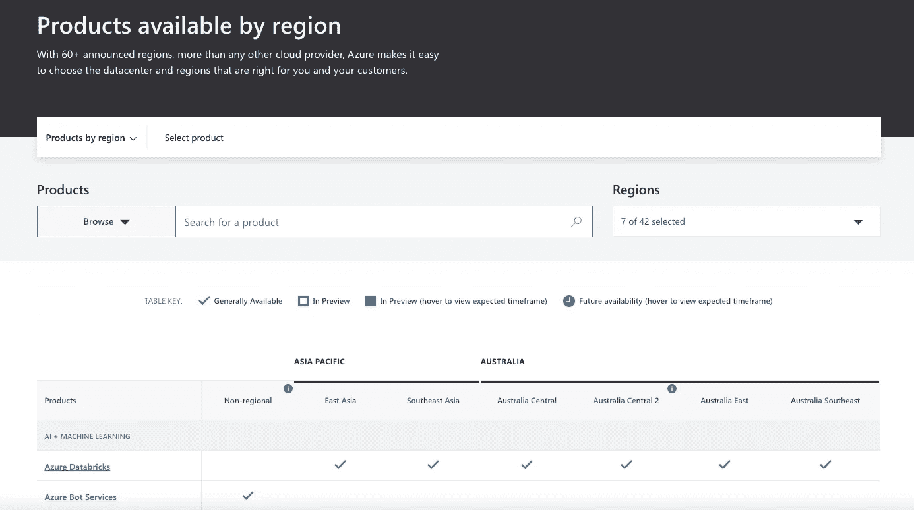
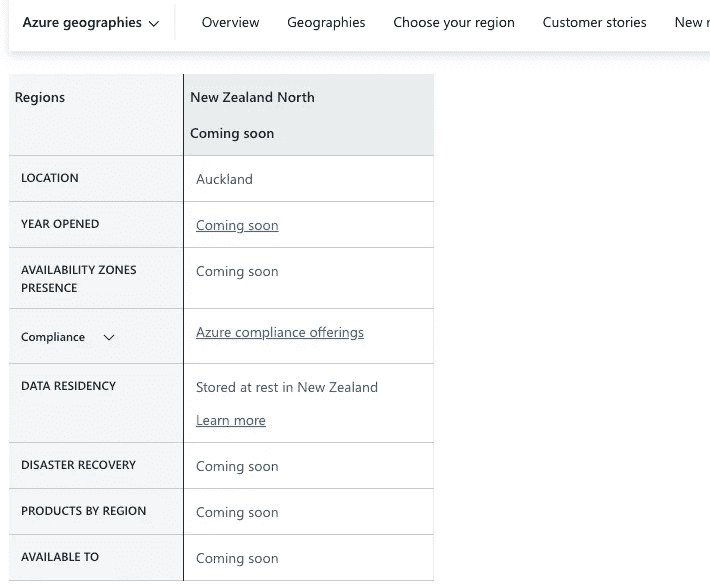
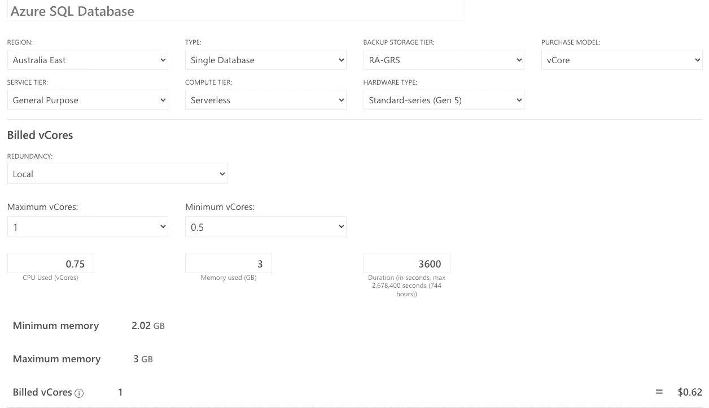
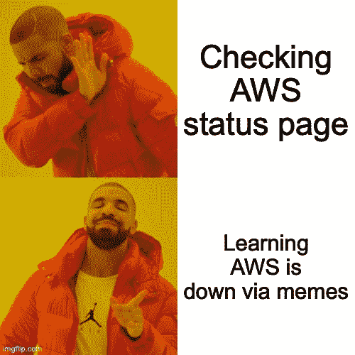
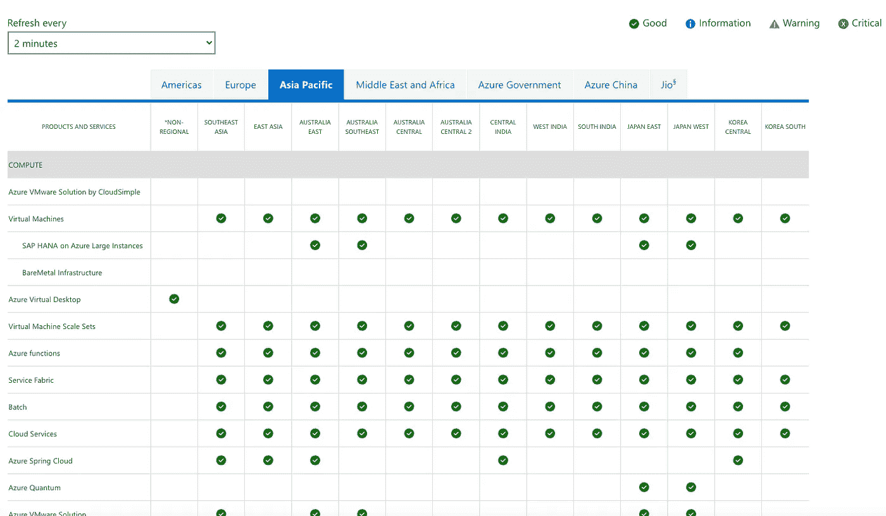
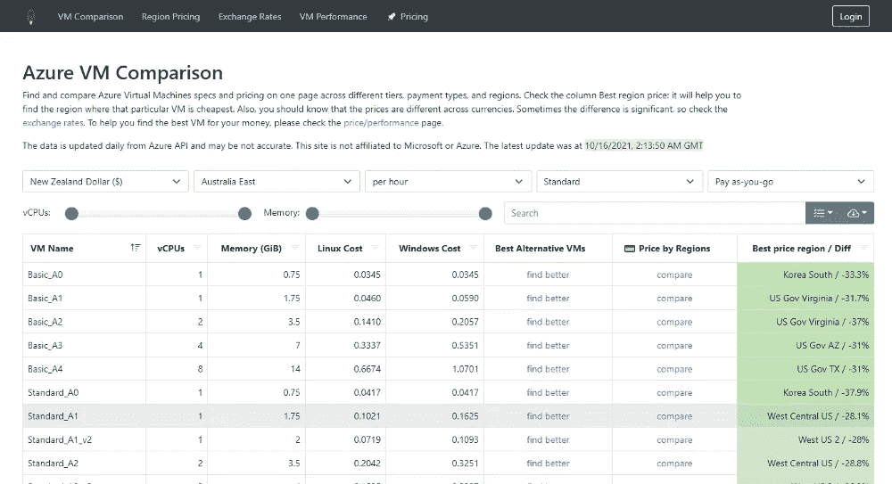

# Azure 提示:用于检查 Region 提供的产品、配置和估计 Azure 产品成本、检查 Azure 状态等的有用工具！

> 原文：<https://levelup.gitconnected.com/azure-tips-useful-tools-for-checking-the-products-provided-by-region-configuring-and-estimating-a5d2a2bda5b6>

照片由 [rawpixel](https://burst.shopify.com/@rawpixel?utm_campaign=photo_credit&utm_content=Free+Stock+Photo+of+Business+Meeting+Over+Coffee+%E2%80%94+HD+Images&utm_medium=referral&utm_source=credit) 从[爆出](https://burst.shopify.com/laptop?utm_campaign=photo_credit&utm_content=Free+Stock+Photo+of+Business+Meeting+Over+Coffee+%E2%80%94+HD+Images&utm_medium=referral&utm_source=credit)

作为一名使用 Azure cloud 的程序员，我发现这 5 页可以帮助我获得关于 Azure 的信息，从而做出更好的决策。本文介绍这 5 个页面，希望它们也能帮助你更高效地使用 Azure。

# 按地区列出的#1 产品

并非所有 Azure 资源在所有 Azure 区域都可用。有时候你可能想提前调查某个资源在某个地区是否可用，那么这个网站可以帮到你。

 [## 按地区划分的 Azure 产品| Microsoft Azure

### 搜索或选择产品以查看地区供货情况，或者选择所有产品您的请求有问题…

azure.microsoft.com](https://azure.microsoft.com/en-us/global-infrastructure/services/?WT.mc_id=DT-MVP-5001664) 

# #2 寻找蔚蓝的地理位置

W 蚂蚁查看某个蔚蓝地理的详细信息？该页面允许您获得在最适合您需求的地理位置上开始使用 Azure 所需的所有信息，从合规性到弹性功能。每个 Azure 地理位置包含一个或多个区域，并满足特定的数据驻留和合规性要求。这使您可以将业务关键型数据和应用保存在容错、高容量的网络基础架构上。

 [## 选择适合您的 Azure 地区| Microsoft Azure

### 从合规性方面获得最符合您需求的地理位置的 Azure 入门所需的所有信息…

azure.microsoft.com](https://azure.microsoft.com/en-us/global-infrastructure/geographies/#geographies) 

# #3 配置和估计 Azure 产品的成本

使用 Azure 产品和服务，您只需为您使用的内容付费。但是，有时您可能会创建远远超出业务需求的资源，从而导致需要支付比预期更多的费用。

因此，下面的页面可能对你有帮助，因为它可以帮助你提前计算出你需要为你的 azure 资源支付多少费用。您可以设置不同的使用场景来计算支出。

 [## 定价计算器| Microsoft Azure

### 为您的特定场景配置和估计 Azure 产品和功能的成本。

azure.microsoft.com](https://azure.microsoft.com/en-us/pricing/calculator/?WT.mc_id=DT-MVP-5001664) 

# #4 检查 Azure 状态

最近的 AWS 故障可能导致你的咖啡因供应链中断。

因此，了解您的云服务的状态非常重要。不要通过迷因学习，而是查看状态页面。像 AWS 一样，Azure 也提供了一个页面来检查服务的状态。

 [## Azure 状态

### 检查当前 Azure 运行状况并查看过去的事件。

status.azure.com](https://status.azure.com/en-gb/status?WT.mc_id=DT-MVP-5001664) 

# 排名第五的 Azure 虚拟机比较工具

T 他的 Azure VM 对比网站与微软或 Azure 无关。它完全是由个人完成的，帮助人们找到关于 Azure VM 定价的信息。主要目标是提供一个简单的单页工具，包括虚拟机规格和定价。所有数据都取自微软 Azure 提供的公共 API。

 [## Azure 虚拟机比较

### 选择您的 cookie 偏好我们使用 cookie 和类似的工具来增强您的体验，提供我们的服务，并…

azureprice.net](https://azureprice.net/?sortField=name&sortOrder=true&currency=NZD&region=australiaeast) 

# #6 Azure 虚拟机选择器工具

TAzure 虚拟机选择器工具是一款官方工具，可以帮助您根据类型、处理器、内存、存储和地区选择 SKU！

 [## Microsoft Azure 虚拟机选择器

### Microsoft Azure 虚拟机选择器:查找您需要的虚拟机

azure.microsoft.com](https://azure.microsoft.com/en-us/pricing/vm-selector/amd/?WT.mc_id=DT-MVP-5001664)