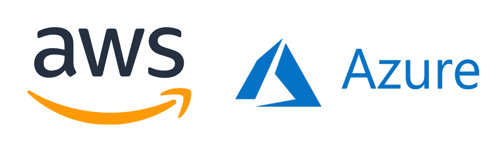

# Azure 到 AWS VPN:循序渐进

> 原文：<https://levelup.gitconnected.com/azure-to-aws-vpn-step-by-step-b8c853a62>



我在 AWS 有资源，我在 Azure 有资源。我如何让他们安全地、秘密地相互通信？

这是这一步一步的重点。更具体地说，我们将在 AWS 虚拟私有云(VPC)和 Azure 的对等虚拟网络(VNet)之间创建一个站点到站点的 VPN。我们将通过展示 AWS 中的 EC2 实例可以通过其私有 IP 地址 RDP 到 Azure 中的虚拟机(VM ),反之亦然，来测试这一点是否成功。

在 Azure 中，我们将在云外壳中使用 PowerShell 来设置资源，对于 AWS，我将使用控制台。我们将介绍以下步骤:

1.  从头开始在 Azure 中创建基础架构
2.  为默认 AWS VPC 创建 VPN 组件。
3.  在 Azure 中创建 VPN 组件

从 Azure 上的新鲜环境开始。您需要以下内容:

**一个资源组**。Azure 迫使你将组件逻辑地组合在一起。例如，你可能有一个应用程序 A 的组件资源组，另一个应用程序 b 的组件资源组。从 AWS 来看，这本质上感觉像是强制标记，我很喜欢它，因为它保持了整洁。

```
New-AzResourceGroup -Name TestRG1 -Location UKSouth
```

这在 UKSouth 位置创建了一个名为 TestRG1 的资源组。你会经常引用 testrg 1——几乎你在 Azure 中构建的所有东西都需要分配给一个资源组。

**一个虚拟的网络。**在 AWS 中，这被称为 VPC。确保它与您的 AWS 环境有不同的地址空间。我们还必须包括 VNet 将存在于哪个资源组中的参数、它的位置、它的名称和它的地址空间。

```
$virtualNetwork = New-AzVirtualNetwork `
-ResourceGroupName TestRG1 `
-Location UKSouth `
-Name VNet1 `
-AddressPrefix 11.1.0.0/16
```

在 PowerShell 中，您可以用$符号设置变量。我们告诉 PowerShell 我们想要设置一个名为$virtualNetwork 的变量，然后我们给出关于这个变量是什么的指令。通常当你按回车键时，PowerShell 会运行你的代码——通过在行尾输入`，PowerShell 会允许你转到下一行。你可以不用`而把所有的东西都写在一行上，但是分开写通常会更清楚。

**你的虚拟机所在的子网。**

```
$subnetConfig = Add-AzVirtualNetworkSubnetConfig `
-Name WebSub `
-AddressPrefix 11.1.0.0/24 `
-VirtualNetwork $virtualNetwork
```

大部分应该是不言自明的。注意我们是如何调用之前设置的变量来告诉 Azure 将子网放在哪个 VNet 中的。

**用您的新子网配置更新您的虚拟网络！**

```
$virtualNetwork | Set-AzVirtualNetwork
```

起初，我没有意识到这一点的重要性——您需要在设置任何新的子网配置后运行它，以便用这些新设置更新 VNet。

**添加网关子网**

```
$vnet = Get-AzVirtualNetwork -ResourceGroupName TestRG1 -Name VNet1Add-AzVirtualNetworkSubnetConfig -Name 'GatewaySubnet' -AddressPrefix 11.1.255.0/27 -VirtualNetwork $vnet$vnet | Set-AzVirtualNetwork
```

在 Azure 中，本地网络网关和虚拟网络网关*必须*放在名为 GatewaySubnet 的子网中才能工作。请注意，我们再次使用 Set-AzVirtualNetwork 命令来应用这些更改。

**在我们继续之前，**我想暂停一下，解释下一个重要的组件及其作用。在 AWS 和 Azure 中，你都需要设置两个设备。在 Azure 中我们有:
-本地网络网关:这是你告诉 Azure 关于你想要连接的 AWS VPN 设备的细节的地方。
-虚拟网络网关:这是你的 Azure VPN 设备。

在 AWS 中，我们有:
-客户网关:这是你告诉 AWS 关于你想要连接的 Azure VPN 设备的细节的地方。
-虚拟专用网关:这是你的 AWS VPN 设备。

希望您可以看到，通过这种设置，每个环境都有一个组件，即 VPN 设备，还有一个组件知道其他环境的详细信息，以便能够连接。现在，我们将在 Azure 中提供一个虚拟网络网关，将其放在 GatewaySubnet 中，并给它一个公共 IP 地址。**注意:**配置 VNet 网关可能需要 45 分钟！

**请求公共 IP 地址**

```
$gwpip= New-AzPublicIpAddress -Name VNet1GWIP -ResourceGroupName TestRG1 -Location 'UKSouth' -AllocationMethod Dynamic
```

这是将与您的 Azure VPN 设备(VPN 网关)关联的公共 IP 地址。在 AWS 中创建您的客户网关时，您将引用这个 IP 地址。

**创建您的网关 IP 地址配置**

```
$vnet = Get-AzVirtualNetwork -Name VNet1 -ResourceGroupName TestRG1$subnet = Get-AzVirtualNetworkSubnetConfig -Name 'GatewaySubnet' -VirtualNetwork $vnet$gwipconfig = New-AzVirtualNetworkGatewayIpConfig -Name gwipconfig1 -SubnetId $subnet.Id -PublicIpAddressId $gwpip.Id
```

我想这里需要一点解释。我们正在设置变量，准备运行下一个命令，这将创建虚拟网络网关。看看下一个命令，您将看到我们刚刚设置的变量是如何插入 New-AzVirtualNetworkGateway 命令的参数中的。

**创建虚拟网络网关**

```
New-AzVirtualNetworkGateway -Name VNet1GW -ResourceGroupName TestRG1 `
-Location 'UKSouth' -IpConfigurations $gwipconfig -GatewayType Vpn `
-VpnType RouteBased -GatewaySku VpnGw1
```

我们终于创建了我们的虚拟网络网关。对于这个例子，我们做了一些决定，你可能不一定总是会做。例如，我们的 VpnType 是基于路由的。我们本可以选择基于策略，而不是— [参见此处的](https://docs.microsoft.com/en-us/azure/vpn-gateway/vpn-gateway-connect-multiple-policybased-rm-ps)了解差异的解释。我们还选择了特定的网关 Sku。关于 GatewaySkus 及其属性的列表，[参见此处](https://docs.microsoft.com/en-us/azure/vpn-gateway/vpn-gateway-about-vpngateways)。我们需要注意的重要一点是，我们必须选择一个支持我们的 VPN 隧道类型的 SKU，即 IKEv2。

这将需要 45 分钟来调配资源。完成后，您可以通过运行以下命令来查看详细信息:

```
Get-AzVirtualNetworkGateway -Name Vnet1GW -ResourceGroup TestRG1
```

在进行资源调配时，让我们转到 AWS 进行设置。我们将使用一个默认的 VPC，这样你就很容易跟上。

1.  在网络和内容交付下，选择 VPC。在左侧面板中，选择客户网关→创建客户网关。在这里，我们将详细介绍我们的 Azure 虚拟网络网关。命名它，选择静态路由并输入你分配给 Azure 虚拟网络网关的 IP 地址，点击创建。
2.  在左侧面板中，选择虚拟专用网关→创建虚拟专用网关。命名它，点击创建。与 Azure 不同，你不需要手动分配 IP 地址。创建完成后，右键单击它并将其附加到您的 VPC。
3.  再次选择左侧面板，选择站点到站点 VPN 连接→创建 VPN 连接:
    名称:我调用了 mine AWS-to-Azure
    目标网关类型:虚拟专用网关(然后选择您刚刚制作的)
    客户网关:选择现有的，然后选择您之前制作的
    路由选项:静态，然后输入您的 Azure VNet 的 IP 地址范围—整个 VNet，**而不是**Gateway subnet 的 IP 地址范围。
4.  下载通用设备的配置。在配置文件中，找到预共享密钥值和“外部 IP 地址:虚拟专用网关”值。您将把这些输入到您将创建的最后一个资源中，即 Azure 中的本地网络网关。

我们暂时结束了 AWS。快速返回 Azure:

*   **创建本地网络网关**

```
New-AzLocalNetworkGateway -Name Site1 -ResourceGroupName TestRG1 `
-Location 'UKSouth' -GatewayIpAddress '__________' -AddressPrefix '__________'
```

GatewayIpAddress 需要是您下载的 AWS 配置文档中的值“外部 IP 地址:虚拟专用网关”。

AddressPrefix 必须是 AWS VPC 的地址范围。

*   **创建 VPN 连接**

```
$gateway1 = Get-AzVirtualNetworkGateway -Name VNet1GW -ResourceGroupName TestRG1$local = Get-AzLocalNetworkGateway -Name Site1 -ResourceGroupName TestRG1
```

我们已经设置了变量，现在开始创建！

```
New-AzVirtualNetworkGatewayConnection -Name Azure-to-AWS -ResourceGroupName TestRG1 `
-Location 'UKSouth' -VirtualNetworkGateway1 $gateway1 -LocalNetworkGateway2 $local `
-ConnectionType IPsec -RoutingWeight 10 -SharedKey '_____'`
-ConnectionProtocol IKEv2
```

用下载的 AWS S2S 连接配置文件中的预共享密钥值替换 SharedKey。不要担心我们已经设置了 IKEv2，AWS 文档提到了 ike v1——这似乎只是 AWS 的一个疏忽。

一切都在 Azure 中完成了，现在我们将在 AWS 中完成最后一块拼图:

*   **启用路由传播**

转到您打算用于连接的路由表(如果您使用默认 VPC，您只有一个)。突出显示路由表，单击路由传播→编辑路由传播，然后传播虚拟专用网关路由。

**证明它有效**

您的站点到站点 VPN 连接现在应该在 Azure 中显示为“已连接”,在 AWS 中显示为“可用”!为了快速测试，您可以在 Azure 中创建一个 VM，在 AWS 中创建一个 EC2 实例，并尝试从一个实例到另一个实例进行 RDP。为了完成这项工作，您必须确保在 AWS 中，您在分配给 EC2 实例的安全组中创建了一个规则，允许流量进入 Azure 地址范围

在 Azure 中，你给你的虚拟机所在的子网分配一个网络安全组，允许流量进入 AWS VPC 地址范围。

证明你的 VPN 正在工作的证据是，你将能够通过每台服务器的*私有* IP 地址进行 RDP。对于生产，请确保为高可用性提供第二个 VPN 隧道。现在，尽情享受您的互联云吧。