# 将 GraphQL、Apollo Server、Sequelize-Auto 与 SQL Server 集成

> 原文：<https://levelup.gitconnected.com/b-crud-operations-with-graphql-apollo-server-sequelize-auto-b-711da1803017>

本教程演示了如何使用 Apollo Server 设置 GraphQL，以及如何使用 ORM Sequelize-auto 将您的服务器与 SQL Server 数据库(SSMS)连接起来。

您可以使用 Sequelize-auto 映射数据库中的任何表。您只需要指定与数据库中的表相匹配的正确的表名。

如果您对 GraphQL 和 Apollo-Server 的具体功能有初步的了解，那么我们将从创建 SQL Server DB 开始。我们将使用一个简单的图书馆数据库，只有两个表，即作者和书籍。

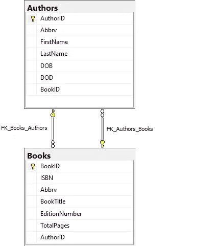

数据库模式(库)

在这里，从我们上面的数据库图中我们不难发现，我们已经定义了两个**(Authors 表中的 **BookID** 为 FK _ 作者 _ 书籍，Books 表中的 **AuthorID** 为 FK _ 书籍 _ 作者)**

# ****我们将从创建新项目到执行基本操作一步步开始。****

****让我们创建一个新项目。****

**如果你没有安装**纱线**，你也可以使用 **npm** 。**

1.  ****创建新目录并启动项目。****

**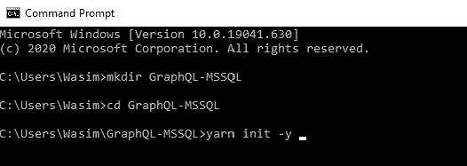**

**用**纱线**命令启动项目**

**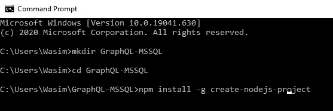**

**在全局级别添加**创建-节点-项目**依赖关系**

**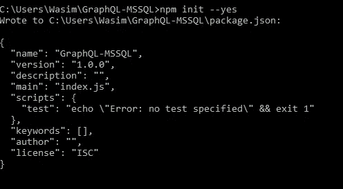**

**用 **npm** 命令启动项目**

**以上两个命令都将生成 package.json 文件。**

**2.**使用 yarn 添加所需的依赖关系****

*   **纱线添加序列-自动序列-cli 序列-g**
*   **纱线添加 Apollo-服务器图表 SQL MSSQL MSSQL 2-保存**
*   **纱线添加节点-D**

****3。使用 npm 添加所需的依赖关系****

*   **npm 安装顺序-自动顺序-cli 顺序-g**
*   **npm 安装 Apollo-服务器图表 SQL MSSQL MSSQL 2-保存**
*   **npm 安装节点 mon -D**

**以上从属关系，**

# **他们将如何帮助我们？**

**是一个基于 promise 的 Node.js ORM，用于 Postgres、MySQL、MariaDB、SQLite 和 Microsoft SQL Server。它具有可靠的事务支持、关系、急切加载和延迟加载、读取复制等特性。Sequelize 遵循[语义版本](http://semver.org/)。阅读更多关于[*sequelize*](https://www.npmjs.com/package/sequelize)*。***

****Sequelize-cli** —在安装这个包依赖项之前，请确保您已经成功地将 *sequelize 安装到您的项目中。cli 是 Sequelize 的命令行界面。***

****Sequelize-auto** —通过命令行自动生成 [SequelizeJS](https://github.com/sequelize/sequelize) 的模型。**

**您将需要安装`sequelize`；不再由`sequelize-auto`安装。**

**在使用 sequelize-auto 之前，您需要安装正确的方言绑定。阅读更多关于 [*序列自动*](https://www.npmjs.com/package/sequelize-auto)**

****mssql 和 MSSQL 2—**Microsoft SQL Server client for node . js(必须安装)**

****nodemon —** nodemon 是一个帮助开发基于 node.js 的应用程序的工具，当检测到目录中的文件更改时，它会自动重新启动节点应用程序。**

**nodemon】不要求*对你的代码或开发方法做任何*额外的改变。nodemon 是`node`的替代包装器。要使用`nodemon`，在执行您的脚本时，在命令行中替换单词`node`。**

# **为我们的项目创建配置和模型文件夹。**

**一旦以上依赖项成功安装，我们将使用数据库模式分别在 config 和 models 文件夹下创建配置文件和模型。**

**为此，请在您的项目下运行以下命令。**

*   **顺序初始化:配置**
*   **初始化序列:模型**

1.  **第一个命令将创建一个连接到数据库的配置文件，我们将在其中指定所有与 SQL Server (SSMS)相关的连接细节。**

**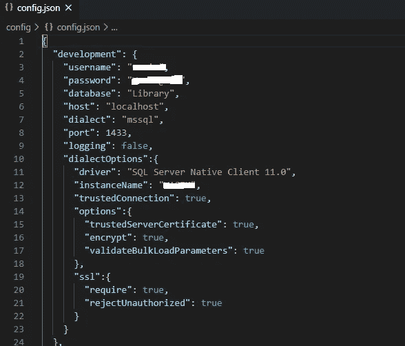**

**配置. json**

**3.第二个命令将创建一个模型文件夹，我们将在其中存储与模型相关的数据库表，即从现有的数据库表中生成模型。为此，我们将使用 [**序列自动**](https://github.com/sequelize/sequelize-auto#readme) **。****

**由于我们已经在我们的项目目录中，我们将简单地点击下面的命令，但是在点击该命令之前，请确保您已经成功地将[**Sequelize-Auto**](https://github.com/sequelize/sequelize-auto#readme)**包依赖项安装到项目目录中的节点模块文件夹[node_modules]中..****

****sequel ize-auto-h localhost-u<username>-x<password>-p 1433-d 库-o "。/models "-e MSSQL-c config/config . JSON</password></username>****

****这里，****

****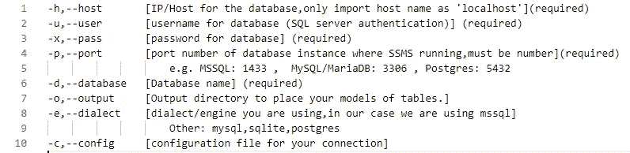****

****以下命令将自动生成一个模型文件，该文件将由数据库中的模型组成。在这个模型的文件夹中，我们将有 **Authors.js** 、 **Books.js** 、 **index.js** 和 **init-models.js** (全部自动生成)文件，这些文件由数据库模型及其关系组成。****

# ****设置解析器和类型定义。****

******什么是解析器？******

****Apollo Server 需要知道如何为模式中的每个字段填充数据，以便能够响应对数据的请求。为此，它使用解析器。****

******解析器是一个负责为模式中的单个字段填充数据的函数。**它可以以您定义的任何方式填充数据，例如从后端数据库或第三方 API 获取数据。****

****如果您*没有*为特定字段定义解析器，Apollo Server 会自动为它定义一个[默认解析器](https://www.apollographql.com/docs/apollo-server/data/resolvers/#default-resolvers)。****

******什么是 Typedefs？******

****GraphQL 有自己的类型语言，用于编写 GraphQL 模式:模式定义语言[(SDL)。最简单的形式是，GraphQL SDL 可以用来定义如下所示的类型:](https://blog.graph.cool/graphql-sdl-schema-definition-language-6755bcb9ce51)****

```
****type User {
  id: ID!
  name: String
}****
```

****首先，我们将在根目录下创建一个 graphql 文件夹，其中包含解析器和 typedefs。****

****我们将通过在/graphql 文件夹中创建一个***typedef . graph QL***文件来定义 typedef。首先，我们将为作者定义。****

****这里我们从一个类型开始。我们将有一个作者类型，看起来像 AuthorID，Abbrv，FirstName，LastName，DOB，DOD，BookID。****

****一旦我们定义了我们的类型，我们需要获取作者，这将通过查询对象来完成，查询对象将是一个作者数组。****

****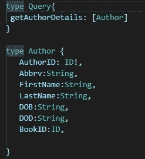****

****typeDefs.graphql****

****这里，getAuthorDetails 是查询的名称。****

****现在让我们通过在 graphql 文件夹中创建一个 **resolvers.js** 文件来实现我们到目前为止所定义的功能，这将是一个简单的 JavaScript 文件。****

****该文件将由查询解析器组成。这里我们将有一个 Author 的解析函数，它将返回 authors 的数组。****

****您的文件应该是这样的，****

****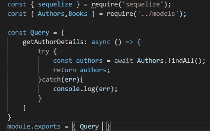****

****resolvers.js****

****同样，你也可以对书籍这样做。****

****一旦我们完成了 typedefs 和解析器，我们就可以创建我们的 **server.js** 文件了。在 **server.js** 文件中，我们需要从 *apollo-server* 包中导入 *Apollo Server 和 gql* 。****

****现在我们可以通过使用 gql 函数创建出 typedefs。为了导入我们的 typeDefs.graphql 文件，我们将使用 *fs(文件系统)*模块。我们将使用 fs.readFileSync()函数来读取我们的模式，我们将传递编码选项，并将其设置为“utf-8 ”,以确保它将文件作为字符串读取。****

****现在我们可以通过传递一个配置对象 typedefs 和 revolvers 来创建一个新的 apollo 服务器实例。****

****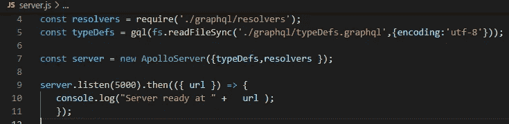****

****server.js****

****最后，我们可以通过在命令提示符窗口中点击下面的命令来运行服务器。****

******nodemon 服务器******

****或者****

******nodemon server.js******

****我们使用 **nodemon** 的原因是，即使我们修改了任何项目文件，我们也可以继续运行我们的服务器。****

****或者你可以简单地跑，****

******国家预防机制启动******

****这将在 [http://localhost:5000](http://localhost:5000/) 上运行，我们将看到 GraphQL Playground 运行。****

****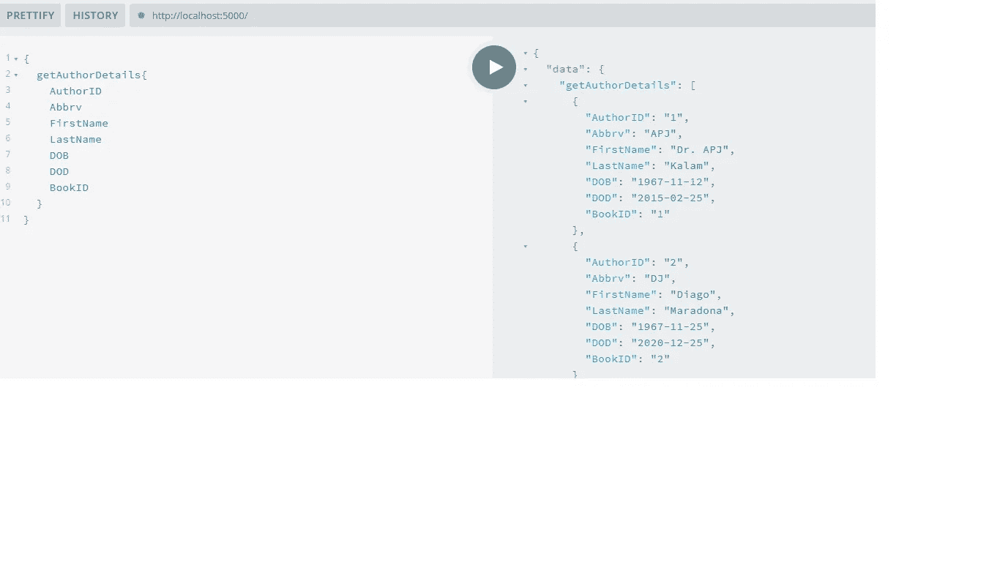****

****以上只是数据库记录的示例输出。****

****到目前为止，我们已经从 Authors 表中获取了所有记录。我们还可以从 Authors 表中获取单个记录，如果我们想从多个表中获取 author 的数据呢？是的，我们可以这样做，因为我们已经定义了关系。现在我们只需要为 author 修改我们的模式，还需要为 book 添加一个新的类型。我们修改后的模式应该如下所示。****

****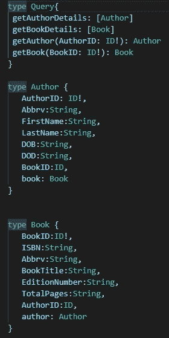****

****修改的 typeDefs.graphql****

****首先，如果我们只需要分别来自 Authors 和 Books 表的单个记录，我们定义了一个新的查询 getAuthor()和 getBook()。****

****上面我们在作者类型中添加了图书字段，图书字段的类型为图书，以便从图书表中获取相关数据。此外，我们还添加了一个新的图书类型，以便从 authors 表中获取与 Authors 数据相关联的所有图书记录。****

****为了从多个表中获取相关数据，我们需要指定我们想要的字段。在本例中，假设我们只需要相关书籍的书名和总页数。然后我们将请求这些字段，这就是 GraphQL 的强大之处，它不会获取所有的细节，查询只会获取请求的字段。****

****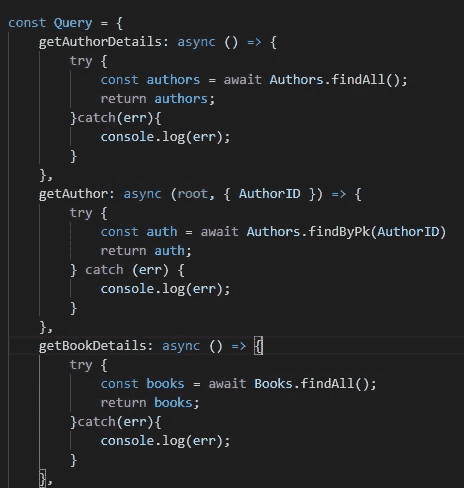****

****修改的 resolver.js(1)****

****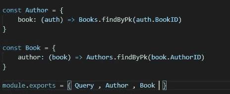****

****修改后的 resolver.js (2)****

****修改了 resolver.js (2)，所以我们说返回一本书，它的 id 与作者的 BookID 相同。****

****这里每个解析器函数接收一些参数，参数是父对象。在这种情况下，由于我们正在为作者解析图书，父对象是一个“auth ”,我们希望返回相关的图书并将其添加到导出的类型中。****

****现在让我们运行相同的查询，并检查输出:****

****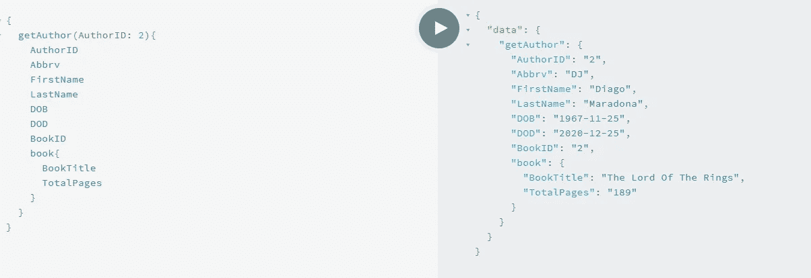****

****这里我们只得到一个 id 为 2 的 author 对象，以及只包含必填字段的相关图书信息。****

# ****如何执行插入、更新和删除操作？****

****为此，我们对 graphql 进行了突变。****

****在我们的 GraphQL 模式中，我们只有查询，它都是关于返回现有数据的，没有任何东西修改数据。修改数据的操作被称为**突变**。它们必须与查询分开。我们需要增加一个单独的类型，叫做突变。突变是一个根类型，就像查询一样。在变异内部，我们可以找到像插入、更新和删除这样的操作。****

****大多数关于 GraphQL 的讨论都集中在数据获取上，但是任何完整的数据平台都需要一种修改服务器端数据的方法。****

****在 REST 中，任何请求最终都可能对服务器造成一些副作用，但是按照惯例，建议不要使用`GET`请求来修改数据。GraphQL 是类似的——从技术上讲，可以实现任何查询来导致数据写入。然而，建立一个约定是有用的，即任何导致写操作的操作都应该通过一个变异显式地发送。****

****下面我们有一个添加新作者的突变，为此我们需要传递添加作者的参数。如果你看作者类型，你有名字，姓氏，缩写，DOB，DOD。这里我们没有 AuthorID 字段，因为在数据库中我们已经将其设置为自动递增。即身份插入已设置为真。****

****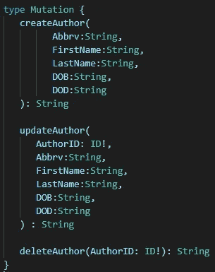****

****修改的 typeDefs.graphql****

****突变必须像查询一样返回结果。在我们的例子中，我们将返回一个字符串。****

****在解析器中，我们需要匹配模式的结构，因此我们需要定义一个名为 Mutation 的新对象，并将其添加到导出的对象中。****

****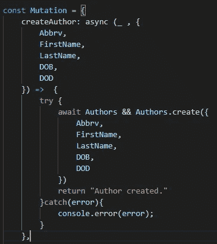********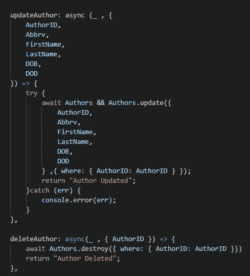

修改后的 resolvers.js**** 

****不要忘记在最后导出变异对象。****

****module.exports = {查询，作者，图书，突变}****

****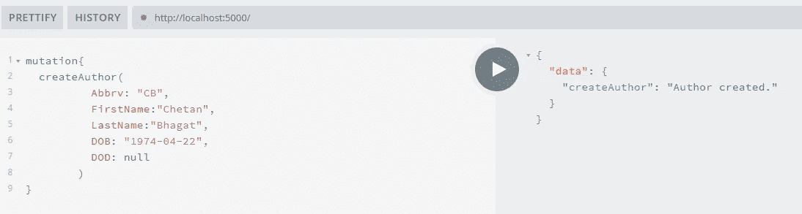****

****添加作者后的输出****

****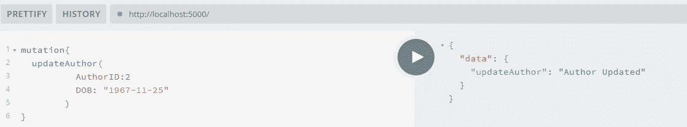****

****更新作者详细信息后的输出****

****同样，你可以添加、更新和删除这本书。****

# ****结论****

1.  ****我们看到了如何用 Apollo Server 在 Node.js 中创建一个 GraphQL 服务器。****
2.  ****我们看到了每个依赖项将如何帮助我们完成项目。****
3.  ****我们还看到了如何使用 Sequelize 将 MSSQL(SQL Server)数据库与 GraphQL 服务器集成。****
4.  ****我们已经使用 GraphQL 对数据库执行了基本操作。****

****该项目也可以在 GitHub [repo](https://github.com/bagwanwasim01/GraphQL-MSSQL) 上获得。****