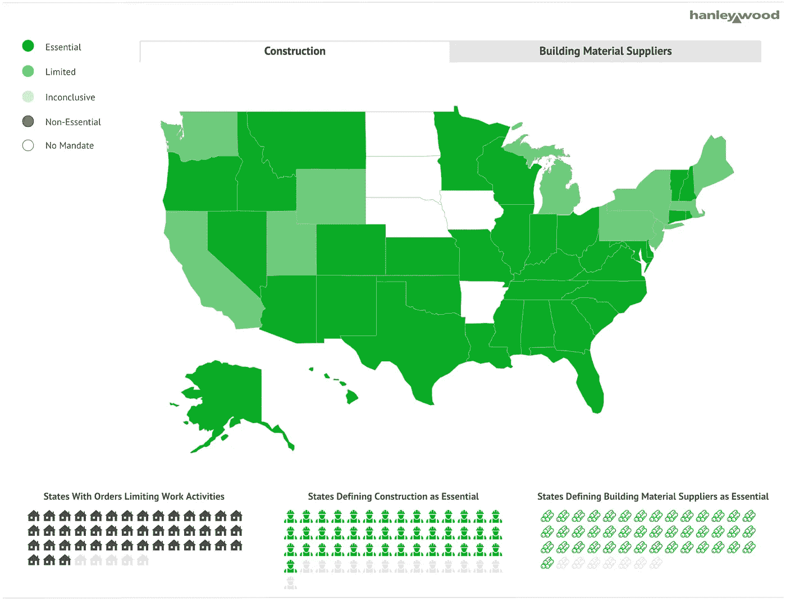

# 婴儿的第一个 Web 组件

> 原文：<https://levelup.gitconnected.com/babys-first-web-component-776067955342>

是我。我是宝贝。


从[图标 8](https://icons8.com/) 到[图标 8](https://icons8.com/) 的插图

# 问题是

在疫情实施几个月后，我们的交互设计团队创建了[冠状病毒建设限制各州跟踪器](https://www.builderonline.com/coronavirus-construction-limits-state-by-state-tracker_s):这是一个仪表板，可以跟踪各州如何对建筑和建筑材料供应商进行分类。显示该仪表板的页面没有使用我们内容管理系统(CMS)中的任何标准页面模板。因此，它需要一个自定义的分享栏，而不是我们文章页面上使用的 Gigya powered 分享栏。



Builderonline.com[上的状态跟踪器](https://www.builderonline.com/coronavirus-construction-limits-state-by-state-tracker_s)

# 第一种方法:创建一个即兴的社交分享吧

我们的交互设计师需要一些 HTML 代码，她可以把这些代码放在页面上，而不需要我们进行代码部署。从头开始创建一个共享栏非常简单。

**所需工具:**

*   社交图标——我们已经在我们的网站上使用了[字体 Awesome](https://fontawesome.com/) ,所以这只是一个将正确的 CSS 类应用到锚标签(即`fa fa-facebook`)的问题
*   社交链接生成器——我指导我们的交互设计师去查看 https://www.websiteplanet.com/webtools/sharelink/的[来生成合适的社交分享链接。](https://www.websiteplanet.com/webtools/sharelink/)

结果会是这样的:

```
<a href="[https://www.facebook.com/sharer/sharer.php?u=https://www.builderonline.com/coronavirus-construction-limits-state-by-state-tracker_s](https://www.facebook.com/sharer/sharer.php?u=https://www.builderonline.com/coronavirus-construction-limits-state-by-state-tracker_s)"><i class="fa fa-facebook">&nbsp;</i></a>
```


***巴达兵，巴达轰！***


# 第二种方法:将共享栏创建为 Web 组件

嗯，我们在上面的方法中遇到了一个难题:这个页面是 CMS 中的一个单独的内容项，显示在[的多个网站上。我们如何让分享栏根据当前被浏览的站点使用适当的分享链接？](https://www.jlconline.com/coronavirus-construction-limits-state-by-state-tracker)

解决这个问题似乎是创建 web 组件的绝佳机会。

> Web Components 是一套不同的技术，允许您创建可重用的自定义元素(将它们的功能封装在代码的其余部分之外)，并在您的 Web 应用程序中使用它们。
> -[developer.mozilla.org](https://developer.mozilla.org/en-US/docs/Web/Web_Components)

## 为什么要使用 Web 组件？

*   **可重用性** —使用一个 web 组件将允许我们只需要创建一次就可以在任何地方使用它。
*   **封装** —影子 DOM 允许我们操作 web 组件的标记、样式和行为，而不会影响页面上的主要代码。
*   **学习的机会** —我将此视为学习如何创建 web 组件的机会，因为这将是一个简单的用例。

## 我们如何实现 Web 组件？

我首先需要定义我的元素，并让它扩展泛型`HTMLElement`类:

```
<script type="text/javascript">
    class ShareElement extends HTMLElement {
      constructor() {
        super();
      }
}
</script>
```

然后我定义了`connectedCallbackMethod()`，它在每次组件被添加到页面时触发。

```
connectedCallback() {        
  // init the component        
  let shadowDom = this.attachShadow({ mode: "open" });
  ...
}
```

在该方法中实现了以下内容:

**添加字体 Awesome 到阴影 DOM**

我立刻注意到字体 Awesome CSS 没有被带入 shadow DOM。我很快就完成了这项工作，所以快速而肮脏的方法是从主 DOM 中检索字体 Awesome `link`元素，并将其插入到阴影 DOM 中。

```
const fontawesome = document.querySelector(‘link[href*=”fontawesome”]’); shadowDom.appendChild(fontawesome.cloneNode())
```

**造型锚标记颜色**

我只需要链接伪选择器`:visited`和`:hover`的几个样式，其余的样式我都懒的内联了。

```
let style = document.createElement('style');
style.textContent = ‘a,a:visited{color:#00aced}a:active,a:hover{color:#000}’;
shadowDom.appendChild(style);
```

**生成社交链接**

记住，最大的问题是我们希望共享链接使用共享栏当前所在页面的 URL。为了生成动态共享链接，我首先获取了当前的 URL，

`const url = window.location.href;`

然后在适当的查询参数中将其添加到社交共享链接。

脸书:`“https://www.facebook.com/share.php?u=' + url` 推特:`“https://twitter.com/intent/tweet?url='+ url`

**适当调整弹出窗口的大小。**

我认为这是一个使用合理大小的弹出窗口的绝佳机会，所以我决定将大小设为 500x500，并在它出现时将其置于屏幕中央:

```
shareLinks[i].addEventListener('click', function(e) {                  e.preventDefault();                
const left = (screen.width/2)-250;                
const top = (screen.height/2)-250;                
window.open(
this.href, 
'socialShareWin',                        
'left=' + left + ',top=' + top + ',
width=500,
height=500,
toolbar=1,
resizable=0');                
return false;              
});
```

**最后，使用**初始化组件

```
customElements.define("hw-share", ShareElement);
```

因此，我能够使用
`<hw-share />`将我的定制元素添加到页面中。


**完成下面的代码:**

# 结论

我在大约一个小时内完成了这个，因为交互团队尽快需要它，所以需要做一些改进。要学的东西太多了，比如[模板和槽](https://developer.mozilla.org/en-US/docs/Web/Web_Components/Using_templates_and_slots)以及剩下的[回调](https://developer.mozilla.org/en-US/docs/Web/Web_Components/Using_custom_elements#Using_the_lifecycle_callbacks)，但是我很高兴我能够在这么短的时间内学到新的东西来解决一个问题。

***你对 web 组件的第一次体验是什么？***

# 更多阅读

*   [使用定制元素| MDN](https://developer.mozilla.org/en-US/docs/Web/Web_Components/Using_custom_elements)
*   [什么是 Web 组件？|连贯实验(教程)](https://coherent-labs.com/posts/web-components/)