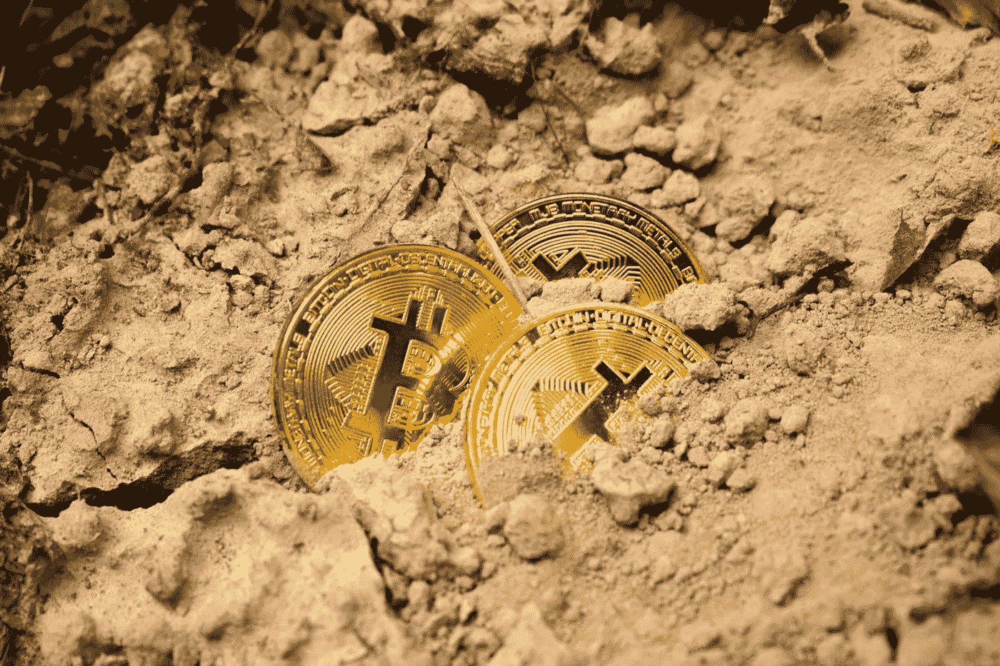
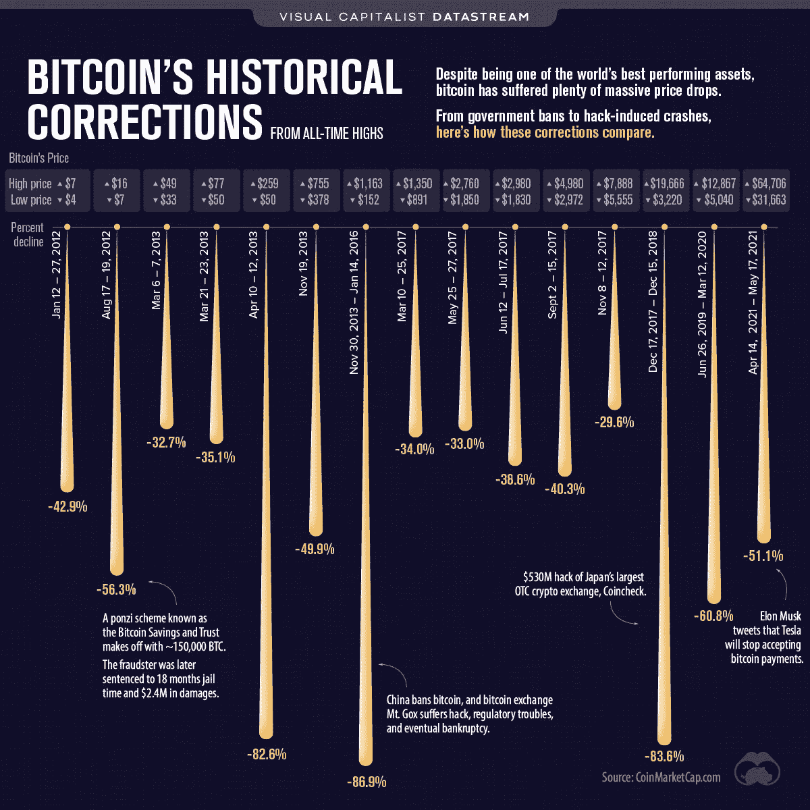
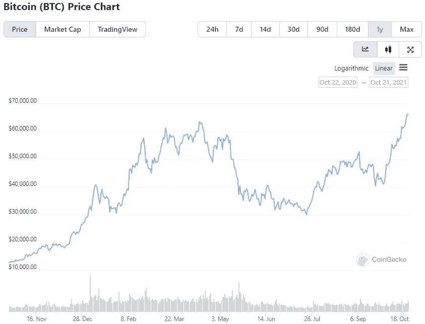
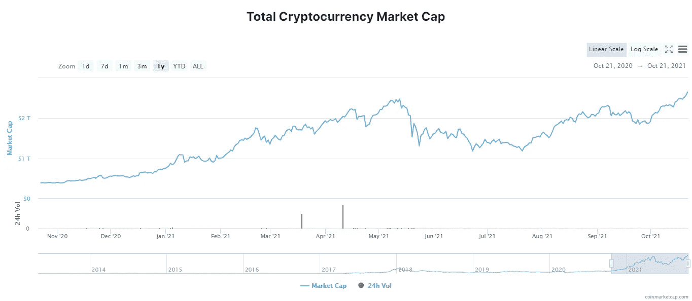
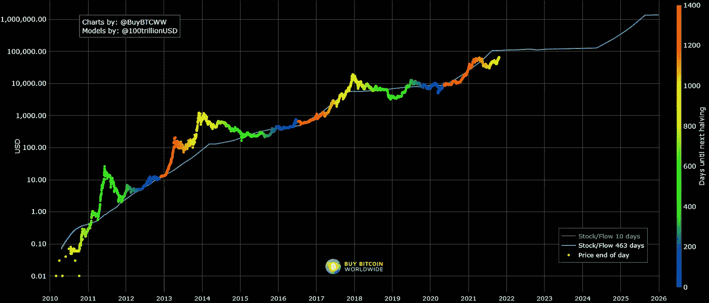

# 回到牛市:比特币在粉碎历史新高后，2021 年还能走多高？

> 原文：<https://levelup.gitconnected.com/back-to-the-bull-market-how-high-can-bitcoin-go-in-2021-after-smashing-all-time-high-c701c55d8da2>

在经历了 5 月和 6 月的大幅调整后，比特币出现了一个似乎最不可能的壮举，它飙升至 64，800 美元的前历史高点，在遭遇阻力前短暂突破 67，000 美元大关。现在世界上最古老和最著名的加密货币已经进入了一个新的价格发现时期，到 2021 年底比特币能实现什么价值？

BTC 的崛起也有助于将各种替代硬币推向新的高度，SOL 在 10 月 21 日攀升了 20%以上，而以太坊也在比特币价格上涨的背景下朝着 4 月份的历史高点 4356.99 美元加速反弹。

*(图片:* [*视觉资本家*](https://www.visualcapitalist.com/bitcoin-historical-corrections-from-all-time-highs/) *)*

然而，如上图所示，通往历史新高的道路并非一帆风顺。主要归因于中国监管方面的挫折和对比特币开采的环境影响的担忧，BTC 的价值在年初大幅上涨后，于 2021 年春季暴跌了 50%以上。

尽管比特币的崩溃引发了人们对熊市将在可预见的未来控制生态系统的担忧，但这种加密货币仅用了 6 个月就反弹并超过了 4 月份的高点。

*(图片:***)**

*如上图所示，在过去的一年里，BTC 经历了巨大的价格波动，显示出一些评论者声称我们将不再看到的波动水平，因为大量机构投资者购买了加密货币。然而，随着 9 月份价格的大幅上涨，比特币似乎在 2021 年第四季度初产生了令人印象深刻的势头。*

**

**(图片:*[*CoinMarketCap*](https://coinmarketcap.com/charts/)*)**

*我们还可以从数据中看到，加密货币市场总市值达到了历史最高水平，达到了 2.65 万亿美元。剧中有如此令人难以置信的数字，BTC 是如何实现如此令人印象深刻的集会的？而 2021 年底加密货币能走多远？让我们更深入地了解加密货币市场的重要季度。*

# *为什么多头又回来了*

*那么，是什么原因导致比特币在夏季开始熊市后恢复牛市呢？围绕加密货币市场的最大新闻之一是世界上第一个基于比特币期货的交易所交易基金的首次亮相，这使得传统股票市场投资者更容易进行加密投资。*

*Freedom Finance Europe 投资研究主管马克西姆曼图罗夫(Maxim Manturov)也指出，由于负利率，我们看到投资者对加密货币的兴趣大大增加。*

*“值得注意的是，美国的实际利率长期为负。即使在美联储可能于 2022 年加息后，实际利率也可能保持为负，”曼图罗夫说。“这很重要，因为负实际利率会导致资产市场的交易和投机活动增加。尽管利率为负，但为了保持购买力，美国人将寻求从股票、加密货币、贵金属和其他投资以及交易工具中获得收入。”*

**

**(图片:***)***

**对于其他加密货币爱好者来说，2021 年牛市的恢复已经在加密货币的股票到流量模型中得到预期。如上图所示，从存量到流量的模型描绘了比特币在其固定减半事件之后的增长——在这些事件中，矿工获得的 BTC 量减半，从而影响了长期供应。**

**在撰写本文时，比特币的股票-现金流图表估计，BTC 今天的价值将接近 107，000 美元，而不是 7 万美元，但鉴于比特币的急剧轨迹，世界上最著名的加密货币[可能会很快达到六位数。](/driving-the-resurgence-bitcoins-rally-revives-the-cryptocurrency-market-ad8987469822)**

# **2021 年 BTC 房价能攀升到多少？**

**那么，比特币将何去何从？CoinDesk 的 Damanick Dantes 最近声称，在短期内，合理的价格目标可能是 86，000 美元——但这可能是迈向更高价格的跳板。**

**“所有人都在关注 10 万美元大关，但当散户真的涌入，更多的资金向比特币开放，包括实物[支持的 ETF](https://en.freedom24.com/ideas/11042-three-corporate-bond-etf)，10 万美元不太可能是它的终点，”[AAX 加密交易所研究和战略主管本·凯斯林](https://www.coindesk.com/markets/2021/10/20/after-bitcoin-all-time-high-whats-next/)说。**

**2021 年 BTC 能达到 10 万美元吗？经济预测机构对这种著名的加密货币的未来持谨慎乐观态度，但没有宣布第四季度结束时达到六位数——列出了 BTC 年底前超过 84，000 美元的潜在高点。该机构认为，2022 年可能会是一个不同的故事，2022 年 10 月的预测将比特币的价格定位在 163，802 美元。**

**然而，并不是所有人都看好 BTC 的前景。“通常当一项投资达到历史高点时，这是最不理想的买入时机，”[注册理财规划师、Fit Advisors 创始人 Anjali Jariwala](https://www.cnbc.com/2021/10/20/expert-bitcoin-high-above-65k-but-its-least-ideal-time-to-buy.html) 说。“我认为，相对于在历史高点买入，静观其变是有意义的。”**

**[比特币著名的](/road-to-recovery-could-bitcoin-still-top-100-000-in-2021-7a84c4b10f8b)波动性提醒人们，加密世界可能是一场不稳定的狂野之旅。出于这个原因，在牛市中被冲昏头脑之前保持谨慎是很重要的。然而，有一点是肯定的，比特币成为主流应用表明它不会很快消失。**