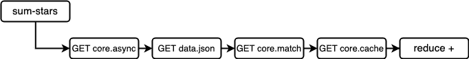
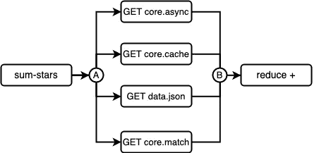

# Clojure 中的回到未来

> 原文：<https://levelup.gitconnected.com/back-to-the-future-in-clojure-934b85a3d08e>

## 一个简单明了的使用期货进行并行处理的例子


照片由[杰米街](https://unsplash.com/@jamie452?utm_source=unsplash&utm_medium=referral&utm_content=creditCopyText)在 [Unsplash](https://unsplash.com/s/photos/parallel?utm_source=unsplash&utm_medium=referral&utm_content=creditCopyText) 拍摄

并行处理是一个令人兴奋的话题，尤其是当谈到可以被分割成更小的任务、独立执行、聚合并呈现为唯一结果的繁重流程时。

Clojure 提供了不同的方法来完成这种工作，而 *futures* 是一种方便的方法，可以将一个大任务拆分成多个并行线程，这些线程最终将被启动它们的进程收集起来，允许它聚合结果，以更快的方式提供相同的结果。

# 谈论未来

你可以把*未来*想象成一段在自己独立的线程上运行的代码。更具体地说， *future* 是一个 Clojure 宏，它接受一组表达式，以便在另一个线程中执行它们。宏返回内存中对已触发的*未来*的引用。这允许通过一些助手功能与它通信:

*   [未来？](https://clojuredocs.org/clojure.core/future_q):验证所提供的参数是未来值。
*   [未来完成？](https://clojuredocs.org/clojure.core/future-done_q):以未来为自变量，验证是否已经完成。
*   [未来-取消](https://clojuredocs.org/clojure.core/future-cancel):试图取消给定的未来。
*   [未来-取消？](https://clojuredocs.org/clojure.core/future-cancelled_q):验证作为参数传递的未来是否被取消。

*future* 的结果存储在缓存中的某个地方，即使尚未完成，我们也可以通过调用`(deref my-future)`来尝试获取其结果。在这种情况下，尝试`deref`的线程将被阻塞，直到*未来*完成。

# 从 Github 得到观星者

我们感兴趣的是获得 [Clojure](https://github.com/clojure) 在 Github 上的明星总数。也就是说，属于 Clojure 帐户的每个存储库中的星的总和。

这些信息很容易被 Github API 获取。`GET /users/:username/repos` [端点](https://developer.github.com/v3/repos/#list-user-repositories)已经响应了每个存储库的星计数。我们可以遍历返回的 JSON 数组，得到星计数，并对它们求和。

出于本文的考虑，让我们假设上面的端点不返回星计数，而是返回存储库的名称，这样我们就可以点击`GET /repos/:owner/:repo` [端点](https://developer.github.com/v3/repos/#get)来获得星计数。这意味着对于每个存储库名称，将会向`GET /repos/:owner/:repo`发出一个请求。



同步聚合存储库

如上图所示，从每个存储库中获取恒星是一个连续的同步任务，完成每个请求可能需要相当长的时间。一旦所有的请求都被成功响应，那么`reduce`函数就会开始对所有的星星进行求和。

下面的函数`get-star-count`同步执行 HTTP 请求以获取存储库细节，然后从响应中提取`stargazers-count`属性，该属性表示星计数。

获取星计数的 HTTP 请求

现在，我们来看看`sum-stars`函数。它提供了两种算法，一种专门获取用户名，另一种需要一系列存储库名称:

同步总星计数

注意，第 3 行中的第一个 arity 调用 2-arity 函数，并将`github/repo-names`的结果作为第二个参数(`repos`)发送。这涉及到一个额外的 HTTP 调用，它阻止我们使用先前定义的序列手动输入 repo 名称。我们可以避免这个额外的 HTTP 调用干扰`sum-stars`，方法是提供一个包含存储库名称的已定义序列，或者将`github/repo-names`的结果存储在一个符号中，然后将其传递给函数。

每个存储库被传递给第 6 行的`get-star-count`，阻塞主线程，直到每个请求同步完成。然后由`reduce`汇总结果。

# 行动中的未来

现在我们将使用*期货*实现相同的功能。这一次，将为每个存储库启动一个执行`GET /repos/:owner/:repo`的*未来*。



异步聚合存储库

每个 HTTP 请求都是并行工作的，如上图所示。使用`future`宏在 A 点触发*期货*。一旦他们都准备好了他们的回答，就可以利用*列表理解*使他们在 B 点相遇，以便简化为唯一的结果。

请注意，有些请求可能比其他请求花费的时间长，因为它们取决于网络吞吐量、Github 服务器的延迟，甚至是运行线程的处理器的速度。因此，这个场景的最坏情况是需要更多时间来完成的请求，因为那将是完成`sum-stars`的时间。

1-arity 函数与同步版本中的基本相同。给定用户名的所有回复都被传递给 2-arity 函数。

有趣的部分从第 5 行开始，用`for`语句创建了一个对*期货*的列表理解。也就是说， *futures* (第 6 行)的序列表示独立工作的线程在内存中的位置。有了这个*未来*的序列，我们就可以使用之前解释过的帮助函数与它们交流，或者简单地尝试`deref`并得到结果。

第 7 行中的管道展示了聚合每个结果的过程。使用`deref`将*期货*的序列传递给`map`。这将阻塞主线程，直到每个并行线程完成。一旦`deref`结束，对*未来*的列表理解就变成了一系列带有实际星星计数的响应。然后，它们被传递给`reduce`函数，该函数简单地对它们求和。

# 标杆管理

让我们看看同步和异步版本有多快。为了做到这一点，我们将使用方便的`time`函数，它是`clojure.core`的一部分。

## 考虑

*   在 MacBook Pro 上执行，macOS Catalina 10.15.1，2.2GHz 6 核 Intel i7，16 GB 2400 MHz DDR4。
*   Github 上的 [Clojure](https://github.com/clojure) 帐户用于测试。
*   `github/repo-names`被限制返回 30 个回购，尽管 [Clojure](https://github.com/clojure) 拥有 85+。
*   基于以上观点，测试考虑了来自 [Clojure](https://github.com/clojure) 账户的 30 个存储库。

```
user=> (def username "clojure")
user=> (def repos (github/repo-names username))
user=>
user=> (time (core/sum-stars username repos))
"Elapsed time: 13841.095288 msecs"
20263
user=>
user=> (time (core/sum-stars-async username repos))
"Elapsed time: 587.558128 msecs"
20263 
```

可以看到，两个版本的结果是一样的`20263`，代表了 Github 上 Clojure 的前 30 个库的总星数。但是同步版本的运行时间几乎是 14 秒，不像异步调用的 587.55 毫秒。

# 结论

并行处理提供了一种强大的方法，可以将一项繁重的任务分解成更小的独立问题，这些问题一旦完成就可以聚合在一起。Clojure 中的期货是完成这类任务的一种强大且易于使用的方法。

下次你在处理一个需要很长时间才能完成的函数时，考虑使用*期货。*

不要忘记克隆和使用本文的[代码。](https://github.com/jovannypcg/parallel-processing)

编码快乐！