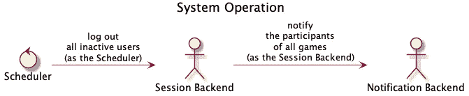

# 后端到后端通信

> 原文：<https://levelup.gitconnected.com/backend-to-backend-communication-d9fe85234ead>

任何分布式系统都解决了在其不同的组件(前端或后端)之间共享信息的问题。在本文中，我将重点关注在不同的后端之间建立通信。为了让读者从各个角度理解这个概念，我概述了交流的原因、目标和方法。

帕万·特里库塔姆在 [Unsplash](https://unsplash.com?utm_source=medium&utm_medium=referral) 上的照片

# 交流的原因

由于以下原因，后端必须到达分布式系统中的其他后端:

*   一个*显式用户动作*(有时充当他们的代理)，
*   一个*隐式系统操作*(例如周期性任务)。

根据经验，用户操作*比系统操作*需要更少的权限。如果可行的话，后端应该只使用相关用户的权限在不同的服务上执行命令。**

首先，下图显示了在线游戏中的示例性*用户动作*，其中*用户*可以向*游戏后端*发送命令以离开特定游戏。接受命令后，*会话后端*需要请求*通知后端*通知其他游戏参与者用户已经离开，因为前者没有发送通知的能力。热心的读者可能会指出*会话后端*应该对通知一无所知；另一方面，这样的关注点分离需要切换到基于*事件的*或基于*命令的*架构。

(显式)用户操作的示例。使用 PlantUML 创建。

其次，下图显示了一个由*代理的用户动作*的例子。*用户*可以从*游戏后端*请求关于特定游戏的信息，游戏后端需要先从*用户后端*收集数据来完成请求。*游戏后端*可以获取用户信息，其权限仅限于所述*用户*的权限。

代理用户操作的示例。使用 PlantUML 创建。

最后，下图说明了一个典型的*预定系统操作*。*调度器*周期性地请求*会话后端*注销所有不活动的用户，这迫使前述后端请求*通知后端*通知所有游戏的参与者关于终止的会话。澄清一下，*会话后端*并不充当代理，因为没有物理用户执行*调度程序*，而正是这个系统执行了调度程序。

(隐式)系统操作的一个例子。使用 PlantUML 创建。

# 沟通的目标

在下列情况下，后端需要向其他后端发送消息:

*   他们需要从他们那里得到一些信息，
*   他们想要改变另一个系统组件的状态。

尽管有人认为*不可变操作*比*可变操作*更安全，但是*被调用者*无论如何都应该验证*调用者*的权限。同样，有问题的系统可能不允许某些用户访问特定信息。

例如，*会话后端*可能会向*认证后端*询问令牌有效性，如下图所示。验证令牌是不可变请求的最基本的例子，因为这样的操作要么确认要么否定有效性，仅此而已。不可变请求不会产生分布式事务的问题，因为即使它们失败了，也没有任何更改需要回滚。

不可变操作的一个例子。使用 PlantUML 创建。

另一方面，用可变命令设计系统需要关于分布式事务的基本知识。这样的事务可能跨越多个微服务，从而触发许多容易出错的操作。即使一个操作失败，系统也需要:

*   取消剩余操作执行的更改，或
*   提交由剩余操作进行的更改，并执行一个*补偿操作。*

软件开发人员可以使用*两阶段提交协议*在多个服务上回滚变更。该协议假设服务之间的稳定通信、它们的运行时稳定性(无崩溃)以及所述服务使用的相关数据库的原子性。该算法要求一个服务充当*分布式事务协调器*，它管理提交的两个阶段:

*   *投票*阶段——当协调器告诉每个服务提交什么，并且它们以成功或失败来响应时，
*   *提交*阶段——协调器收集投票并要求所有服务提交或回滚。

由于外部系统的原因，完成某些交易所需的时间可能会超过几分钟。这种*长时间运行的事务*，由于它们不能依赖两阶段提交协议，所以当失败发生时，使用*补偿事务*。例如，如果用户预订了一张音乐会门票并已付款，而音乐会主持人没有在指定的时间范围内确认该门票，系统需要通知用户该问题，取消该门票并退款，如下所示。

一个长时间运行的事务的例子。使用 PlantUML 创建。

# 交流的方法

后端可以使用以下方式与其他后端通信:

*   显式和同步消息(例如，通过 HTTP 请求)，
*   隐式和异步消息(例如，通过基于事件的系统)。

无论选择何种通信方法，每条消息都应包含一条信息，以便能够识别发送者。即使后端使用隔离的子网进行数据交换，了解消息的来源也有助于在整个系统中实施*访问控制*。

优先考虑速度的系统，比如关注点分离，可能更喜欢使用*同步消息*，特别是对于不可变的操作。对于 HTTP，服务可能使用 CDN ( *内容交付网络*)或其他缓存层调用*等幂*端点，从而随着时间的推移更快地获得结果。使用同步消息意味着在接收方做出响应之前，调用方一直处于阻塞状态；在一个线程后端同时阻塞太多线程可能会阻止整个实例接受新连接。

基于命令或基于事件的系统使用*异步消息*，这意味着后端可能会向消息管道发送一个命令(或一个事件)供其他后端进一步处理，如下所示。系统最终会处理这样的消息，但是原始发送者从不明确地等待任何结果。使用消息驱动的系统允许服务解耦，因为具有特定功能的后端不需要知道彼此的存在。

基于命令的系统的一个例子。使用 PlantUML 创建。

# 摘要

随着现代软件开发抛弃了单片后端，转而支持微服务，从而支持分布式系统，软件专业人员需要建立后端到后端的通信。这种通信有多种方式，取决于将两个服务连接在一起的确切原因和要实现的目标。我发现理解这一点很重要，一旦开发人员在两个后端之间建立了通信，迁移到不同的信息交换方法可能会使整个系统设计颠倒过来。