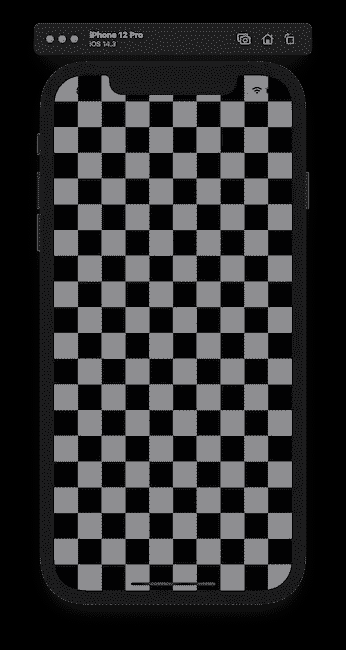

# SwiftUI 的背景色

> 原文：<https://levelup.gitconnected.com/background-color-with-swiftui-415fc661b31f>

一旦创建了 SwiftUI 视图，它就有了默认的背景色，白色代表亮模式，黑色代表暗模式。怎么能换成不一样的呢？今天让我们来研究一下。


[AB](https://unsplash.com/@applefanboy) 在 [Unsplash](https://unsplash.com/?utm_source=medium&utm_medium=referral) 上拍照。

在本文中，我们将讨论可以用来更改 SwiftUI 视图默认背景的不同技术。

# 使用修饰符

我想到的第一个方法是使用`.background()` [修饰符](http://apple.co/3mSzqar)。遗憾的是，苹果没有为此提供文档。它接收一个视图，该视图被设置为我们添加该修改器的视图的背景。

在这种情况下，我们想改变背景颜色。例如，我们可以传入`Color.gray`。

```
Text("Hello, world!")
  .background(Color.gray)
```


我们看到它只为文本视图设置了背景颜色。这就是 SwiftUI 的工作方式。我们想把它设置为整个屏幕。我们可以使用`VStack`、`HStack`和几个`Spacer()`视图来接近它。

```
VStack {
  Spacer()
  HStack {
    Spacer()
    Text("Test")
    Spacer()
  } 
  Spacer()
}.background(Color.gray)
```


看起来好一点，但是我们想设置为整个屏幕，忽略安全区域。我们可以使用`.edgesIgnoringSafeArea` [修改器](http://apple.co/38HHk1c)来实现。使用这个修饰符，我们可以告诉 SwiftUI 布局引擎扩展到屏幕的安全区域之外。它接受一个参数来定义我们可以扩展哪些边。在这种情况下，我们将传入`.all`。

```
.background(Color.gray.edgesIgnoringSafeArea(.all))
```


这看起来正是我们想要的。问题是代码相当麻烦，有很多嵌套视图和间隔符。让我们从另一个角度来看。​

# 使用`ZStack`

我们可以通过利用`ZStack` [视图](https://developer.apple.com/documentation/swiftui/zstack)来显著提高代码的可读性和复杂性。使用这个视图，我们可以将多个视图层层叠加。我们的方法是添加背景色，然后在上面添加内容。

```
ZStack {
  Color.gray
    .edgesIgnoringSafeArea(.all)

  Text("Hello, world!")
}
```

代码现在看起来干净多了，我们在它上面有一个灰色的背景和文本。这种方法最好的部分是，我们只为背景色视图忽略安全区域。其他视图不会延伸到安全区域之外。


# 多种颜色

现在我们知道了如何将背景色设置为单一颜色，那么将它设置为垂直和水平两种颜色怎么样？我们可以通过在垂直对齐的`VStack` [视图](https://developer.apple.com/documentation/swiftui/vstack)或垂直对齐的`HStack` [视图](https://developer.apple.com/documentation/swiftui/hstack)中使用`ZStack`和包装颜色的方法来实现。

# 竖向定线

让我们用两种颜色——灰色和黑色。通过在`VStack`视图中包装它们并使用`ZStack`，我们可以将屏幕垂直分成两半。其中一个填充灰色，另一个填充黑色。

```
ZStack {
  VStack(spacing: 0) {
    Color.gray
    Color.black
  }
  .edgesIgnoringSafeArea(.all)
}
```


# 水平线向

通过将`VStack`改为`HStack`，我们可以用灰色和黑色水平填充屏幕。

```
ZStack {
  HStack(spacing: 0) {
    Color.gray
    Color.black
  }
  .edgesIgnoringSafeArea(.all)
}
```


# 国际象棋桌子背景

让我们做一些疯狂的事情，建立一个背景，看起来像一个国际象棋台。我们可以用多种颜色垂直和水平地重复几次前面的例子。

```
ZStack {
  VStack(spacing: 0) {
    ForEach((1...10).reversed(), id: \.self) { i in
      HStack(spacing: 0) {
        ForEach((1...5).reversed(), id: \.self) { i in
          Color.gray
          Color.black
        }
      }
      HStack(spacing: 0) {
        ForEach((1...5).reversed(), id: \.self) { i in
          Color.black
          Color.gray
        }
      }
    }
  }.edgesIgnoringSafeArea(.all)
}
```

这里我们看到了 SwiftUI 布局引擎和 Swift 代码相结合的力量。



# TL；速度三角形定位法(dead reckoning)

SwiftUI 视图带有默认的背景色——亮模式下为白色，暗模式下为黑色。在很多情况下，我们想把它换成别的东西。第一种方法是使用`.background`修饰符并传递`Color`，这是 SwiftUI 中的一个视图。第二种方法是使用`ZStack`并为垂直布局添加一种颜色或多种颜色，为水平布局添加`VStack`。如果你对改变 SwiftUI 视图的背景色有其他想法，请告诉我。感谢您的阅读。

# 链接

*   [样本代码](https://github.com/fassko/swiftui-view-background-color)
*   [颜色和框架](https://www.hackingwithswift.com/books/ios-swiftui/colors-and-frames)
*   [SwiftUI 背景色教程](https://www.ioscreator.com/tutorials/swiftui-background-color-tutorial)
*   `[.background](http://apple.co/3mSzqar)` [修改器](http://apple.co/3mSzqar)