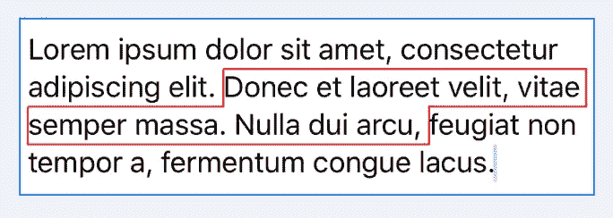

# UITextView 中带圆角的背景

> 原文：<https://levelup.gitconnected.com/background-with-rounded-corners-in-uitextview-1c095c708d14>

在制作[质子](https://github.com/rajdeep/proton/)的过程中，我有机会学到了很多东西。就像我喜欢分享我的代码一样，我也喜欢谈论挑战和胜利。这篇文章关注的是 [Proton](https://github.com/rajdeep/proton/) 中的另一个特性，我相信这个特性在 iOS 中应该是现成的。如果你是新手，在深入细节之前，想了解更多关于 [Proton](https://github.com/rajdeep/proton/) ，[为 iOS](/building-a-native-editor-for-ios-968ff9bc6e0c) 构建一个原生编辑器是一个很好的起点。

# 带背景的文本

我们经常想在文本视图中给文本添加背景。最简单也可能是最好的方法是使用 [backgroundColor](https://developer.apple.com/documentation/foundation/nsattributedstring/key/1528791-backgroundcolor) 属性。您可以为给定的范围提供任何`UIColor`，iOS 会负责在文本背景中呈现该颜色。


用...发短信。背景颜色属性

您需要的唯一代码是将属性`backgroundColor: UIColor.cyan`添加到`UITextView`的`attributedText`属性中的`NSAttributedString.Key`列表中。虽然这在大多数情况下是可行的，但可能感觉太普通了。你可能想要更花哨的格式，比如添加阴影或边框。至少，很可能你会想要圆角的背景。不幸的是，这些属性都不能通过使用属性来修改。

# 更好的背景


我在使用 [Proton](https://github.com/rajdeep/proton/) 时遵循的一个原则是提供我们作为开发人员可能想要定制的所有功能，同时保持这些定制的自然性。我的意思是，您可能想要做的所有定制，在理想情况下应该只不过是添加一个带有必需信息的属性。例如，如果您想在 UITextView 中添加列表，那么只需在文本范围中添加一个`.listItem`属性即可。你可以在 UITextView 的[列表中阅读我的冒险经历。使用](https://medium.com/dev-genius/lists-in-uitextview-756fe2b1407a)[质子](https://github.com/rajdeep/proton/)，您可以添加一个与`backgroundColor`非常相似的属性，并实现以下功能:


圆角背景


带阴影的圆角



仅带边框的背景


阴影、边框和圆角

您需要添加的唯一代码是:

```
let style = BackgroundStyle(color: .green, cornerRadius: 5, 
border: BorderStyle(lineWidth: 1, color: UIColor.blue),  
shadow: ShadowStyle(color: .gray, offset: CGSize(width: 2, height: 2), blur: 3))editor.addAttribute(.backgroundStyle, value: style, at: editor.selectedRange)
```

`editor`是`UITextView`的[质子](https://github.com/rajdeep/proton/)对应。除了其他特性，它还提供了简单的 API 来操作属性。

# 在后台

如果你想了解这是如何在质子中实现的，请继续阅读。

文本的布局和绘制由`[NSLayoutManager](https://developer.apple.com/documentation/uikit/nslayoutmanager)`管理。它提供了两个可以被覆盖以实现所需行为的功能:

## 初始方法

我尝试的第一种方法是使用[fillbackgroundrectaray](https://developer.apple.com/documentation/uikit/nslayoutmanager/1403161-fillbackgroundrectarray)。该函数为具有`.backgroundColor`属性的范围绘制背景提供了更好的控制。这个函数被所有用背景色定义范围的矩形调用。

带圆角的绘图背景

这种方法是可行的，但是根据内容的添加方式，[fillbackgroundrectaray](https://developer.apple.com/documentation/uikit/nslayoutmanager/1403161-fillbackgroundrectarray)可能会被多次调用，甚至是针对同一行中的文本。这会导致基于单词而不是文本行渲染圆角:


如果内容是粘贴的，而不是输入的，背景会像预期的那样绘制，每个单词没有可见的舍入，正如我们上面看到的。

## 最后进场

花多一点时间在`NSLayoutManager`上，我发现使用`[drawBackground](https://developer.apple.com/documentation/uikit/nslayoutmanager/1402949-drawbackground)`是一个更好的选择。使用与上面类似的代码，您可以获得更好的结果。

在[质子](https://github.com/rajdeep/proton/)中，我添加了额外的逻辑来根据每条重叠的线计算圆角，还使用了一个技巧来确保当有边界时，边界只画在有背景的矩形的外边缘。

包含所有选定范围的初始版本看起来如下，其中角在外边缘是圆形的，但第一个矩形的底线仍然导致它显示为两个独立的背景矩形。


使用一些简单的逻辑，我能够计算出重叠线，如下图黄色所示:


一旦识别出重叠的线条，剩下的唯一一件事就是为线条使用与背景相同的颜色，这样线条就消失了:


## 还有一点

有了绘制圆角背景的所有计算，它还有助于动态绘制背景，根据应用了`backgroundStyle`的文本范围合并和拆分背景:


我希望你喜欢阅读这篇文章，就像我喜欢在 [Proton](https://github.com/rajdeep/proton/) 中开发这个特性一样。