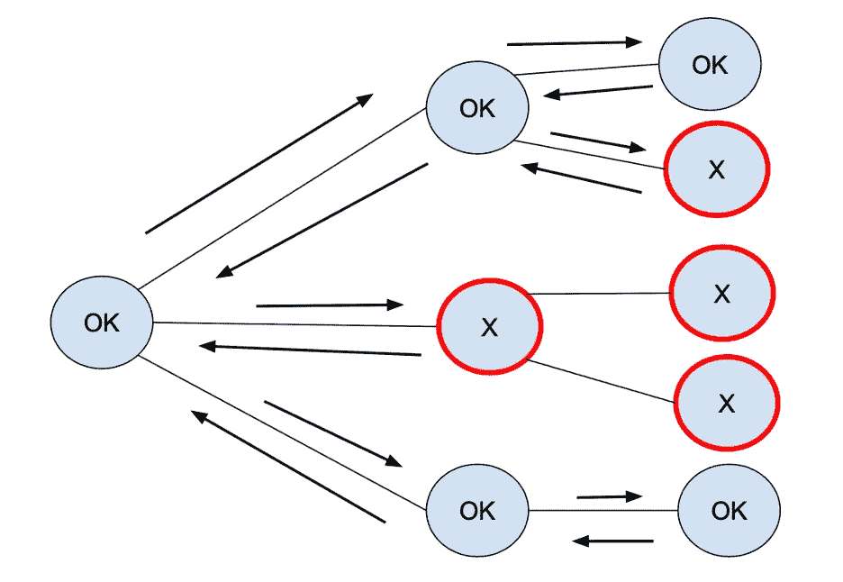

# 追踪

> 原文：<https://levelup.gitconnected.com/backtracking-6cd491777a9b>

回溯是一种递归技术，使用蛮力来逐步寻找和构建最佳或所需的解决方案。

当部分解决方案失败时，它会返回到先前的部分解决方案，并尝试使用新的解决方案。

一个著名的例子是“最佳飞行路线”，给定一个航班列表和一个起点，建立行程。如果有多个旅程，按字母顺序给出第一个。

**让我们深入研究代码:**

让我们调用 helper 方法，但是我们首先定义最佳路由和当前路由变量。

首先，我们检查航班列表是否不为空，或者是否有关联(否则，我们无能为力)。

那么对于航班列表中的每一个航班，如果出发和转机不是同一个地点，就是一条失败的航线；我们需要回去，这种部分解决办法是行不通的。

对于当前与出发地点匹配的航班，有两种选择；有更多的航班要检查，然后我们将航班目的地附加到当前路线，并递归调用航班列表，但删除当前航班。

如果是列表上的最后一个航班，我们需要比较最佳路线；如果没有最佳路线，那么我们选择当前路线作为最佳路线；否则，我们采用现有最佳路线和当前路线之间的最短路线。

让我们使用下一个扩展来确定一个更小的路线。

以下是如何使用该功能的示例:

**由于回溯技术使用暴力手段**，你可能需要尝试所有可能的组合；这不是一个有效的算法。**在最坏的情况下，根据算法要求，可能会导致 O(n！)，O(2^n)，甚至 O(n^n)的空间和时间复杂性。**

[< <双指针 vs 滑动窗口](https://medium.com/geekculture/two-pointer-vs-sliding-window-460133eb9228) | [图书](/@jbstevenard/learn-data-structures-and-algorithms-with-swift-5-6-d9f36a4027dd) |即将推出…

 [## 通过我的推荐链接加入 Medium—JB stevenard

### 阅读 jb stevenard 的每一个故事(以及媒体上成千上万的其他作家)。你的会员费直接支持 jb…

medium.com](https://medium.com/@jbstevenard/membership)