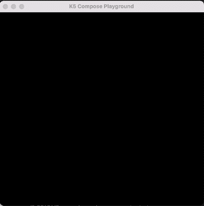
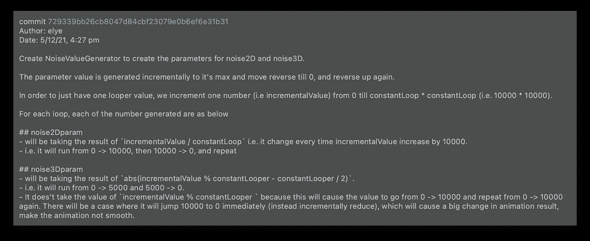
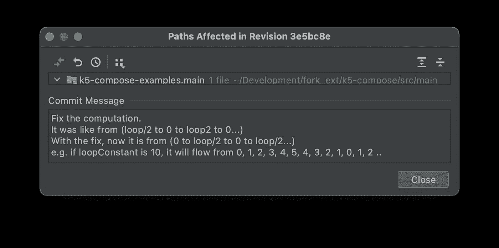
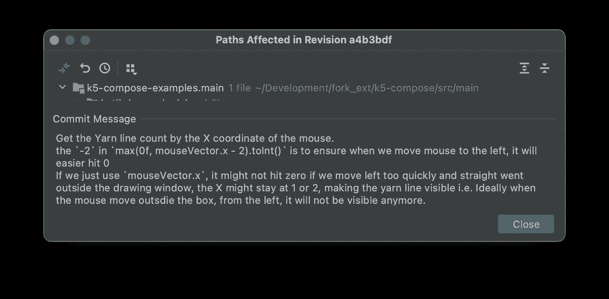

# 糟糕的代码变得更好:一个例子

> 原文：<https://levelup.gitconnected.com/bad-code-to-better-code-an-example-5fe034f448f6>

## 学习编程

## 一个绘制漂亮的自动纱舞动画的例子


由[洛斯莫尔托斯剧组](https://www.pexels.com/@cristian-rojas)在[像素](https://www.pexels.com/photo/wood-art-creative-mexican-7205817/)拍摄的照片

R 最近我[在玩 Kotlin Jetpack 作曲 K5 游乐场](https://medium.com/mobile-app-development-publication/jetpack-compose-animation-under-50-lines-using-k5-compose-playground-bef35060c471)。用它，我编写了各种即兴程序来生成一些漂亮的动画。其中一个我称之为自动纱线舞蹈如下。

在这里，我将解释画出下图的代码，并展示我们如何将糟糕的代码改进成可读性更好的代码。



只有不到 50 行代码。但我不认为很多人会喜欢读它。所以我做了一个更好的(下图之后)。

与其看上面的，下面的在可读性方面不是好很多吗？

它隐藏了所有的细节，但在绘制纱线线条时却有着很高的层次。从这里我们知道

1.  它为随机的纱线线产生一些噪声参数。
2.  当鼠标 X 坐标向右移动时，它会绘制尽可能多的纱线。

下面是代码是如何转换的，hope 是如何提高代码可读性的一个案例。

# 将附带功能提取到不同的类中

在原始代码中，除了画线，我们还有生成噪声参数值的代码。这些代码扰乱了代码的清晰性。

它有两部分

## 提取升降计数器

从代码中，您可以看到它有一个值，当达到最大值时，该值会上下波动。这里使用的技术是

*   类和变量的名字解释了意图
*   函数名使它们更加清晰。

```
class UpDownCounter(private val maxValue: Int) {
    var incrementalValue = 0
    private var isUp = true

    fun change() {
        if (isUp) {
            if (isReachingMax()) {
                reverseChange()
            } else {
                incrementalValue++
            }
        } else {
            if (isReachingMin()) {
                reverseChange()
            } else {
                incrementalValue--
            }
        }
    }

    private fun reverseChange() { isUp = !isUp }
    private fun isReachingMin() = incrementalValue <= 0
    private fun isReachingMax() = incrementalValue > maxValue
}
```

## 提取噪声参数生成器

该类用于生成决定纱线拉伸随机性的噪声参数。它可以从绘图功能中分离出来。这个类还利用 UpDownCounter 来生成噪声参数

```
lass NoiseParamsGenerator(
    private val constantLooper: Int = 10000,
    private val constantNoiseWeight: Float = 0.002f) {

    private val upDownCounter = 
        UpDownCounter(constantLooper * constantLooper)

    private val incrementalValue: Int
        get() = upDownCounter.incrementalValue

    private val noise2Dparam: Int
        get() = iterateZeroToLoop()
    private val noise3Dparam: Int
        get() = iterateZeroToHalfLoopAndReverse()

    fun change() = upDownCounter.change()

    private fun iterateZeroToHalfLoopAndReverse() =
        *abs*(*abs*(
            incrementalValue % constantLooper - constantLooper / 2) 
                - constantLooper / 2)
    private fun iterateZeroToLoop() = 
        incrementalValue / constantLooper

    operator fun component1(): Double {
        return (noise2Dparam * constantNoiseWeight).toDouble()
    }

    operator fun component2(): Double {
        return (noise3Dparam * constantNoiseWeight).toDouble()
    }
}
```

为了清楚起见，我们再次使用了类名、变量名和函数名。然而，你可能和我想的一样，仅仅用名字不能很好地表达上下文，需要更多的帮助。

因此，我使用以下两种方法来提供更多的背景

## 在提交消息中存储额外的相关信息

NoiseParamsGenerator 中有相当多的上下文。一种方法是在函数之上编写代码注释。但是代码注释的缺点是，每当类被改变时，它必须总是记得保持一致。

另一种方法是将信息存储到 Git Commit 中，以提供尽可能多的上下文，而不用担心代码混乱。



Git Commit 消息的另一个优点是，无论何时发生变化，我们都需要提供一个新的上下文，覆盖以前的上下文。Git 提交消息是有时间限制的，因此它总是最新的。

例如，我将下面的代码从

```
private fun iterateZeroToHalfLoopAndReverse() =
    *abs*(incrementalValue % constantLooper - constantLooper / 2)
```

到下面…

```
private fun iterateZeroToHalfLoopAndReverse() =
    *abs*(*abs*(incrementalValue % constantLooper - constantLooper / 2) - constantLooper / 2)
```

我必须放入一个新的提交消息，它很好地反映了变化。



## 为场景说明创建相关的测试用例

当我们提取新的类时，我们可以创建测试来提供更多的上下文，而不是围绕它写很长的上下文。

```
class NoiseParamsGeneratorTest {

    @Test
    fun `Test Noise Value Generator Loop Value`() {
        lateinit var  noiseParamsGenerator: NoiseParamsGenerator
        var resultString = ""

        fun given() {
            noiseParamsGenerator = NoiseParamsGenerator(10, 1f)
        }
        fun whenever() {
            *repeat*(16) **{** val (x, y) = noiseParamsGenerator
                resultString += "($x: $y) "
                noiseParamsGenerator.change()
            **}** }
        fun then() {
            val expectedResult = "(0.0: 0.0) (0.0: 1.0) (0.0: 2.0) (0.0: 3.0) (0.0: 4.0) (0.0: 5.0) (0.0: 4.0) (0.0: 3.0) (0.0: 2.0) (0.0: 1.0) (1.0: 0.0) (1.0: 1.0) (1.0: 2.0) (1.0: 3.0) (1.0: 4.0) (1.0: 5.0)"
            Assert.assertEquals(
                "Result is not incremented as expected",
                expectedResult,
                resultString.*trim*()
            )
        }

        given()
        whenever()
        then()
    }
}
```

这样做有两个好处

*   用用例场景提供更好的代码上下文。
*   未来的代码重构可以被测试，以确保没有任何破坏。

在测试用例中，我们还展示了两个避免注释的巧妙技巧

1.  编写有意义的测试名称。在科特林使用反勾号。因此测试函数名可以有空格``testing function name`()`
2.  使用局部范围函数而不是注释。例如，我们不再需要使用`//given`、`//when`或`//then`，但是它们每个都是一个函数本身
3.  当失败时，使用带有适当消息的测试断言来更好地描述失败。

# 将长函数分割成较小的部分

至于绘图本身，我也把它提取出来作为函数来代替。虽然有些可读性，但还是包含了太多的细节。

相反，也许让我们把函数分解成更小的部分，在函数名中有更清晰的意图。如果你看下面，可读性更强，不是吗？

每个小功能进一步扩展如下。它们有助于

*   每个都有一个函数名，很好地解释了意图(不需要使用注释)。
*   代码块越小，它本身就越容易消化和理解。

## 生成纱线线坐标

```
private fun generateYarnLineCoordinates(
    size: Size,
    m2d: Double,
    m3d: Double,
    offset: Double
): Pair<FloatArray, FloatArray> {
    fun noiseX(variant: Double) = 
        2 * size.width * *noise3D*(variant, m2d, m3d)
    fun noiseY(variant: Double) = 
        2 * size.height * *noise3D*(offset + variant, m2d, m3d)
    val x = FloatArray(4) **{** index **->** noiseX(offset + 5 + index * 10).toFloat() 
    **}** val y = FloatArray(4) **{** index **->** noiseY(offset + 5 + index * 10).toFloat() 
    **}** return Pair(x, y)
}
```

## 从给定坐标生成纱线路径

```
private fun createYarnLinePathFromCoordinates(
    x: FloatArray,
    y: FloatArray
): Path {
    val path = *Path*()
    path.moveTo(x[0], y[0])
    path.cubicTo(x[1], y[1], x[2], y[2], x[2], y[2])
    return path
}
```

## 生成纱线线条颜色

```
private fun generateYarnLineColor(
    m2d: Double,
    m3d: Double,
    offset: Double
): Triple<Int, Int, Int> {
    fun color(variant: Double) = 
        0xFF - (0xFF * *noise3D*(variant, m2d, m3d)).toInt()
    val red = color(offset + 35)
    val green = color(offset + 25)
    val blue = color(offset + 15)
    return Triple(red, green, blue)
}
```

## 获取鼠标 Y 坐标

```
private fun getMouseYCoordinate(mouseVector: Vector2D, size: Size) =
    max(min(mouseVector.y / size.height, 1f), 0f)
```

这在绘制路径的代码中用来设置绘图的不透明性

```
drawScope.drawPath(
    path,
    *Color*(red, green, blue),
    alpha = ***getMouseYCoordinate***(mouseVector, size),
    style = Stroke(width = 0.3f)
)
```

## 获取鼠标 X 坐标

```
private fun getMouseXCoordinate(mouseVector: Vector2D) =
    max(0f, mouseVector.x - 2).toInt()
```

这在顶部代码中使用，以确定我们需要绘制多少条纱线线。

```
for (i in 0 *until* ***getMouseXCoordinate***(mouseVector)) {
    *drawYarnLine*(dimensFloat, offset, m2d, m3d, this, mouseVector)
    offset += 0.002
}
```

一个可能的问题是为什么我们有负 2 的`mouseVector.x — 2`。

同样，为了提供上下文，我在 Git commit 消息中对它进行了大量描述，这样就不会弄乱代码。如果将来发生变化，就需要一个新的 Git commit 消息，这样消息就不会过时。



# TL；速度三角形定位法(dead reckoning)

从上面我们了解到，为了提高代码的可读性，我们可以做以下事情

1.  将侧面功能提取到不同的类中
2.  使用类名和变量名来解释意图
3.  将长函数分割成较小的函数
4.  函数名使每个上下文更加清晰
5.  在 Git 提交消息中存储额外的相关信息
6.  为场景说明创建相关的测试用例
7.  使用带有适当消息的测试断言来提供更好的失败环境

## 完整的更好的代码

比原来的长多了。这都是因为现在它包含了代码本身的大部分上下文。

需要花时间去思考如何架构，比较长，但是值得。将来再读一遍也不会后悔

> 我们将来可能仍然会后悔，不是因为太多的上下文，而是给出的上下文仍然不够…因此我不敢说这是一个好代码。从来没有完美的代码，最多只有足够好的代码。