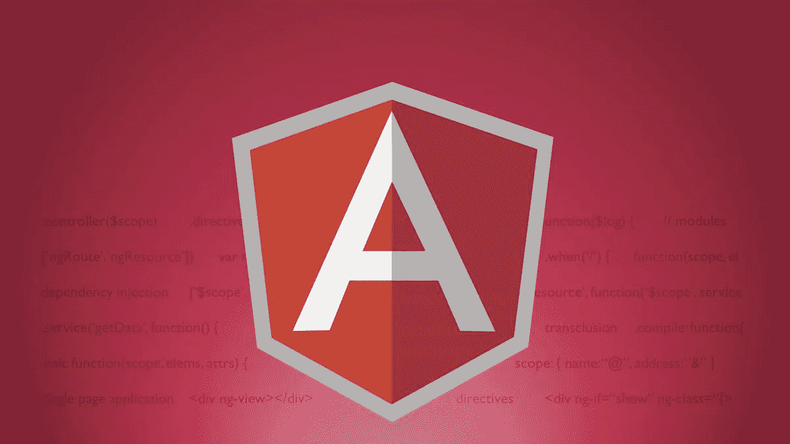
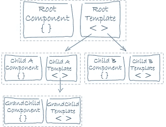

# 你应该避免使用角

> 原文：<https://levelup.gitconnected.com/bad-practices-you-should-avoid-with-angular-development-58098e5542d5>



来源:[https://code burst . io/three-best-angular-js-4-online-courses-3234 a 65 dab FD](https://codeburst.io/three-best-angular-js-4-online-courses-3234a65dabfd)

## ❌不做的事情:用空订阅将正在处理的逻辑放到 tap 中

不要将您要实现的逻辑放在 **tap 操作符**中，并保持 subscribe 为空，以防您的可观察对象有很多订阅者。

**为什么？tap 操作符主要用于缓存或日志记录等副作用，如果你把你的逻辑放在那里，每个用户都会调用 tap 逻辑，甚至不需要它**

**但是！:**这不是一个通用规则，它取决于您的使用情况，如果您希望所有订户都有此逻辑，或者您只有一个订户，并且您希望使用“异步管道”，那么我的规则不适用。

**代码示例:**

**解决方案:**使用订阅逻辑，不要点击

## 订阅中不要做❌:错误函数只是一个`console.error`

不要使用`console.error`

对于错误处理，因为只记录错误并不抛出错误，而且要知道某些东西失败了，你的可观察对象不能继续执行

**解决方案:**使用提供的 Rxjs 操作符进行错误处理，以优雅地处理错误并重试逻辑

## 不要做❌:一些 3-4k 线组件

不要把所有东西都放在一个组件中，因为:

*   很难重构
*   对其他开发人员来说可读性差
*   打破组件思维概念的规则

**代码示例:(多行代码的随机组件示例)**

**解决方案:**总是考虑一个可重用的组件和关注点分离的父/子组件



来源:[https://v2 . angular . io/docs/ts/latest/guide/architecture . html](https://v2.angular.io/docs/ts/latest/guide/architecture.html)

## 不要在模板中做❌:大量的逻辑内联代码

不要在模板中调用函数，因为这会:

*   影响应用程序的性能
*   以后很难进行重构

**代码示例:**

**解决方案:**

解决方案是对你的数据进行手工计算或组合，或者使用**管道**来增加代码的可读性和**的可重用性**

## 难道❌:不用承诺来代替可观察的吗

如果您使用带有角度组件的 promises 来处理 HTTP 请求或其他，您应该考虑这些**限制**:

*   你不能轻易取消承诺。
*   你不能轻易重复或重试承诺

**代码示例**:有承诺用途的角形部件

## 不要在 subscribe 方法中进行❌:映射或转换数据

不建议在订阅块中处理您的数据

**为什么？**想象一下，您有许多订户需要相同的转换，因此存在大量代码冗余

并且订阅是同步调用，那么在转换完成之前，您将被阻止。

**代码示例:**

**解决方案:你应该使用**[**Rxjs map**](https://www.learnrxjs.io/operators/transformation/map.html)**操作符对你的数据进行**预处理，因为很多订阅者都可以得到你的结果，你会获得一些代码逻辑(复用性)。

Impac t:性能改进

## 不要❌:把一切都放在共享模块里

共享模块是推荐的角度架构模式，用于组织常用的管道、指令和组件。

但是随着时间的推移和应用程序规模的增长，您会发现自己在组件中引入了不需要的依赖项，这将影响到您的项目包的大小

## 很高兴做✔️:添加 **$后缀**为变量类型可观察

**后缀** $用来表示某个变量是可观测的。它有助于区分正常变量和可观察变量

**代码示例:**

```
const currentTimeSeconds = currentTimeMs.pipe(
  map(currentTimeMs => currentTimeMs * 1000)
) 
```

**提高:**

用$后缀重命名您的可观察对象

```
const currentTimeSeconds$ = currentTimeMs$.pipe(
  map(currentTimeMs => currentTimeMs * 1000)
)
```

## 很高兴做✔️: **在一个单独的文件中定义常数**

建议定义多个组件之间常用的全局常量

当您希望在整个应用程序中使用通用行为时很有帮助

并且你可以在一个单独的组件中使用这些**常量文件**:

## 来源:

*   [https://www . Reddit . com/r/angular 2/comments/xz 4k PP/what _ is _ the _ worst _ angular _ code base _ youve _ worked _ on/](https://www.reddit.com/r/Angular2/comments/xz4kpp/what_is_the_worst_angular_codebase_youve_worked_on/)
*   [https://medium . com/showpad-engineering/why-you-should-never-use-function-calls-in-angular-template-expressions-E1 a50 F9 c 0496](https://medium.com/showpad-engineering/why-you-should-never-use-function-calls-in-angular-template-expressions-e1a50f9c0496)
*   [https://www . elite-corner . com/2020/06/how-to-define-global-constants variables-in-angular . html](https://www.elite-corner.com/2020/06/how-to-define-global-constantsvariables-in-angular.html)
*   [https://stack overflow . com/questions/38944725/how-to-get-DOM-element-in-angular-2](https://stackoverflow.com/questions/38944725/how-to-get-dom-element-in-angular-2)
*   [https://www . learn rxjs . io/learn-rxjs/operators/error _ handling](https://www.learnrxjs.io/learn-rxjs/operators/error_handling)
*   [https://v2 . angular . io/docs/ts/latest/guide/architecture . html](https://v2.angular.io/docs/ts/latest/guide/architecture.html)
*   [https://medium . com/showpad-engineering/why-you-should-never-use-function-calls-in-angular-template-expressions-E1 a50 F9 c 0496](https://medium.com/showpad-engineering/why-you-should-never-use-function-calls-in-angular-template-expressions-e1a50f9c0496)
*   [https://angular.io/guide/sharing-ngmodules](https://angular.io/guide/sharing-ngmodules)

## 额外资源📗：

如果你对阅读更高级的角度话题感兴趣，可以看看这些博客

*   [优化角度单元测试以加快执行速度](/optimizing-angular-unit-tests-for-faster-execution-70c7adda6b21)
*   [通过以下步骤优化角度束尺寸](/lets-optimize-angular-bundle-size-with-these-steps-6d6b753ac256)
*   [Ngrx 和 Angular 状态管理简介](/introduction-to-state-management-with-ngrx-and-angular-91f4ff27ec9f)
*   [用 Angular 和 Cypress 编写 CRUD E2E 测试](/write-e2e-tests-with-angular-and-cypress-1f011f673a5e)

## 最后的话:

如果你喜欢这篇文章，请留下你的👏，在 [Twitter](https://twitter.com/RebaiAhmed_) 和 [GitHub](https://github.com/Rebaiahmed) 上关注我

感谢阅读