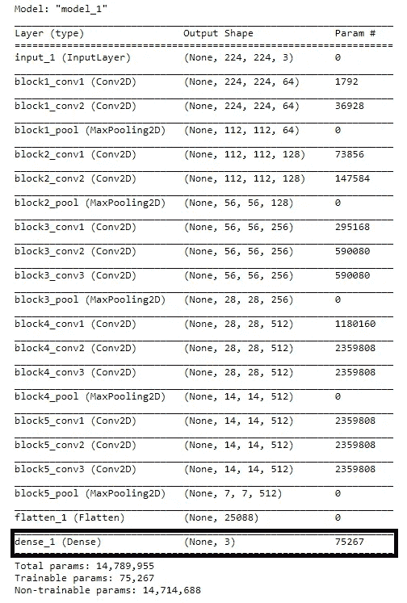

# 基于 CNN 和烧瓶的香蕉成熟度检测

> 原文：<https://levelup.gitconnected.com/banana-ripeness-detection-using-cnn-and-flask-880f8ed58056>

使用 Flask 从数据准备到部署的端到端项目


“作者提供的图像”

菠萝是全球消费最多的水果之一。根据 FAO(联合国粮食及农业组织)的数据，中国的水果产量约占全球的 16%。几乎世界上三分之一的人吃香蕉。香蕉是一种很好的能量来源，它给身体提供饱腹感。在每项运动中，香蕉都是运动员的能量补充剂。吃一个过熟的香蕉会导致你一系列的疾病，胃的问题，等等。在过去的 10 年里，人们试图找到香蕉的正确成熟阶段。香蕉果实的成熟期是影响果实成熟过程中品质和成熟后商品性的主要因素，也是提高产量的重要因素。如果我们知道我们每天平均生产 100 吨香蕉，那么找到香蕉的正确成熟阶段会更加困难。我们需要一些智能系统来检测香蕉的正确阶段。

在这篇博客中，我们将使用机器学习构建一个香蕉成熟度检测器，为了测试，我们还将创建一个 flask 应用程序。

我们开始吧，首先，你需要安装一些依赖项。

1.  张量流

```
pip install tensorflow
```

如果您的系统中有 GPU，那么请使用 TensorFlow-GPU 和 Cuda。你可以看我的博客，关于用 TensorFlow **在 windows 中安装 [**Cuda。**](https://medium.com/pythoneers/cuda-installation-in-windows-2020-638b008b4639)**

2.瓶

```
pip install flask
```

# 数据准备

我们的任务是创建一个机器学习模型，可以根据图像预测香蕉的成熟度。在我们的项目中，我们将成熟阶段分为三类:成熟、未成熟和过熟。我们需要准备同样的数据。

创建一个包含三个子文件夹“成熟”、“未成熟”和“过成熟”的数据文件夹。让我们首先为成熟的香蕉准备数据，然后对未成熟和过熟的香蕉进行同样的处理。

1.  去谷歌上输入熟香蕉。逐一下载所有图片。
2.  去百叶窗股票和成熟的香蕉。逐一下载所有图片。
3.  去 Unsplash 型成熟香蕉。找到所有与香蕉相关的图片并下载所有图片。

每个类别至少下载 50 张图片。

现在，下一步是使用数据扩充来增加数据集的大小。在数据扩充中，我们使用 Keras 执行裁剪、填充、水平翻转、缩放、重缩放等操作。

首先，我们从 Keras 库中导入 [ImageDataGenerator](https://www.tensorflow.org/api_docs/python/tf/keras/preprocessing/image/ImageDataGenerator) 。然后，我们使用 ImageDataGenerator 创建一个 datagen 对象，其中包含一些增强参数。然后

我们导入操作系统，找到当前工作目录，并将其更改为我们当前的工作目录。

之后，我们运行一个简单的循环，直到目录结束。在循环中，我们首先加载图像，然后对其进行整形，并使用`.flow`将我们的 datagen 对象应用到我们的图像上，并将图像保存为 jpeg 文件。我们连续 10 次对目录中的每个图像执行相同的过程。

在应用数据扩充后，我们得到 500 幅成熟的图像、500 幅未成熟的图像和 500 幅过熟的香蕉图像。我们已经准备好了所有的数据，现在我们可以继续构建和训练模型了。

# 模型构建和培训

我们将使用迁移学习技术来构建我们的模型。迁移学习是一种技术，采用在较大数据集上训练的模型，并应用其知识来训练小得多的数据集。在我们的例子中，我们将使用预先训练的模型[**Vgg16**](https://parasharabhay13.medium.com/vgg-16-architecture-implementation-and-practical-use-e0fef1d14557) 并将其转换为在三个类别之间进行分类。

首先，我们需要导入所有与模型构建和预处理图像相关的必要库。

```
from keras.layers import Input,Lambda,Dense,Flatten
from keras.models import Model 
from keras.applications.vgg16 import VGG16 
from keras.applications.vgg16 import preprocess_input
from keras.preprocessing import image
from keras.preprocessing.image import ImageDataGenerator
from keras.models import Sequential
import numpy as np
```

现在下一步是，用预训练的权重加载我们的预训练模型。我们将使用的权重是 imagenet 的，我们将使用的图像大小是(224，224，3)。我们也将冻结所有的层，并删除最后一层，这样我们就可以添加我们的自定义最后一层 3 个节点。

```
**### Defining Image size**
IMAGE_SIZE = [224, 224]**### Loading model**
vgg = VGG16(input_shape=IMAGE_SIZE + [3], weights='imagenet', include_top=False)**### Freezing layers**
for layer in vgg.layers:  
  layer.trainable = False**### adding a 3 node final layer for predicion** x = Flatten()(vgg.output)
prediction = Dense(3, activation='softmax')(x)
model = Model(inputs=vgg.input, outputs=prediction)**### Generating Summary**
model.summary()
```



“模型摘要—作者提供的图片”

现在我们将编译模型

```
model.compile( loss='categorical_crossentropy',  
               optimizer='adam',  
               metrics=['accuracy'])
```

## 训练集和测试集

现在，我们需要使用相同的 ImageDataGenerator 准备训练集和验证集。

```
train_datagen = ImageDataGenerator(rescale = 1./255,                          
                                    shear_range = 0.2,
                                   zoom_range = 0.2,
                                    horizontal_fli= True)
training_set = train_datagen.flow_from_directory('data/train',
                                           target_size = (224, 224),
                                             batch_size = 16,                             
                                        class_mode = 'categorical')
```

我们对测试集也做同样的事情

```
test_datagen = ImageDataGenerator(rescale = 1./255)
test_set = test_datagen.flow_from_directory('data/validation',
                                         target_size = (224, 224),
                                         batch_size=16,
                                         class_mode = 'categorical')
```

现在到了最后一部分，训练模型。使用 fit_generator，我们将在训练集和验证集上训练我们的模型。

```
r = model.fit_generator(training_set,  validation_data=test_set,  epochs=25,steps_per_epoch=len(training_set),validation_steps=len(test_set))
```

最后，我们将保存模型进行测试。

```
model.save("ripeness.h5")
```

现在我们已经准备好了我们的模型，我们可以开始构建我们的 flask 应用程序，以便我们可以测试我们的模型。

# 创建用于测试的 Flask 应用程序

我们将使用 HTML 和 CSS 创建一个简单的 flask web 应用程序。我们只需要两个按钮，一个用于选择图像，另一个用于预测。尝试创建自己独特的应用程序。将所有 HTML 文件保存在 templates 文件夹中，并将所有 CSS 和任何其他静态文件保存在 static 文件夹中。

如果你愿意，你可以在我的 Github 中找到我的模板和静态目录。

[](https://github.com/Abhayparashar31/brd) [## Abhayparashar31/brd

### 基于 CNN 的香蕉成熟度检测。在 GitHub 上创建一个帐户，为 Abhayparashar31/brd 开发做出贡献。

github.com](https://github.com/Abhayparashar31/brd) 

现在，我们将创建主 app.py 文件来运行 flask 应用程序，从 web 应用程序获取图像并预测类。

**app.py**

让我们来理解上面的代码👇

1.  首先，在最上面的 12 行，我们只是导入运行 flask 应用程序和测试我们的模型所需的所有库。
2.  **model_predict** 函数将图像上的路径作为输入，然后首先加载图像，并根据模型所需的形状调整其大小。然后它将图像标准化并保存到一个数组中。之后加载训练好的模型做预测，找到预测类的索引，返回。
3.  这里我们定义了两条路径，一条用于索引页面，另一条用于预测按钮被按下时。
4.  **上传**函数获取上传的图像并保存在上传文件夹中，然后找到上传图像的路径并在 model_predict 函数中传递。model_predict 函数返回预测，然后 upload 函数在网页上显示预测。

使用`python app.py`运行你的 app.py，你会看到你的 web app 正在本地运行 [http://127.0.0.1:5000/](http://127.0.0.1:5000/) 。


“测试 Web 应用程序—作者提供的图片”

## 感谢阅读😀