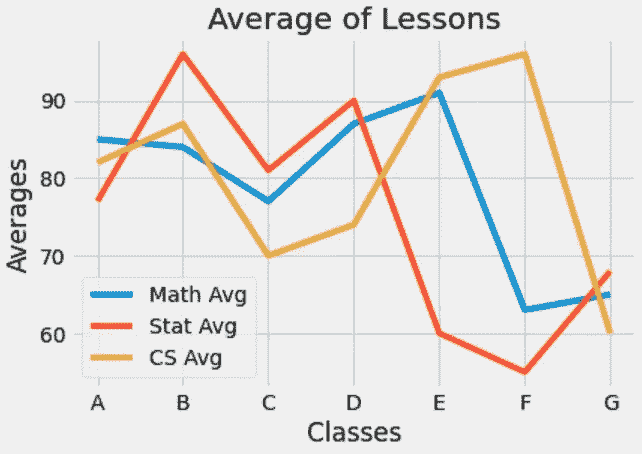
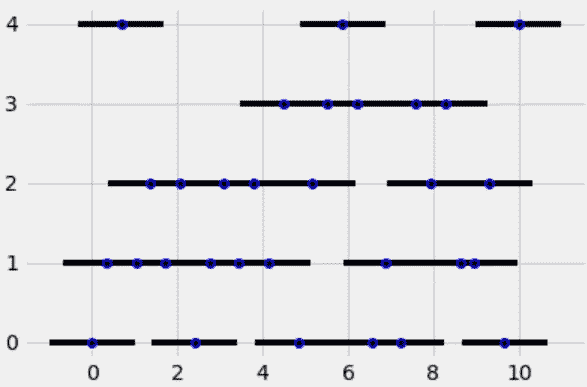

# 使用 Python 中的 Matplotlib 动手绘制条形图

> 原文：<https://levelup.gitconnected.com/bar-plot-with-matplotlib-in-python-aa98f2493847>

## 如何绘制有效条形图的实用指南。

由[卢卡斯·布拉塞克](https://unsplash.com/@goumbik?utm_source=medium&utm_medium=referral)在 [Unsplash](https://unsplash.com?utm_source=medium&utm_medium=referral) 上拍摄的照片

假设您有五种不同工作的平均工资数据，并且您想要比较这些工资。您可以使用条形图来可视化这些数据。条形图用于比较不同类别中的值。条形图可以水平或垂直绘制。在这篇文章中，我将讨论以下主题。

*   如何绘制条形图？
*   如何画误差线？
*   如何用误差线画柱状图？

让我们开始吧！

 [## 蒂伦达兹学院

### 嗨，欢迎来到提伦达兹学院。Tirendaz 学院是一个在线教育平台，制作视频和写博客…

www.youtube.com](https://www.youtube.com/channel/UCFU9Go20p01kC64w-tmFORw) 

# 条形图

首先，让我们导入必要的库。

你可以在这里找到笔记本和数据集[。接下来，我要用`%matplotlib inline`魔法命令来看看字里行间的情节。](https://github.com/TirendazAcademy/DATA-VISUALIZATION-WITH-PYTHON/blob/main/07-Bar%20Plot%20with%20Matplotlib%20in%20Python.ipynb)

我将选择 seaborn-whitegrid 样式作为图形样式。

让我们首先创建一个数据集，显示数学、统计和计算机类的七个类的平均分数，以显示条形图。

接下来，让我们使用列表创建`classes`变量。

让我们为这些类画一个柱状图。这里，`legend`方法显示了图中的标签名称。

线形图

哎呀！运行这些命令时，您会遇到一个线图。如果 x 轴有分类变量，最好绘制条形图。让我们用`bar`方法代替`plot`方法来画一个柱状图。

堆积条形图

如你所见，堆叠的条形被画了出来。要查看数据的单个条形，让我们首先对数据进行索引。我将为此创建一个`x_index`变量。

接下来，让我们将这个变量添加到`bar`方法中，并使用一个`x`变量来防止条形重叠。

条形图(非堆积图)

请注意，条形是重叠的。让我们使用`width`参数来更好地查看条形。

条形图(不重叠)

如果你注意 x 轴，有一些数字，如果你想用`classes`变量的值替换这些数字，你可以使用`xtricks`方法。

带有类值的条形图

# 误差线

在科学研究中，通过考虑误差来进行测量。误差线是数据可变性的图形表示，用在图形上表示报告测量中的误差或不确定性。所以你可能想用误差线。

让我们为 x 轴和 y 轴创建值。首先，我要在 x 轴上取 30 个 0 到 30 之间的数字。

接下来我要为 y 轴生成 30 个 0 到 5 之间的整数。

让我们画出 x 轴和 y 轴的散点图。

散点图

让我们给这些点加上误差线。

误差线

您可以使用`fmt`参数来调整颜色和外观。要查看水平误差线，您可以利用`xerr`参数。

水平误差线

您可以向`errorbar`方法添加其他属性。

彩色误差线

# 带误差线的条形图

让我们画一个图来一起看条形图和误差线。为了证明这一点，我将使用虹膜数据集。让我们导入`load_iris`方法来读取这个数据集。

在鸢尾数据集中，有显示萼片长度和宽度、花瓣高度和宽度以及三种类型的鸢尾花的变量。让我们来看看这个数据集。

接下来，让我们计算数据集中数值变量的均值和标准差。

让我们取一个区间变量，并将 iris 数据集中的 4 个数值变量赋给这个区间变量。

之后我要画两个图，一个是横条，一个是竖条。让我们在第一个图形区域绘制误差线和水平条形图。`bars`方法用于绘制水平条形图。

带误差线的水平条

给剧情加个标题吧。

带误差线和标题的水平条

您也可以使用`ytricks`方法来标记 y 轴上的条形。

标签条形图

接下来，让我们画出竖线。

带误差线的竖条图

让我们用`xtricks`方法给出 x 轴的标签。我将使用`rotation`参数来设置文本的旋转。

带标签的竖条

此外，您可以使用`width`参数调整条形的宽度。

调整了条宽的垂直条

# 结论

条形图用于比较不同类别中的值。条形图可以水平或垂直绘制。在这篇文章中，我谈到了酒吧的情节。就是这样。我希望你喜欢它。感谢您的阅读。你可以在这里找到这个笔记本[。](https://github.com/TirendazAcademy/DATA-VISUALIZATION-WITH-PYTHON/blob/main/07-Bar%20Plot%20with%20Matplotlib%20in%20Python.ipynb)

别忘了在 YouTube 上关注我们

[提伦达兹艾](https://tirendazacademy.medium.com/?source=post_page-----aa98f2493847--------------------------------)

## 用 Python 实现数据可视化

[View list](https://tirendazacademy.medium.com/list/data-visualization-with-python-72919ad57b84?source=post_page-----aa98f2493847--------------------------------)11 stories

*如果这篇文章有帮助，请点击拍手👏按钮几下，以示支持👇*