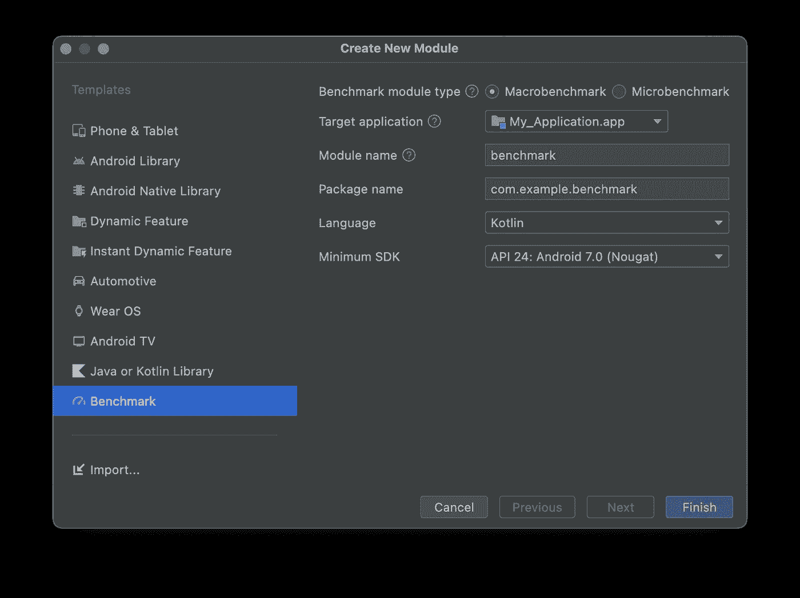
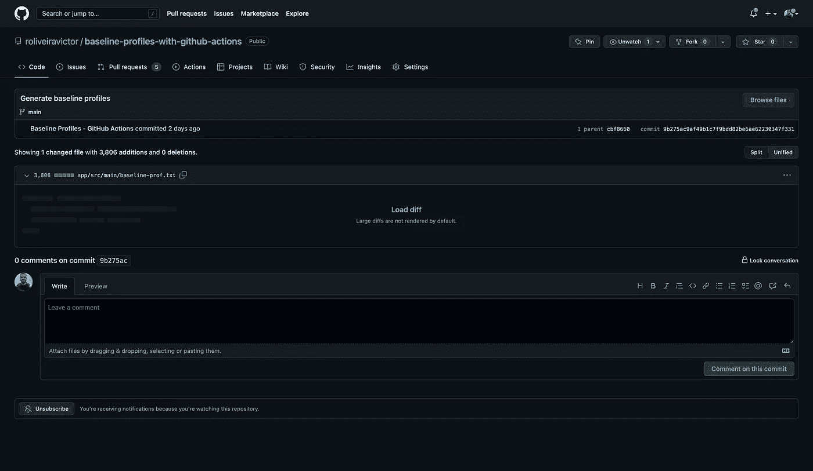

# 基线配置文件和 GitHub 操作

> 原文：<https://levelup.gitconnected.com/baseline-profiles-github-actions-ce8bc6858bb3>

自动生成规则的最简单指南

本文旨在讨论宏基准、基线概要和 GitHub 动作。这些科目的基础知识是需要提前掌握的。**请记住，这里学到的与 GitHub 行动相关的经验可以移植到任何其他类型的项目中。**


图标由[鲁斯兰·巴布金](https://www.flaticon.com/authors/ruslan-babkin)

在过去的几年里，谷歌一直致力于许多关于性能改进的更新。Baseline Profiles 是该公司发布的最新工具之一，他们声称它可以将 Android 应用程序的启动时间缩短 40%。如果您曾经尝试过基线概要文件，您可能会意识到，即使使用 Macrobenchmark 库，生成规则也可能是非常痛苦的。本文提供了一种自动生成这些规则的简单方法，不管你的项目有多大，只要它在 GitHub 上有版本。

> 无论是否选择开始新项目，你的都要设置`compileSdk 32`或更高，支持 Android Gradle Plugin 7.3.0 或更高。

*注:以下脚本的 Gradle Kotlin DSL 在* [*这里*](https://gist.github.com/roliveiravictor/48af9b7ebda04dca805b3a7ff6e0f3b4) *可用。*

```
/**
*
*  :app Gradle file
*
**/
android {
  compileSdk 33
}

/**
*
*  Top-level Gradle file
*
**/
plugins {
  id 'com.android.application' version '7.3.0' apply false
  id 'com.android.library' version '7.3.0' apply false
  id 'com.android.test' version '7.3.0' apply false
}
```

[#1](https://github.com/roliveiravictor/baseline-profiles-with-github-actions/pull/1) — **(可选)**创建一个空的 Android 项目

[#2](https://github.com/roliveiravictor/baseline-profiles-with-github-actions/pull/2) —向您的项目添加宏基准库



宏基准库。模块添加用户界面。

[#3](https://github.com/roliveiravictor/baseline-profiles-with-github-actions/pull/3) —在`app`目录下创建一个`benchmark-rules.pro`文件，以确保 Proguard 不会混淆基准构建变体，并将其设置为`benchmark`构建类型上的 Proguard 文件

```
# Benchmark-rules.pro
# Disables obfuscation for benchmark builds.
-dontobfuscate
```

```
/**
*
* :app Gradle file
*
**/
android {
  buildTypes {
        benchmark {
            signingConfig signingConfigs.debug
            proguardFiles("benchmark-rules.pro")
            matchingFallbacks = ['release']
            debuggable false
        }
    }
}
```

[#4](https://github.com/roliveiravictor/baseline-profiles-with-github-actions/pull/4) —添加**至少一个**被管理设备

```
 import com.android.build.api.dsl.ManagedVirtualDevice

/**
*
*  :benchmark Gradle file
*
**/
android {
  testOptions {
    managedDevices {
      devices {
        pixel2Api31(ManagedVirtualDevice) {
          device = "Pixel 2"
          apiLevel = 31
          systemImageSource = "aosp"
        }
      }
    }
  }
}
```

[#5](https://github.com/roliveiravictor/baseline-profiles-with-github-actions/pull/5) —增加**至少一个**收集基线剖面

```
/**
*
*  :benchmark module
*
**/

package com.example.benchmark

import androidx.benchmark.macro.ExperimentalBaselineProfilesApi
import androidx.benchmark.macro.junit4.BaselineProfileRule
import androidx.test.ext.junit.runners.AndroidJUnit4
import org.junit.Rule
import org.junit.Test
import org.junit.runner.RunWith

/**
*
*  ExperimentalBaselineProfilesApi is required so that
*  macrobenchmark tests can be skipped when running 
*  the :benchmark:pixel2Api31BenchmarkAndroidTest task with
*  androidx.benchmark.enabledRules=BaselineProfile
*  as an argument. Check out actions.yml file.
*
**/
@OptIn(ExperimentalBaselineProfilesApi::class)
class BaselineProfileGenerator {

    @get:Rule
    val baselineProfileRule = BaselineProfileRule()

    /**
    *
    *  @packageName Same as your applicationId (:app Gradle file)
    *
    **/
    @Test
    fun startup() =
        baselineProfileRule.collectBaselineProfile(
            packageName = "com.example.myapplication",
            profileBlock = {
                startActivityAndWait()
            }
        )
}
```

[#6](https://github.com/roliveiravictor/baseline-profiles-with-github-actions/pull/6) —添加 GitHub 动作脚本

```
# Workflow name
name: baseline-profiles

# Workflow title
run-name: ${{ github.actor }} requested a workflow

# Event trigger so this actions gets executed every time a push is made on the main branch
# Change this event to what suits your project best.
# Read more at https://docs.github.com/en/actions/using-workflows/events-that-trigger-workflows
on:
  push:
    branches:
      - main

# Environment variables (Optional)
# Small projects might have signingConfigs locally. This could lead to failures on GitHub Actions.
# If that's the case, upload your properties defined locally to GitHub Secrets.

# On your signingConfigs, you can recover GitHub Secrets using: variable = System.getenv("VARIABLE")

# Then uncomment this block properly defining your uploaded variables
# env:
#  VARIABLE: ${{ secrets.VARIABLE }}

# Read more at https://docs.github.com/en/actions/security-guides/encrypted-secrets

# Jobs to executed on GitHub machines
jobs:

    # Job name
    generate-baseline-profiles:

      # Operating system where the job gets to be executed
      runs-on: macos-latest

      # Job steps
      steps:

        # Checks your code out on the machine
        - uses: actions/checkout@v3

        # Sets java up
        - uses: actions/setup-java@v3
          with:
            distribution: temurin
            java-version: 11

        # Sets gradle up
        - name: Setup Gradle
          uses: gradle/gradle-build-action@v2

        # Grants execute permission to gradle (safety step)
        - name: Grant Permissions to gradlew
          run: chmod +x gradlew

        # Cleans managed device if previously settle and space currently is not available
        - name: Clean Managed Devices
          run: ./gradlew cleanManagedDevices --unused-only

        # Generates Baseline Profile
        - name: Generate Baseline Profile

          ## swiftshader_indirect: 
          ## Required to use software acceleration on machines that can't use hardware acceleration

          ## enabledRules=BaselineProfile:
          ## Required to skip macrobenchmark tests. 
          ## Read more at https://developer.android.com/topic/performance/benchmarking/benchmarking-in-ci#real-devices
          ## Read more at https://developer.android.com/topic/performance/benchmarking/macrobenchmark-overview#configuration-errors

          ## gradle.workers.max: 
          ## Required to avoid running multiple managed device tests concurrently. Read more at https://issuetracker.google.com/issues/193118030

          run: ./gradlew :benchmark:pixel2Api31BenchmarkAndroidTest -Pandroid.testoptions.manageddevices.emulator.gpu="swiftshader_indirect" -Pandroid.testInstrumentationRunnerArguments.androidx.benchmark.enabledRules=BaselineProfile -Dorg.gradle.workers.max=4

        # Sets the Baseline Profile on its proper place so it gets correctly bundled into Play Store
        - name: Move & Rename Baseline Profiles
          run:  |
            mv -f benchmark/build/outputs/managed_device_android_test_additional_output/pixel2Api31/BaselineProfileGenerator_startup-baseline-prof.txt app/src/main/baseline-prof.txt

        # Commits the generated Baseline Profile to your origin/remote
        - name: Commit Baseline Profiles
          run: |
            git config --global user.name 'Baseline Profiles - GitHub Actions'
            git config --global user.email 'github@actions'
            git add app/src/main/baseline-prof.txt
            git commit -m "Generate baseline profiles"
            git push
```

[#7](https://github.com/roliveiravictor/baseline-profiles-with-github-actions/pull/7) —将所有变更合并到`main`分支中

[EOF](https://github.com/roliveiravictor/baseline-profiles-with-github-actions/actions/runs/3424775794) —大约 10 分钟后，Actions 选项卡上会出现一个成功的作业，最后，存储库中的最后一次提交会显示最近添加的`baseline-prof.txt`文件的更改。



由 GitHub 在主分支上提交的操作生成的基线配置文件规则

GitHub Actions 是一个非常强大的工具，可以以可伸缩的方式生成基线配置文件规则。通过适当地调用其他的`actions/*`并替换`*.yml`文件上的`run`命令，可以创建许多其他的工作流。GitHub Actions 是最适合您项目的自动化工作流程的最佳方式之一。

*现在，告诉我，你认为基线配置文件或 GitHub 操作如何派上用场？在评论中告诉我更多关于你的观点。如果你喜欢的话，谢谢你的掌声&分享，别忘了关注我，关注即将到来的文章！=}*

***参考文献***

1.  [*宏基准*](https://developer.android.com/topic/performance/benchmarking/benchmarking-overview#macrobenchmark)
2.  [*基线剖面图*](https://developer.android.com/topic/performance/baselineprofiles/overview)
3.  [*GitHub 动作*](https://github.com/features/actions)
4.  [*性能提升概述*](https://developer.android.com/topic/performance/improving-overview)
5.  [*性能介绍— MAD 技巧*](https://www.youtube.com/watch?v=6R0jrJp1Uwg&list=PLWz5rJ2EKKc9T9fxvsrbzg_mflg2EYLZk)
6.  [*使用基准配置文件提高应用性能*](https://android-developers.googleblog.com/2022/01/improving-app-performance-with-baseline.html)
7.  [*手动创建基线剖面图*](https://developer.android.com/topic/performance/baselineprofiles/manually-create-measure)
8.  [安装 Android 12 SDK](https://developer.android.com/about/versions/12/setup-sdk)
9.  [*安卓 Gradle 插件 7.3.0*](https://developer.android.com/studio/releases/gradle-plugin?gclid=CjwKCAjwv4SaBhBPEiwA9YzZvAYWtMHYLjoI6136i6xmGl3m9IFV1qG4GMJdTM46ZVqsePrYt_yCehoCRNEQAvD_BwE&gclsrc=aw.ds#7-3-0)
10.  [*编写宏基准*](https://developer.android.com/topic/performance/benchmarking/macrobenchmark-overview)
11.  [*安卓代码搜索—简介示例*](https://cs.android.com/androidx/platform/frameworks/support/+/androidx-main:benchmark/integration-tests/macrobenchmark/src/androidTest/java/androidx/benchmark/integration/macrobenchmark/GithubBrowserBaselineProfile.kt)
12.  [*宏基准—配置错误*](https://developer.android.com/topic/performance/benchmarking/macrobenchmark-overview#configuration-errors)
13.  [*基准配置文件—已知问题*](https://developer.android.com/topic/performance/baselineprofiles/overview#known-issues)