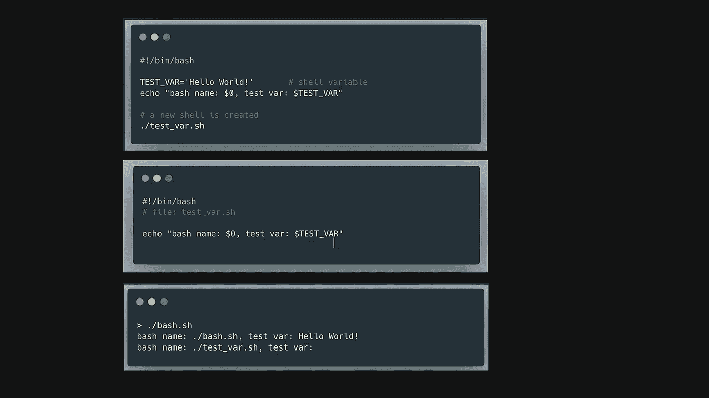
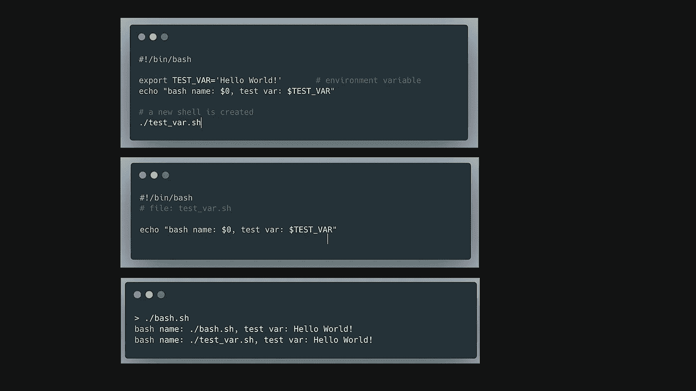

# 作为初学者应该知道的 Bash 脚本语法

> 原文：<https://levelup.gitconnected.com/bash-scripting-syntax-you-should-know-as-a-beginner-b498879d3763>


[赛·基兰·阿纳加尼](https://unsplash.com/@anagani_saikiran?utm_source=medium&utm_medium=referral)在 [Unsplash](https://unsplash.com?utm_source=medium&utm_medium=referral) 上的照片

# 设置变量

[](https://www.digitalocean.com/community/tutorials/how-to-read-and-set-environmental-and-shell-variables-on-linux) [## 如何在 Linux | DigitalOcean 上读取和设置环境和 Shell 变量

### 当通过 shell 会话与您的服务器进行交互时，有许多信息是您的 shell…

www.digitalocean.com](https://www.digitalocean.com/community/tutorials/how-to-read-and-set-environmental-and-shell-variables-on-linux) 

Bash 中有两种变量: **shell 变量**和**环境变量**。

shell 变量在当前 shell 中定义，并且专门包含在 shell 脚本中。

```
TEST_VAR='Hello World!'
```



外壳变量

环境变量在当前 shell 中定义，并由所有子 shell 继承。

```
export TEST_VAR='Hello World!'
```



环境变量

# 访问变量

为了引用一个变量的值，我们使用$符号后跟变量名。

```
echo $TEST_VAR
```

如果没有指定变量，我们可以使用默认值。

```
echo ${TEST_VAR:-hello world}
```

# 测试命令

test 命令将一个元素与另一个元素进行比较，并返回 true 或 false。

使用 test 命令有两种语法。

```
$ test EXPRESSION
$ [ EXPRESSION ]
```

所有支持的表达式的完整列表可在[手册页](https://linux.die.net/man/1/test)中找到。

# 感叹号

Bash 中的感叹号常用来反转表达式的逻辑。如果表达式为真，`!`操作符将返回 false。反之亦然。

这里有一个例子。

```
var="hello"if [ ! "$var" = "hello" ]; then
  echo "var is not hello"
else
  echo "var is hello"
fi
```

# Bash 变量$？

`$?`用于查找最后执行的命令的返回值。

如果最后一个命令成功，那么$？将为 0。如果前面的命令不成功，那么$？将是非零的。

因此，判断前面的命令是否成功是很有帮助的。

```
ls xxx
if [ $? -eq 0 ]; then
  echo "The last command was successful."
else
  echo "The last command was unsuccessful."
fi
```

结果

```
ls: xxx: No such file or directory
The last command was unsuccessful.
```

希望你对 Bash 有所了解，并喜欢这篇文章。

# 分级编码

感谢您成为我们社区的一员！在你离开之前:

*   👏为故事鼓掌，跟着作者走👉
*   📰查看[升级编码出版物](https://levelup.gitconnected.com/?utm_source=pub&utm_medium=post)中的更多内容
*   🔔关注我们:[Twitter](https://twitter.com/gitconnected)|[LinkedIn](https://www.linkedin.com/company/gitconnected)|[时事通讯](https://newsletter.levelup.dev)

🚀👉 [**加入人才集体，找到一份令人惊喜的工作**](https://jobs.levelup.dev/talent/welcome?referral=true)