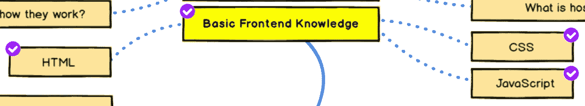

# 基本的前端知识— HTML、CSS、JS

> 原文：<https://levelup.gitconnected.com/basic-frontend-knowledge-737702051bd8>


照片由 [Sai Kiran Anagani](https://unsplash.com/@_imkiran?utm_source=medium&utm_medium=referral) 在 [Unsplash](https://unsplash.com?utm_source=medium&utm_medium=referral) 上拍摄

虽然我专注于后端开发，但与前端开发人员的合作是不可避免的，尤其是当我在设计供前端开发人员使用的 API 时。因此，我们至少必须掌握一些前端基础知识。



来源:[https://roadmap.sh/roadmaps/backend.png](https://roadmap.sh/roadmaps/backend.png)

HTML、CSS、Javascript 是构成一个网站的三大要素。让我们一个一个来看看他们能做什么。

## 超文本标记语言

HTML(超文本标记语言)用于标记不同种类的内容(例如，表格、段落、列表、超链接、图像、视频等)。)在带有标签的网页中。用户界面(UI)是使用 HTML 构建的。

**HTML 文件示例:**

```
**<!DOCTYPE html>** *<!–- Version of HTML being used -->*
**<html>** *<!–- Start of the HTML document -->*
  **<head>** 
    *<!-- 
    The head section of a document.
    Usually contains CSS, JavaScript
    scripts, metadata
    -->*
    **<title>Document Title</title>**
  **</head>
  <body>** *<!--
    The content of the document goes
    into the body section
    -->
* **<h1>First Heading</h1>**
    *<!–- Rest of page goes here -->*
 **</body>
</html>** *<!–- End of the HTML document -->*
```

我们有哪几种标签？你可以看看这个网站:

[](https://www.w3schools.com/tags/default.asp) [## HTML 参考

### 组织良好，易于理解的网站建设教程，有很多如何使用 HTML，CSS，JavaScript 的例子…

www.w3schools.com](https://www.w3schools.com/tags/default.asp) 

HTML 中有很多标签，但是请记住这一点。永远不要学习所有的标签。只学习最常见的标签已经足够了。最常见的标签是:

1.  `<h1> — <h6>`标题
2.  `<p>`段落
3.  `<a>`锚
4.  ``图像
5.  `<ul> & <li>`无序列表&列表项
6.  `<table> <tr> <th> <td>`表
7.  `<div>`分部

简而言之，HTML 是 a 网站的主干。

## 半铸钢ˌ钢性铸铁(Cast Semi-Steel)

CSS(层叠样式表)定义了标记文档的样式。例如，颜色、字体、对齐、布局等。每个可显示的 HTML 元素都有一组样式属性，可以用 CSS 修改。

**CSS 文件示例:**

```
**body** /* Selector */
**{** /* We define the property names and values here */ ** 
  font-family: Verdana, Helvetica, sans-serif;
  font-size: 1em;
  text-align: justify;
}**
```

*   **选择器**指定应用样式的元素
*   **声明**列出一个或多个属性，用
    分号“；”隔开
*   **属性**有一个名称和值，用冒号“:”隔开

我们有什么样的财产？以下是所有 CSS 属性的列表:

[](https://www.w3schools.com/cssref/default.asp) [## CSS 参考

### 组织良好，易于理解的网站建设教程，有很多如何使用 HTML，CSS，JavaScript 的例子…

www.w3schools.com](https://www.w3schools.com/cssref/default.asp) 

简而言之，CSS 是用来让 HTML 更漂亮的。

## java 描述语言

Javascript 是一种强大的脚本语言，它可以完成很多事情。当我们在本文中讨论 web 开发时，我将关注它的功能之一，**用户界面**。

**Javascript 的例子:**

```
 <button **id="button"**> Click Me! </button>
</body>**<script>
  document.getElementById("button").onclick = function(){
    alert("Hello World");** // displays an alert box **};  
</script>**
```

有 3 个主要应用。通过使用 Javascript，我们可以:

1.  在网站上创建 UI 组件
2.  分配事件处理程序(就像上面的例子一样)
3.  更新 UI 组件

我个人认为 Javascript 比 HTML 和 CSS 更难，因为它涵盖了许多编程概念，如 for-loops、if-else 条件、函数和变量。所以，在这个话题上多花点时间肯定没问题。有关更多信息，您可以查看:

[](https://www.w3schools.com/js/default.asp) [## JavaScript 教程

### JavaScript 是 HTML 和 Web 的编程语言。JavaScript 很容易学。本教程将教你…

www.w3schools.com](https://www.w3schools.com/js/default.asp) 

简而言之，Javascript 是用来和用户交互的。

在现代，很少只用 HTML，CSS，JS 文件来写一个网站，因为这对于网络开发来说很慢。通常，我们会从不同的前端框架开始。最流行的框架有 React、Angular、Vuejs 等。通过使用框架和库，它确实节省了你大量的时间和效果。

要了解更多关于我的后端学习路径，请点击这里查看我的旅程:

[](https://medium.com/@matthew.chohin/my-backend-developer-learning-journey-%E6%88%91%E7%9A%84%E5%BE%8C%E7%AB%AF%E5%AD%B8%E7%BF%92%E4%B9%8B%E6%97%85-5315fe2fefc2) [## My Backend Developer Learning Journey 我的後端學習之旅

### 毕业一年多了。拥有 2 年以上的前端和后端工作经验…

medium.com](https://medium.com/@matthew.chohin/my-backend-developer-learning-journey-%E6%88%91%E7%9A%84%E5%BE%8C%E7%AB%AF%E5%AD%B8%E7%BF%92%E4%B9%8B%E6%97%85-5315fe2fefc2)