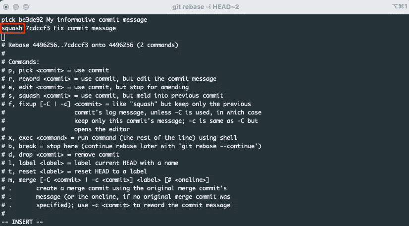

# QA 工程师的基本 Git 命令

> 原文：<https://levelup.gitconnected.com/basic-git-commands-for-qa-engineers-9ecaab92aebb>

一开始，每个面对 git 的人只需要使用有限数量的命令。事实上，您不需要花费数小时阅读 git 文档或学习一些其他材料。让我们考虑一下测试工程师最基本的流程:*创建一个分支- >将您的变更发布到远程存储库- >发布请求- >修复在代码评审期间收到的注释- >在代码评审之后应用变更并更新请求*。


由[罗曼·辛克维奇·🇺🇦](https://unsplash.com/@synkevych?utm_source=unsplash&utm_medium=referral&utm_content=creditCopyText)在 [Unsplash](https://unsplash.com/s/photos/git?utm_source=unsplash&utm_medium=referral&utm_content=creditCopyText) 上拍摄的照片

## 基本流程命令

1.  转到开发(或任何其他主)分支，并从远程存储库中获取最新的变更:

```
git pull origin develop
```

2.从当前开发创建您的分支:

```
 git checkout -b feature/new-feature-branch
```

3.对代码进行更改后，您可以检查并验证工作目录的状态:

```
git status
```

4.将所有更改的文件添加到您的提交中:

```
git add .
```

5.创建提交:

```
git commit -m "My informative commit message"
```

6.检查开发分支中没有重大变更

```
git checkout develop
git pull origin develop
```

如果发生了变化—将它们应用到您的分支

```
git checkout feature/new-feature-branch
git rebase develop
```

7.如果重置过程失败，则解决冲突(我总是使用 IDE 中的 UI 工具来解决冲突)并继续重置:

```
git rebase --continue
```

8.将更改推送到您的远程分支:

```
git push origin feature/new-feature-branch
```

9.创建要开发的拉式请求。我更喜欢使用 web 界面来创建 Pull 请求(请记住，根据您使用的解决方案，它需要不同的步骤:Github、Bitbucket 等。)

10.在你的公关被审查后，你必须修改一些评论。并准备修复提交(参见第 4 项和第 5 项)

11.把你的承诺压缩成一个

```
git rebase -i HEAD~2
```

之后，您必须选择选择哪个提交和挤压哪个提交。默认情况下，它将是 *vim* 文本编辑器(注意，您可以配置任何您需要的编辑器)。你将有可能改变挤压后提交消息



壁球提交示例

12.将更改推送到您的远程分支:

```
git push -f origin feature/new-feature-branch
```

13.PR 通过后，可以随意合并

## Git 别名使用

如果您喜欢使用命令行界面进行 git 操作，我强烈建议您开始使用别名。目前，我正在使用提供内置 git 别名配置的 [oh-my-zsh](https://ohmyz.sh/) 框架。下面是上面 git 流的一些别名示例。

本文可能对任何刚刚开始 git 之旅的人都有用