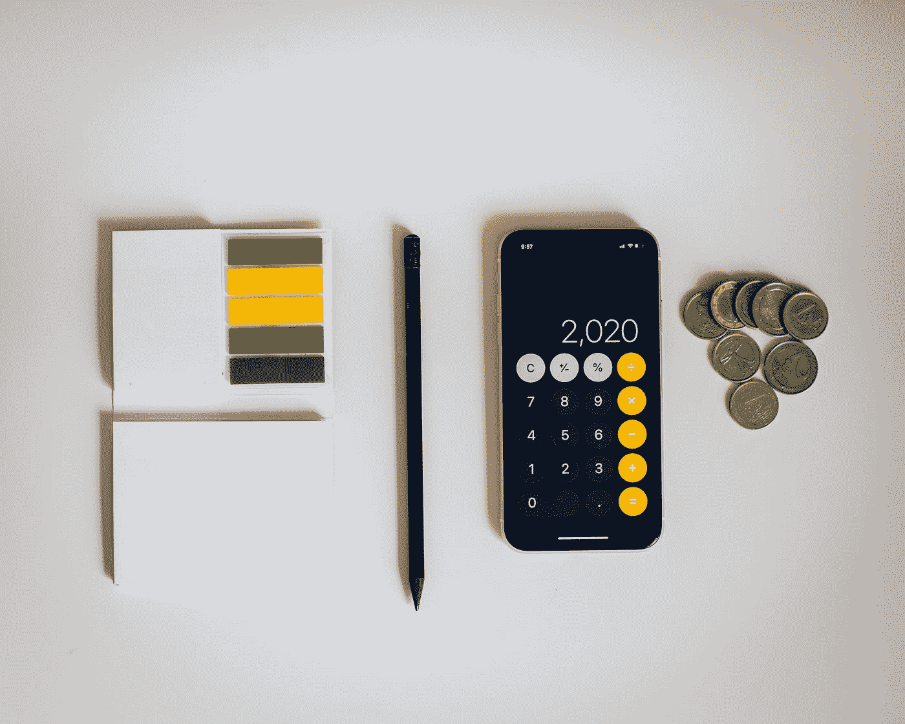

# Python 中的基本 GUI 计算器— Python 编程

> 原文：<https://levelup.gitconnected.com/basic-gui-calculator-in-python-python-programming-pyshark-ba990f82d7f5>

阿莫尔·泰亚吉在 [Unsplash](https://unsplash.com?utm_source=medium&utm_medium=referral) 上拍摄的照片

本文将带您了解用 Python 开发 GUI 计算器的整个过程。如果你正在阅读这篇文章，你可能已经知道如何用 Python 写一个计算器程序。而现在你想为这样一个程序开发一个 GUI(图形用户界面),使它更好看，更容易重用。

**目录:**

*   介绍
*   构建主屏幕
*   添加方程式线
*   为计算器创建按钮
*   向 GUI 添加按钮
*   将动作分配给按钮
*   结论

# 介绍

在我们深入代码之前，让我们先讨论一下我们要构建什么类型的计算器，它的功能是什么，以及它的“必备功能”是什么。

本文的预期输出将引导您完成用 Python 创建 GUI 计算器的过程，如下所示:

以下是我认为该应用程序的“必备条件”:

1.  显示单击动作和结果的方程式行(屏幕)。
2.  按钮必须有值并且是可点击的。
3.  进行数学运算(加、减、乘、除)。
4.  执行方程式计算(=)并清除屏幕。

在整个过程中，我们将使用 [tkinter](https://docs.python.org/3.8/library/tkinter.html) ，这是 Python 的标准 GUI 库。如果您有兴趣了解更多关于该库及其功能的信息，可以在线获得[详细指南](https://python-textbok.readthedocs.io/en/1.0/Introduction_to_GUI_Programming.html)。

# 用 Python 构建计算器的基础

作为第一步，我们要导入 tkinter 库并定义一个类，以及 __init__ 方法和执行语句。这将是我们的主框架，在此基础上，我们将添加 GUI 和计算器功能。

这可能看起来像一个难以理解的代码，但我们将详细讨论每个部分是什么，所以与我裸露。

让我们一步一步来讨论:

创建一个**计算器**类(这是一个具有特定行为的独立对象)。

定义我们的第一个方法 **__init__** 。
该方法特定于 python 类，在面向对象的概念中充当构造函数。当对象被创建时，这个方法被立即调用，并允许类初始化它的属性。

将两个参数传递给 **__init__** 方法: **self** 和 **master** 。
**self** 代表类的实例，基本上就是说 **__init__** 是 **Calculator** 类的一个方法。
**master** 是我们传递给 **__init__** 方法的一个局部变量，它的作用是创建一个顶级小部件(通常是应用程序的主窗口)。更多细节将进一步讨论。

创建对应用程序 **self.master=master** 主窗口的引用，以便对其执行操作。然后给我们的应用程序添加一个标题 **master.title("Python 计算器")**

如果 _ _**name**_ _ = _ _ '**main**' _ _，则添加标准执行启动器**。这是一个标准程序，你可以点击了解更多详情[。](https://stackoverflow.com/questions/419163/what-does-if-name-main-do)**

指定当我们执行文件时应该发生什么。
这个比较有顺序性，所以按照逻辑来。
-我们首先创建一个局部变量 **root** ，并给它赋值 Tk()。Tk()是一个 tkinter 类，它创建了我们的主窗口。
-然后我们创建另一个局部变量 **my_gui** 并将**计算器**类赋给 is，同时传递**根**作为**计算器**的参数。本质上，这一步通过告诉一个类使用**根**创建了一个 GUI，它是 **Tk()** 作为它的主窗口。
-最后我们添加了 **root.mainloop()** ，其中 mainloop()是 Tk()的一个方法，基本上是告诉应用程序等待事件(点击)并相应地更新 UI。

这是一次需要消耗的大量信息。但是我们已经完成了指南的第一部分，现在可以看到我们的初始屏幕了。将上面的代码复制粘贴到您的编辑器中并运行它。您应该看到以下内容:

# 在 Python 中向计算器添加方程线

作为下一步，我们想做的是添加一个公式线到我们的计算器图形用户界面。如果你现在手里拿着一个计算器，我们想添加的是“显示器”,在上面显示你所有的操作。

这部分非常直观，只需要我们向我们的 **__init__** 方法添加两行代码:

我们之所以将它添加到 **__init__** 方法中，是因为我们希望应用程序一启动就“创建”它。

让我们一步一步来讨论:

我们需要创建一些想要添加到我们的**计算器**类中的**方程**行，因此我们将其定义为 **self.equation** ，然后使用 tkinter 类 **Entry()** 创建一个小部件。
Entry()类中有一些参数。我们需要让它知道它应该属于我们的**主**窗口，以及一些基本的样式属性，如**宽度**和**边框宽度**(可以随意更改这些，但现在请按照我指定的值进行)。

将方程式线放在我们的主屏幕上。所以我们已经创建了我们的行，它属于**计算器**类。但是它还不知道它应该在这个灰色屏幕上的什么位置。应该放在右上角、左下角还是其他地方？我会放在我们的图形用户界面的顶部。为此，我将使用**。grid()** 方法的 **Entry()** 类附带一些参数。
所以我们已经知道它需要赋给我们的“显示”，于是就有了形式 **self.equation.grid()** 。
现在什么进入**。grid()** 需要一点解释:
——回想一下 Python 索引是从 0 开始的，所以第一个**行**的索引是 0，第一个**列**的索引也是 0。
- **columnspan** 将指定这一行将占据多少“列”。看看介绍部分的计算器应用程序的最终图像，你会注意到应用程序按钮被放置在 4 列中。因为我们的方程线占据了屏幕的整个宽度，这意味着它正好占据了 4 列。注意:这也是我选择 36 宽度的原因，因为它可以被 4 整除而没有余数，并且保持布局不受影响。
- **padx** 和 **pady** 是我添加到线条顶部、底部、左侧和右侧的基本填充，只是为了在视觉上给它多一点空间。

将这些内容添加到我们的代码中，您应该会得到以下结果:

将上面的代码复制粘贴到您的编辑器中并运行它。您应该看到以下内容:

您会注意到应用程序窗口实际上变得更小了，因为现在它被方程显示所包围。您还可以在该行中随意键入任何内容，只是为了测试它的“entry”属性。

# 在 Python 中创建计算器按钮

好了，到目前为止，我们有我们的计算器主屏幕和方程显示连接到它。我们的下一步是给这个 GUI 添加按钮，这样它看起来就像一个完整的计算器。

这是代码中最乏味的部分，在技术上比前面的部分更高级一些。让我们浏览所有的代码和解释。

我们将创建一个新方法 **createButton()** ，并向其中添加以下代码:

让我们一步一步来讨论:

**步骤 1:**
定义一个新方法 **createButton()** 并将 **self** 作为参数传递给它。这基本上将这个方法分配给了**计算器**类的实例。

**第二步:**
创建按钮对象。您会注意到所有的按钮都遵循相同的模板:*b[some name]= self . add button(some value)*。逐个创建每个按钮是一个繁琐的过程，而且可以自动化。为了解释细节，我一个一个地硬编码。本质上，每个按钮名称都代表了我们希望这个按钮执行的操作。比如 **b9** 是 9 的按钮， **b_add** 是加法的按钮，以此类推。
现在，出现的问题是:这个 **self.addButton()** 是什么？这是我们将在后面的代码中定义的另一个方法。本质上，它所做的是用我们需要的值创建我们需要的按钮对象。这将在下一节解释。整体登录是针对 **createButton()** 方法内的每个按钮，我们调用 **addButton()** 方法来生成按钮。

**第三步:**
将按钮按照它们在计算器上出现的顺序排列成行。我们希望它有 4 行，每一行有 4 个按钮，所以它们按以下顺序出现:
*第 1 行* : 7，8，9，+
*第 2 行* : 4，5，6，-
*第 3 行* : 1，2，3，*
*第 4 行* : c，0，=，/

**第四步:**
用按钮填充每一行。现在，作为添加按钮的最后一步，我们基本上遍历每行的每一列，并用按钮填充它。
要记住的一件事是，我们从行索引 1 到 4 开始(从 **r=1** )，因为我们的行索引 0 是用等式“display”填充的。
另一方面，我们的列将从 0 到 3 进行索引。

这是重要的一步，不是上面显示的代码块。所以我们创建了这个方法来创建按钮。现在要执行它，我们需要通过向它添加 **self.createButton()** 从我们的 **__init__** 方法中“调用”它。

在这一部分之后，到目前为止完整的代码应该如下所示:

注意:如果您现在尝试运行它，您应该会得到一个错误。错误的原因是我们在我们的 **createButton()** 方法中使用了某个 **addButton()** 方法，但是我们没有指定它具体做什么。我们将在下一节讨论这个问题。

# 向 GUI 添加按钮

在这一节中，我们将把我们创建的按钮添加到 GUI 中。还记得我们用来创建每个按钮的 **addButton()** 方法吗？这正是我们现在要重点添加的内容。这个方法实际上创建并返回一个 tkinter 按钮对象，然后我们将它添加到 GUI 中。

下面几行代码将帮助我们:

让我们一步一步来讨论:

**步骤 1:**
定义一个新方法 **addButton()** 并传递两个参数: **self** 和 **value** 给它。 **self** 将该方法分配给 **Calculator** 类的实例，而 **value** 是我们想要在 GUI 中的每个按钮上显示的实际“值”。

我们用一些我们需要的参数创建一个按钮类:
- *self.master* :这将按钮对象分配给计算器类。
- *text=value* :这将把我们作为参数传递的“值”显示为按钮上的文本。
- *width=9* :这只是造型，你可以调整按钮的宽度。

现在让我们将它添加到主代码中并运行它:

如果一个完整的 GUI 有可点击的按钮，你会看到什么。所以它现在就像一个普通的计算器应用程序一样工作，除了每次点击都没有什么变化。

# 将动作分配给按钮

经过上一步，我们已经为计算器应用程序设计了一个完整的 GUI。我们有方程式线和可点击的按钮。最后一步是添加实际的数学功能。

让我们看看将为我们做这件事的代码块:

这部分是我们添加主要数学计算和程序逻辑的地方，比前面的部分更复杂。我们来讨论一下步骤:

定义一个新方法 **addButton()** 并传递两个参数: **self** 和 **value** 给它。 **self** 将该方法分配给 **Calculator** 类的实例，而 **value** 是我们想要在 GUI 中的每个按钮上显示的实际“值”。

为了让计算器知道下一步该做什么，它需要知道方程式行中显示的内容。为了从方程式行中获取内容，我们使用了**。get()** 方法的*方程*行是一个 tkinter **条目**类。
这意味着，例如，如果公式行中有“1+1 ”,该函数将获取该行，并将其作为字符串存储在本地 *current_equation* 变量中。

这里我们开始为点击添加逻辑，最简单的是当用户点击“c”时，Python 中的计算器应该执行什么操作？如果用户点击“c ”,我们希望公式行被清除**,这正是我们使用**所做的。删除属于 tkinter **条目**类的*等式*行的()**方法。**

我们条件的第二部分是添加当用户点击“=”时的功能。我们想要的是计算出一个答案，并显示在方程行中。
-我们在 **elif** 部分做的第一件事是计算 *current_equation* ，这是我们在步骤 1 中已经得到的。我们使用 Python **eval()** 方法，该方法解析字符串表达式并“评估”它，就像您直接在 Python 中运行它一样，并将它存储为本地变量 *answer* 。比如你的 *current_equation* 是“1+1”，是一个字符串，你用 Python 运行 1+1，它会给你 2 作为输出。这正是我们在这里做的。
-然后我们使用**从方程式行中删除当前文本。tkinter 条目类的 delete()** 方法(类似于我们在用户点击“c”时清除该行)。
-最后使用**将我们的*答案*插入方程式行。tkinter 入口类的 insert()** 方法。

调节的最后一步是添加我们称之为“全部捕捉”的条件，我们将它放在 **else** 部分中。本质上，如果用户点击除了“c”或“=”之外的任何东西，这意味着他们点击了从 0 到 9 的数字或数学运算符号(+、-、*、/)。在这种情况下，我们只想把它加到我们的方程线上。
-首先，我们删除方程式行**中的现有文本。tkinter 入口类的 delete()** 方法。
-然后我们将 *current_equation* 与*值*(这是最近的点击)连接起来，并使用**将其插入方程式行。tkinter 入口类的 insert()** 方法。举个例子，如果你的方程式行中有“1+”，然后点击“1”，我们要做的就是把“1+”和“1”粘在一起，得到“1+1”，然后粘贴回方程式行。

**附加步骤:**
我们需要做的最后一步是让我们的按钮知道当它们被点击时属于它们中的每一个的动作。为此，我们需要返回到我们的 **addButton()** 方法，并为 **Button()** 对象创建添加一个参数。我们需要添加的是一个*命令*。命令是按钮的参数，让它知道应该做什么，每个按钮本质上应该做的是使用 **clickButton()** 方法作为它的参数。所以我们需要将 **addButton()** 方法中的代码从:

收件人:

现在，当我们的按钮被创建时，GUI 知道每个按钮的点击所分配的动作。

我们刚刚用 Python 编写的完整的基本 GUI 计算器的最终代码应该是这样的:

这段代码也可以在我的 [GitHub](https://github.com/misha-pyshark/python-calculator) 页面上找到。

# 结论

在本文中，我们介绍了如何使用 tkinter 库在 Python 中创建一个定制的基本 GUI 计算器。我也鼓励你看看我在 [Python 编程](https://pyshark.com/category/python-programming/)上的其他帖子。

如果你有任何问题或者对编辑有任何建议，请在下面留下你的评论。

*原载于 2020 年 6 月 18 日*[*https://pyshark.com*](https://pyshark.com/basic-gui-calculator-in-python/)*。*