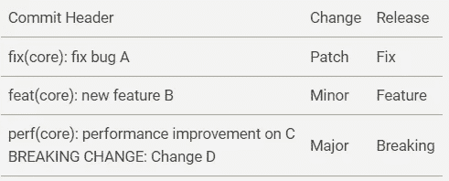

# 语义发布基本指南

> 原文：<https://levelup.gitconnected.com/basic-guide-to-semantic-release-9e2aa7834e4b>


照片由[丹金](https://unsplash.com/@danielcgold?utm_source=medium&utm_medium=referral)在 [Unsplash](https://unsplash.com?utm_source=medium&utm_medium=referral) 上拍摄

当涉及到将软件项目发布到产品中时，版本控制是一个很容易被忽视的话题，因为它太琐碎了，并且是手工完成的。我们如何确定下一个版本号？应该是主版本(v1 到 v2)还是次版本(1.1 到 1.2)？[语义发布](https://github.com/semantic-release/semantic-release)是软件开发人员用来自动管理我们代码版本的软件模式。

语义发布遵循 **v{Major}{Minor}{Patch}** 的标准[语义版本](https://semver.org/)格式，例如 *v1.2.3* 。因此，当您在项目上运行语义发布时，语义发布将有助于确保创建的所有版本都将严格遵守语义版本化，这样您就不能跳跃版本(v1 到 v3)或向后移动(v2.1 到 v2.0)。语义版本化的一些基本准则如下:

。版本发布后不做任何修改

。任何改变都必须是新的版本

。版本号只能上升

。{补丁} →向后兼容的错误修复

。{Minor} →新的向后兼容特性，公共 api 的弃用

。{Major} →新的向后不兼容 api

。{Major} = 0 →任何事情都可能改变时的初始开发

。{Major} >= 1 →第一个公共稳定版本

。预发布版本→例如 1.0.0-alpha，1.0.0 之前的 1.0.0-beta

# 语义发布是如何工作的？

语义发布是在 NodeJS 中开发的，但它可以在任何代码基础上使用，例如 java、kotlin、c#、golang 等。为什么？因为它并不完全是我们代码的一部分(除了配置之外)，但是语义发布是在我们的持续集成(CI)环境中使用和安装的(例如 GitHub、GitLab 等)。当我们的代码库中有任何代码更改(推送、合并等)时，语义发布会运行以确定是否需要新版本，如果需要，它将为其创建一个 [git 标签](https://www.atlassian.com/git/tutorials/inspecting-a-repository/git-tag)，并在我们的 git 中发布一个发布版本。

那么它如何知道是否需要新版本呢？这是由我们提交代码时的提交消息决定的。因此，为了正确使用语义发布，开发人员在提交时需要遵循某些常规的提交消息格式。默认情况下，语义发布遵循[角度提交消息约定](https://github.com/angular/angular/blob/master/CONTRIBUTING.md#-commit-message-format)。一些基本准则如下:

。提交标头格式:(范围):

```
. Type and Short summary are mandatory. Type: **fix**, **feat**, perf, ci, build, docs, refactor. Scope: affected package
```

。使用命令式现在时。例如“修复”而不是“修复”或“已修复”

。第一个字母不要大写

。没有”在句子的结尾

。提交页脚格式(如有必要)

```
. **BREAKING CHANGE**: <Summary of breaking change> <blank line> <description if any>. DEPRECATED: <What is deprecated> <blank line> <description if any>
```

确定版本号最常见的方法是使用`fix`和`feat`提交头类型。



从上表中可以看出，如果您的提交消息中有一个`fix: xxx`或`fix(scope): xxx`，当语义发布运行时，它将创建一个补丁版本。所以如果当前版本是 2.1.0，那么发布版本将是 2.1.1。同样，如果你有一个`feat: xxx`消息，下一个发布版本将是 2.2.0。

在内部，当执行语义发布时，有 9 个步骤要依次执行，如下所示:

1.  验证条件
2.  分析提交
3.  验证发布
4.  生成注释
5.  准备
6.  出版
7.  添加通道
8.  成功
9.  失败

这些步骤由插件执行，插件是可以实现上述一个或多个步骤的其他 npm 模块。默认情况下，只有 4 个插件与语义发布一起提供。这 4 个插件和它们实现的步骤如下:

1.  @ semantic-release/commit-analyzer—分析提交
2.  @ semantic-release/release-notes-generator-generate notes
3.  @semantic-release/npm —验证条件、准备、发布
4.  @semantic-release/github —验证条件、发布、成功、失败

正如你所看到的，并不是所有的 9 个步骤都实现了。如果没有实现，则跳过该步骤。只有 analyzeCommits 步骤是必需的，其余步骤都是可选的。在每个步骤中，语义发布将运行每个定义的插件，只要插件实现了该步骤。我们可以在配置文件中定义运行什么插件来进行语义发布。这个配置文件通常是主项目文件夹中以 json 或 yaml 格式编写的`.releaserc`文件。官方和社区插件列表可在[https://semantic-release . git book . io/semantic-release/extending/plugins-list](https://semantic-release.gitbook.io/semantic-release/extending/plugins-list)上获得。有关格式和其他可用配置的更多信息，请访问[https://semantic-release . git book . io/semantic-release/usage/configuration](https://semantic-release.gitbook.io/semantic-release/usage/configuration)。需要注意的一点是，为了运行非默认插件，您将需要`npm install`CI 文件中的插件，以及在这个配置文件中指定插件。下一节中的例子将演示通过在 GitHub 动作中安装`@semantic-release/git`和`@semantic-release/changelog`插件。

# 用 GitHub 动作演示 Java 项目的语义发布

要开始在 GitHub 上托管的 java 项目上进行语义发布，第一步是启用 GitHub 操作。点击 github 项目页面中的`Actions`标签，会出现各种模板供你选择。语义发布文档在[https://github . com/semantic-Release/semantic-Release/blob/master/docs/recipes/github-actions . MD](https://github.com/semantic-release/semantic-release/blob/master/docs/recipes/github-actions.md)上也有一个可用的模板，但它更适用于 nodejs 项目，因为它使用默认的 npm 插件，该插件会将项目发布到 npm。对于一个 java 项目，典型的工作流如下:

1.  签出源代码—操作/签出@v2
2.  设置 Java-操作/设置-java@v2
3.  设置节点—操作/设置节点@v2
4.  构建/测试 java 代码
5.  运行 npm install 来安装语义发布和您需要的任何插件
6.  运行语义发布

我们仍然需要在 VM 中安装 nodejs，因为语义发布将从 npx 命令中运行。一个非常基本的 github 动作工作流脚本是这样的

```
name: Releaseon:
  push:
    branches: [ master ]
  pull_request:
    branches: [ master ]env:
  GH_TOKEN: ${{ secrets.GH_TOKEN }}jobs:
  release:
    runs-on: ubuntu-latest
    steps:
    - uses: actions/checkout@v2
    - name: Set up JDK 11
      uses: actions/setup-java@v2
      with:
        java-version: '11'
        distribution: 'adopt'
        cache: maven
    - name: Setup Node.js
      uses: actions/setup-node@v2
      with:
        node-version: 'lts/*'
    - name: Build with Maven
      run: mvn -B package --file pom.xml
    - name: setup semantic-release
      run: npm install -g semantic-release @semantic-release/git @semantic-release/changelog -D
    - name: release
      run: npx semantic-release
```

为了检查代码并安装 java 和 node，我们只是使用 [github marketplace](https://github.com/marketplace?category=&query=&type=actions&verification=) 上可用的模板，然后我们只是使用 shell 脚本运行`mvn package`来打包我们的代码。如果这是成功的，意味着项目中的所有测试都通过了，那么它将进入下一步，安装语义发布和带有`npm install`的插件。注意，除了 semantic-release，我们还在这里安装了另外两个插件。最后，我们用`npx semantic-release`运行语义发布。

请注意，我们已经将此工作流配置为只在主分支中运行，只要有推送或拉取请求。我们还设置了名为`GH_TOKEN`的环境变量，该值链接到当前 github 项目中定义的一个秘密。这个`GH_TOKEN`是 [github 语义发布插件](https://github.com/semantic-release/github)需要的一个变量，我们将用它在 github 中发布发布。基本上，为了执行所需的 git 动作，插件需要被认证。所以在这种情况下，我们需要在 github 项目的`Settings -> Secrets`中创建一个名为`GH_TOKEN`的变量，这样它是安全的，当任何人克隆项目时都不会被下载。

GitHub Action 会在你在 master 分支提交这个文件后自动运行这个工作流，它会失败。错误信息可能是`ENOPKG Missing package.json file`。这是默认`@semantic-release/npm`插件中`verifyConditions`步骤的失败。因为我们没有运行 nodejs 项目，所以我们没有 package.json，我们也不打算使用 npm 插件将包发布到 npm。所以我们需要创建一个`.releaserc`文件来覆盖默认插件。下面是一个例子:

```
{
  "branches": "master",
  "repositoryUrl": "https://github.com/thecodinganalyst/semantic-java",
  "debug": "false",
  "plugins": [
    "@semantic-release/commit-analyzer",
    "@semantic-release/release-notes-generator",
    [
      "@semantic-release/changelog",
      {
        "changelogFile": "CHANGELOG.md",
        "changelogTitle": "# Semantic Versioning Changelog"
      }
    ],
    [
      "@semantic-release/git",
      {
        "assets": ["CHANGELOG.md"]
      }
    ],
    [
      "@semantic-release/github",
      {
        "assets": [
          {
            "path": "release/**"
          }
        ]
      }
    ]
  ]
}
```

我们移除了 npm 插件，并引入了另外两个插件— `changelog`和`git`。`changelog`将有助于在每次发布时在我们的项目文件夹中创建和维护一个`CHANGELOG.md`。`git`然后会在发布中包含 CHANGELOG.md。提交该文件后，工作流将再次运行，这一次它将成功。

在[https://github.com/thecodinganalyst/semantic-java.](https://github.com/thecodinganalyst/semantic-java.)有一个运行在 github action 上的带有语义发布的工作 java 项目的示例报告

*本文原载于*[*https://the coding analyst . github . io/knowledge base/Basic-guide-to-Semantic-Release/*](https://thecodinganalyst.github.io/knowledgebase/Basic-guide-to-Semantic-Release/)*。*