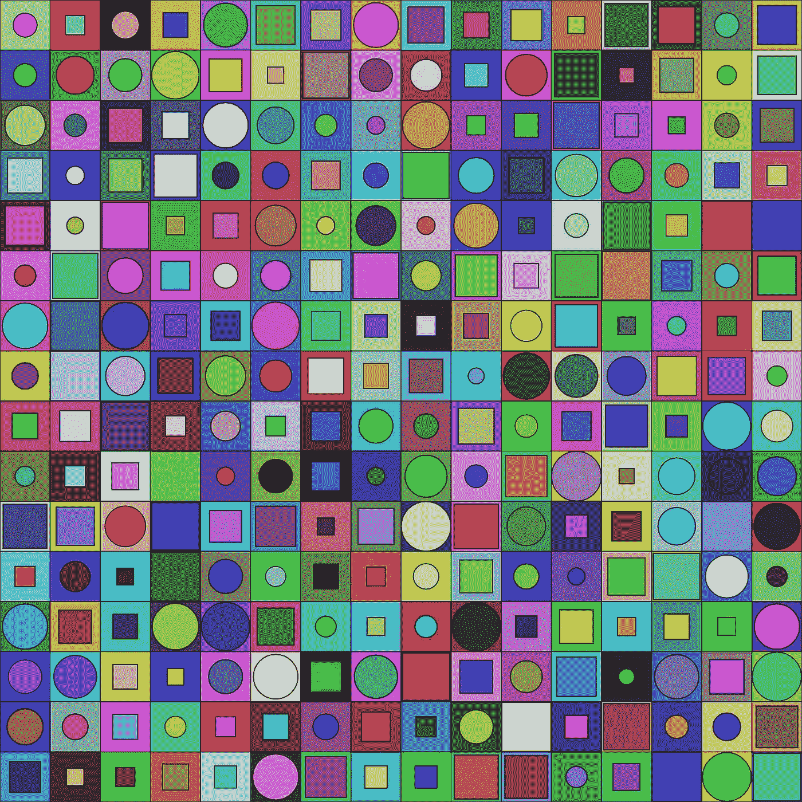

# 基础 p5.js 创建处理艺术

> 原文：<https://levelup.gitconnected.com/basic-p5-js-create-processing-art-beca397607d7>



p5.js 是一个 JavaScript 库，旨在简化在 web 浏览器中创建交互式图形、可视化和动画的过程。它基于处理编程语言，最初是为了向艺术家和设计师教授计算机编程而开发的。p5.js 提供了一组函数，允许开发人员在浏览器中创建和操作形状、颜色和其他可视元素，以及与用户输入(如鼠标和键盘事件)进行交互。p5.js 用于各种环境，包括数据可视化、生成艺术和教育应用。

[](https://youtube.com/shorts/kQDleaucR_k?feature=share) [## 使用 p5.js - Tutorial 创建创成式艺术

### 在这个视频中，我们将看看如何使用 p5.js javascript 库制作一个生成式椭圆艺术。这是一个极好的…

youtube.com](https://youtube.com/shorts/kQDleaucR_k?feature=share) 

要在本地机器上设置 p5.js 开发环境，您需要安装一个文本编辑器并创建一个新的项目文件夹。您还需要链接到 HTML 文件中的 p5.js 库。下面是设置 p5.js 开发环境的步骤:

1.  安装一个文本编辑器:你需要一个文本编辑器来编写和编辑你的 p5.js 代码。一些流行的选项包括 Visual Studio 代码、Atom 和 Sublime Text。选择一个你觉得合适的安装在你的机器上。
2.  创建一个新的项目文件夹:在您的机器上创建一个新的文件夹来保存您的 p5.js 项目。你可以给这个文件夹起任何你喜欢的名字，并且你可以在你的机器上的任何地方创建它。
3.  创建一个 HTML 文件:在你的项目文件夹中，创建一个新的 HTML 文件。您可以将该文件命名为您喜欢的任何名称，但是它应该具有. html 扩展名。该文件将成为 p5.js 项目的入口点，并将包含加载 p5.js 库和运行 p5.js 代码的 HTML 代码。
4.  链接到 p5.js 库:要在项目中使用 p5.js，您需要在 HTML 文件中链接到 p5.js 库。为此，您可以在 HTML 文件的`<head>`部分添加一个`<script>`标签，并将`src`属性设置为 p5.js 库的 URL。您可以链接到 CDN(内容交付网络)上托管的 p5.js 库，也可以下载该库并直接从项目文件夹链接到它。

下面是一个链接到 CDN 上的 p5.js 库的 HTML 文件示例:

```
<!DOCTYPE html>
<html>
<head>
  <title>My p5.js Project</title>
  <script src="https://cdn.jsdelivr.net/npm/p5@1.3.0/lib/p5.min.js"></script>
</head>
<body>
  <!-- Your p5.js code will go here -->
</body>
</html>
```

下面是一个链接到 p5.js 库的 HTML 文件示例，该库位于项目文件夹中名为“lib”的文件夹中:

```
<!DOCTYPE html>
<html>
<head>
  <title>My p5.js Project</title>
  <script src="./lib/p5.min.js"></script>
</head>
<body>
  <!-- Your p5.js code will go here -->
</body>
</html>
```

一旦建立了 p5.js 开发环境，就可以开始编写和测试 p5.js 代码了。您可以在 web 浏览器中打开 HTML 文件来查看代码的结果，并且可以使用文本编辑器来编辑和保存代码。

在 p5.js 中，通过绘制到 HTML 页面上的 canvas 元素来创建可视化项目。画布是一个空白区域，您可以在其中使用 p5.js 函数绘制形状、线条和其他图形。

要在 p5.js 中创建画布，可以使用`createCanvas`函数，该函数有两个参数:画布的宽度和高度(以像素为单位)。可以在`setup`函数内部调用这个函数，这个函数是 p5.js 中的一个特殊函数，在程序启动时只调用一次。

以下是如何在 p5.js 中创建画布的示例:

```
function setup() {
  createCanvas(400, 400);
}
```

这将创建一个 400 像素宽和 400 像素高的画布。您可以通过更改 width 和 height 参数来调整画布的大小。

要绘制到画布上，可以使用一系列 p5.js 函数，比如`rect`、`ellipse`、`line`和`point`。这些函数采用参数来指定正在绘制的形状或线条的位置、大小和其他属性。

例如，`rect`函数有四个参数:矩形左上角的 x 和 y 位置，以及矩形的宽度和高度。`ellipse`函数有四个参数:椭圆中心的 x 和 y 位置，以及椭圆的宽度和高度。

以下是如何使用`rect`和`ellipse`函数在画布上绘制矩形和椭圆的示例:

```
function draw() {
  rect(100, 100, 200, 200);
  ellipse(300, 300, 150, 150);
}
```

这将绘制一个矩形，其左上角位于位置(100，100)，宽度和高度为 200 像素，以及一个椭圆，其中心位于位置(300，300)，宽度和高度为 150 像素。

还有许多其他的 p5.js 函数可以用来在画布上绘图，并且可以组合这些函数来创建更复杂的项目。例如，您可以使用`stroke`和`fill`函数来控制正在绘制的形状和线条的颜色和样式，并且可以使用`translate`和`rotate`函数来转换用于绘制形状和线条的坐标系。

通过练习和实验，你将能够使用 p5.js 创建广泛的可视化项目。

P5.js 提供了一系列在画布上绘制形状、线条和曲线的函数。这些功能包括`rect`、`ellipse`、`line`、`point`、`quad`、`triangle`等等。

下面是一个示例，说明如何使用这些函数在 p5.js 中的画布上绘制基本的形状和线条:

```
function setup() {
  createCanvas(400, 400);
}

function draw() {
  // Draw a rectangle with its top-left corner at position (100, 100), and a width and height of 200 pixels
  rect(100, 100, 200, 200);

  // Draw an ellipse with its center at position (300, 300), and a width and height of 150 pixels
  ellipse(300, 300, 150, 150);

  // Draw a line from position (50, 50) to position (350, 350)
  line(50, 50, 350, 350);

  // Draw a point at position (200, 200)
  point(200, 200);

  // Draw a quadrilateral with vertices at positions (50, 50), (100, 100), (150, 50), and (200, 100)
  quad(50, 50, 100, 100, 150, 50, 200, 100);

  // Draw a triangle with vertices at positions (250, 250), (300, 300), and (350, 250)
  triangle(250, 250, 300, 300, 350, 250);
}
```

这段代码将在画布上绘制一个矩形、一个椭圆、一条线、一个点、一个四边形和一个三角形。通过更改传递给绘图函数的参数，可以调整形状和线条的位置、大小和其他属性。

您还可以使用其他 p5.js 函数，如`stroke`和`fill`，来控制正在绘制的形状和线条的颜色和样式。例如，您可以使用`stroke`功能设置形状或线条的轮廓颜色，使用`fill`功能设置形状的内部颜色。

下面是一个如何使用`stroke`和`fill`函数来控制正在绘制的形状和线条的颜色的例子:

```
function setup() {
  createCanvas(400, 400);
}

function draw() {
  // Set the stroke color to red
  stroke(255, 0, 0);

  // Set the fill color to blue
  fill(0, 0, 255);

  // Draw a rectangle with its top-left corner at position (100, 100), and a width and height of 200 pixels
  rect(100, 100, 200, 200);

  // Set the stroke color to green
  stroke(0, 255, 0);

  // Set the fill color to yellow
  fill(255, 255, 0);

  // Draw an ellipse with its center at position (300, 300), and a width and height of 150 pixels
  ellipse(300, 300, 150, 150);
}
```

这段代码将在画布上绘制一个红色边框、蓝色填充的矩形，以及一个绿色边框、黄色填充的椭圆。您可以使用`stroke`和`fill`功能为您的形状和线条创建各种颜色组合和样式。

P5.js 提供了许多指定和操作颜色的方法，包括 RGB 和 HSL 颜色模型，以及预定义的颜色名称。

要在 p5.js 中指定一种颜色，可以使用`color`函数，它有三个参数:颜色的红色、绿色和蓝色值。您还可以使用`color`功能通过 HSL 颜色模型指定颜色，HSL 颜色模型代表色调、饱和度和亮度。

以下是如何使用`color`函数通过 RGB 颜色模型指定颜色的示例:

```
function setup() {
  createCanvas(400, 400);
}

function draw() {
  // Set the stroke color to red
  stroke(255, 0, 0);

  // Set the fill color to blue
  fill(0, 0, 255);

  // Draw a rectangle with its top-left corner at position (100, 100), and a width and height of 200 pixels
  rect(100, 100, 200, 200);
}
```

这段代码将在画布上绘制一个红色边框、蓝色填充的矩形。`color`函数有三个参数，每个参数在 0 到 255 的范围内，代表颜色的红、绿、蓝值。

您还可以使用`color`功能通过 HSL 颜色模型指定颜色，HSL 颜色模型代表色调、饱和度和亮度。色调值是一个介于 0 到 360 之间的数字，代表颜色在色轮上的位置。饱和度值是一个百分比，代表颜色的强度。亮度值也是一个百分比，表示颜色中白色或黑色的数量。

下面是一个如何使用 HSL 颜色模型使用`color`函数指定颜色的示例:

```
function setup() {
  createCanvas(400, 400);
}

function draw() {
  // Set the stroke color to a light green
  stroke(120, 50, 50);

  // Set the fill color to a dark purple
  fill(300, 100, 50);

  // Draw an ellipse with its center at position (300, 300), and a width and height of 150 pixels
  ellipse(300, 300, 150, 150);
}
```

这段代码将在画布上绘制一个浅绿色轮廓、深紫色填充的椭圆。`color`函数有三个参数:色调值(120)、饱和度值(50%)和亮度值(50%)。

除了 RGB 和 HSL 颜色模型，p5.js 还提供了许多预定义的颜色名称，您可以使用它们来指定颜色。这些颜色名称包括常见的颜色，如红色、绿色、蓝色和黄色，以及更不常见的颜色，如鲑鱼和蓝绿色。

下面是一个如何使用预定义的颜色名称在 p5.js 中指定颜色的示例:

```
function setup() {
  createCanvas(400, 400);
}

function draw() {
  // Set the stroke color to red
  stroke('red');

  // Set the fill color to blue
  fill('blue');

  // Draw a rectangle with its top-left corner at position (100, 100), and a width and height of 200 pixels
  rect(100, 100, 200, 200);
}
```

要使用 p5.js 创建响应鼠标和键盘输入的交互式项目，可以使用该库提供的一系列事件函数和变量。这些事件函数被调用来响应特定的事件，例如鼠标点击、鼠标移动和键盘按压，并允许您基于用户的输入来执行操作。

下面是一个如何使用 p5.js 创建响应鼠标输入的交互式项目的示例:

```
let x = 100;
let y = 100;

function setup() {
  createCanvas(400, 400);
}

function draw() {
  // Clear the canvas
  clear();

  // Set the fill color to red
  fill(255, 0, 0);

  // Draw an ellipse at the current mouse position
  ellipse(mouseX, mouseY, 50, 50);
}
```

这段代码将在画布上的当前鼠标位置绘制一个红色椭圆。`mouseX`和`mouseY`变量分别包含鼠标当前的 x 和 y 坐标。

您还可以使用事件函数来响应特定的事件，如鼠标点击或键盘按压。例如，每当按下鼠标就调用`mousePressed`函数，每当按下一个键就调用`keyPressed`函数。

下面是一个如何使用`mousePressed`和`keyPressed`函数创建一个响应鼠标和键盘输入的交互式项目的例子:

```
let x = 100;
let y = 100;

function setup() {
  createCanvas(400, 400);
}

function draw() {
  // Clear the canvas
  clear();

  // Set the fill color to red
  fill(255, 0, 0);

  // Draw an ellipse at the current position
  ellipse(x, y, 50, 50);
}

function mousePressed() {
  // Increase the x and y position by 10 when the mouse is pressed
  x += 10;
  y += 10;
}

function keyPressed() {
  // Decrease the x and y position by 10 when a key is pressed
  x -= 10;
  y -= 10;
}
```

这段代码将在画布上的当前位置绘制一个红色椭圆，并在按下鼠标或按键时将椭圆在 x 和 y 方向上移动 10 个像素。

这些只是几个例子，展示了如何使用 p5.js 创建响应鼠标和键盘输入的交互式项目