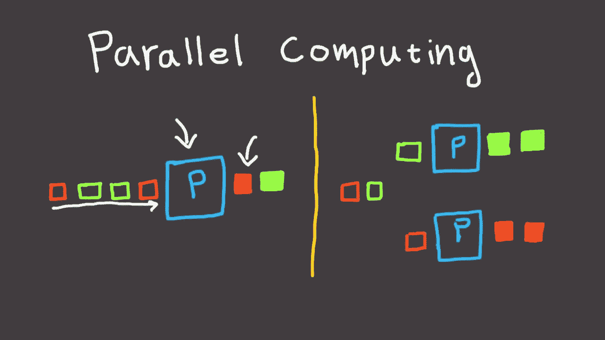

# 围棋中的基本并行计算

> 原文：<https://levelup.gitconnected.com/basic-parallel-computing-in-go-fda50894241c>



去年，我一直在谷歌担任软件工程师，用 Go 编程已经成为我的新习惯。我的一些朋友问我为什么去，我也用“简单”来回答。

不过，我想写一篇关于 Go 中并发性的短文，因为这是我过去使用其他编程语言探索过的一个主题，例如我喜欢的[假设我们想从一个 URL 下载内容。我们可以简单地使用下面的函数。这段代码同步运行。](https://medium.com/hackernoon/a-sad-story-about-concurrency-346990a9a3fe# </em> </strong> </a>。因此，在这篇文章中，我将尝试遵循以前在我的其他并发文章中使用的相同模式，从非常串行的程序走向并行版本的程序。</p><p id=)

```
func content(url string) (string, error) {
 resp, err := http.Get(url)
 if err != nil {
  return "", err
 }
 defer resp.Body.Close() out := &strings.Builder{}
 buff := make([]byte, 1024) for {
   n, _ := resp.Body.Read(buff)
   if n <= 0 {
    break
  } out.Write(buff[:n])
 } time.Sleep(2000 * time.Millisecond) return out.String(), nil
}
```

[正如我们所看到的，在计算中存在嵌入式延迟，这实际上可能是与数据库或任何其他系统对话的结果。](https://medium.com/hackernoon/a-sad-story-about-concurrency-346990a9a3fe# </em> </strong> </a>。因此，在这篇文章中，我将尝试遵循以前在我的其他并发文章中使用的相同模式，从非常串行的程序走向并行版本的程序。</p><p id=)

[问题是，我们如何同步地编写如上代码，然后将它与其他相关计算链接起来。](https://medium.com/hackernoon/a-sad-story-about-concurrency-346990a9a3fe# </em> </strong> </a>。因此，在这篇文章中，我将尝试遵循以前在我的其他并发文章中使用的相同模式，从非常串行的程序走向并行版本的程序。</p><p id=)

[让我们定义一个新函数，它使用`content`的结果来做一些其他的工作。](https://medium.com/hackernoon/a-sad-story-about-concurrency-346990a9a3fe# </em> </strong> </a>。因此，在这篇文章中，我将尝试遵循以前在我的其他并发文章中使用的相同模式，从非常串行的程序走向并行版本的程序。</p><p id=)

```
type Counts map[string]intfunc countWords(content string) Counts {
 out := Counts{} words := strings.Split(content, ",") for _, w := range words {
  out[w]++
 } return out
}
```

[最后，我们可以通过以下方式同步链接它们:](https://medium.com/hackernoon/a-sad-story-about-concurrency-346990a9a3fe# </em> </strong> </a>。因此，在这篇文章中，我将尝试遵循以前在我的其他并发文章中使用的相同模式，从非常串行的程序走向并行版本的程序。</p><p id=)

```
c, err := content("https://www.google.com")
 if err != nil {
  fmt.Printf("error = %v", err)
  os.Exit(1)
 }
fmt.Printf("%v", countWords(c))
```

现在，让我们假设我们需要下载和字数数以百万计的网址，每一个都需要时间来处理。在这种情况下，我们不应该在每个 URL 上阻塞，我们应该尝试并行处理每个处理部分。

```
func contentAsync(url string, output chan<- string) error {
 c, err := content(url)
 if err != nil {
  return err
 }output <- c
 return nil
}
```

请注意，`contentAsync`收到一个通道，在`content`实际完成下载后，它在那里写入结果。在此之前，没有任何异步，但是让我们看看如何调用这个函数。

```
size := 10
q := make(chan string, size)for i := 0; i < size * 2; i++ {
  go contentAsync("[https://www.google.com](https://www.google.com)", q)
}for i := 0; i < size * 2; i++ {
  c := <-q
  fmt.Println(len(c))
}
```

首先，我们有`size`来指定我们可以在通道中排队多少消息。试图在信道中放入更多的消息，会阻塞，直到从信道中取出一些其他消息。这确保了并行计算数量受限于`size`。

第二，我们用特定的类型声明通道，所以只有字符串可以在通道上发送/接收。

然后，我们启动一个名为 goroutine 的并行进程，它实际上负责下载 URL 的内容并将其写入给定的通道。请注意，我们下载的 URL 是通道中可用位置的两倍，`contentAsync`将阻塞通道，等待其他进程从通道中取出项目。

最后，我们有另一个 for 循环，它在元素变得可用时从通道中取出元素。请注意，如果通道中没有任何东西，`<-q`将会阻塞，直到有东西出现。事实上，这个 for 循环在第一个循环完成之前就开始执行了。

现在，我们需要链接下载和计数，使它们并行发生。让我们看看我们如何能做到这一点。

```
func countAsync(input <-chan string, output chan<- Counts) {
 for c := range input {
  output <- countWords(c)
 }
 close(output)
}
```

函数`countAsync`基本上从通道`input`中读取，并将相应的计数写入通道`output`。

现在，如果我们想要 N 个计算单元计数，我们只需要启动 N 个运行`countAsync`的 goroutines。

```
size := 10
q := make(chan string, size)
o := make(chan Counts, size)for i := 0; i < size*2; i++ {
  go contentAsync("[https://www.google.com](https://www.google.com)", q)
}go countAsync(q, o)for i := 0; i < size*2; i++ {
  fmt.Println(len(<-o))
}
```

在上面的例子中，我们从一个`countAsync` 开始，但是，如果我们想要更多，我们可以很容易地这样做。请注意，由于它们是并行运行的，它们不会阻塞，下面的 for 循环将等待 size * 2 计数出现在`o`通道中。

如果我们需要更多的计算能力，并且我们负担得起，我们只需用函数启动更多的 goroutines。

```
size := 10
q := make(chan string, size)
o := make(chan Counts, size)for i := 0; i < size*2; i++ {
  go contentAsync("[https://www.google.com](https://www.google.com)", q)
}for i := 0; i < 5; i++ {
  go countAsync(q, o)
}for i := 0; i < size*2; i++ {
  fmt.Println(len(<-o))
}
```

注意`countAsync`连同通道的使用，是链接计算的一种非常自然的方式。它们就像 linux 中的管道，其中生成器在多个实例中运行，而接收器(管道的另一端)也可以运行自身的多个实例。

在分布式系统的世界中，Apache Kafka 以完全相同的方式工作。我们让发送器并行运行，生成数据并将其排入队列以供其他进程处理。在 Kafka 中，队列的大小受到集群资源的限制。在 Go 中，通道受到内存和处理能力的限制，但从概念上讲，它们与队列相同，在队列中，我们从多个独立的进程中进行读写。

我希望通道和队列的类比能够帮助您理解 Go 中的同步和并行处理是如何工作的。当然，我们可以在 Go 中使用许多其他高级构造，但大多数都是使用本文中显示的构建模块。

*快乐编码*