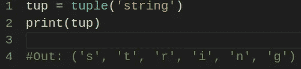
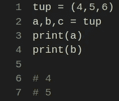
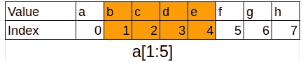
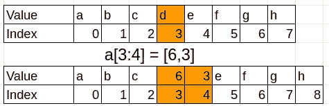
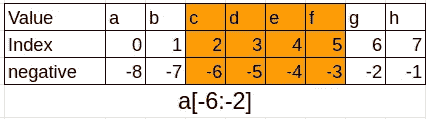

# 基本 Python 数据结构

> 原文：<https://levelup.gitconnected.com/basic-python-data-structures-1797aede5f6f>


大家好！在本文中，我将写一些可以在 Python 中找到的基本数据结构，以及一些实际的例子。

数据结构简单而有效。掌握这些技能对于成为优秀 Python 程序员至关重要。

在本文中，我将讨论其中的两个:元组和列表。

# 元组

元组是不可变的，并且具有固定的大小。它们可以保存任何类型的值。

例如:

```
tup = 4,5,6
print(tup);# (4,5,6)
```

当创建更复杂的元组时，我们通常**使用括号**。在以下示例中，我们正在创建一个元组:

```
nested_tup = (1,2,3), (7,8)
print(nested_tup)# ((1, 2, 3), (7, 8))
```

我们可以**将**任何序列/迭代器转换成一个元组，调用 ***tuple*** *:*



将字符串转换为元组

因为一个元组是不可变的，所以你不能给一个元素赋值。将发生一个*类型错误*。

但是如果一个元素是一个可变的对象，你可以改变它(例如，一个列表作为一个元组的元素):

```
tup = tuple(['bar', [1,3], True])
tup[1].append(5)
print(tup)# ('bar', [1, 3, 5], True)
```

您还可以**连接元组**，以及使用**乘数符号**(后者的行为是不复制值，只复制它们的引用):

```
tup = (4, 'test', True) + (5,0)
print(tup)# (4, 'test', True, 5, 0)tup = ('foo', 'bar') * 4
print(tup)# ('foo', 'bar', 'foo', 'bar', 'foo', 'bar', 'foo', 'bar')
```

# 解包元组

Python 可以使用一种非常直接的方法来**解包元组:**



解包元组

使用这个 Python 功能，在变量之间交换值变得更加容易。在其他语言中，您可以编写类似如下的内容:

```
temp = a 
a = b
b = temp
```

你必须有一个临时变量来保存第一个值。但是在 Python 中，你可以写这样的东西:

```
a, b = 1, 2
a, b = b, a
```

很整洁，对吧？

解包最常见的事情之一是能够**丢弃一个元组的一些元素**并重用它的另一部分。举例来说，这样做效果更好:

```
values = 1,2,3,4,5,6
a, b, *rest = values
print(a)
print(b)
print(rest)# 1
# 2
# [3, 4, 5, 6]
```

你可以用任何你喜欢的变量名来代替名字' rest '。你甚至可以使用下划线。

# 元组方法

因为元组不能被修改，所以它只有几个方法。一个特别有趣的是**方法 count** ，它计算一个给定值在元组中出现的次数:

```
a = (1,2,2,2,3,4,5,2)
print(a.count(2))#4
```

# 列表

与元组相反，列表可以有一个**可变大小，并且它的内容可以就地修改**。列表可以使用方括号或名为 list 的函数来创建。

```
a_list = [1,2,3,None,'foo']tup = ('foo', 'bar', 'baz')
b_list = list(tup)
print(b_list)# ['foo', 'bar', 'baz']
```

# 添加和删除列表中的元素

我们可以使用 **append** (在列表末尾添加一个值)或 **insert** (在给定位置插入一个值)在列表中插入元素:

```
a_list = [1,2,3,None,'foo']
a_list.append('test')
print(a_list)
# [1, 2, 3, None, 'foo', 'test']a_list.insert(2, 'value') #index where the value will be inserted
print(a_list)
# [1, 2, 'value', 3, None, 'foo', 'test']
```

方法 ***insert* 比 *append* 消耗更多内存**，因为 Python 需要在插入值后重新排列所有索引。另一方面， *append* 没有这个开销(第一个有 O(n)的大 O，而最后一个有 O(1)的大 O，这意味着后者快得多)。

要删除一个值，我们用***弹出*** 和 ***删除*** :

```
a_list = [1,'bar',3,None,'foo']
a_list.pop(2)
print(a_list)
# [1, 'bar', None, 'foo']a_list.remove('bar')
print(a_list)
# [1, None, 'foo']
```

与之前的方式相同， ***删除*比*弹出*** 效率低，原因与上一段解释的一样。

# 连接列表

我们可以使用**加号**将一个列表添加到另一个列表:

```
a = [1,2,3]
b = ['foo', 'bar']
c = a + b
print(c)# [1, 2, 3, 'foo', 'bar']
```

我们还可以使用 ***扩展*** 的方法来连接几个元素:

```
a = [1,2,3]
a.extend(['foo', 'bar'])print(a)# [1, 2, 3, 'foo', 'bar']
```

使用 **extend 比加号**更有效，因为 Python 不需要创建新的列表和复制对象。

# 排序值

使用列表，您还可以通过调用*排序*函数来**就地对值进行排序**:

```
a = [1,3,6,3,7,6,8]
a.sort()
print(a)# [1, 3, 3, 6, 6, 7, 8]
```

通过 sort，你也可以使用它的选项，给一个包含一个值的键，作为我们排序列表的第二种方式。

例如，假设我们想要按照**元素的长度**对给定的字符串列表进行排序:

```
a = ['saw', 'small', 'He', 'foxes', 'six']
a.sort(key=len)
print(a)# ['He', 'saw', 'six', 'small', 'foxes']
```

当然，这里有比看上去更多的东西，你可以找到更多关于*分类* [的信息，点击这里](https://docs.python.org/3/howto/sorting.html)。

# 分割列表

可以使用带冒号的方括号来分割列表。

```
a = ['a', 'b', 'c', 'd', 'e', 'f', 'g', 'h']
print(a[1:5])# ['b', 'c', 'd', 'e']
```

为了演示上面的代码是如何工作的，我们有一张图:



我们可以看到，**第一位是包含性的，第二位是排他性的**。

如果我们省略切片上的第一个或最后一个数字，**它将从开始处开始(或在最后一个元素处结束)**:

```
a = ['a', 'b', 'c', 'd', 'e', 'f', 'g', 'h']
print(a[:5])
# ['a', 'b', 'c', 'd', 'e']print(a[2:])
# ['c', 'd', 'e', 'f', 'g', 'h']
```

也可以使用切片将值添加到列表中**:**

```
a = ['a', 'b', 'c', 'd', 'e', 'f', 'g', 'h']
a[3:4] = [6, 3]
print(a)# ['a', 'b', 'c', 6, 3, 'e', 'f', 'g', 'h']
```

我们在[3:4]中有一个值(在本例中是字母“d”)，我们用[6，3]替换这个值:



在 Python 中，还可以使用**负索引**，这有时会让我们的生活变得更简单:

```
a = ['a', 'b', 'c', 'd', 'e', 'f', 'g', 'h']
print(a[-6:-2])# ['c', 'd', 'e', 'f']
```

为了更清楚起见，我将再次使用一个图像:



如果你开始更多地使用负数，你就会习惯了。

最后，还可以添加另一个冒号(和一个值)来表示**步骤**。这样做，有可能按一定的间隔获得元素:

```
a = ['a', 'b', 'c', 'd', 'e', 'f', 'g', 'h']
print(a[::2])# ['a', 'c', 'e', 'g']
```

使用一个步骤的一个聪明的方法是**反转一个列表**传递-1 作为一个值:

```
a = ['a', 'b', 'c', 'd', 'e', 'f', 'g', 'h']
print(a[::-1])# [['h', 'g', 'f', 'e', 'd', 'c', 'b', 'a']
```

我希望你们喜欢这次阅读。在下一篇文章中，我将讨论序列和其他数据结构的有用函数，比如字典和列表理解。那里见！

[](https://skilled.dev) [## 编写面试问题

### 一个完整的平台，在这里我会教你找到下一份工作所需的一切，以及…

技术开发](https://skilled.dev)