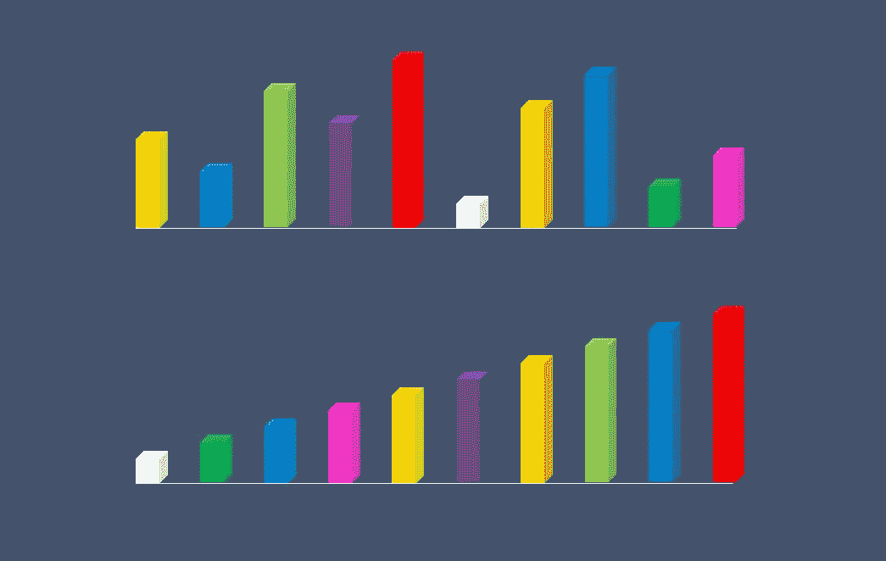

# 一个隐喻中的基本排序和搜索算法

> 原文：<https://levelup.gitconnected.com/basic-sorting-and-searching-algorithms-in-one-metaphor-44bbccc7e4f0>

## 用一个简单的例子简单解释最常见的排序和搜索算法。



每个开始学编程的人都面临算法。我也是。它们是最简单但同时也是最常见的排序和搜索算法。每个程序员都在日常工作中使用它们。当然，每种编程语言都提供了它的实现。但是知道它们是如何工作的以及如何实现它们可能是相当有趣和重要的。至少要通过技术面试，还要了解每种算法背后的含义，以及哪种算法更适合您的特定目的。

和任何抽象概念一样，这些算法有时可能难以理解，尤其是当你第一次面对它们的时候。至少对我来说是这样。我花了很大力气去理解它们的工作原理以及它们之间的区别。

但是当我把所有这些算法翻译成更熟悉和更容易想象的东西时，生活变得更容易了。现在我想分享我的方法，这个隐喻帮助我有目的地帮助他人实现顿悟。

# 排序算法

想象你和其他几个人在一个房间里。有人让你把这些人排成一排。你会怎么做？你将如何完成这项任务？


克里斯蒂安·弗雷南在 [Unsplash](https://unsplash.com?utm_source=medium&utm_medium=referral) 上拍摄的照片

您可以使用几种不同的方法。这些方法通常被称为排序算法，因为你所要做的就是将这些人从最矮的(左边)到最高的(右边)排序。现在我要用这个人排成一行的比喻来解释最常见的排序算法。

## **1。冒泡排序**

让我们假设我们的人已经站成一排，但没有任何秩序。(在我看来)我们可以做的最简单的事情是比较前两个人，如果第二个人比第一个人小，就改变他们的位置。然后我们拿第三个人和第二个人比较。如果第三个比第二个小，那么我们改变他们的位置。如果他比第一个小，我们也交换他们。如果我们的第三人称不比第二个或第一个小，我们就把他留在原地，因为这意味着他已经在他的位置上了。

我们对以下所有人都这样做。我们把他们每个人和他的邻居交换，直到他前面的人变得比他小。如果发生这种情况，这意味着我们找到了我们现在要移动的人的正确位置。

在伪代码中，我们可以这样写解决方案:

```
for each person in a line:
    for each person before him:
        if he is smaller:
            swap them
```

这种方法的缺点是，我们需要将每个人与房间中的几乎所有其他人进行比较，这可能需要太多时间。

## **2。选择排序**

这种方法改进了冒泡排序。现在我们不需要比较每个人和他所有的邻居。相反，在每次迭代中，我们只需要在人群中找到最小(或最高)的人。

假设我们从左边开始让人们排队(或者我们可以从右边开始，结果是一样的，所以这并不重要)。首先，我们找到最矮的人，把他放在左边。然后我们从剩下的一组中选出最小的一个，把他放在最先被选中的那个人的右边。我们不断经历这个过程，直到所有人都找到自己的位置。

在伪代码中，我们的程序将如下所示:

```
for all the people in the line:
    find the smallest person
    put him after the person we choose on previous step
        (if he is the first - just put him on the most left edge)
    remove him from the consideration
```

这种方法的缺点与前面的算法相同:我们必须将每个人与组中的所有其他人进行比较。太无聊了，可能会花太多时间。

## **3。插入排序**

与前面的方法非常相似，但是现在我们不选择最小(或最高)的人。我们把遇到的第一个人放在最开始。

然后我们拿另一个人和第一个人比较。如果他比第一名高，我们就把他放在第二名。否则，我们把他放在第一位，把第一位的移到第二位。

我们继续对所有其他人这样做:找到他们在队伍中的位置，如果必要的话，把那些高个子移到右边。

伪代码中的程序可能如下所示:

```
take the first person and put him on the first place
for all the rest of the people:
    compare each one with the people who are already in the line
    find his place moving those who are taller to the right
```

但同样在最坏的情况下，如果我们从最高的人开始，然后意外地一直选择最高的人，我们会将每个人与房间里的所有其他人进行比较。效率不是很高。

## **4。合并排序**

如果我们想提高流程的效率呢？我们必须发明新的东西。这个挑战的答案是——将人们分组。分成小团体，非常小的团体。我们把他们分成一组，每组一人。听起来真的很奇怪。


照片由 [Jana Shnipelson](https://unsplash.com/@shnipelson?utm_source=medium&utm_medium=referral) 在 [Unsplash](https://unsplash.com?utm_source=medium&utm_medium=referral) 上拍摄

但是根据定义，所有这些组都已经被排序了，因为这个人本身在这样一个组中处于他的位置。然后我们开始把它们放在一起。我们把孤独的人两两比较，必要的话交换。然后我们比较这些对，把人们按四人一组的顺序排列，然后我们再次把这些人组合成更大的线，在这些组中进行比较。我们继续合并单独的组，直到我们将它们全部聚集在一起，但是因为它们是以小组的形式排序的，所以它们也会以排序的顺序出现在完整的行中。

在伪代码中，我们可以将此逻辑编写如下:

```
while the number of people in a group bigger then 1:
    divide the group in halves
    do this process to the left half of people
    do this process to the right half of people combine two groups of people:
        if the next person in the first group is taller:
            put him in the next place of combined group
        else:
            put there the next person from another group
```

有人可能会注意到这是一个递归过程。尽管看起来很复杂，但这可以更容易更快地完成，因为每个人只需要在我们把他与另一个群体，并且只与少数其他人联系起来的时候进行比较。

但是这种方法也有它的缺点:它需要额外的内存。

## **5。快速排序**

这种方法的工作原理与前一种非常相似，但是没有任何额外的内存使用。这个过程的想法也是基于将所有的人分成更小的群体，但是是另一种方式。

我们以第一个人为模型。然后我们开始从边缘移动到线的中间。如果左边有人比我们的模型大，右边有人比他小，我们就把这两个人互换。我们一直这样做，直到我们来到中心，把模型放在那里。这是分裂点。

然后，我们对分割点前后的两部分重复这个过程，也将它们分成两部分，左边的所有人肯定比这一半的新分割点矮，右边的所有人肯定高。

我们继续这个过程直到每组中的一个人。这意味着我们从头到尾对这一行进行了排序。

我们可以用伪代码来写:

```
take the first person as a model
for each person from the left edge and from the right edge:
    if someone from the left side is taller than the model
    and if someone from the right side is smaller than the model:
    swap themcontinue doing this until the left side will meet the right side
move the model to the point where the left side met the right siderepeat the process for the left and right parts from the modeldo this until there will be one person in each part
```

目前，这种方法是不同编程语言中最常用的排序方法。在一般情况下，它比我们之前讨论过的任何其他排序方法使用更少的时间和内存。这就是它如此高效和有用的原因。而且真的很好，值得被人了解和理解。

# 搜索算法

好了，现在我们知道了如何给人分类，例如，把他们从最小到最大排成一行。但是如果我们想在这个房间里找到一个和你一样高的人呢？我们做什么呢我们怎样才能找到他？我们可以使用我现在想描述的一种搜索算法。

## **1。顺序搜索**

真的，这是一个非常简单的任务。你所要做的就是把你自己和房间里的每个人进行比较。这真的很容易，不需要任何特殊的技术。你只是走到每个人面前，看看谁的头更高。就是这样。

在伪代码中，我们将这样做:

```
for each person in the room:
    compare me with him
    if we are the same heighth:
        I've found my vis-a-vis
        the task completed
```

这种方法的优点是，即使房间中的人站在不同的位置(例如，不在一条线上，也不在一个排序线上)，我们也可以这样做。但缺点是——我们再次需要和房间里的所有人一起做这些无聊的事情，而在我们处理更有效的算法之前，没有太多的时间。

## 2.跳跃搜索

尽管有前面的方法，但是这个和接下来的算法仅在人已经被分类的情况下才起作用，例如，他们停留在有序的行中。现在事情变得容易了。


肖恩·斯特拉顿在 [Unsplash](https://unsplash.com?utm_source=medium&utm_medium=referral) 上拍摄的照片

我们能做什么？我们可以不与每个人比较，而是与其中一些人比较。例如，我们用第一个人测量你的身高，然后用第五个，第十个，等等。虽然他们都比你小，但我们继续沿着这条线前进。但是当下一个被测量的人变得比你高的时候，我们回到之前和你比较，然后把你和从他开始的所有人比较，直到最后一个你和谁比较，我们已经知道比你高。

我们要么找到和你一样高的那个，要么找不到。但我们确定他应该在这里的某个地方。在伪代码中，我们可以这样写程序:

```
devide people into small groups(usually the number of people in each group defines as the square root of the number of all the people)for number of groups:
    compare yourself with the first person in each group
    until you'll find someone taller than youfor each person in previous group:
    compare yourself with every person in a group
    until you either find someone you need - success!
    or not - failure
```

该算法比顺序搜索更充分，但还可以改进。

## **3。二分搜索法**

现在我想向你们展示和解释我见过的最优雅的算法。我们再次假设房间里的人已经按照我们之前检查的方式进行了排序。

你仍然需要在房间里找到一个和你一样高的人。但是现在你走到队伍中间的那个人面前，把自己和他进行比较。如果你比较高，就往右，如果你比较矮，就往左。再次将你自己与这一半中间的人进行比较。如此下去，直到你找到一个和你一样高的人，或者意识到这个房间里没有人和你一样高。

在伪代码中，这个过程可以写成如下方式:

```
while there are people in the group:
    find the middle person of a group
    if you are bigger:
        goupe = half of a group to the right side
    if you are smaller:
        group = half of a group to the left side
    if you are the same height:
        he is found
        the tast is done
```

这是我所知道的最好的算法，因为它非常快速、高效，同时，它很容易理解和实现。

这是对最基本和最常见的排序和搜索编程算法的简要介绍。对于每一个解释，我都用伪代码提供了例子。我做这件事是有目的的。你用哪种编程语言来写这些算法并不重要。最重要的是——你理解他们吗？如果是的话，你可以用任何你想用的语言来写。我希望这个关于人的比喻能让你接近理解。如果是这样，我很高兴，因为这是我的目标。