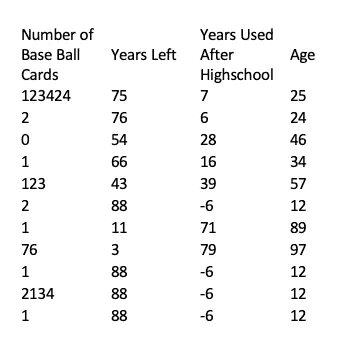

# 基础统计:复习

> 原文：<https://levelup.gitconnected.com/basic-statistics-a-brushup-4144392b1eaa>

如果你和我一样，你学过统计学课程，我们大多数人都学过。然而，通常情况下，上课并不意味着掌握更多的技能。通过这篇文章，我希望重新介绍为什么统计很有趣(这将是我希望撰写的系列文章的一部分)。我想涵盖描述性统计，如平均值，中位数，模式，范围，方差，标准差，百分位数，并阅读散点图和直方图。样本数据集将根据葡萄酒的特征进行葡萄酒评级([数据源](https://www.kaggle.com/uciml/red-wine-quality-cortez-et-al-2009))。这种媒介不会比 excel 更先进。文章下面还列出了所有步骤，如果你希望独立完成，可以参考。

首先，我们想得到 10000 英尺。对我们数据的理解；找到每一列的汇总统计信息是一个好主意。葡萄酒数据集“质量”栏的汇总统计数据说明了很多问题:

> 1 —样本大小
> 2 —最小值和最大值，
> 3 —最常见值(众数)
> 4 —平均值(均值)
> 5 —中间值(中值)
> 6 —范围(最大值减去最小值)
> 7 —标准偏差(n 个数值的平均值的平方距离之和的 sqrt)

总而言之，标准化的测量方法，当比较时，可以立即告诉你是否有异常值，是否有遗漏条目，数据是否紧密或分散，或者数据是否需要进一步检查。

数据集中质量列的汇总统计

这样做之后，为每一列创建一个直方图将进一步帮助您将数据放在上下文中。直方图将数值范围划分为“箱”，然后计算符合每个“箱”的每个数据点

在 quality 列的直方图中，我们可以看到并非所有从 0 到 10 的值都出现在数据集中。我们可以看到，该模式位于 5“bin”中，但也有许多 6。我们还可以看到，虽然有少数高和低的比率，但大多数评级是平均的。我们可以开始对我们想要用这些数据做什么有一个感觉。接下来，我们必须找出每个主要组的统计成分(本例中有三个:高、中和低)。为了找到这一点，对每种类型的数据集进行过滤(本例中为 3 个评级、5 + 6 个评级和 8 个评级)，然后为每种类型创建摘要。

低值的自定义汇总(约 3 个等级)

中间值的自定义汇总(大约 5-6 个等级)

高值的自定义摘要(约 8 个评级)

从这一点上，我们可以看出，在很大程度上，这些因素可能与葡萄酒的质量关系不大。但这是数据科学，“可能”是不可接受的交付物。以上给了我们一种三个主要质量分组之间极端相似的感觉，然而，这并不容易解释。下一步是为每个分组创建相关系数，然后描述每个分组所在的百分位数(第 50 个是中值，第 0 个是最小值，第 100 个是最大值)。

相关系数。低值(~3 个等级)

相关系数。中值(大约 5-6 个等级)

相关系数。高价值(大约 8 个等级)

正如我们从这些总结中所看到的，我们对定制总结的最初估计是准确的，葡萄酒的质量和数据集中列出的因素之间没有太多的相关性。我们可以为这些类别中的每一个创建散点图，以直观地了解相关系数，但相反，我们将描述数字的重要性。相关系数的范围从-1 到 1。A -1 表示强负相关，0 表示不相关，1 表示强相关。例如，使用以下示例数据，您将获得以下结果。

抽样资料

无相关性(接近 0 系数。)

强负相关(接近-1 Coef。)

强正相关(接近 1 Coef。)

现在我们明白了我们的数据集并没有为劣质酒和优质酒的成因提供重要的信息，我们必须开始思考了。有哪些隐藏变量？如果不是酸性和化学沉着，那是什么？可能是品牌、价格、年份、酒厂的传统、葡萄、类型、包装、风味等。

这项工作的一个重要收获是，我们知道有一个质量框架，让我们可以查看更多与葡萄酒质量相关的数据。我们还删除了一项内容(至少目前是这样):我们知道这些数据不是关键。知道什么不起作用几乎和知道什么起作用一样重要。像所有科学一样，要做出发现或支持假说，人们必须做大量繁重的工作，以获得各种各样合格的发现。得出有意义的数字需要耐心、练习和坚持。

## 创建汇总统计数据

1)导航至【数据>数据分析】并打开对话框。

2)从列表中选择“描述性统计”。

3)选择所需的栏作为“输入范围”；定义“输出范围”；点击汇总统计；那就成交。

## 创建直方图

1)选择所需的栏作为“输入范围”；定义“输出范围”；点击汇总统计；那就成交。

2)导航至"插入>统计图>直方图"并点击。

## 过滤数据集

1)选择顶行中的所有列，并按 Command + Shift +向下箭头

2)导航至“数据>过滤器”

3)在列标签上，单击向下箭头并根据需要进行过滤。

## **在单元格内创建汇总**

1)选择空卖，使用这些函数(=AVERAGE()，=MEDIAN()，=MODE())。

## 寻找相关系数

1.  选择空卖并使用此功能(=CORREL())。

## 创建散点图

1)选择所需的*列和*列。

2)导航至"插入> XY 散点图>散点图"并点击。