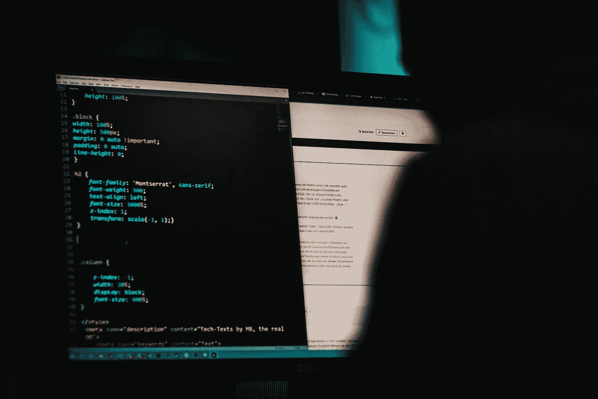

# 终端命令来节省时间并提高您的工作效率

> 原文：<https://levelup.gitconnected.com/basic-terminal-commands-for-programmers-to-save-your-time-and-make-you-more-productive-ffd488e606b3>

## 了解每个开发人员的基本终端命令



照片由[米卡·鲍梅斯特](https://unsplash.com/@mbaumi?utm_source=unsplash&utm_medium=referral&utm_content=creditCopyText)在 [Unsplash](https://unsplash.com/s/photos/hacking?utm_source=unsplash&utm_medium=referral&utm_content=creditCopyText) 上拍摄

如果你是一名程序员，那么大部分时间你会使用终端。本文列出了一些最重要的 Mac/Linux 终端命令。

# 基本命令

`clear` →清除屏幕。或者，我们可以使用`Cmd + K`。

`reset` →重置终端显示。

`sudo command` →使用超级用户的安全权限运行命令。Sudo 代表`super user Do`。

# **更换目录**

打印当前工作目录的完整路径(当前工作目录)。

```
pwd
```

将当前目录更改为特定目标

```
cd folder_path
```

将当前目录更改为主目录

```
cd# or cd ~
```

将当前目录更改为驱动器的根目录

```
cd /
```

将当前目录更改为上次浏览的目录

```
cd -
```

将当前目录更改为父目录

```
cd ..
```

将目录向上更改多个级别

```
cd ../../ # move up two levels
```

# 列出文件

`ls` →显示当前目录下文件和子目录的名称。

`ls -l` →以长格式列出文件和子目录。包括文件模式、所有者和组名、文件修改的日期和时间、路径名等。

`ls -lh` →与`ls -l`相同，但文件大小可读。

`ls -a` →列出文件和文件夹，包括隐藏的文件和文件夹。

`ls -la` →列出详细的目录内容，包括隐藏文件。

`ls -1` →以每行一个条目的格式输出文件列表。

`ls -R` →递归列出所有文件和文件夹，这意味着当前文件夹中的所有文件都将被打印。

`ls -S` →按大小分类文件和文件夹。

# 创建和查看文件

创建文件

```
touch <filename>
```

使用 vim 创建/打开文件

```
vim <filename> 
```

在终端中打开文件

```
nano <filename>
```

打印文件的内容

```
cat <file>
```

打印文件的前 10 行

```
head <file>
```

# 创建文件夹

创建新文件夹

```
mkdir <dirname>
```

如果你想在`directory name`中使用`whitespace`，那么使用双引号`“”`。

```
**mkdir "dir name"**
```

创建嵌套文件夹。

```
mkdir -p parent/child/grandchild;
```

创建文件夹名称中包含`whitespace`的嵌套文件夹。

```
mkdir -p "parent/child 1/child 2";
```

在当前目录中创建多个文件夹。

```
mkdir dir1_Name dir2_Name dir3_Name
```

# 删除文件和目录

删除文件

```
rm path_to_file
```

删除目录

```
rmdir path_to_directory
```

供选择的

```
rm -R path_to_directory
```

在用户确认后删除文件

```
rm -i file_path
```

删除多个文件

```
rm file1 file2 file3
```

# 复制文件和文件夹

将文件复制到目录中

```
cp path_to_file destination_directory
```

将文件复制到另一个文件

```
cp source_file_path new_file_path
```

在复制文件之前用警告覆盖消息进行提示。如果`destination_folder`包含同名文件，将显示该消息

```
cp -i file_path destination_folder
```

要复制多个文件

```
cp file1 file2 file3 destination_folder
```

要复制文件夹

```
cp -R directory_to_copy destination_path
```

移动/重命名文件

```
mv source_file new_filename
```

将文件移动到文件夹

```
mv file director_to_move
```

将具有特定扩展名的文件移动到特定文件夹

```
mv *.pdf director_to_move
```

# **搜索文件和文件夹**

查找目录和子目录中文件名为的所有文件

```
find dir_to_search -name "file_name" # list all files with file name as "file_name"
```

我们也可以使用通配符

```
find dir_to_search -name "file*"
```

要搜索文件夹

```
find dir_to_search -name "folder_Name"  -type d# list all the directory with name "folder_Name" under "dir_to_search"
```

# 在文件中搜索内容

输出文件中特定字符串的所有匹配项

```
grep "text_to_search" file
```

打印没有特定图案的所有行

```
grep -v "search_pattern" file_name
```

搜索目录中包含特定字符串的所有文件

```
grep -rl "text" directory_path
```

要在上面的命令中添加不区分大小写，请添加`-i`

```
grep -rli "text" directory_path
```

# 终端历史

显示最后执行的`n`命令，其中`n`是一个数字

```
history n
```

交互式搜索先前键入的命令

```
Ctrl + r# when you type something it will display all command which matches the current typed command
```

执行最后一个命令

```
!!
```

打印最后执行的命令

```
!!:p
```

执行最后一个以“value”开头的命令

```
![value];#consider we have used ls command !l # --> execute the ls command
```

打印以“value”开头的最后一个命令

```
!l:p#output
ls 
#because we executed ls as last command
```

# 访问剪贴板

将文件内容复制到剪贴板

```
pbcopy < file
```

粘贴剪贴板内容

```
pbpaste
```

将剪贴板内容粘贴到文件中

```
pbpaste > file
```

# 快捷指令

`Ctrl + a` →将光标移动到当前命令的开头。

`Ctrl + e` →将光标移动到当前命令的末尾。

`Ctrl + l` →清除屏幕，但我们可以向上滚动查看历史记录。

`Ctrl + h` →替换为`backspace`。

`Ctrl + c` →不管你在跑什么都干掉。

`Ctrl + f` →将光标向前移动一个字符(右箭头)。

`Ctrl + b` →将光标向后移动一个字符(向左箭头)。

`Ctrl + r` →交互式搜索之前输入的命令。

`Option + right arrow(→)` →将光标向前移动一个单词。

`Option + left arrow(←)` →将光标向后移动一个单词。

`Tab` →自动完成命令、文件名和文件夹名。

`Ctrl + u` →剪切当前命令当前光标位置之前的所有文本。文本`cut`没有被复制到剪贴板，但是我们可以使用命令`ctrl+y`粘贴清除的文本

`Ctrl + k` →在当前命令中，剪切当前光标位置之后的所有文本。`cut`的文本不会复制到剪贴板，但是我们可以使用命令`ctrl+y`粘贴清除的文本

`Ctrl + w` →使用空格作为分隔符向后删除一个单词。`cut`的文本不会复制到剪贴板，但我们可以使用命令`ctrl+y`粘贴清除的文本。

`Ctrl + y` →使用`ctrl + u`或`ctrl+k`或`ctrl + w`在终端打印最后一个切割命令。

`Ctrl + d` →无进程运行时退出当前 shell。

`Ctrl + t` →交换光标前的最后两个字符。

`Cmd + l` →清除由最后执行的命令产生的最后打印输出。

`Cmd + k` →完全清除屏幕。

要了解更多关于命令的信息，请使用`man`、`info`、`help`命令。

```
[command] -hman [command]info [command]
```

要获得一行描述，请使用

```
whatis [command]
```

参考: [Github](https://github.com/0nn0/terminal-mac-cheatsheet#english-version)

跟随 Javascript Jeep🚙💨。

[](https://sitepoint.tapfiliate.com/p/payout-methods/new/) [## 登录|站点点

### 不支持的浏览器虽然我们的跟踪技术支持旧的浏览器，不幸的是我们的网站不支持…

sitepoint.tapfiliate.com](https://sitepoint.tapfiliate.com/p/payout-methods/new/)