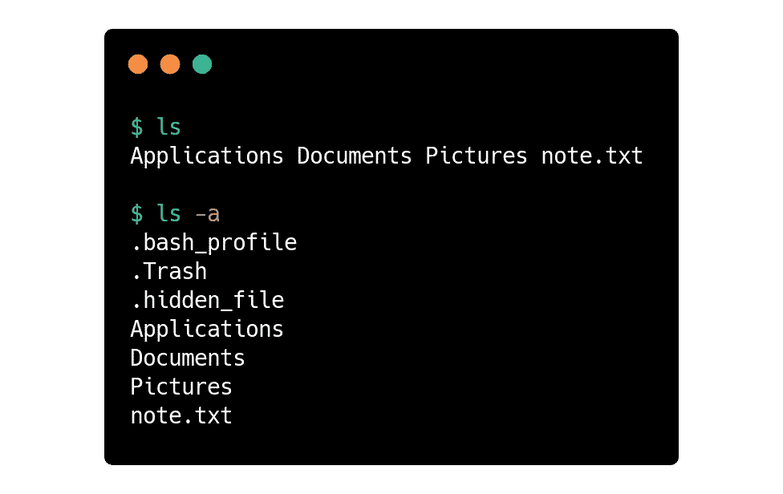
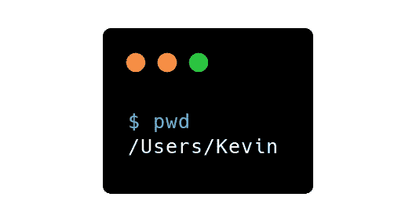
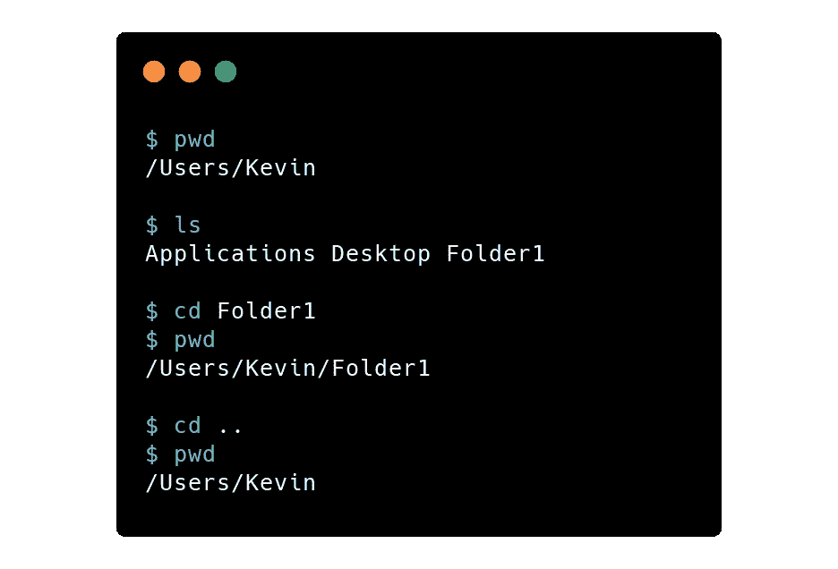
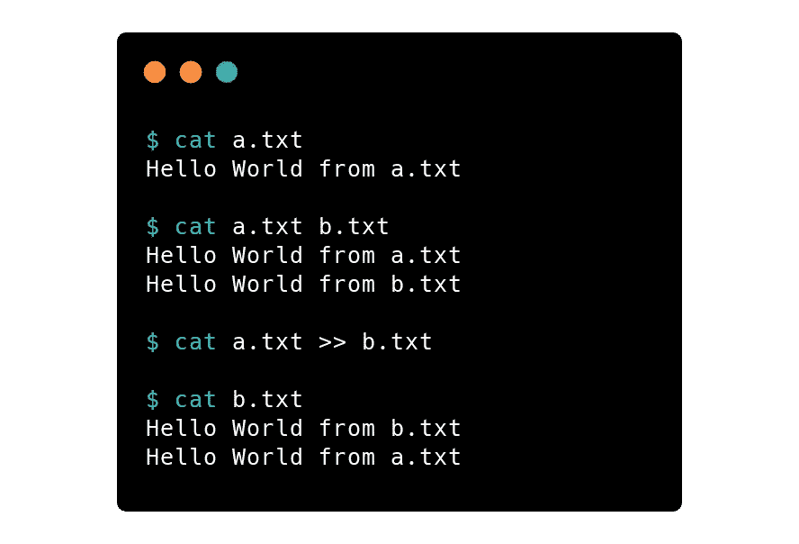
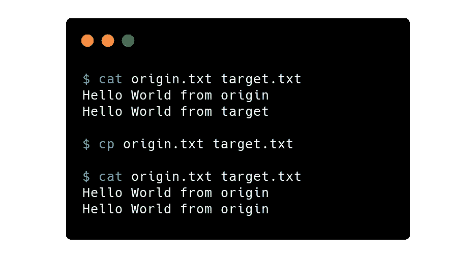
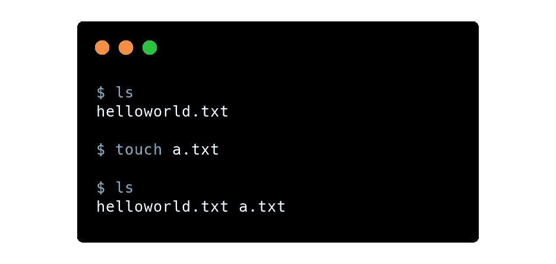
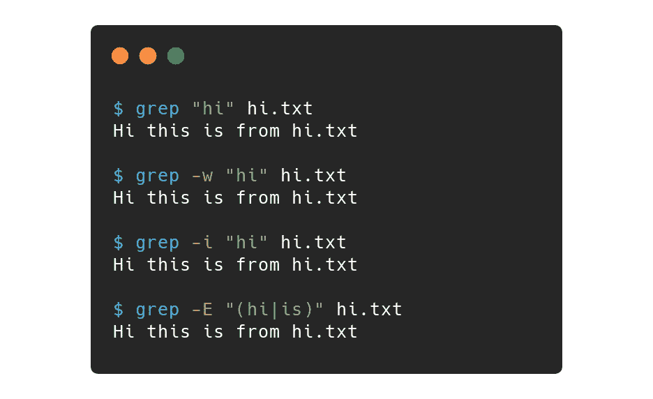
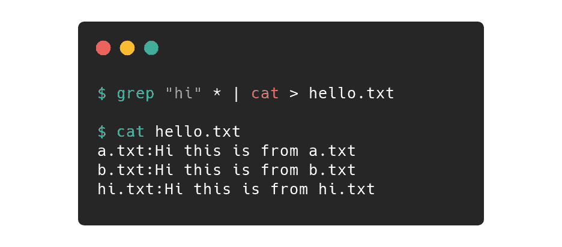

# 您应该知道的基本终端命令

> 原文：<https://levelup.gitconnected.com/basic-terminal-commands-you-should-know-cc8e37470c9>

## 终端可能让人感到畏惧，但不应该如此，这是每个程序员都应该具备的技能

[奥斯汀·陈](https://unsplash.com/@austinchan?utm_source=unsplash&utm_medium=referral&utm_content=creditCopyText)在 [Unsplash](https://unsplash.com/s/photos/productive?utm_source=unsplash&utm_medium=referral&utm_content=creditCopyText) 上的照片

很长一段时间以来，终端一直让我望而生畏。我只把它用于从指南和教程中复制粘贴的基本任务，以下载或初始化一个项目——是的，我正看着你`npm`。

我没有学习这些命令的借口是，我是一个视觉学习者，并且更习惯于图形界面——你可能也是。然而，作为一名开发人员，您迟早会以某种方式处理命令行。

我向您保证，一旦您熟悉了这些命令，您的工作效率将会提高。它们也允许开发者有更多的权力和控制。在本文中，我将讨论大多数情况下会遇到的基本用例以及如何使用它们。

我可以介绍更多的命令，要了解更多关于该命令的其他标志或功能，您可以在终端中键入`man <cmd>`以获得终端中的完整文档。

# 让我们从这些命令开始。

`ls` —用于列出文件系统中的所有文件和目录。

*   `ls -a` —列出所有隐藏文件(以`.`开头的文件)
*   `ls -R` —递归列出所有文件，包括嵌套目录中的文件

ls 命令示例

`pwd` —从根目录开始打印当前工作目录路径。它用于为其他操作快速获取文件路径

pwd 命令示例

`cd` —用于改变当前工作目录

*   `cd directory` —用要更改的目录名替换目录。它通常在`ls`之后使用，以检查可用的目录，然而，绝对路径也可以像`cd /users/documents`一样使用
*   `cd ..` —用于转到一个目录或其父目录。它就像一个后退按钮。这是我最常用的命令之一。
*   `cd ~` —返回根目录。
*   `cd —` —导航至上一个工作目录

cd 命令示例

`cat` —(连接)输出文件内容，创建或连接文件。

*   `cat a.txt`—`a.txt`中的内容输出到终端(默认)
*   `cat a.txt b.txt` —输出两个文件的内容
*   `cat a.txt > b.txt` —将文件`a.txt`中的内容复制到文件`b.txt`(是否**会覆盖**)
*   `cat a.txt >> b.txt` — **将`a.txt`文件中的**内容追加到`b.txt`文件的末尾
*   `cat > c.txt` —将提示用户输入文本到**覆盖** (ctrl +d 结束)
*   `cat >> c.txt` —将提示用户输入文本到**追加** (ctrl + d 结束)
*   `cat d.txt | less` —完整显示文件`d.txt`的内容(q 退出)

卡特彼勒命令示例

`cp` —将文件或文件夹从源位置复制到目标位置

*   `cp origin.txt target.txt` —将文件`source.txt`的内容复制到当前工作目录下的`target.txt`中，并将覆盖`target.txt`中的内容
*   `cp -i source.txt target.txt` —覆盖时交互标志会提示用户
*   `cp -r dir1 dir2` —如果不存在，递归标志将创建`dir2`。

cp 命令示例

`touch` —轻松创建一个没有内容的新文件

*   `touch a.txt b.txt` —将创建两个空文件`a.txt`和`b.txt`

触摸命令示例

`grep` —从文件中搜索单词或字符串

*   `grep "hi" hi.txt` —在`hi.txt`文件内容中搜索字符串“hi”
*   `grep -w "hi" hi.txt` —仅匹配整个单词
*   `grep -i "hi" hi.txt` —忽略大小写标志以搜索不区分大小写的匹配
*   `grep -R "hi" .` —递归搜索匹配当前目录及所有子目录
*   `grep -E "(hi|is)" *` —以扩展正则表达式(ERE)的形式搜索模式

grep 命令示例

`nano` —终端中的文本编辑器。你可以使用其他文本编辑器(`vim`)，这大多是个人喜好。您可以使用`code`在 vscode 中打开文件。

`|` —管道运算符用于将左侧命令的输出重定向到右侧命令。

*   `grep "hi" * | cat > hello.txt`—grep 匹配的输出将被写入`hello.txt`文件，而不是打印出来

管道命令示例

学习这几个命令让我变得更加高效，并且证明在需要使用 ssh 或连接到虚拟机时非常有用。我希望它能帮助您在编程之旅中更有成效。干杯！