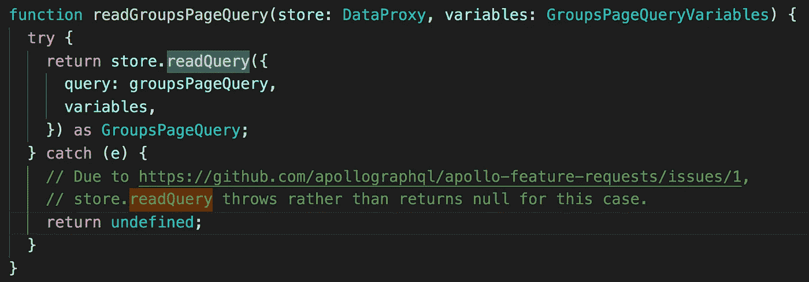
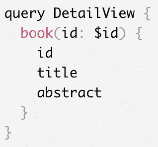

# GraphQL Apollo React 客户端中缓存数据的基础知识

> 原文：<https://levelup.gitconnected.com/basics-of-caching-data-in-graphql-7ce9489dac15>

这是一个剧本，讲述了在 React Apollo GraphQL 中访问和操作存储/缓存的一些常见模式。作为入门，请阅读[https://www . apollographql . com/docs/react/essentials/get-started . html # installation](https://www.apollographql.com/docs/react/essentials/get-started.html#installation)

## **直接缓存访问**

要访问数据缓存，您可以通过`DataProxy`接口使用阿波罗客户端类方法`readQuery`、`readFragment`、`writeQuery`和`writeFragment`。

## readQuery

`readQuery`永远不会向您的 GraphQL 服务器发出请求。它将总是从缓存中读取一个错误；因此，确保只读取你知道你在商店里的数据。

readQuery 的用法示例

或者，如果适当的数据不在您的缓存中，`query`方法可能会向您的服务器发送一个请求。

## 读取碎片

`readFragment`允许您从您查询的任何节点读取数据，而`readQuery`只允许您从根查询类型读取数据。

为此，您需要初始化 ApolloClient 时定义的由`dataIdFromObject`函数返回的数据的`id`。如果`id`不存在于缓存中`readFragment`将返回 null。如果`id`确实存在，但是没有片段查询指定的字段，那么将抛出一个错误。

神奇的是，对象可以来自任何地方——它可能是商店中的单例对象，也可能是列表对象，甚至可能是变异对象。只要 GraphQL 服务器为您提供了片段形状的对象，您就可以从缓存中读取它。

## writeQuery 和 writeFragment

您还可以将任何数据写入缓存。注意，这只会更改本地缓存中的数据，而不会更改服务器中的数据。如果重新加载，更改将会消失。

这些方法具有与`readQuery`和`readFragment`相同的函数签名，除了需要传递一个额外的`data`变量。

Apollo 客户端商店的任何订户都会看到这些更新，并相应地呈现 UI。

writeQuery 用法示例

# 为什么要使用数据存储？

## 绕过缓存

当对特定操作不使用缓存有意义时，您可以在查询中使用`network-only`或`no-cache` fetchPolicy 。

*   `network-only`仍然将响应保存到缓存中以备后用，绕过读取并强制网络请求。这是为了确保与服务器的数据一致性，但这是以对用户的即时响应为代价的。
*   `no-cache`策略不会读取，也不会将响应写入缓存。它将始终使用您的网络接口向服务器发出请求。与仅网络策略不同，它不会在查询完成后将任何数据写入缓存。

用于查询的仅网络和缓存优先提取策略的使用示例

> fetchPolicy 有比这两个变体更多的内容。在[https://www . apollographql . com/docs/react/API/react-Apollo . html # graph QL-config-options-fetchPolicy](https://www.apollographql.com/docs/react/api/react-apollo.html#graphql-config-options-fetchPolicy)上阅读有关 fetch policy 的更多信息

## 突变后更新

如果您想在对象列表中添加一些内容而不重新提取整个列表，或者如果有些对象不能分配对象标识符，Apollo Client 就不能更新现有的查询。

*   `refetchQueries`是更新缓存最简单的方法。使用`refetchQueries`,您可以指定一个或多个在突变完成后要运行的查询，以重新提取可能受突变影响的存储部分。

变异后 refetchQueries 的用法示例

如果您用一个字符串数组调用`refetchQueries`，那么 Apollo Client 将寻找以前调用的与提供的字符串同名的查询，然后用它们当前的变量重新提取这些查询。您还可以导入对其他组件的查询，以确保这些组件将被更新。

*   `update`允许您以自己喜欢的任何方式对数据模型进行更改，以响应突变。

突变后更新的用法示例

> 注意突变后的更新有一整套技术挑战。在[https://www . apollographql . com/docs/react/features/Optimistic-UI . html](https://www.apollographql.com/docs/react/features/optimistic-ui.html)上阅读有关乐观用户界面的更多信息

## 增量装载

如果您想处理无限滚动分页，或者当加载更多数据而不是丢弃一个列表时，只需将新加载的数据追加到已经在存储中的列表中，您可以使用`fetchMore`。

增量加载的 fetchMore 用法示例

fetchMore 方法获取要与新查询一起发送的变量映射。我们需要传入一个偏移量来避免获取已经在存储中的项目。请注意，变量映射与为与组件相关联的查询指定的映射合并，因此，例如，一旦设置了变量映射，就不需要传递限制。

默认情况下，`fetchMore`查询是与容器相关联的查询，但是它也可以接受名为 argument 的查询，该查询可以是包含查询的 GraphQL 文档。

## `@connection`指令

分页查询是相同的查询，只是对`fetchMore`的调用更新了相同的缓存键。由于处理分页的字段通常有一些额外的参数，如 cursor 或 limit，我们希望确保我们有一个干净的缓存键，不包括这些参数。

Apollo Client 1.6 中引入的`@connection`指令有助于指定从该字段返回的数据应该存储在所提供的键下，从而更容易由于突变或分页结果而追加到列表中。

@connection 指令的用法示例

如果我们不在那个字段上使用`@connection`指令，我们的变异更新函数将需要重新生成最初传递给那个字段的参数的精确集合。

因为 connection 指令为结果指定了一个自定义的存储键，所以我们也不需要为访问缓存数据提供分页参数，比如限制、偏移量或游标。即使有多个`fetchMore`，每次 feed 更新的结果总是会导致商店中的 feed 键被更新为最新的累积值。

我们还可以使用`@connection`指令的可选`filter`参数在 store 键中包含`type`查询参数，这将产生多个 store 值，这些值累积了来自每种类型提要的查询。

在我们的变异中使用@connection 指令的好处

> 在[https://www . apollographql . com/docs/react/features/pagination . html # connection-directive](https://www.apollographql.com/docs/react/features/pagination.html#connection-directive)和[https://www . apollographql . com/docs/react/advanced/caching . html # connection-directive](https://www.apollographql.com/docs/react/advanced/caching.html#connection-directive)上阅读有关`@connection`指令的更多信息

## 用`cacheRedirects`缓存重定向

在某些情况下，查询会请求已存在于客户端存储中的不同关键字下的数据。一个非常常见的例子是当你的 UI 有一个列表视图和一个细节视图，两者都使用相同的数据。

查询以列出书籍

显示图书详细信息的查询

> 注意:列表查询返回的数据必须包括特定查询需要的所有数据。如果特定的图书查询获取了列表查询没有返回的字段，Apollo 客户机就不能从缓存中返回数据。

我们知道数据很可能已经在客户端缓存中，但是因为它是由不同的查询请求的，所以 Apollo 客户端不知道这一点。为了告诉 Apollo 客户机在哪里寻找数据，我们可以定义定制的解析器。

使用缓存重定向的自定义解析程序

注意:只要您使用相同的方法，这也适用于自定义的 dataIdFromObject 方法。

注意:`getCacheKey`在第三个参数中被传递给解析器，以根据其`__typename`和`id`生成对象的键。

为了弄清楚应该在`__typename`属性中放入什么，在 GraphiQL 中运行一个查询，并获得`__typename`字段。

## 重置商店

`client.resetStore`完全重置阿波罗缓存。它还会重新提取任何活动的查询，并且是异步的。

如果你想清空存储但不想重新提取活动的查询，使用`client.clearStore()`而不是`client.resetStore()`。

client.resetStore 的使用示例

要注册一个在存储被重置后执行的回调函数，使用`client.onResetStore`并传递您的回调函数。要注册多个回调，请再次调用`client.onResetStore`。所有回调都被放入一个数组中并发执行。

client.onResetStore 的使用示例

注意:如果您使用`apollo-link-state`进行本地状态管理，并在应用程序中的任何地方调用`client.resetStore`，请使用`client.onResetStore`将默认值写入缓存。

您也可以从 React 组件中调用`client.onResetStore`。如果您希望在重置存储后强制重新呈现用户界面，这将非常有用。

如果您想从`client.resetStore`取消订阅您的回调，请使用`client.onResetStore`的返回值来取消订阅功能。

取消订阅您的客户端。onResetStore 回调

在[https://www . apollographql . com/docs/react/advanced/Caching . html](https://www.apollographql.com/docs/react/advanced/caching.html)上阅读有关缓存数据的更多信息

 [## 学习 GraphQL -最佳 GraphQL 教程(2019) | gitconnected

### 9 大 GraphQL 教程。课程由开发者提交并投票，让你找到最好的图表

gitconnected.com](https://gitconnected.com/learn/graphql)