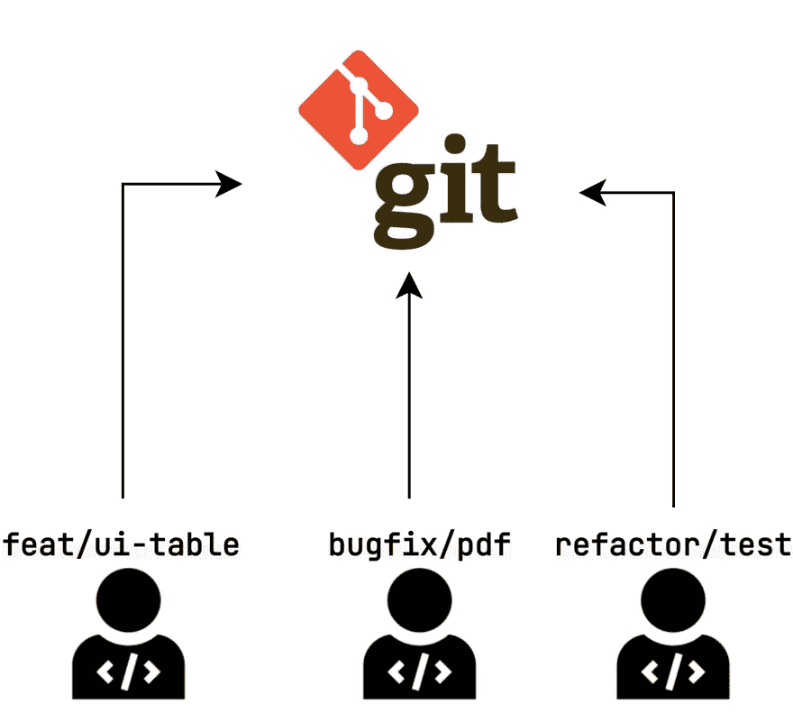
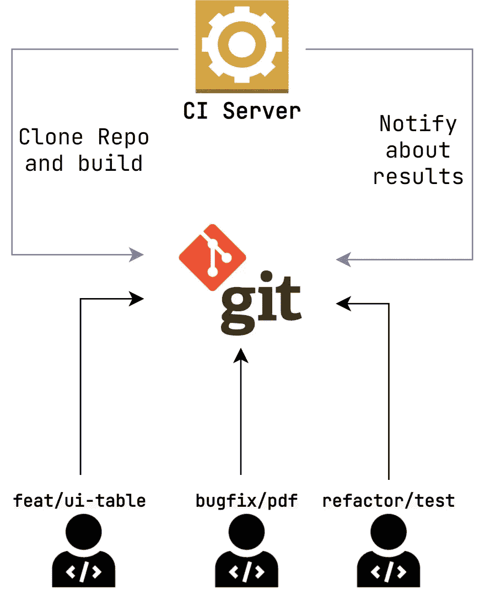
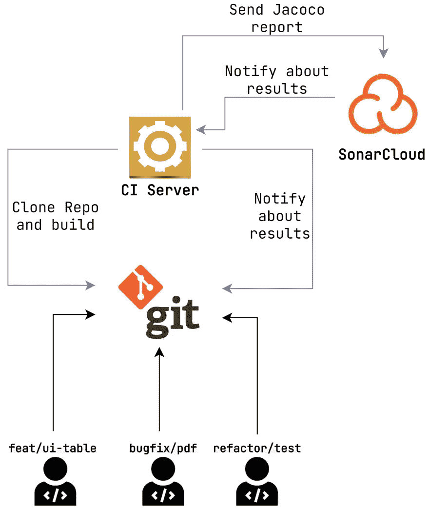
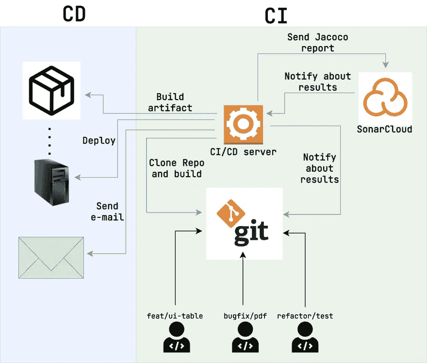

# CI/CD 基础

> 原文：<https://levelup.gitconnected.com/basics-of-ci-cd-a98340c60b04>

任何软件项目的主要目标都是通过业务流程的自动化来赚钱。你越快向客户发布新版本，对你的公司越有利。但是如何以一种*快速*的方式实现发布过程呢？你可以手动操作。例如，可以通过 SSH 连接到远程服务器。然后，您可以用新代码克隆存储库，构建它，并使用命令行运行它。虽然它确实有效，但这不是一个有效的方法。所以，今天我们讨论产品发布和开发过程本身的自动化。

CI 和 CD 是两个缩写，分别代表*持续集成*和*持续交付*。

# 海峡群岛

*持续集成*描述了变更流向存储库的过程。让我们来看一个简单的模式，它给出了一个团队开发的例子。

基本团队发展

一群人可以同时工作。但是所有的更改最终都会转移到`master`分支。无论如何，即使是这样一个简单的模型也引发了一些问题。

1.  我们怎么知道去`master`分支的代码编译了？
2.  我们希望开发人员为代码编写测试。我们如何验证[测试覆盖率](https://en.wikipedia.org/wiki/Code_coverage)没有减少？
3.  所有团队成员都应该用指定的代码样式格式化代码。我们如何检查可能的违规行为？

当然，所有描述的需求都可以手工验证。尽管这种方法非常混乱。更重要的是，当团队成长时，保持它变得更加困难。

CI 被用来自动化所陈述的提议。

先说第一点。我们如何检查即将到来的变化不会破坏构建？为此，我们的模式中需要另一个块。

基础 CI

大多数 CI 流程都可以根据该算法进行描述。

1.  在每次打开拉请求(以及推送新的变更)时，Git 服务器都会向 CI 服务器发送一个通知。
2.  CI 服务器克隆存储库，签出到源分支(例如，`bugfix/wrong-sorting`)，并与`master`分支合并。
3.  然后启动构建脚本。例如，`./gradlew build`。
4.  如果命令返回 0 代码，则构建成功。否则，它将被视为失败。
5.  CI 服务器将带有构建结果的请求发送给 Git 服务器。
6.  如果构建成功，那么就允许合并拉请求。否则，合并将被阻止。

该过程保证任何进入`master`分支的代码都不会破坏进一步的构建。

# 测试覆盖检查

让我们把任务变得更复杂。假设我们想要设置最小的测试覆盖率。所以，在任何时候，`master`分支的覆盖率都不能低于`50%`。 [Jacoco 插件](https://www.eclemma.org/jacoco/)可以轻松解决问题。如果测试覆盖值小于可接受的值，您只需要以使构建失败的方式来配置它。

方法实现是小菜一碟。但是它有一个警告。只有在项目启动后配置了插件，它才能工作。

想象一下，你正在开发一个已经有五年历史的产品。自从第一次提交以来，没有进行过测试覆盖检查。开发人员在没有任何纪律的情况下随机添加测试。但是有一天你决定增加测试次数。您调整 Jacoco 插件，使最小 bar 等于`60%`。过了一会儿，开发人员打开一个新的拉请求。然后他们突然意识到测试覆盖率只有`30%`。因此，为了成功地完成任务，必须至少覆盖产品代码的`30%`。正如你可能猜到的，对于这个历时五年的项目来说，这几乎是一个无法解决的问题。

如果我们只验证*即将到来的*代码变更，而不是整个产品，会怎么样？如果一个开发人员在 Pull 请求中修改了 200 行，他们将需要覆盖其中的至少 120 行(如果测试覆盖率栏等于`60%`)。但是没有必要遍历大量不属于该任务的模块。这可以解决问题。我们如何将它应用到项目中？谢天谢地，有一个解决方案。

带测试覆盖检查的 CI

Jacoco 报告被发送到测试覆盖服务器。

> [*sonar cloud*](https://sonarcloud.io/)*是最流行的解决方案之一。*

服务器保存以前计算的统计数据。计算即将到来的变化的测试覆盖率以及整个代码是有益的。然后，分析结果被发送到 CI 服务器，CI 服务器将其发送回 Git 服务器。

这个工作流程提供了一个在任何产品发展阶段应用强制测试文化的机会。因为只有新的更改被验证。

说到代码风格，没有太多不同。可以试试 [Checkstyle](https://checkstyle.sourceforge.io/) 插件。如果构建违反了任何规定的需求，它会自动失败。例如，代码可能有一个未使用的导入。此外，您可以查看运行代码分析并将结果显示为一堆图表的云服务(SonarCloud 也可以做到这一点)。

# 激光唱片

*连续交付*描述了新产品版本自动部署的过程。

让我们对 CI 模式进行一些更改。这就是 CI/CD 流程在实际项目中的样子。

CI/CD 流程

首先，CI 服务器现在命名为 *CI/CD 服务器*。事实上，CI 和 CD 作业通常都是由同一个任务管理器执行的。所以，我们正在研究这种方法。

> 虽然这不是规则。例如，可以将 CI 作业委托给[*git lab CI*](https://docs.gitlab.com/ee/ci/)*，将 CD 作业委托给*[*Jenkins*](https://www.jenkins.io/)*。*

模式的右边部分代表 CI。我们之前已经讨论过了。左边一张图片光盘。CD 作业构建项目(或者重用 CI 阶段生成的工件)并将其部署到最终服务器。

> 值得一提的是，服务器*在我们的例子中是一个抽象。例如，部署可能会进行到*[*Kubernetes*](https://kubernetes.io/)*集群。因此，可能有几个服务器。*

部署阶段完成后，通常会发送电子邮件。例如，CD 服务器可以通知订户成功或失败的部署。

反正有个重要的问题。我们应该何时运行 CD 作业？触发因素可能有所不同。

1.  在每个拉请求合并后部署。
2.  根据时间表进行部署。
3.  在每个拉请求合并到特定分支后部署。
4.  组合选项。

第一点设置流程，使 CI 和 CD 作业始终按顺序运行。这种方法在开源开发中相当流行。[语义发布](https://github.com/semantic-release/semantic-release)库帮助调优项目，透明地集成这个过程。

> *了解* `*deploy*` *的定义很重要。并不一定意味着某个地方正在推出什么东西。如果你开发一个库，那么就没有*推出*。相反，部署过程意味着新库版本的发布。*

第二点独立于 CI 流程。因为项目是根据一些预定义的时间表部署的。比如每天早上`01:00`的时候。

第三点和第一点类似。尽管存在差异。假设我们的存储库中有两个主要分支。`develop`分支和`master`分支。`develop`包含了最相关的变化。而第二个只有发行版。如果我们只需要部署`master`分支，就不需要在合并到`develop`时触发 CD 作业。

最后一点是所有方法的汇总。例如，`develop`分支可能会根据开发环境的时间表进行部署。并且`master`被部署到每个拉请求合并的生产中。

# 工具

市场提供了数十种自动化 CI/CD 流程的解决方案。让我们来看看其中的一些。

1.  詹金斯。世界上最受欢迎的 CI/CD 工具之一。由于它的开源政策，它变得如此受欢迎。所以，你什么都不用付。Jenkins 允许用 [Groovy](https://groovy-lang.org/) 强制性地描述构建管道。一方面，它提供了更多的灵活性。但另一方面，它需要更高的能力水平。
2.  [GitHub 动作](https://github.com/features/actions)。CI/CD 工具包含在 GitHub 和 GitHub Enterprise 中。与 Jenkins 不同，GitHub Actions 提供了带有 YAML 配置的声明性构建。此外，该解决方案还与不同的质量保证系统(例如 SonarCube)进行了大量集成。因此，可以用几行文字来描述这个构建。
3.  [GitLab CI](https://docs.gitlab.com/ee/ci/) 。它与 GitHub 操作非常相似。然而，它有自己的特点。例如，GitLab CI 可以指出构建失败的特定测试。
4.  [特拉维斯 CI](https://www.travis-ci.com/) 。云 CI/CD 服务。它提供了许多不需要复杂配置的功能。例如，应该隐藏在公共存储库中的数据的加密。此外，Travis CI 的好处是可以完全免费地应用于 GitHub、GitLab 和 BitBucket 开源公共项目。

# 结论

这就是我想说的关于 CI/CD 流程的基础知识。如果您有任何问题或建议，请在下面留下您的评论。感谢阅读！