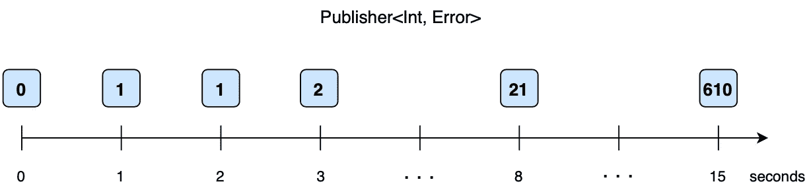

# 联合收割机框架的基础

> 原文：<https://levelup.gitconnected.com/basics-of-combine-framework-64dbd18da341>

## 带有图形示例


本文介绍了 Combine 的基础知识，这是一个框架，允许您编写可靠、安全且经过良好测试的异步代码。在这篇文章中，我们将集中讨论它的理论基础和关键点，并提供图形示例。在编写任何一行异步代码之前，这是必不可少的。

# **首先:异步代码**

如果我们查看苹果文档，我们会发现以下关于 Combine 的描述:*“通过组合事件处理操作符来定制异步事件的处理”。实际上这非常准确，但是如果你开始使用 Combine，它可能会有点复杂或抽象。这样，让我们从异步代码的概念开始。*

首先，同步运行的程序按顺序执行它的代码行。结帐如下例。只有一个执行线程，因此您很容易知道数据的状态。在这种情况下，输出将是`2`。

```
**var** myNumber = 1
myNumber+=1
print(myNumber)
```

现在创建前面代码的异步版本。在这种情况下，我们将随机安排代码行。代码在不同的内核上并发运行，因此我们每次执行代码时都会得到不同的结果。有时它打印`1`，有时打印`2`。

```
**var** myNumber = 1
**let** randomDeadline = .now() + Double.random(in: 1.0...5.0)
**let** anotherRandomDeadline = .now() + Double.random(in: 1.0...5.0)DispatchQueue.main.asyncAfter(deadline: randomDeadline) {
    myNumber+=1
}DispatchQueue.main.asyncAfter(deadline: anotherRandomDeadline) {
    print(myNumber)
}
```

**注意**:您可以在 Xcode Playground 中运行代码行来测试它。

# 处理异步代码的传统方式

到目前为止，Swift 为我们提供了几种处理异步事件的方法。我们已经有了一些功能，如闭包、作为委托或通知的设计模式，甚至其他框架(如 GCD)。

所有这些工具帮助我们正确地实现异步代码，同时我们遵循良好的实践。然而，当我们同时使用所有不同种类的异步 API 时，问题就来了。如下图所示的场景。


这些元素共享数据状态。在这种情况下，异步代码和资源共享会产生难以重现、追踪和最终修复的问题。

这就是 Combine 出现的地方，它提供了这些问题的解决方案。Combine 集成在 Swift 生态系统中，处理所有流程，以组织这种异步环境。所以让我们从基础开始。

# 组合要素

Combine 为我们提供了几个实现异步代码的元素，但主要的是:发布者、操作者和订阅者。将所有这些放在一起，我们可以制作函数链，将值从一个传递到另一个。这创建了从输入流向输出的*流*值。

## 出版商

它们可以随着时间的推移释放出价值。这些值由订户实例使用。通过这种方式，发布者可以发出以下几种类型的事件:

*   发布者的输出值，那是一个通用的`Output`类型。
*   成功的完成
*   错误完成。键入它可能发布的内容。

这些`Output`和`Failure`类型包含在发布者遵循的协议中。此外，请注意，发布者可以发出零个或多个`Output`值，但只能完成一次。一旦发送出去，发布者就结束它的活动。

除此之外，发布者实现了`receive(subscriber:)`方法来连接订阅者。换句话说，发布者的输出与订阅者的输入相匹配，对于失败类型也是如此。

例如，假设在一个发布器中，每秒钟都会发出一组斐波纳契数列。类似于:



## 经营者

在发布者协议上声明的特殊方法返回另一个发布者。它们有输入/输出和错误处理。除此之外，它们可以被组合(😉)制作运算符链来实现复杂的逻辑。

这种创建和连接异步元素的方式避免了数据的共享状态。那个问题以前评论过。

继续 Fibonacci publisher 的例子，我们可以有两个操作符将`<Int, Error>`输入转换为`<String, Never>`输出。那个`String`可以是斐波纳契数及其表示(即`"F(8) = 21"`):


**注意**:一个`Failure`是`Never`类型的发布者意味着它不会失败。

## 订阅者

任何这些出版商和运营商链最终都有一个订户。它接收这些值。Combine 提供两个内置订户:

*   `sink(receiveCompletion:receiveValue:)`:使用 os 闭包处理接收到的元素和完成事件。
*   `assign(to:on:)`:绑定在数据模型的属性或 UI 控件上接收的元素。该属性由密钥路径标识。


# 组合与传统方法

正如我们之前看到的，Swift 已经拥有足够的工具来开发能够正确处理所有与异步流程相关的应用程序。然而，和许多其他框架一样，Combine 为异步代码提供了额外的抽象。这个额外的一层比我们提出的任何其他解决方案都更加高效、安全且经过充分测试，原因如下:

*   Combine 是系统级的，所以它使用了我们作为开发者无法接触到的特性。
*   异步代码使用相同的接口。您可以轻松提高代码的组合性、可伸缩性和可重用性。
*   非组合方法意味着使用几种解决方案(闭包、委托、分派……)。将所有这些复杂性结合起来。
*   这种抽象是由操作者提供的。它们是高度可组合的，这使得我们可以轻松地实现复杂的逻辑。

# 结论

如您所见，Combine 为我们提供了许多关于当前解决方案的工具。此时，我们应该考虑将这个框架集成到我们的项目中。请注意，这并不意味着改变你的应用程序结构和删除所有已完成的工作。组合可以集成为部分和迭代的方式。

## 资源:

*   Combine:使用 Swift 进行异步编程([https://store . raywenderlich . com/products/combine-Asynchronous-Programming-with-Swift](https://store.raywenderlich.com/products/combine-asynchronous-programming-with-swift))
*   https://developer.apple.com/documentation/combine
*   [https://www . vadimbulavin . com/swift-combine-framework-tutorial-getting-started/](https://www.vadimbulavin.com/swift-combine-framework-tutorial-getting-started/)