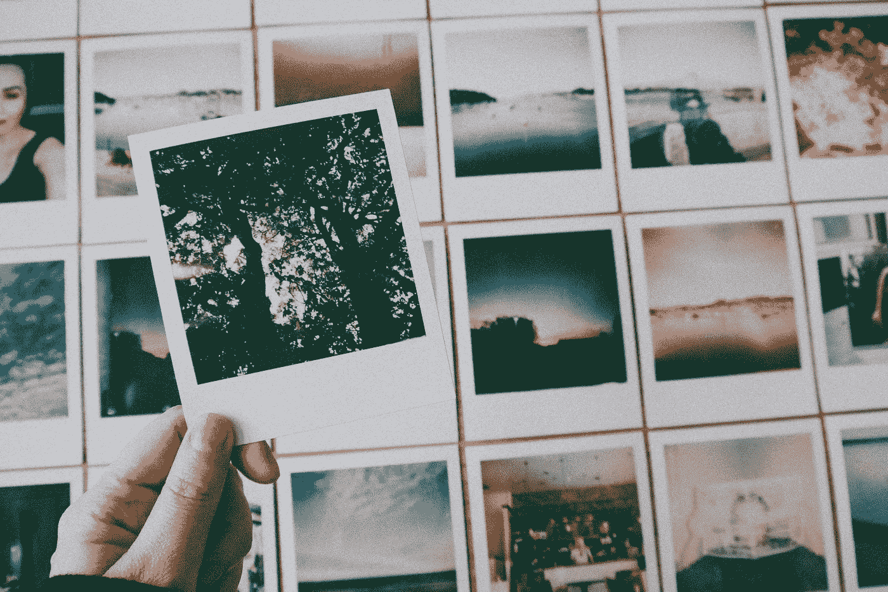
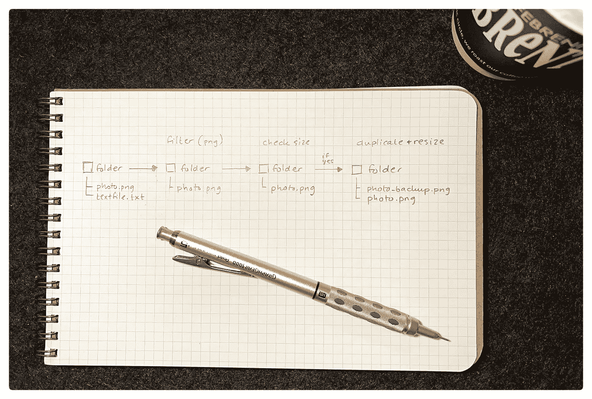
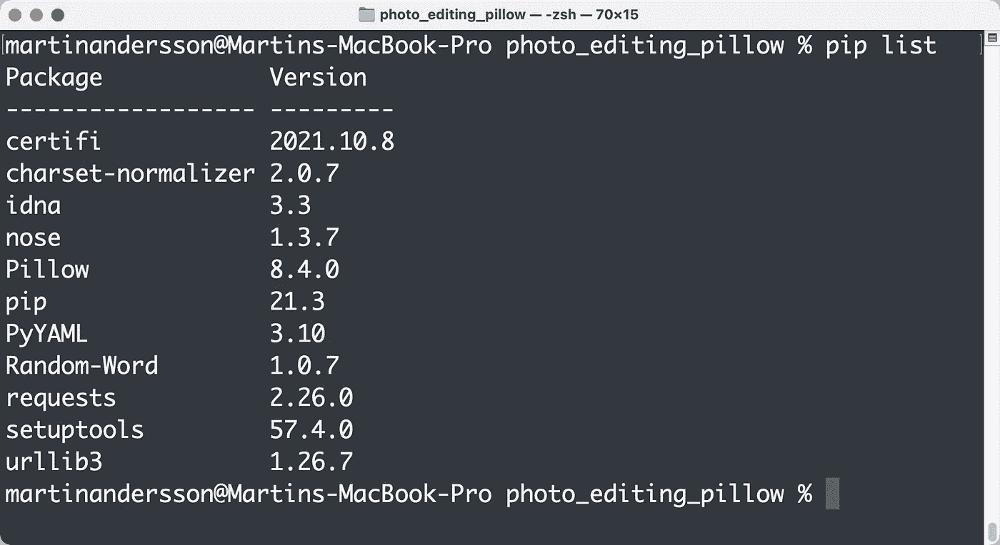
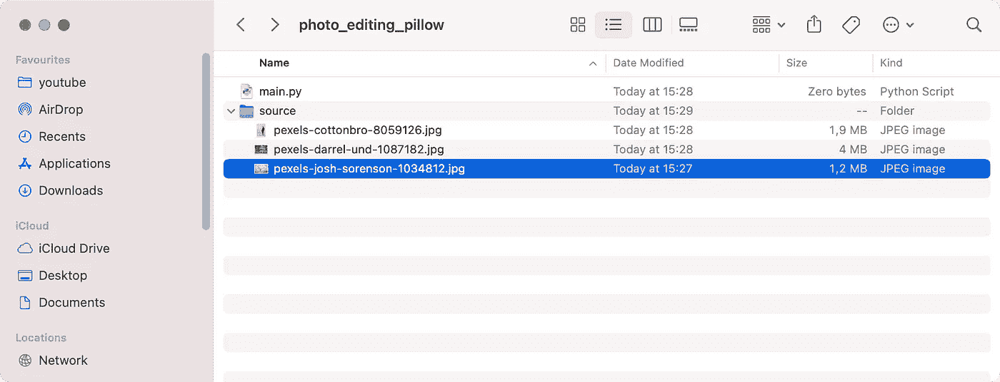
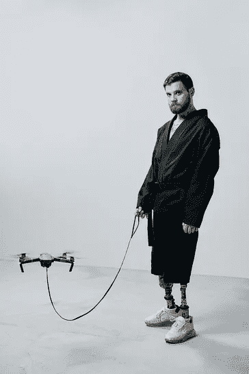
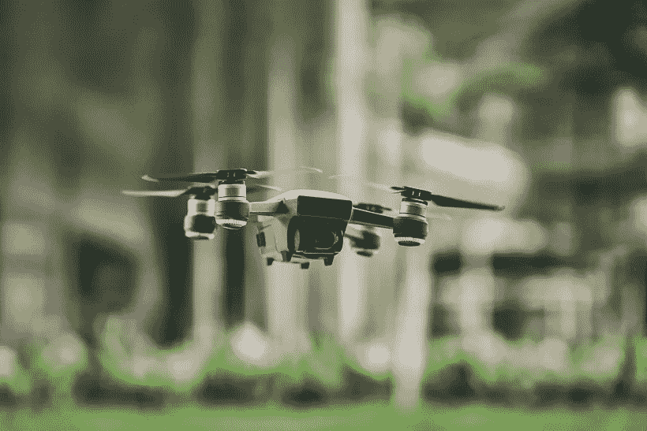
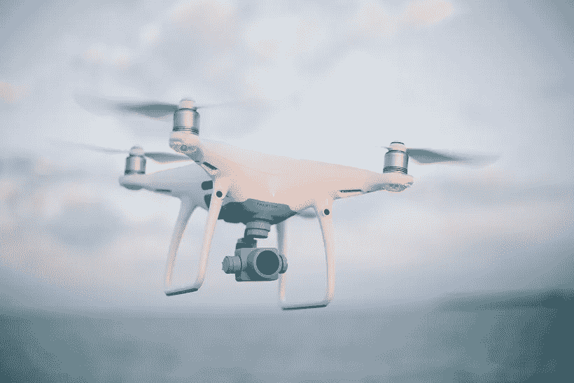
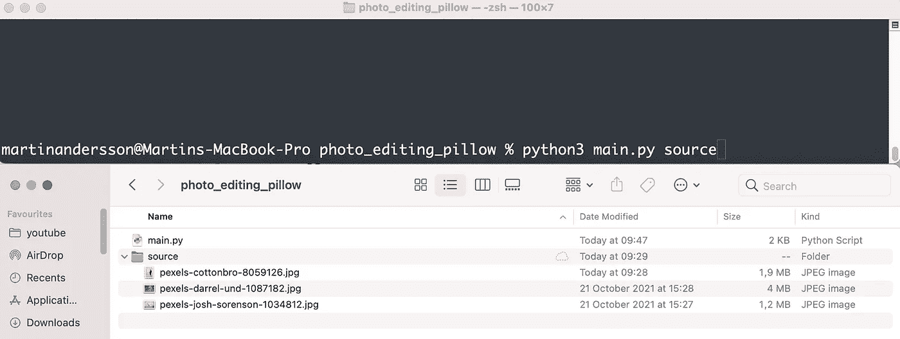

# 用 Python 批量编辑照片为我们节省了数千美元

> 原文：<https://levelup.gitconnected.com/batch-editing-photos-in-python-saved-us-thousands-of-dollars-9ca6a150992b>

## 人类是昂贵的——好的代码可以消除这一点



照片由 [Pexels](https://www.pexels.com/photo/silhouette-of-tree-photo-3024996/?utm_content=attributionCopyText&utm_medium=referral&utm_source=pexels) 的[丽莎](https://www.pexels.com/@fotios-photos?utm_content=attributionCopyText&utm_medium=referral&utm_source=pexels)拍摄

我负责一个电影项目，我们有很多数据，特别是纹理数据。我们使用大量的 png 图像在我们的视口中显示纹理。当我们渲染最终图像时，我们也使用相同的纹理。问题是动画师不能使用全分辨率纹理。他们需要一个代理版本。

在我们的例子中，源纹理都是 8k 的。分辨率为 8192x8192，磁盘上的文件大小在 60MB-100MB 之间，当您在工作文件中同时获得许多文件时，这显然很沉重。

在 Photoshop 中缩小图像没有问题。另一方面，我们的问题是我们有几百个这样的人。你总是可以使用 Photoshop actions 或类似的工具来完成工作，但拥有一个工具在未来肯定会很方便。

让我来介绍一下“**玛蒂娜的形象忍者**”或者任何我们能为这个工具想出的好听的名字。

# 简短的

像往常一样，我们需要一份简报。如果我们没有从客户那里得到一份简报，为你自己或你的团队做一份简报是一个很好的方式来勾画出项目需要什么。

我用伪代码来绘制我们需要的东西。

```
# load folder with images# check images based on criteria, store them for future reference# get scale based on user input# duplicate and rename images to keep a copy of the source (optional)# set scale and save image
```

如果我需要对正在发生的事情有一个更直观的描述，我会使用 Miro 或者在纸上画出这个工具。简报应该是这样的:



工具的时间线，作者照片

在本文中，我们将使用 Python 3.10。有了这个准备，我们就开始吧。

# 安装枕头

当处理图像时，我们可以使用一个名为 Pillow 的伟大模块。

Pillow 基于停产的 PIL 模块，如果你正在使用 Python 3。x，你应该给枕头一个机会。

要安装 Pillow，只需像这样进行 pip 安装:

```
pip3 install pillow
```

如果您不确定您的系统上安装了什么，或者想要查看您的版本，您可以像这样使用 pip install:



使用 pip install 检查 pillow 是否已安装，作者截图

# 准备图像

在这篇文章中，我们将使用一些来自 Pexels.com 的随机照片。我在代码中注明了摄影师。

为了使它成为一个多用途的工具，我想把这些照片收集到一个不同的文件夹中，告诉这个工具去哪里找。我们可能想要创建一些递归地查看文件夹结构的东西，以确保它抓取所有可能需要处理的文件。然而，这对我们的项目来说太冒险了，所以我想让用户告诉我们在哪里寻找工具的第一次迭代。我们不能让一些源文件被覆盖或类似疯狂的事情。

这里是无人机相关的照片，我将用于该项目和我要去的结构。不幸的是，我们的纹理图像在 NDA 下，还不能公开显示。



文件和文件夹结构的截屏，按作者截屏



照片由来自 Pexels 的 Josh Sorenson、Darrel Und 和 cottonbro 拍摄

# 代码

我喜欢先发布完整的代码，然后再浏览幕后发生的事情。今天也不例外。

## 进口:

这个项目我们需要一些进口货。

*   pathlib 来获取我们需要使用的所有文件。
*   操作系统分割扩展(有许多方法可以做到这一点，但今天我们这样做)
*   图片来自 PIL。这是用枕头

## def get_images(path，legal_ext):

这个函数返回一个在我们告诉它要查看的文件夹中找到的文件列表。不过，它只会返回我们正在寻找的文件。因此，我们可以使用`legal_ext`来过滤出我们想要的文件类型。

文件在文件夹中工作，并以字符串格式存储所有文件名。

`image_files`可能看起来有点吓人，但这也是一个很长的理解列表。只要在`legal_ext`中找到图像文件的扩展名，它就会将所有图像文件存储在一个名为`image_files`的列表中。

`os.path.splitext(image)`将返回`filename`和`.ext`。当我们说`[1][1:]`时，我们只得到不带点的 ext。然后，我们检查是否在`legal_ext`元组中找到了该扩展。

如果您仍然不确定这是如何工作的，请考虑以下几点:

```
image = superimage.png
filename,ext = splitext(image) --> (superimage,.png)
ext = .png
ext[1:] = png#since splitext() creates a tuple we can access this directly:
splitext(image)[1][1:] # where [1] is the ext and [1:] removes the .we add a .lower in there so we don't have to deal with jpg/JPG issues.
```

## def duplicate_work_files(源列表，标识符):

我们不想直接在我们的图像上工作，所以我们复制它们并添加一个标识符，比如“_original”或类似的标识符，以将全分辨率图像与新图像分开。

我们希望保留文件名，这样引用就不会中断。想象一下，如果一个艺术家在用一张名为“supergreat.png”的照片。我们仍然希望艺术家使用该文件名，但我们想调整它的大小。因为我们不想直接在照片上编辑(出于备份原因)，所以我们将其复制到“supergreat_bacckup.png”。现在我们有两个文件仍然是完整的。调整原始文件的大小是安全的，如果需要，仍然可以访问备份文件。

## 定义过滤器 _ 图像(图像 _ 源，最小 _ 宽度，最小 _ 高度):

我们需要满足特定的标准来处理照片。在我们的例子中，它需要大于给定的 8k 大小。

`image_source`参数是文件列表。`min_width`和`min_height`告诉我们在这些轴中寻找更大的图像。

该函数使用两种列表理解。`image_objects`创建列表中所有图像的图像对象。这样我们就可以开始使用 Pillow 处理图像了。

`filtered_on_size`创建新列表。如果循环中的图像符合大小标准，它将存储在此列表中。这也是函数返回的内容。

## def resize_images(image_source，size):

这个过程处理图像的大小调整。因为我们希望统一调整它的大小，所以我们使用缩略图方法。这样，它将调整图像的大小，从而将最大的参数(宽度或高度)设置为给定的大小。如果图像是 4096x1024，我们希望将其大小调整为 2048，则新的大小是 2048x512。

我们使用`.thumbnail(size)`来改变图像的大小。然后，我们使用`.save(image.filename)`以相同的名称保存文件，有效地完成了一次保存。

## def main():

这是我们告诉程序开始调整大小的地方。

首先，我们将有效的扩展存储在`texture_ext`中。作为用户，您可以在这里决定要处理哪些文件。如果你有原始的`exr`文件并且不想编辑`png`代理，你只需要在这里添加`exr`。

然后我们使用`images_to_process`功能处理图像。

注意`sys.argv[1]`的说法。通过这样做，我们可以在使用程序时使用任何我们喜欢的文件夹。这里有一个例子来说明我们如何在我们的案例中使用它。



argv[1]允许我们使用任何我们喜欢的文件夹，截图由作者

我们根据过滤器复制我们的文件。滤镜让您决定图像的大小。

我们做的最后一件事是调整剩余图像的大小。

# 最后的想法

尽管这是我们的一个特定用例，但您可能需要一些不同的东西。枕头很棒，因为你可以用它做比我们今天在这里做的更多的事情。

如果你在一个网站上工作，需要一个拍摄的个人资料照片，你可以得到源文件，并缩小它们的缩略图。它不必就此停止。如果你愿意，你也可以制作灰度版本。

请务必深入阅读文档，看看可以用这个库做些什么。也许你会找到有用的东西。

一天下来，我们通过编写一个小脚本节省了数千美元。

马丁