# BatchData API:使用 Python 跳过属性追踪主页所有者

> 原文：<https://levelup.gitconnected.com/batchdata-api-property-skip-trace-home-owners-using-python-512ebf848136>

艾米·芬利在 [LoveToKnow](https://best.lovetoknow.com/Best_Free_People_Finder) 上的照片

我们如何找到好的投资机会？最好的交易来自于找到 ***有积极性的卖家*** 。

积极的卖家拥有 ***在维护或付款方面被忽视的不良资产*** 。这些房产 ***折价出售*** 。

为了联系这些 ***有动机的卖家*** 我们需要执行 ***跳过追踪。***

跳过跟踪获取财产所有者的信息，如电话号码、电子邮件和地址。我们可以直接联系业主，达成交易。

在本文中，我们将介绍如何通过 Python 使用 BatchData API 来跳过跟踪属性以获取所有者联系数据。

## 什么是跳过跟踪？

照片由[马丁纽霍尔](https://unsplash.com/@laughayette)在 [Unsplash](https://unsplash.com/photos/uAFjFsMS3YY) 上拍摄

> 在房地产中，跳过跟踪是指查找房产所有者的过程。
> 
> 房地产投资者通常会使用跳过跟踪来寻找好的投资机会。
> 
> 这是因为不良资产有时会被其所有者遗弃或搁置起来留待以后处理。——[*格克切资本*](https://gokcecapital.com/skip-tracing-real-estate/#:~:text=In%20real%20estate%2C%20skip%20tracing,to%20be%20dealt%20with%20later.)

## 跳过追踪合法吗？

是的。在美国，跳过追踪获取公开信息是合法的。

## ***框架***

作者在谷歌幻灯片中创建的图片

1.  **寻找有积极性的卖家。**有动机的卖家是**想要或者需要销售**的人。他们以折扣价出售房产，并很快成交。例如，提前取消抵押品赎回权、离婚、拖欠税款和业主不在的财产。这些列表可以在像 [PropStream](https://trial.propstreampro.com/analyticsariel/) 这样的网站上找到。
2.  **找到业主**。业主信息可在您当地的县网站上找到。我们将为此使用 BatchData API。
3.  **联系业主**。这里是跳过跟踪的棘手部分！我们需要找到准确的业主联系信息。我们将为此使用 BatchData API。
4.  **达成交易**。我们的目标是将积极的销售线索转化为合格的销售线索，并最终转化为交易。

## 问题陈述

我们是房地产投资者，正在寻找可以转手的房产。

我们想以折扣价购买房产。这将使我们在修理后获得更大的利润。

我们的营销列表包含我们地区的**不在酒店**。

对于营销列表中的每个酒店，我们需要找到:

1.  业主的全名
2.  业主联系信息(电话、电子邮件、家庭住址)

我们将使用 BatchData API 来检索这些信息。

## 先决条件

1.  你自己的 Python 环境或者谷歌账户。
2.  【BatchData 的免费账户

在本教程中，我们将使用来自 BatchData 的*免费*模拟数据。

## 支持视频

跟随我的 Python 教程视频。

作者在 YouTube[上制作的视频](https://youtu.be/6r3j7E3MfPs)

## Python 教程

如果您没有现有的 Python 环境，那么我强烈建议首先**克隆笔记本**(在文章的底部)。

这将允许您在 Google Colab 中运行 Python 代码(免费！).它是一个基于云的环境，让您无需在本地安装 Python 就可以运行代码。

# I .导入库

接下来，导入所需的库。

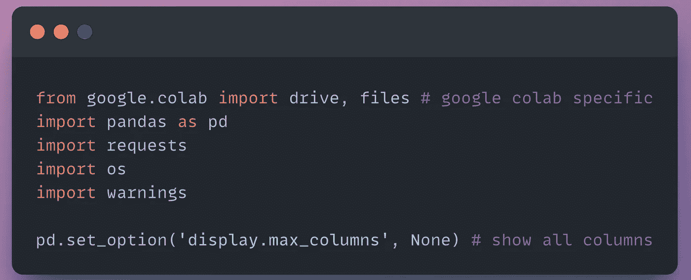

导入的代码片段(作者使用 snappify.io 创建的图片)

# 二。局部变量和常量

在 [BatchData 入门指南](https://developer.batchdata.com/docs/batchdata/beff8ca9e3a8d-getting-started)中创建一个*模拟* API 键。

创建一个变量来保存我们的 API 键。

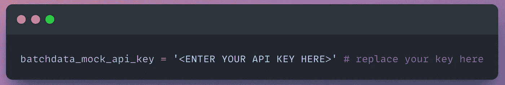

API 键的代码片段(作者使用 snappify.io 创建的图片)

# 三。数据

## 跳过所有者数据的跟踪属性

我们将为属性所有者数据调用 [BatchData 属性跳过跟踪端点](https://developer.batchdata.com/docs/batchdata/a45e094c668b1-property-skip-trace)。对于我们的例子，我们将使用模拟数据。

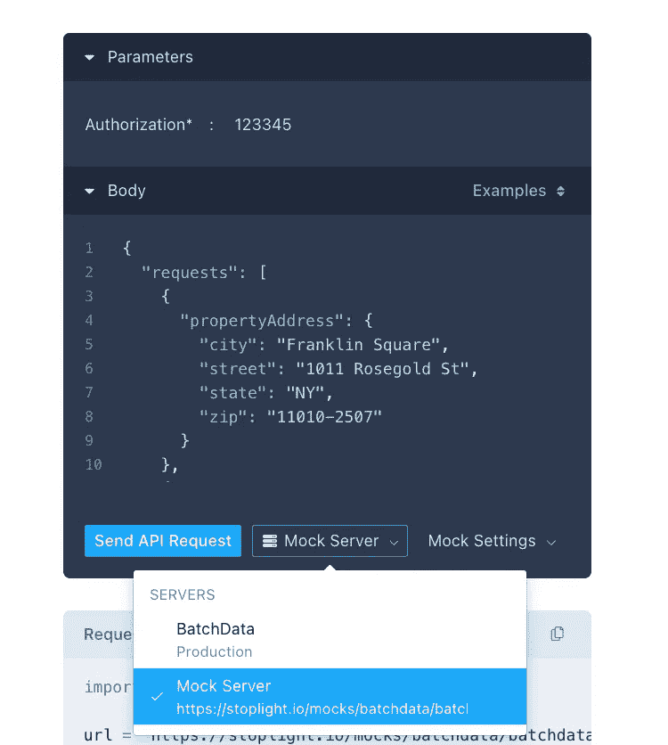

图片作者(截图来自 [BatchData](https://developer.batchdata.com/docs/batchdata/a45e094c668b1-property-skip-trace) )

***让我们向 API 发出一个请求，获取我们的属性地址的数据。***

这里我们传入一个单一的属性地址:街道、城市、州和邮政编码。

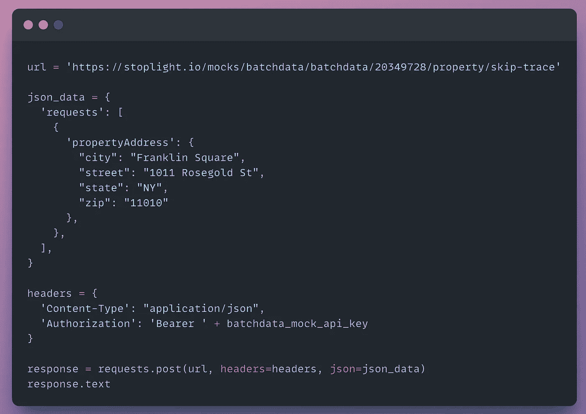

API 调用的代码片段(作者使用 snappify.io 创建的图片)

该响应包含关于资产所有者及其联系信息的信息。

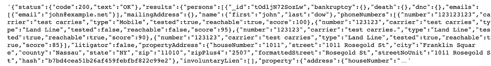

代码输出(作者创建的截图)

***让我们将这个响应转换成 JSON 格式，以提高可读性。***

JSON 响应的代码片段(作者使用 snappify.io 创建的图片)

现在，我们的数据由键/值对构成。

我们可以看到“电子邮件”和“电话号码”是我们数据集中的关键字。

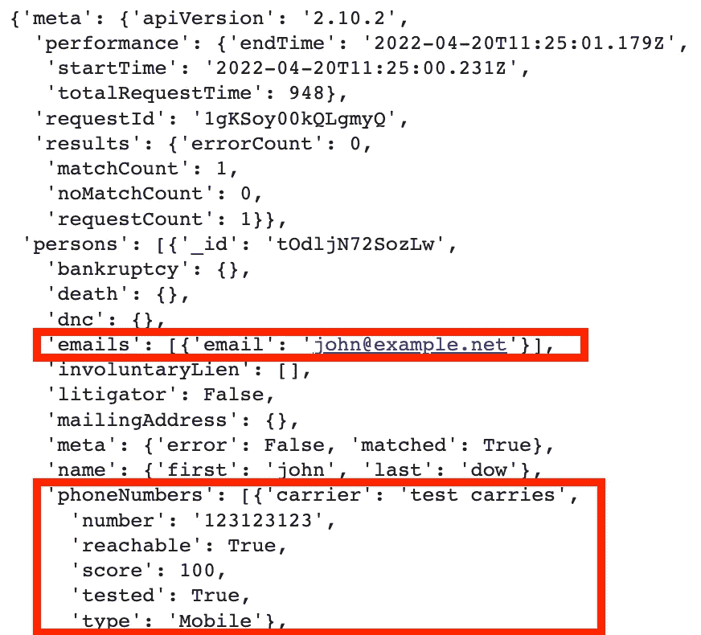

代码输出(作者创建的截图)

***让我们将数据集从 JSON 对象转换成包含行和列的 DataFrame。***

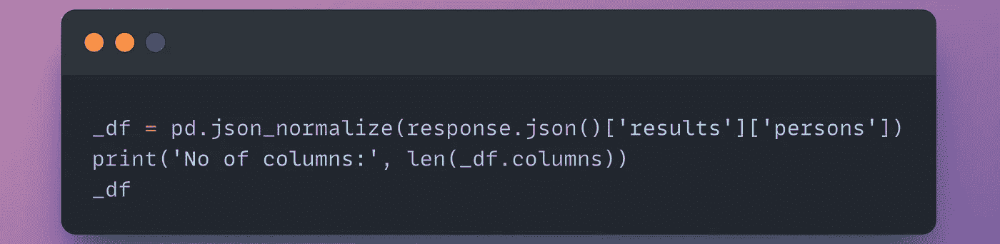

DataFrame 的代码片段(作者使用 snappify.io 创建的图片)

我们的数据集包含 50 列。

“电子邮件”和“电话号码”联系人数据嵌套在列表中。

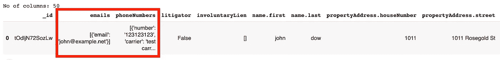

代码输出(作者创建的截图)

***让我们查看电话号码，只提取有效号码。***

## 验证电话号码

将我们的电话号码数据转换成表格。

DataFrame 的代码片段(作者使用 snappify.io 创建的图片)

这里我们可以看到我们的模拟数据为我们的财产所有者返回了四个可能的电话号码。

每个电话号码都包含属性，包括*可达*和*分数*。

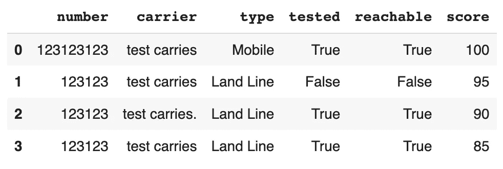

代码输出(作者创建的截图)

让我们把我们的电话号码精简为有效的号码。

这将节省我们的时间和金钱，只关注最有可能与业主相关的联系数据。

这里我们过滤 *reachable = True* 和 *score ≥90* 。

此外，为了映射回模拟数据集，我们更改了我们的数字。

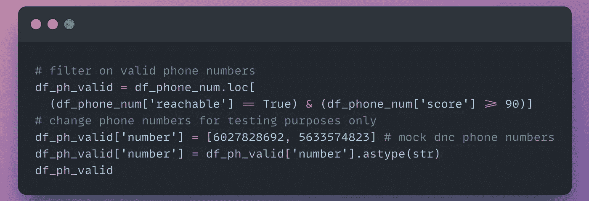

DataFrame 的代码片段(作者使用 snappify.io 创建的图片)

我们的*有效电话号码*减少到两个号码。

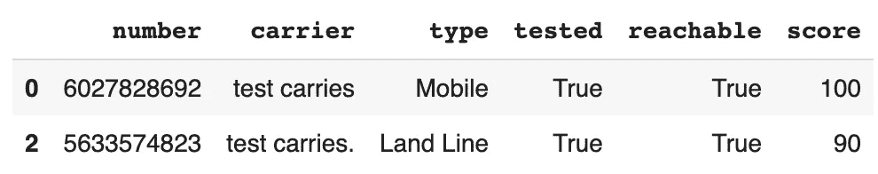

代码输出(作者创建的截图)

## 确认 DNC 状态

在我们联系业主的过程中，我们必须遵守美国法律，不要联系 DNC 列表中的电话号码。

> 国家不打电话登记处是由美国政府维护的数据库，列出了要求电话销售人员不要联系他们的个人和家庭的电话号码。——[*维基百科*](https://en.wikipedia.org/wiki/National_Do_Not_Call_Registry#:~:text=The%20National%20Do%20Not%20Call,law%20to%20respect%20this%20request.)

BatchData 提供了一个 API 来检查潜在客户的电话号码是否在 DNC 列表中— [BatchData 电话 DNC 状态](https://developer.batchdata.com/docs/batchdata/c760ba61020c6-phone-dnc-status)。

在 API 端点中，我们将选择模拟数据。

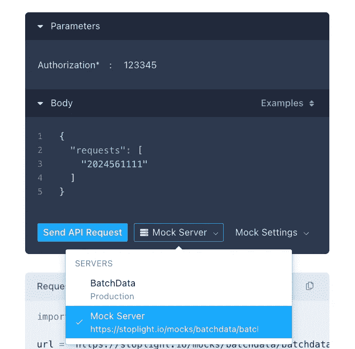

图片由作者提供(截图来自 [BatchData](https://developer.batchdata.com/docs/batchdata/c760ba61020c6-phone-dnc-status)

***让我们从数据帧中传递有效的电话号码，并调用 API 来检查它们是否在 DNC 列表中。***

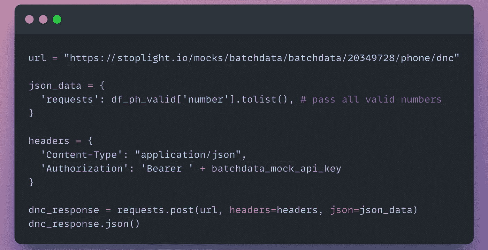

API 调用的代码片段(作者使用 snappify.io 创建的图片)

我们收到电话号码和相关数据的响应。

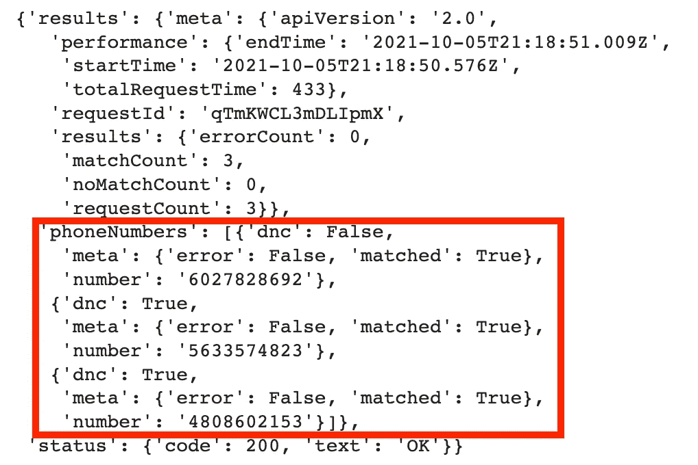

代码输出(作者创建的截图)

***让我们在数据帧中查看我们的电话号码数据并解析它。***

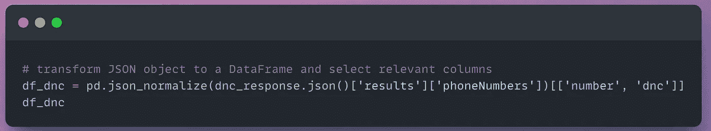

DataFrame 的代码片段(作者使用 snappify.io 创建的图片)

我们的相关栏目是*号*和 *dnc* 。

如果 *dnc* = True，那么我们无法联系到业主。

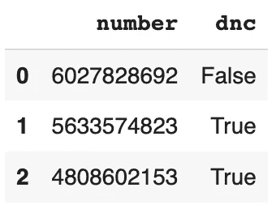

代码输出(作者创建的截图)

***让我们将我们的有效电话号码数据框与我们的 DNC 列表连接起来，以确认我们可以联系哪些号码。***

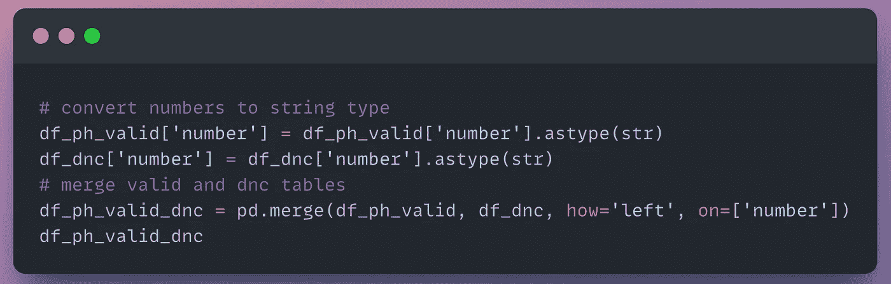

DataFrame 的代码片段(作者使用 snappify.io 创建的图片)

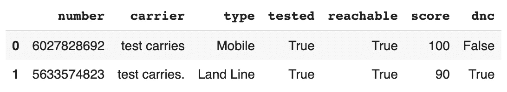

代码输出(作者创建的截图)

根据 *DNC* = False 进行过滤，以获得可联系的有效号码。

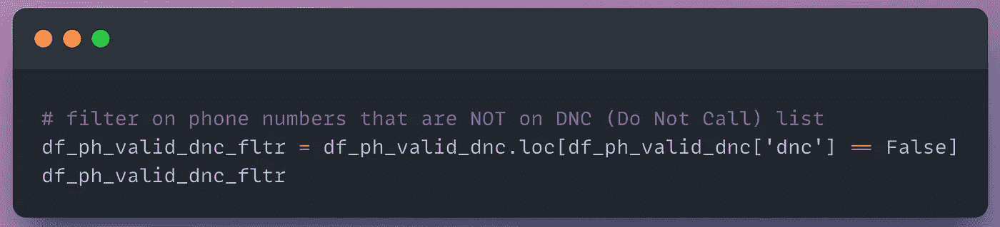

DataFrame 的代码片段(作者使用 snappify.io 创建的图片)

我们的*有效电话号码表*减少到一个号码。

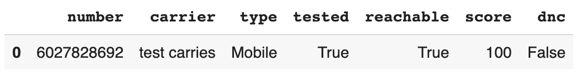

代码输出(作者创建的截图)

# 四。转换

我们希望将有效的电话号码追加到原始数据帧中。

***让我们通过为每个*** 添加一个额外的列来设置我们的脚本来处理多个有效的电话号码。

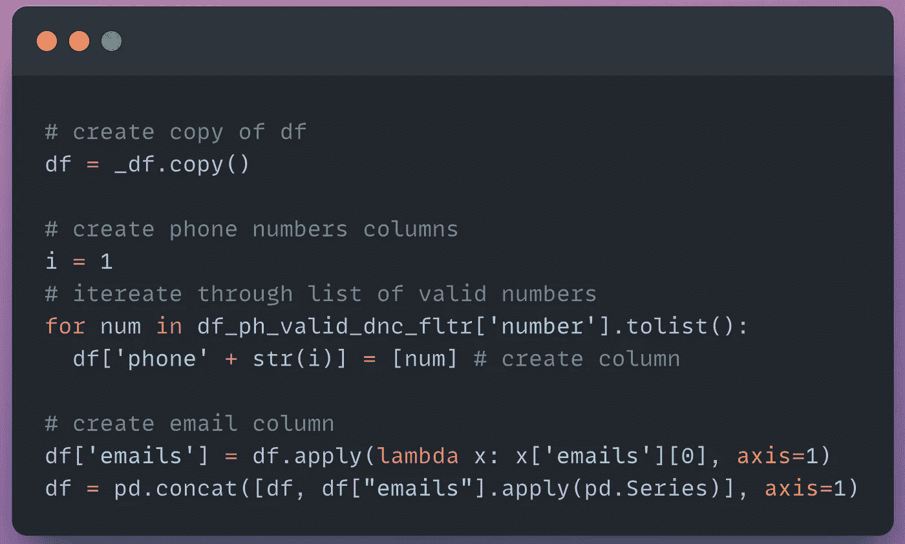

DataFrame 的代码片段(作者使用 snappify.io 创建的图片)

***让我们根据相关列进一步过滤数据集。***

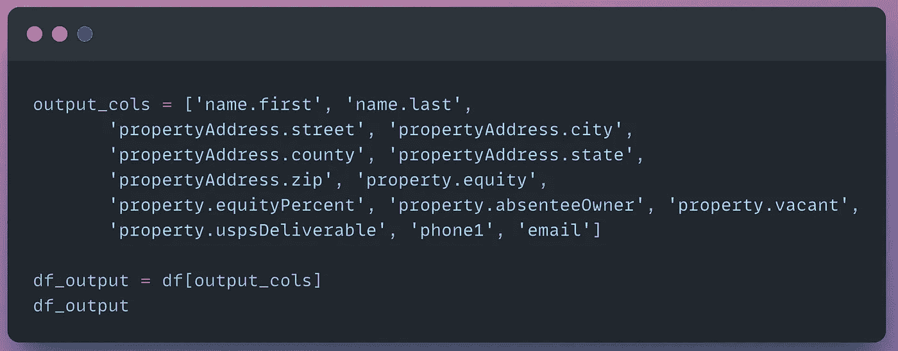

DataFrame 的代码片段(作者使用 snappify.io 创建的图片)

我们简化的数据框架有三个组成部分:

1 —财产所有者和所有者地址数据

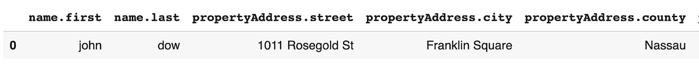

代码输出(作者创建的截图)

2 —股权和居住身份

在这里，我们可以确认所有者不在-property . absent e owner= True。

*property . empty =*False。我们可以假设这是一个出租物业，业主是房东。

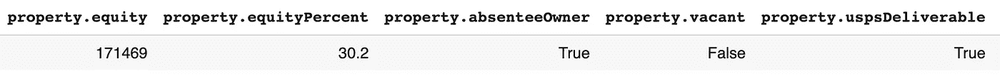

代码输出(作者创建的截图)

3 —有效的电话号码和电子邮件

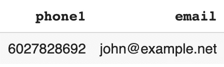

代码输出(作者创建的截图)

太好了，我们现在可以通过电话或电子邮件联系这个地址的业主了！

# 结论

直接联系有积极性的卖家是打折购买房产的好方法。

BatchData 通过使用它们的属性 Skip Trace API 使之变得容易。

这个工作流可以在 CRM 系统中进一步自动化，或者使用像 Zapier 这样的工作流工具。

查看我的 [YouTube 频道——analytics Ariel](https://youtube.com/c/analyticsariel),了解更多关于房地产数据源和数据分析的信息！

# 克隆笔记本

 [## 主 analyticsariel/projects 上的 projects/batch data _ skip _ tracing _ mock _ data . ipynb

### https://analyticsariel.com/.通过在 GitHub 上创建帐户，为 analyticsariel/projects 开发做出贡献。

github.com](https://github.com/analyticsariel/projects/blob/master/skip_tracing/batchdata_skip_tracing_mock_data.ipynb) 

# 来源

 [## 入门|批处理数据

### 欢迎来到 BatchData。这份文件将概述一切需要开始与您的帐户和制作 API…

developer.batchdata.com](https://developer.batchdata.com/docs/batchdata/beff8ca9e3a8d-getting-started)  [## 全国不打电话登记处

### 编辑描述

www.donotcall.gov](https://www.donotcall.gov/)  [## 跳过跟踪属性所有者

### 一些房地产业主很难找到，信不信由你，这是一件好事！你看他们是不是很难找…

www.thewholesalerstoolbox.com](https://www.thewholesalerstoolbox.com/skip-tracing.html)