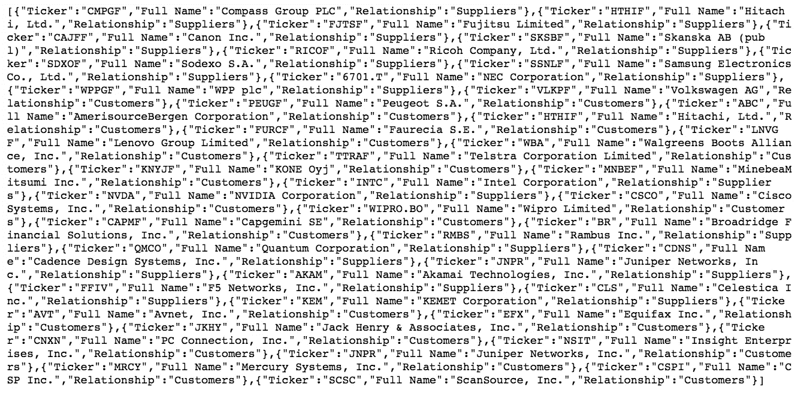
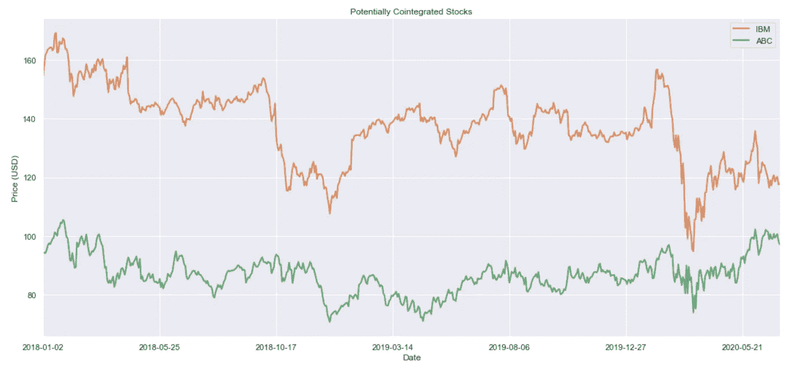
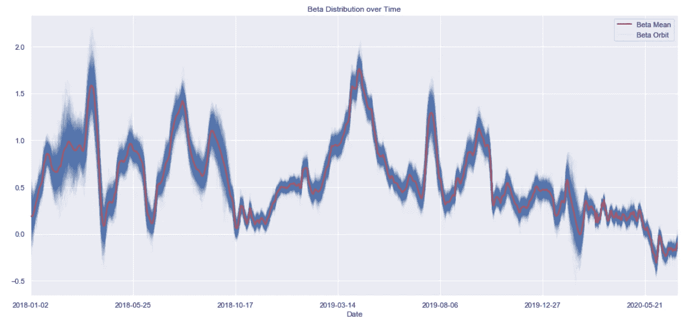
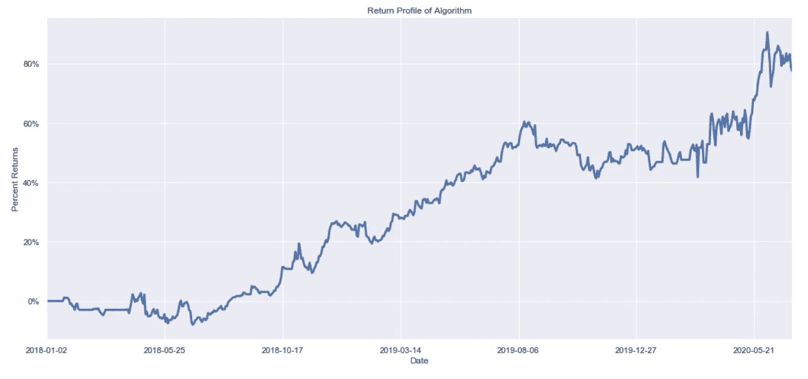

# 使用企业供应链数据的贝叶斯对交易

> 原文：<https://levelup.gitconnected.com/bayesian-pairs-trading-using-corporate-supply-chain-data-8b96305686d>

## 使投资者能够为给定的企业供应链构建套期保值和统计套利策略。

# 介绍

配对交易是统计套利的经典方法，有着悠久的历史。确定配对交易的传统方法是通过 frequentist 统计协整检验，如 Engle-Granger 两步检验。

在这里，我们提出了一个更复杂的贝叶斯方法来使用概率规划进行配对交易，这是贝叶斯机器学习的一种形式。与更简单的 frequentist 协整检验不同，我们的贝叶斯方法允许我们随着时间的推移监控一对股票之间的关系，这允许我们跟踪协整参数稳定或突然变化的股票对。当结合一个简单的均值回归交易算法，我们证明这是一个可行的理论交易策略，为进一步的评估和风险管理做好准备。

优秀配对交易候选人的一个潜在来源是企业供应链。找到一家公司的实际供应商和客户往往非常困难。许多公司不想向他们的竞争对手透露这些信息。利用混合数据源来提供公司供应链生态系统的完整画面， [AlphaWave Data 公司供应链 API](https://rapidapi.com/alphawave/api/corporate-supply-chain/endpoints) 使投资者能够为给定的公司供应链构建对冲和建立统计套利策略。详细描述这一分析的 Jupyter 笔记本也可以在 [Google Colab](https://colab.research.google.com/drive/1e_SiiZn7WEW3OUNG-ftN3riPNjiz0M0C?usp=sharing) 和 [Github](https://github.com/AlphaWaveData/Jupyter-Notebooks/blob/master/AlphaWave%20Corporate%20Supply%20Chain%20API%20Example.ipynb) 上获得。

# 软件

对于这个项目，我们使用了几种基于 Python 的科学计算技术，并使用了股票回溯测试引擎以及 [AlphaWave 数据公司供应链 API](https://rapidapi.com/alphawave/api/corporate-supply-chain/endpoints) 。

```
import json
import requests
import pymc3 as pm
import numpy as np
import pandas as pd
import theano as th
import seaborn as sns
import sklearn.decomposition
import matplotlib.pyplot as plt
%matplotlib notebook
sns.set()import warnings
warnings.filterwarnings('ignore')
```

# 配对交易的股票选择

因为我们的目标是建立一个 pairs 交易算法，一个共同整合股票的潜在来源是公司供应链。使用 [AlphaWave 数据公司供应链 API](https://rapidapi.com/alphawave/api/corporate-supply-chain/endpoints) ，我们可以获得给定股票代码的供应商和客户列表。要用 Python 调用这个 API，可以选择 API 控制台中提供的一个受支持的 Python 代码片段。下面是一个如何用 Python 请求调用 API 的例子。您需要在下面的代码块中插入您自己的 **x-rapidapi-host** 和 **x-rapidapi-key** 信息。

```
url = "[https://corporate-supply-chain.p.rapidapi.com/api/v1/resources/supplychain](https://corporate-supply-chain.p.rapidapi.com/api/v1/resources/supplychain)"querystring = {"ticker":"IBM"}headers = {
    'x-rapidapi-host': "YOUR_X-RAPIDAPI-HOST_WILL_COPY_DIRECTLY_FROM_RAPIDAPI_PYTHON_CODE_SNIPPETS",
    'x-rapidapi-key': "YOUR_X-RAPIDAPI-KEY_WILL_COPY_DIRECTLY_FROM_RAPIDAPI_PYTHON_CODE_SNIPPETS"
    }response = requests.request("GET", url, headers=headers, params=querystring)print(response.text)
```

输出:



```
# Create DataFrame.  
df = pd.DataFrame.from_dict(response.json())
df
```

输出:


就是这样！

现在，对于给定的股票代码(本例中为 IBM)，您在 pandas 数据框架中有了一个供应商和客户列表。如果您愿意，您可以使用基本面数据、技术指标或其他替代数据来源进一步筛选供应商和客户列表，以获得良好的配对交易候选列表。

在这个例子中，我们将选择 IBM 的客户 ABC 来继续我们的 pairs trading 分析。

# 市场数据

为了这次探索，我们从金融数据供应商 [IEX 云](https://iexcloud.io/)获取了几年的每日收盘数据。您需要在下面代码块中的 **YOUR_IEX_API_KEY_HERE** 占位符中插入您自己的 IEX API 密钥。

```
IEX_API_Key = 'YOUR_IEX_API_KEY_HERE'tickers = [ 'IBM', 'ABC', ]#Create an empty string called `ticker_string` that we'll add tickers and commas to
ticker_string = ''#Loop through every element of `tickers` and add them and a comma to ticker_string
for ticker in tickers: 
    ticker_string += ticker 
    ticker_string += ',' 

#Drop the last comma from `ticker_string`
ticker_string = ticker_string[:-1]#Create the endpoint and years strings
endpoints = 'chart'
years = '5'#Interpolate the endpoint strings into the HTTP_request string
HTTP_request = f'[https://cloud.iexapis.com/stable/stock/market/batch?symbols={ticker_string}&types={endpoints}&range={years}y&cache=true&token={IEX_API_Key}'](https://cloud.iexapis.com/stable/stock/market/batch?symbols={ticker_string}&types={endpoints}&range={years}y&cache=true&token={IEX_API_Key}')#Send the HTTP request to the IEX Cloud API and store the response in a pandas DataFrame
stock_data = pd.read_json(HTTP_request)#Create an empty list that we will append pandas Series of stock price data into
series_list = []#Loop through each of our tickers and parse a pandas Series of their closing prices over the last 5 years
for ticker in tickers: 
    series_list.append(pd.DataFrame(stock_data[ticker]['chart'])['close'])#Add in a column of dates
series_list.append(pd.DataFrame(stock_data['IBM']['chart'])['date'])#Copy the 'tickers' list from earlier in the script, and add a new element called 'Date'. 
#These elements will be the column names of our pandas DataFrame later on.
column_names = tickers.copy()
column_names.append('Date')#Concatenate the pandas Series togehter into a single DataFrame
stock_data = pd.concat(series_list, axis=1)#Name the columns of the DataFrame and set the 'Date' column as the index
stock_data.columns = column_names
stock_data.set_index('Date', inplace = True)stock1_name, stock2_name = 'IBM','ABC'
orig_data = stock_data.loc['2018-01-01':,]
data = orig_data.diff().cumsum()
data1 = data[stock1_name].ffill().fillna(0).values
data2 = data[stock2_name].ffill().fillna(0).valuesplt.figure(figsize = (18,8))
ax = plt.gca()
plt.title("Potentially Cointegrated Stocks")
orig_data[stock1_name].plot(ax=ax,color=sns.color_palette()[1],linewidth=2)
orig_data[stock2_name].plot(ax=ax,color=sns.color_palette()[2],linewidth=2)
plt.ylabel("Price (USD)")
plt.legend()
plt.show()
```



# 贝叶斯建模

我们的股票贝叶斯模型不会固有地对两只股票的整合顺序做出假设。但是，作为一个简化的假设，我们将假设一对协整股票的某种线性组合本身是平稳的，并且是正态分布的。

使用 PyMC3 语法，我们得到以下模型描述:

```
with pm.Model() as model:

    # inject external stock data
    stock1 = th.shared(data1)
    stock2 = th.shared(data2)

    # define our cointegration variables
    beta_sigma = pm.Exponential('beta_sigma', 50.)
    beta = pm.GaussianRandomWalk('beta', sd=beta_sigma,
                                 shape=data1.shape[0])

    # with our assumptions, cointegration can be reframed as a regression problem
    stock2_regression = beta * stock1# Assume prices are Normally distributed, the mean comes from the regression.
    sd = pm.HalfNormal('sd', sd=.1)
    likelihood = pm.Normal('y',
                           mu=stock2_regression,
                           sd=sd,
                           observed=stock2)with model:
    stock1.set_value(data1)
    stock2.set_value(data2)
    trace = pm.sample(2000,tune=1000,cores=4)rolling_beta = trace[beta].T.mean(axis=1)plt.figure(figsize = (18,8))
ax = plt.gca()
plt.title("Beta Distribution over Time")
pd.Series(rolling_beta,index=orig_data.index).plot(ax=ax,color='r',zorder=1e6,linewidth=2)
for orbit in trace[beta][:500]:
    pd.Series(orbit,index=orig_data.index).plot(ax=ax,color=sns.color_palette()[0],alpha=0.05)
plt.legend(['Beta Mean','Beta Orbit'])
#plt.savefig("beta distrib.png")plt.show()
```



请注意，𝛽(两只股票之间的关系)似乎经常突然变化。

# 交易策略

知道两只股票可能是也可能不是协整的，并不能明确定义交易策略。为此，我们提出以下简单的均值回复式交易算法，它利用了假设的股票组合的均值回复行为。每当我们的投资组合回到均值时，我们就交易。当算法不交易时，我们动态地更新𝛽和它的其他参数，以适应可能变化的协整条件。一旦交易开始，我们被迫以固定的价格交易这两只股票，因此我们的𝛽在交易期间被锁定。该算法的具体实现如下:

定义一个“信号”，这应该意味着-如果𝛽保持相对静止，归零。

定义一个“平滑信号”，一个“信号”的 15 天移动平均线。

如果我们不交易…

*   更新𝛽，这样它就不会在我们不交易的时候保持不变。
*   如果平滑信号高于零*且*向下移动，做空我们的投资组合。
*   如果平滑后的信号低于零*且*向上移动，做多我们的投资组合。

如果我们做多交易…

*   如果平滑后的信号低于它的起始值，就平仓；我们可能偏离了平均值。
*   如果平滑信号上升穿过零线，我们就达到了平均值。结束交易。

如果我们做空交易…

*   如果平滑后的信号高于它的起始值，就平仓；我们可能偏离了平均值。
*   如果平滑后的信号落在零线上，我们就达到了平均值。结束交易。

```
def getStrategyPortfolioWeights(rolling_beta,stock_name1,stock_name2,data,smoothing_window=15):data1 = data[stock_name1].ffill().fillna(0).values
    data2 = data[stock_name2].ffill().fillna(0).values# initial signal rebalance
    fixed_beta = rolling_beta[smoothing_window]
    signal = fixed_beta*data1 - data2
    smoothed_signal = pd.Series(signal).rolling(smoothing_window).mean()
    d_smoothed_signal = smoothed_signal.diff()
    trading = "not"
    trading_start = 0leverage = 0*data.copy()
    for i in range(smoothing_window,data1.shape[0]):
        leverage.iloc[i,:] = leverage.iloc[i-1,:]if trading=="not":# dynamically rebalance the signal when not trading
            fixed_beta = rolling_beta[i]
            signal = fixed_beta*data1 - data2
            smoothed_signal = pd.Series(signal).rolling(smoothing_window).mean()
            d_smoothed_signal = smoothed_signal.diff()if smoothed_signal[i]>0 and d_smoothed_signal[i]<0:leverage.iloc[i,0] = -fixed_beta / (abs(fixed_beta)+1)
                leverage.iloc[i,1] = 1 / (abs(fixed_beta)+1)trading = "short"
                trading_start = smoothed_signal[i]elif smoothed_signal[i]<0 and d_smoothed_signal[i]>0:fixed_beta = rolling_beta[i]
                leverage.iloc[i,0] = fixed_beta / (abs(fixed_beta)+1)
                leverage.iloc[i,1] = -1 / (abs(fixed_beta)+1)trading = "long"
                trading_start = smoothed_signal[i]else:
                leverage.iloc[i,0] = 0
                leverage.iloc[i,1] = 0elif trading=="long":# a failed trade
            if smoothed_signal[i] < trading_start:
                leverage.iloc[i,0] = 0
                leverage.iloc[i,1] = 0
                trading = "not"# a successful trade
            if smoothed_signal[i]>0:
                leverage.iloc[i,0] = 0
                leverage.iloc[i,1] = 0
                trading = "not"elif trading=="short":# a failed trade
            if smoothed_signal[i] > trading_start:
                leverage.iloc[i,0] = 0
                leverage.iloc[i,1] = 0
                trading = "not"# a successful trade
            if smoothed_signal[i]<0:
                leverage.iloc[i,0] = 0
                leverage.iloc[i,1] = 0
                trading = "not"

    return leverage
```

# 结果

作为一种多空算法，人们期望这种算法在市场下跌时表现强劲。这里的回溯测试包括 2018 年底的市场下跌，2019 年初随后的较小跌幅，以及 2020 年 3 月的冠状病毒抛售。

```
portfolioWeights = getStrategyPortfolioWeights(rolling_beta,stock1_name, stock2_name,data).fillna(0)def backtest(pricingDF,leverageDF,start_cash):
    """Backtests pricing based on some given set of leverage. Leverage works such that it happens "overnight",
    so leverage for "today" is applied to yesterday's close price. This algo can handle NaNs in pricing data
    before a stock exists, but ffill() should be used for NaNs that occur after the stock has existed, even
    if that stock ceases to exist later."""

    pricing = pricingDF.values
    leverage = leverageDF.values

    shares = np.zeros_like(pricing)
    cash = np.zeros(pricing.shape[0])
    cash[0] = start_cash
    curr_price = np.zeros(pricing.shape[1])
    curr_price_div = np.zeros(pricing.shape[1])

    for t in range(1,pricing.shape[0]):

        if np.any(leverage[t]!=leverage[t-1]):# handle non-existent stock values
            curr_price[:] = pricing[t-1]     # you can multiply with this one
            curr_price[np.isnan(curr_price)] = 0
            trading_allowed = (curr_price!=0)
            curr_price_div[:] = curr_price    # you can divide with this one
            curr_price_div[~trading_allowed] = 1

            # determine new positions (warning: leverage to non-trading_allowed stocks is just lost)
            portfolio_value = (shares[t-1]*curr_price).sum()+cash[t-1]
            target_shares = trading_allowed * (portfolio_value*leverage[t]) // curr_price_div

            # rebalance
            shares[t] = target_shares
            cash[t] = cash[t-1] - ((shares[t]-shares[t-1])*curr_price).sum()

        else:

            # maintain positions
            shares[t] = shares[t-1]
            cash[t] = cash[t-1]

    returns = (shares*np.nan_to_num(pricing)).sum(axis=1)+cash
    pct_returns = (returns-start_cash)/start_cash
    return (
        pd.DataFrame( shares, index=pricingDF.index, columns=pricingDF.columns ),
        pd.Series( cash, index=pricingDF.index ),
        pd.Series( pct_returns, index=pricingDF.index)
    )shares, cash, returns = backtest( orig_data, portfolioWeights, 1e6 )plt.figure(figsize = (18,8))
ax = plt.gca()
plt.title("Return Profile of Algorithm")
plt.ylabel("Percent Returns")
returns.plot(ax=ax,linewidth=3)
vals = ax.get_yticks()
ax.set_yticklabels(['{:,.0%}'.format(x) for x in vals])
plt.show()
```



正如我们可能希望的那样，在市场下跌中表现强劲。由于我们的投资组合只有两只股票，回报率有些过高。对于这个算法的最终版本，我们可能会交易 100 对或更多来减少波动。

# 结论和潜在的未来方向

使用 [AlphaWave 数据公司供应链 API](https://rapidapi.com/alphawave/api/corporate-supply-chain/endpoints) 来识别股票对，我们展示了一个健壮的原型，它将被内置到一个更复杂的股票对交易算法中。这种算法和方法有许多地方可以改进，包括扩大投资组合，为𝛽何时适合交易建立标准，在更多时期内进行回溯测试，使用简化假设较少的贝叶斯模型，以及调查股票之间潜在的非线性关系。这一节的剩余部分将介绍其中的每一项。

## 过滤β以丢弃“坏”对

在这篇文章中，我们主要用𝛽来交易两只股票，不考虑𝛽's 的行为。限制交易只发生在𝛽稳定的时候，可能有助于识别适合配对交易的股票，因为期望我们的算法在可以想象的所有可能的股票配对中完美无缺是不合理的。

## 附加回溯测试

虽然目前的回溯测试很有希望，但该算法尚未经过各种配对和时间段的严格回溯测试。理想情况下，这项工作将大幅扩大规模，对其在更广泛的股票范围内的表现进行分析，将是朝着可以在市场上交易的算法版本迈出的一步。

对哪些股票最适合配对的更深入的分析也可以来自于计算大千世界中每一个可能配对的𝛽，例如罗素 3000 指数中的股票。这种关系是否显著应该从高性能股票对是否具有某种特殊的市场结构关系(例如:公司供应链、相同行业、类似产品等)来判断。)，以帮助避免过度拟合。

## 模型简化假设

在整个调查中，假设一对协整股票(𝑝)的线性组合变化很小，对分析来说不重要。人们可以想象，如果𝑝的波动很大，那么这个假设就是错误的。此外，还假设𝑝是静止的。人们可以设想这样一种情况，其中𝑝不是稳定的，但仍然是均值回复的，这样它的均值几乎是稳定的。在我们目前的分析中，这两只股票可能并不理想，但在𝑝.的不同统计模型中，它们可能看起来更有序

放松对𝑝的简化假设可能会揭示我们可以成功进行配对交易的额外股票，因此在我们无法找到足够多具有理想𝛽属性的配对的情况下，这可能是一个富有成效的未来方向。

## 协整分组

与标准的 frequentist 协整检验不同，我们的贝叶斯模型很容易扩展到三个或更多的股票，而我们的模型几乎没有变化。

主要的变化是我们现在有了额外的𝛽变量。虽然还不清楚试图在更大的协整投资组合(三个或更多)上交易会有什么影响，但使用贝叶斯统计和概率规划来构建是完全可行的。

## 深度贝叶斯分析

到目前为止，假设是股票的一个*线性*组合产生一些平稳(或低阶积分)分布𝑝.有些股票可能会有非线性关系。我们可以对股票应用贝叶斯神经网络来捕捉非线性关系，而不是假设简单的线性加权。如果我们从 PyMC3 和 Theano 转向 Edgar 和 TensorFlow，这将变得完全可行。

***来自《走向数据科学》编辑的提示:*** *虽然我们允许独立作者根据我们的* [*规则和指导方针*](https://towardsdatascience.com/questions-96667b06af5) *发表文章，但我们并不认可每个作者的贡献。你不应该在没有寻求专业建议的情况下依赖一个作者的作品。详见我们的* [*读者术语*](https://towardsdatascience.com/readers-terms-b5d780a700a4) *。*