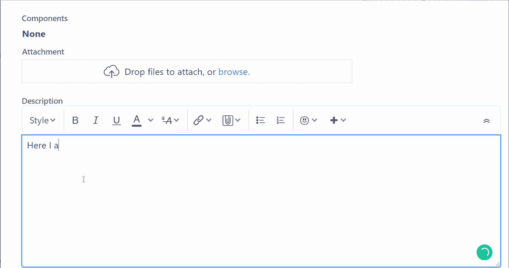

# 成为更好的软件开发人员:写更好的罚单

> 原文：<https://levelup.gitconnected.com/be-a-better-software-developer-write-better-tickets-75ccf9621c02>

## 大吉拉门票的 6 个小贴士

图片来源:[https://unsplash.com/@nickmorrison](https://unsplash.com/@nickmorrison)

这句来自[马丁·福勒](https://www.goodreads.com/author/quotes/25215.Martin_Fowler)的话一直伴随着我:

> 我不是一个伟大的程序员；我只是一个习惯很棒的好程序员。

写票更是如此。在我们匆忙制作代码的过程中，我们忘记了票务也是一门手艺。就像预先用代码偷工减料会导致技术债务一样，马虎的票据会导致沟通债务。它们会导致遗漏的需求、重复的工作和怨恨。

去年你在一个特性中引入了一个代价高昂的 prod bug，相应的罚单是两个句子片段和一个随机附加的。csv 文件。

票证描绘了进度和优先级的实时快照。它们对于估计最后期限、分配优先级和发布计划至关重要。它们不仅被你阅读，还被项目经理、经理、可能的用户阅读，最重要的是，当你在追踪一个生产 bug 时，你会再次阅读。

希望你已经理解了**为什么**写好票很重要。本指南的其余部分将介绍**如何**。它特别关注吉拉，但一般建议应该适用于类似的管理工具，如 Monday.com 和 Asana。

## **坏票的例子**

一个模糊不清、结构不良的吉拉票的虚拟例子。

仅仅通过看它，我们可能都同意这张票是坏的。但是具体为什么呢？

1.  很难看——全是纯文本。没有清晰的切片或字体对比。错别字，并给出了一个整体仓促和粗心的演示。
2.  内容模糊，缺乏商业语境。
3.  许多内置的吉拉字段，如标签，史诗，优先权是空白的。
4.  没有截图(…处以死刑)，附件，或媒体。
5.  没有优先、紧急或影响的表象。
6.  没有关联的利益相关者或业务联系人。

像这样的票会打击士气。他们强迫工程师在开始之前做前期分析——这些分析可能已经由检票员完成，但在翻译过程中丢失了！为了节省几分钟的票*作文*，作者牺牲了几个小时对其未来*的理解*。

## **提示 1:使用问题模板**

我的示例票表明了一个懒惰的作者，对吗？显然不是一个像你一样小心谨慎，迂腐的员工，对吗？不要太肯定…即使你最精心制作的门票也可能会错过对某人来说很重要的东西。也许你遗漏了一个关键利益相关者的名字或者一个 DB 查询，而另一个开发人员会发现它很有用？**只需使用问题模板**，而不是试图记住机票材料的清单。它们简单、直观，并且莫名其妙地从我们的大多数吉拉工作流程中消失了！它们确保整个团队或组织中票证的一致性和可再现性。

Atlassian Marketplace 中“问题模板”的搜索结果。在我尝试的几个模板中，针对吉拉问题的简易模板是一个轻量级的交钥匙选项。

首先，去 [Atlassian Marketplace](https://marketplace.atlassian.com/) 搜索“问题模板”。将显示几个结果。这些大多有 1 个月的免费试用期，所以我试了几个。**吉拉问题的简易模板**是第一个我能在 5 分钟内安装并运行的模板，所以我用了它。它还有[清晰的文档](https://appliger.atlassian.net/wiki/spaces/ET/pages/489390092/Create+Issue+from+Template)。

模板化过程很简单。选择给定类型(bug、故事、任务)和描述以及元数据字段(标签、史诗等)的标签。然后，在创建新票证时，只需从已保存的模板中进行选择，所有预填充将被设置为默认值，如下所示。

使用 Atlassian Marketplace 上提供的“吉拉问题简易模板”插件来预填故障单。

对于我们的模板，我们已经决定了以下部分。

1.  **简短摘要**:问题的简要*概览*描述
2.  **利益相关方**:用户报告、主要开发人员、BA、QA 签准人员…
3.  **影响/紧急程度**:票据重要性和紧急程度的详细信息
4.  **完整描述**:重现步骤、截图和完整细节
5.  **相关项目**:松弛会议、电子邮件等...关于这个问题
6.  **根本原因分析(仅限 bug)**:根本原因技术调查
7.  **跟进&跟进-从**开始:关联问题/相关工作的详细情况
8.  **测试用例**:测试新的/修正的行为的场景概要
9.  **技术说明**:对其他开发者有用的信息，比如数据库查询

这些部分足够简洁，可以简化票证创建过程，但又足够全面，可以扩展到大型项目。注意不要重复吉拉自己已经跟踪的信息，例如，票证创建日期。请避免在模板中要求冗余或繁琐的信息；开发者会停止使用它们！

不幸的是，大多数插件的付费模式都是按用户付费的，所以如果你的组织有很多用户，这些插件可能需要每月 100 美元以上。如果成本太高，只需复制/粘贴模板文本，如下文链接所示。

> **不确定如何在票证模板中放置什么内容？为什么不从我的开始呢——它们可以从这里下载。**

## 技巧 2:使用 Markdown 和 JIRA 内置宏

吉拉有丰富的内嵌降价和有用的键盘快捷键。以下是我最喜欢的几个。

*   `#`或`##`将在文本前添加一个 HTML 标题(即。大字体)。
*   `Ctrl+B`为粗体字；`Ctrl+I`为斜体；`Ctrl+K`添加超链接。

仅仅这几个快捷方式就能迅速降低易读性。

几个基本的内联键盘快捷键让纯文本变得生动起来。

键入正斜杠`/`会弹出一个包含丰富内容的宏搜索选择器，比如信息面板、表格和代码片段。

信息面板对于传达“流行”的重要信息非常有用。代码片段将突出几十种语言的语法——其他平台应该注意(咳嗽中等咳嗽)。

## 技巧 3:内嵌媒体

不要只是把媒体附在票上，做一个说“请看附件”的人。内嵌并拉伸它以填充屏幕。这种礼貌避免了必须打开弹出窗口或滚动附件的麻烦，这两者都会打断读者的思路。

拖移图像或视频的边缘以扩展它，从而填充画布。

## 技巧 4:截屏一切——或者更好，创建 gif

一张票永远不够截图。我建议在票里放上几乎所有东西的照片。与业务用户的轻松对话？包括它。管理层的邮件确认？截图吧。任何能提供一点上下文信息的东西…截图吧。或者更好，GIF-it！

关于如何使用 LiceCap 轻松创建 GIF 的一分钟视频。 **Protip** :将 LiceCap images 文件夹直接添加到 QuickAccess，以便更快地检索。

本文中创建的 gif 是使用免费工具 [LiceCap](https://licecap.en.softonic.com/) 完成的，这是我最喜欢的效率工具[之一](/my-7-favorite-software-developer-productivity-tools-a4c13b0fc0af?source=search_post---------0&gi=7cdfc508f9b8)。我 90%的票都用它。干净的 gif 是用最少的努力记录错误和行为的好方法。几乎我做的每张票都有 GIF。如果一张图片胜过千言万语，那么一张 GIF 至少值 5000。

## 技巧 5:整合，整合，整合

像其他主要的项目管理系统一样，吉拉通过 [Atlassian Marketplace](https://marketplace.atlassian.com/categories/project-management) 与第三方集成已经成熟。这些插件增强了你可能已经在使用的工具的体验。这里是我们使用的一些。

*   Slack 插件与吉拉无缝集成。您将获得任何相关票证活动的聊天通知(比电子邮件更好)。您可以使用如下所示的`/create`等命令管理最近的票证，甚至直接从 Slack 创建新票证:

*   BitBucket 插件由 Atlassian 直接管理，收紧了吉拉和 BitBucket(Atlassian 版本的 Github**)之间的回路。这是一个双向插件，所以 BitBucket 与吉拉对话，反之亦然。只需在提交或拉取请求中包含一个吉拉票证编号，BitBucket 活动将与票证一起被跟踪，如下所示。**

****

**BitBucket-吉拉集成自动关联 PRs 并提交到票证，非常适合跟踪票证的代码更改。相反，可以直接从位存储桶(未示出)改变标签状态。**

*   ****哨兵插件**将[哨兵 IO 应用监控](https://sentry.io/welcome/)与 Slack 和吉拉集成。这很巧妙——当我们的应用程序中出现错误时，我们会得到一个 Slack 警报，其中有一个简短的描述和到 Sentry 错误页面的链接，该页面包含了关于错误的所有相关信息。从哨兵，吉拉插件可以立即创建一个跟踪问题。**

****

****左图**:哨兵错误页面截图——要创建吉拉问题，只需点击圈出的方框。**右**:链接岗哨问题出现在吉拉门票侧边栏。**

## ****提示 6:语法浏览器插件****

**优秀的语法插件分析所有网络浏览器的文本输入并实时验证。我明白了，你是个工程师，不是普利策奖获得者。但是外表和对细节的关注很重要——当你的老板在看你的罚单时，你真的想写上:“软件是一种服务”吗？作为奖励，它也有助于写中型文章:)**

****

**填写吉拉门票，同时语法上提供实时反馈。对于大多数人来说，免费版本可能已经足够了，但高级功能也非常好。**

## ****改良票的例子****

**这是根据上面的提示更新的原始虚拟门票。它更加易读、悦目、信息量大。**

****

**一个假设的 UI 错误的模板化的干净标签的例子。**

## **超越门票**

**开出干净的罚单只是开始。以下是根据我的经验提出的其他一些建议。**

1.  ****让别人分配你的门票**。开发人员更喜欢在绿地上工作，并倾向于迷恋镀金小功能的细节。通过让项目经理优先考虑和专门分配工作来避免这种情况。把自己想象成一个与优先级队列交互的简单工作节点。这确保了你在最重要的业务项目上工作，使你成为无价的资源。**
2.  ****不要清理坏票。**就是不要。如果写得不好的票一直找上门来，就退回去。将它们分配给作者，并建设性地解释为什么不充分(授人以鱼)。**
3.  ****学习高级功能。吉拉有许多围绕看板、冲刺、发布和 CI/CD 构建的高级功能。主动探索并释放您的组织所支付的项目管理工具的力量。这将带来*高可见性*生产率的提高。****
4.  ****把票务系统当成一等公民**。像编码一样对待票证。给予吉拉与版本控制或构建系统同样的关心和关注。不像那些系统，你的老板实际上会时不时地盯着票，不管公平与否，他们会从他们看到的表象中得出结论。**

****你怎么看？**有不同的拍摄？我漏了什么吗？评论一下，让我知道。**