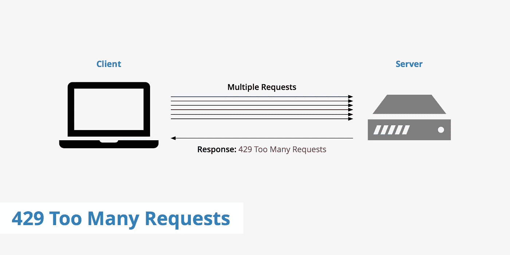

# 用费率限制器做一个好的服务电话市民

> 原文：<https://levelup.gitconnected.com/be-a-good-service-call-citizen-with-ratelimiter-e29e27d1a972>

## 如何拨打节流意识服务电话

洛根·韦弗在 [unsplash](https://unsplash.com/) 上拍摄的照片

# 为什么要限制自己的应用呢？

你可能看着这个会想

> “我为什么要限制我的应用程序的性能？我希望我的应用程序尽可能快地加载和执行，所以我不应该限制我的 API 调用”

嗯，你是对的，也是错的

你不应该武断地限制你的 API 调用，这是事实。然而，有时候——对于大型应用程序来说——可能有必要限制您的 API 调用以避免被 API 抑制。

节流由 [Adobe](https://helpx.adobe.com/coldfusion/api-manager/throttling-and-rate-limiting.html#:~:text=Throttling%20is%20a%20process%20that,consumers%20during%20a%20given%20period.&text=For%20example%2C%20you%20can%20limit,as%20%22too%20many%20requests%22.) 定义为

> 用于控制消费者在给定期间使用 API 的过程。您可以在应用程序级别和 API 级别定义节流。节流限制被认为是 API 级别的累积限制。

所以你应该只在必要的时候使用限速。

# 添加速率限制的案例研究

您的老板希望您创建一个函数，该函数能尽快对他喜欢的 API 进行 100 次调用🏃‍♂️💨。

所以你会想，哦，我会用 100 个线程进行并行调用，与同步调用相比，速度可能快 100 倍😛！

这是我们虚拟服务调用的代码。

## API 调用

然后编写以下代码来创建 100 个 ServiceCall 实例，并并行调用它们以获得最大速度💪！

## 应用程序(不限于)

现在你运行代码，你想“这太棒了，我 100 倍于这个代码的性能，我肯定会加薪！”

相反，你看到这个…🚨🚫🚨🚫

发生了什么事？你做了太多太快的调用，API 因为你的贪婪而阻止了你😠。

所以你联系 API📞他们告诉你一次只能有 10 个活动连接，以避免被限制。

你将如何实现这一行为😨？这就是 RateLimiter 发挥作用的地方😃！

## 应用程序(有限制)

这里我们创建了 10 个“许可证”,每次我们想要调用服务时，我们都必须获得一个许可证。permit 允许创建一个线程(即 10 个 permit 意味着我们一次可以有 10 个活动线程)。一旦服务调用终止，我们就释放其被获取的许可。这将导致一个较慢的过程，但我们将保持在 API 的调用限制内。

现在，您可以成为一名优秀的 API 公民，确保您的应用程序能够正常运行，而不会引发 429 错误。