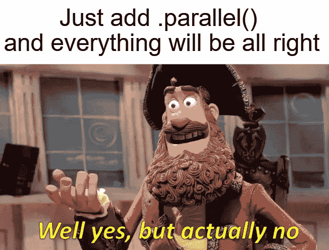
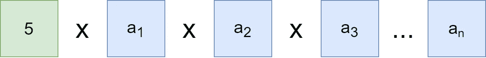
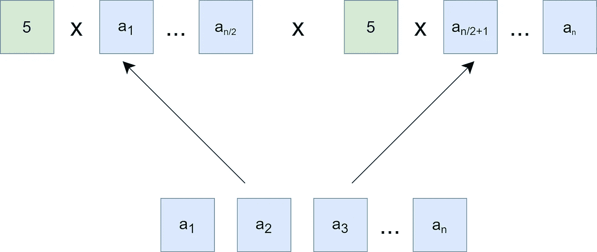

# 小心 Java 并行流

> 原文：<https://levelup.gitconnected.com/be-careful-with-java-parallel-streams-3ed0fd70c3d0>

Java Stream API 很牛逼。这是自 Java 8 以来最大的改进之一。它允许我们以声明的方式在集合上构建复杂的查询。此外，流 API 为并行执行提供了一种简单的方法。只需添加`parallel()`语句或者用`parallelStream()`函数构造流即可。但是如果您不想处理意外的 bug，那么有一个警告是您应该知道的。

假设我们需要将给定的一组数字相乘，Stream API 可以派上用场。

减流

结果是`524490120`。假设这个数也要乘以 5。没问题。我们只需替换归约的身份。

不同身份的流减少

答案是`2622450600`。一切按预期运行。

如果数据流包含成百上千个数字会怎样？顺序执行可能太慢。让我们使流并行，并测试结果是否相等。

不同身份的并行流缩减

令人惊讶的是，我机器上的结果是`40975790625000`。那肯定跟`2622450600`不搭。

这是怎么回事？Java 并行流有 bug 吗？实际上，一切正常。让我们更深入地了解一下并行流是如何工作的。

## ForkJoinPool

Java 流使用 [ForkJoinPool](https://docs.oracle.com/javase/8/docs/api/java/util/concurrent/ForkJoinPool.html) 来启动并行执行。描述这个执行器的细节超出了本文的范围。但是主要思想是任务递归地分成多个块，然后每个块可以独立计算。

所以，这是`Stream.reduce`顺序执行的示意图。

顺序还原

如你所见，算法非常简单。假设，我们想要并行执行。为了简单起见，让我们假设这个任务只分成两部分。

平行还原

每个块都被乘以 5。因为这就是平行流的工作方式。它为每个确定的块应用给定的身份。

我们如何解决这个问题？我们需要做的就是将`5`放在`reduce`函数的外面。

无错误并行流减少

乘以`1`不影响结果。所以不管有多少块。

根据给出的例子，我可以给你一些设计你的流 API 案例的建议。

## 减少应分裂

如果您不确定流是否是顺序的(例如，它是作为函数参数来的)，那么`reduce`函数的`identity`不应该影响单个块的结果。这意味着，求和函数在与函数`1`相乘时必须接受`0`。

## 也许你不需要平行流

不是所有流操作都应该并行化。例如，`map`、`flatMap`和`filter`是很好的候选，因为他们是无国籍的。另一方面，`sorted`、`distinct`和`limit`可能不会显示出良好的性能增强。

不仅如此，并行化的有效性很大程度上取决于流的来源。一个`ArrayList`、一个数组或者`IntStream.range`支持随机访问，这意味着它们可以很容易地分开。但是`LinkedList`需要`O(n)`时间来分解。另外`Stream.iterate`和`BufferedReader`也不是一个好的选择，因为它们在开头都有一个未知的长度，所以很难估计何时拆分源。

## 编写单元测试

我们已经看到，每个并行流不仅是潜在的性能优势，也是漏洞所在。因此，每次用并行流替换顺序流时，都要确保功能没有被破坏。

## 结论

我们可以看到，Stream API 并没有看起来那么明显。我想推荐一本书，它不仅完美地描述了 Stream API 及其注意事项，而且完全描述了 Java 8 lambdas。是“ [Java 8 Lambdas:实用函数式编程](https://www.amazon.com/Java-Lambdas-Pragmatic-Functional-Programming-ebook/dp/B00J3B3J3C)”。如果您有任何问题或建议，请在下面写下您的意见。感谢阅读！