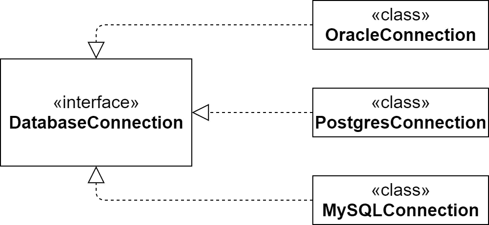
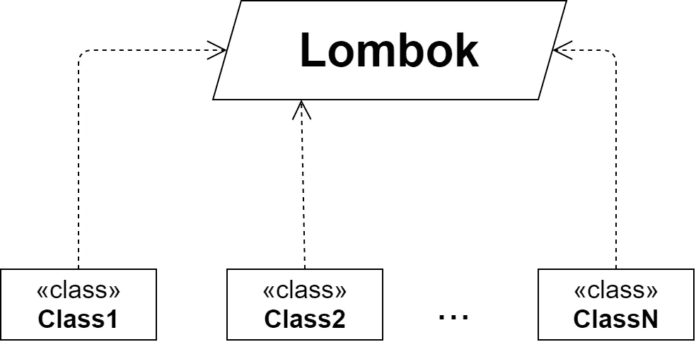

# 小心龙目岛

> 原文：<https://levelup.gitconnected.com/be-careful-with-lombok-2e2edfc01110>

Lombok 是一个很棒的 Java 库。它有助于减少“基础设施代码”的数量。您不再需要编写构造函数、获取函数、设置函数，甚至构建函数。你所要做的就是添加适当的注释，插件会为你生成一切。它有助于开发人员专注于业务逻辑。但是我认为过度使用 Lombok 可能会导致一些问题，使代码更加耦合和复杂。大家说说吧。

阿什利·巴茨在 [Unsplash](https://unsplash.com/s/photos/labyrinth?utm_source=unsplash&utm_medium=referral&utm_content=creditCopyText) 上的照片

在我看来，龙目岛不是银弹有几个原因。我们将从最不重要的几点开始。

## 0.附加依赖性

尽管 Lombok 很方便，但它仍然是项目的一个附加依赖项。不仅如此，它还迫使其他开发人员在他们的 ide 和代码编辑器中安装一个特殊的插件。否则，Lombok 用法就成了障碍，而不是蹦床。

> 现在这不是什么大问题。你只需点击几次就可以安装所需的插件。说到附加的依赖项，Lombok 是一个编译时库。因此，在运行时不需要它，它不会影响包的大小。所以我才把这些理由放在零的位置。它们没什么大不了的。

## 1.巨大的耦合

让你的组件尽可能独立是一个好习惯。通常，可以通过接口来完成。接口是调用代码和底层实现之间的屏障。

从底层细节中分离出来

我们可以看到，商业逻辑并不依赖于底层细节。但是如果我们使用 Lombok 会发生什么呢？

与龙目岛的巨大耦合

几乎我们系统中的每一个类都依赖于 Lombok。为什么不好？

首先，我们不知道龙目进化的下一步是什么。也许下一个主要版本会打破向后兼容性。这将使得无法升级依赖关系，并迫使您使用将来会停止维护的旧依赖关系。

其次，如果你感染了病毒怎么办？这意味着它不会出现在一个孤立的模块中，而是出现在整个应用程序中。不是最好的开发者日。

最后，如果许可证改变了怎么办？甚至现在龙目岛也提供某种[企业订阅](https://projectlombok.org/tidelift)。也许再过几年，整个图书馆都会商业化。没人知道。

## 2.代码缩减

Lombok 最大的优势就是减少了你需要编写的代码量。看看这两个 dto(数据传输对象)就知道了。第一个仅使用纯 Java 声明，第二个使用 Lombok 注释。

没有 Lombok 注释的 DTO 示例

带有龙目岛注释的 DTO 示例

不仅如此，我们还可以进一步减少代码。

带有值注释的 DTO 示例

不用说，最后两个选项看起来更简洁，也更容易理解。我们没有直接在代码中添加构造函数和 getters，而是放入元信息，告诉我们所有必要的东西都将被生成。

问题是它隐藏了我们的班级变得太大太复杂的事实。不仅如此，从 Spring 4.3 开始，它的影响甚至更大。如果一个 bean 有一个接受所有必需依赖项的构造函数，就没有必要在它上面放`@Autowired`。所以，我们可以用 Lombok 注释代替它。

假设我们有一个典型的弹簧控制器。

带 Lombok 的控制器

现在让我们想想办法。这个类有没有太多耦合？嗯，好像不是。只有*六*行的依赖关系。让我们摆脱龙目岛，看看会发生什么。

不带 Lombok 的控制器

我想现在你已经开始感到不舒服了。这个类的功能一点也没有改变，但是现在你可以看到它的耦合。在我看来，这是龙目岛最危险的事情之一。它*隐藏了*无处可去的复杂性。

巨大的构造函数的存在表明有些事情不对劲。也许班级太大或者责任太大。Lombok 把它缩成一行。我见过有 10 个甚至 15 个依赖项和一个`@AllArgsConstructor`注释的类。开发人员没有发现任何问题，因为他们没有感受到复杂性。

## 3.建设者

建筑商怎么了？其实什么都不是。这是一个很好的设计模式，但经常被错误地使用。我认为 Lombok 的过度使用是原因。

Java 没有带默认值的命名参数和可选参数。因此，开发人员需要一些变通办法。这就是建筑工人到来的时刻。假设我们有一个用户 DTO。我们希望`role`字段有一个默认值。如果还没设置，应该是`Role.GUEST`。这里有一个简单的例子。

构建器示例

这就是它的使用方式。

构建器使用示例

这是一个非常方便的方法，但是看看我们写的代码量。该逻辑不可重用。因此，如果我们有几个需要构建器的类，我们将需要反复编写几乎相同的代码片段。那将是乏味的。幸运的是，Lombok 为我们提供了一种不那么冗长的方式来声明构建器。

龙目岛建造者

就是这样！仅仅几个注解，我们就达到了同样的结果。

现在让我们回到前面的问题。假设我们有一个巨大的 DTO。

巨大的 DTO

实例化是这样的。

使用构造函数的用户实例化

如你所见，论点的意思不清楚，因为它们太多了。嗯，我们可以用`@Builder`代替`@RequiredArgsConstructor`。让我们看看会发生什么。

使用构建器进行用户实例化

这种方法看起来更好。然而，有一个不明显的问题。如果我们忘记向构造函数传递参数，代码将无法编译。而建筑商呢？假设我们没有设置`age`。或者也许有人给`User`添加了另一个字段。会发生什么？什么都不会。这才是重点。构建器允许我们省略值，而构造器不允许。有时这是意料之中的行为。另一方面，如果它要求设置所有的值，构建者可能会带来问题。

我们该怎么办呢？首先，这个班级太大了。我们应该把它分成几个小的。

具有分割子类别的用户

现在我们可以直接实例化`User`了。

使用构造函数的用户实例化

有人可能会说，这种方法看起来不如前面的构建器方法漂亮。我同意你的观点。但是构造函数最大的优点是它有严格的不能被打破的界限。与构造器不同，构造器不允许我们将不完整的对象传递给客户端。

## 4.龙目岛会带来虫子

Spring Boot 能够直接将`application.properties`绑定到 dto。

应用程序.属性

数据库配置

不仅如此，Spring Boot 还有更强大的功能。它可以基于配置类自动生成元数据。您所要做的就是为`spring-boot-configuration-processor`添加依赖关系。例如，这就是我们将从`DatabaseConfig`类中得到的。

Spring 元数据

这个 JSON 用于为我们的属性实现自动完成。

不管怎样，我们为什么要手动声明 getters 和 constructor？我们有龙目岛。让我们解决这个问题。

使用 Lombok 的数据库配置

所以，一切都应该是一样的，对吗？

断掉的 Spring 元数据

坚持住。那是什么意思？什么是`arg0`、`arg1`、`arg2`？这完全出乎我们的意料。

你可以通过[这个](https://github.com/spring-projects/spring-boot/issues/18730)和[那个](https://github.com/rzwitserloot/lombok/issues/2275)链接找到更多关于这个问题的信息。bug 已经修复了，但是还没有发布。在此之前，唯一的解决方法是我们自己声明构造函数。

使用 Lombok 修复数据库配置

# 下一步是什么？

有人可能会认为我在试图说服你拒绝使用 Lombok。一点也不。我认为 Lombok 是 Java 世界中最伟大的库之一。相反，我可以给你一些建议，可能有助于避免不愉快的后果。

## 0.Lombok 必须是编译时依赖项

如果您正在处理一个代码不应该被重用的服务，那么您如何声明 Lombok 是没有区别的。但是如果你正在开发一个库，不要忘记检查依赖的范围。否则，用户可能会面临在类路径中有两个不同版本的 Lombok 的问题。

## 1.跟踪复杂性

正如我们所看到的，Lombok 会误导我们关于类的耦合。您应该始终注意它包含的依赖项的数量。总之，不要忘记 [SRP(单一责任原则)](https://en.wikipedia.org/wiki/Single-responsibility_principle)。

## 2.不要过度使用建筑商

Builder 是用默认值声明参数的一个很好的模式。如果您的 DTO 只有必填字段，最好使用构造函数。如果你有一个巨大的 DTO，不要把问题藏在`@Builder`注释后面。尽量分班。

## 3.不要让你的业务逻辑依赖于生成的东西

这种情况并不常见，但确实会发生。

Lombok 为我们生成了大量代码。因此，一些开发人员想出了一个在其上实现功能的主意。例如，我们可以创建一个自定义的反序列化器，通过反射来设置值。我们所有的 dto 都使用`@Builder`注释。生成器包含与字段同名的 setter 方法。我们就一个一个的调用这些方法吧。最后，所有需要做的就是打电话给`build`。

这种方法是绝对脆弱的。如果我们传递一个没有生成器的对象会怎么样？如果有人决定用`@Builder(setterPrefix = "set")`改变 setter-method 前缀会怎么样？一切都会崩溃。

因此，在生成的代码上构建逻辑之前，您应该三思而行。

## 4.遵循相同的代码风格

这个规则不仅适用于龙目岛，也适用于整个开发过程本身。

有成百上千的*最佳实践*和成千上万的书籍可以教你*写代码的正确方法*。但是在我看来，没有人真正知道如何去做。你会发现包括我在内的许多人都支持不变性和构造函数注入。同样的，也有很多其他专业开发人员有不同的看法。

所以，我认为你真正应该关心的唯一标准是让你的代码尽可能的统一。如果您喜欢用 setters 初始化 dto，可以将这种方法扩展到整个应用程序。如果你是构造函数注入的支持者，`@RequiredArgsConstructor`应该成为你最好的朋友。

Lombok 是一个非常灵活的库。尝试它提供的每一个功能总是有很大的诱惑。而且没有问题。但是不要让你的好奇心把代码库弄得一团糟。

# 结论

这就是我想说的关于龙目岛的一切。如果你有任何问题或建议，请在下面留下评论。感谢阅读！