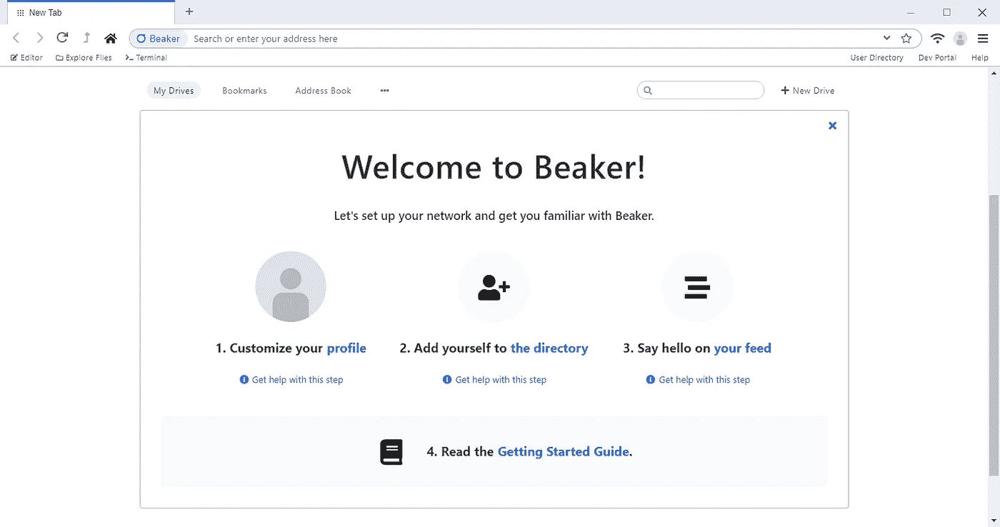
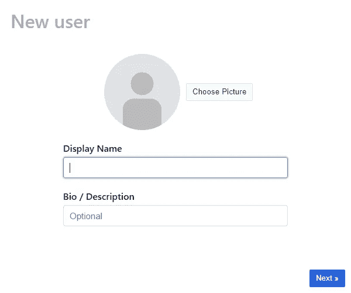

# Beaker 如何创造了一个新的社交网络

> 原文：<https://levelup.gitconnected.com/beakers-new-world-wide-web-d7b47def5177>

## 烧杯浏览器

## 一种新的互联网社交形式刚刚出现。它是烧杯，它使用超光速推进器。

照片:[延斯·克罗伊特](https://unsplash.com/@jenskreuter) /Unsplash

“烧杯”和“超光速推进器”这两个名字听起来很有未来感。但是让我提醒你，我们都生活在未来。有些汽车靠电力驱动，而在此之前，电力只够点亮灯泡并向世界各地发送单个脉冲。这个新的互联网世界不需要很长时间就可以学习和分享知识。不要惊讶，我们现在将会学习和发明比以往更多的东西。

Firefox、Chrome 或 Safari 等现代网络浏览器将用户连接到服务器。用户可以请求查看某个页面，服务器会将该页面发送回来。服务器同时与数十、数百或数千用户异步通信。这意味着，公司花大价钱在几个强大的服务器上托管他们的网站，因此许多用户可以连接并请求大量数据而不会有缓慢的处理时间。

这是一个 30 年历史的甜蜜图表。

烧杯是当我们从等式中移除服务器时发生的事情。用户直接与其他用户交流，下载他们请求的页面。用户与用户交流。这种在互联网上发送和接收数据的方法被称为[点对点](https://en.wikipedia.org/wiki/Peer-to-peer)。

P2P 以前也在其他应用程序中使用过，比如 BitTorrent 客户端和一些视频游戏。在 torrent 网站上，用户在一个大列表上发布他们有一些文件， [a *torrent*](https://en.wikipedia.org/wiki/Torrent_file) ，其他用户可以通过向所有者请求来下载 torrent。当这些文件被下载后，他们成为种子的所有者，被称为*播种者*。现在，当更多的用户请求文件时，有两个服务器——两个*种子服务器*——所以下载速度更快，循环继续。下载文件的用户被称为*吸血鬼*。

最终，一条洪流可以有成千上万的播种者和吸血者。这就是软件、音乐和电影盗版在网上的运作方式。因为托管和提供文件的不仅仅是一台服务器。全世界有成千上万的用户。大多数种子用户通过支付虚拟专用网来隐藏他们的 IP 地址，从而使他们的身份匿名。

烧杯的起始页，供新用户使用。

新的 Beaker 浏览器使用与 BitTorrent 客户端相同的方法为用户提供网站服务。Beaker 的网站由用户托管在[超空间](https://hypercore-protocol.org/#hyperdrive)上，类似于 torrents。用户可以类似地选择托管超光速驱动器。这和播种洪流是一回事。Hyperdrive 包含网站的所有文件，如登录页面、关于页面和样式信息。就像服务器提供页面一样，用户将页面从 Hyperdrive 网站植入请求页面的用户。

超光速引擎建立在 [Hypercore 协议](https://hypercore-protocol.org/)之上，这是 Beaker 所有点对点业务的核心。它是 Dat 协议的后继协议。BitTorrent 客户端使用简单的点对点文件共享，它们的方法没有 Hypercore 协议的强大。Hypercore 协议是安全的，不会被恶意破坏，它是安全的，清晰的，快速的，轻量级的。这意味着加载受信任的超硬盘没有风险，因为每个文件都经过加密签名，因此如果文件损坏或被恶意修改，用户会自动拒绝该文件。

当用户第一次启动 Beaker 浏览器时，系统会要求他们创建一个新的用户配置文件。

Beaker 最大的特点之一是它的用户档案。用户配置文件是他们自己的超空间驱动器，由该用户托管。一些网站会要求将数据存储在用户的个人资料中。多个应用程序可以在那里存储数据，并且在适当的权限下，可以从用户已经访问的其他应用程序中检索数据。这意味着，用户不需要登录不同的服务。这是一个安全的配置文件。

因为所有的用户配置文件都是超驱动器，他们可以在上面托管个人网站和作品集。用户资料上已经出现了很多微博。这是免费的 real estate，如果用户喜欢你的个人资料，他们会帮你托管。Beaker 是一个开始写博客或开始你的作品集的好地方，因为网络浏览器内置了你所有的网站编辑工具！它有一个内置的文件管理器，语法高亮编辑器和一个网络终端。

Beaker 允许用户访问任何超光速引擎网站，这意味着下载并拥有它的独立版本。用户可以进行更改，然后向原始网站的所有者发送拉请求。然后，所有者可以接受所有的更改，或者只接受一些更改。可以派生任何网站，改变其风格，并继续使用私有版本，因为所有代码的功能仍然完全相同。

网站的所有代码都在用户的电脑上运行，因为没有一台服务器给中间人。作为一种解决方法，用户可以向同一个超空间驱动器上的其他用户发送消息。这允许实时聊天、分布式处理和读写权限的委托，而不是在单个写系统中。Beaker 制作了一个视频聊天超空间驱动模板来展示如何让连接到超空间驱动的用户之间的视频聊天成为可能。网页上写着“流量是加密的，只有拥有该网站网址的用户才能阅读。”

随着点对点网络的狂野西部继续，这个陌生领域的开发者找到了保护数据的方法，我们可以希望更多的用户和企业将在那里建立一个存在。这是由使用它的人主持的新的社会万维网。这是一个自我改进设计的教科书范例，肯定会引发一场运动。