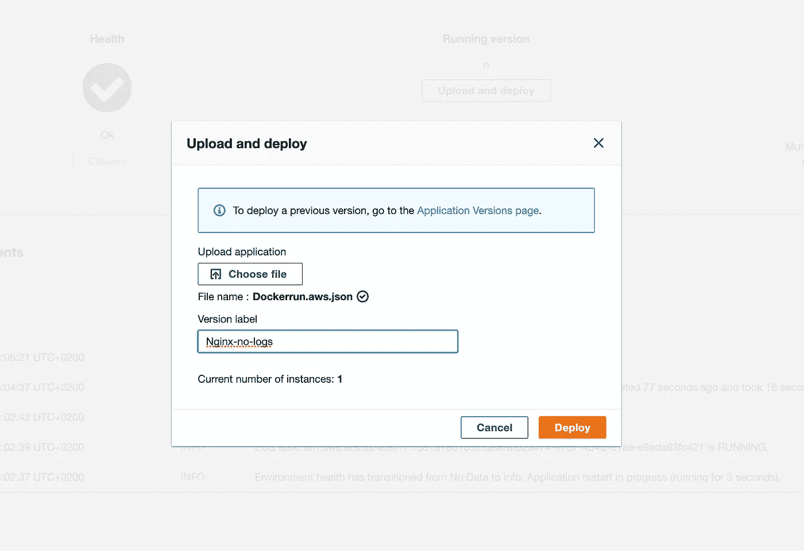
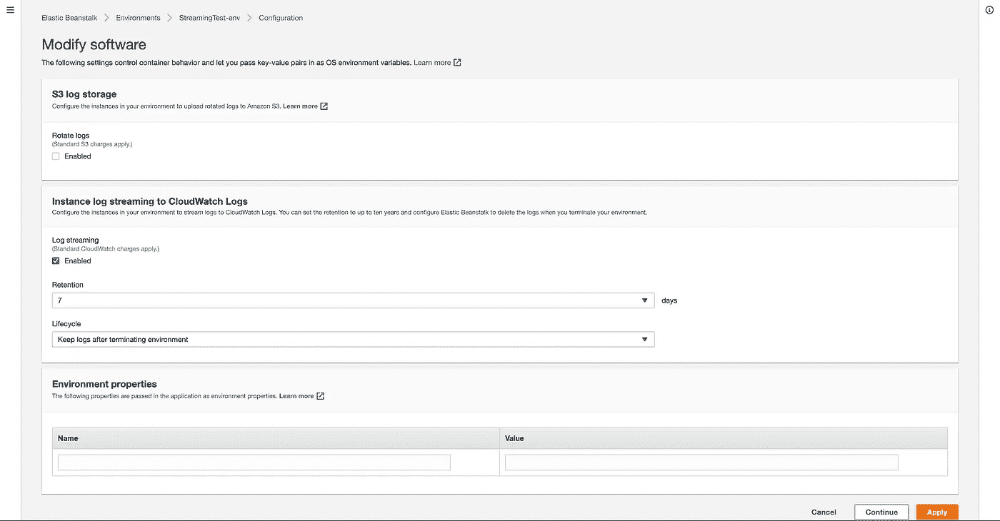
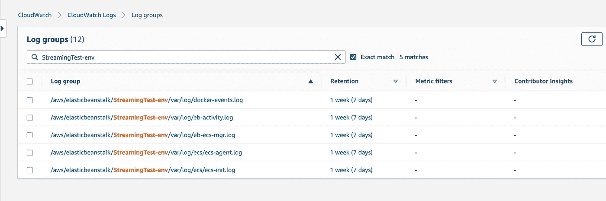
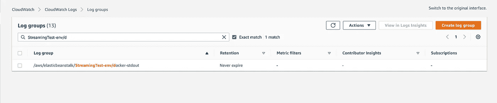
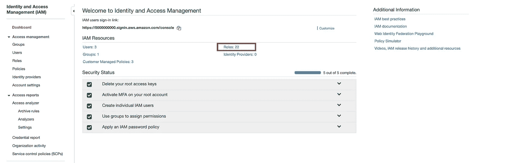
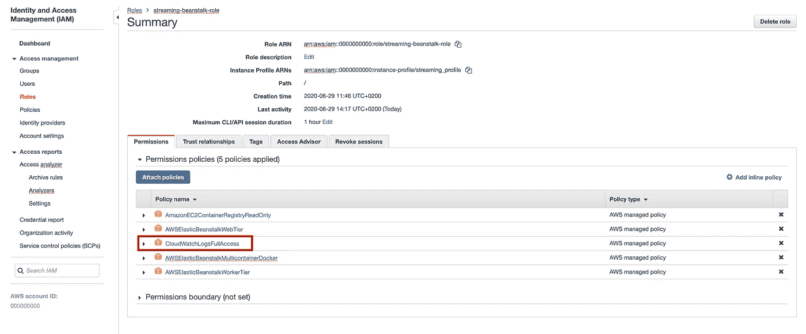

# Beanstalk 多容器 Docker 日志到 Cloudwatch

> 原文：<https://levelup.gitconnected.com/beanstalk-multicontainer-docker-logs-to-cloudwatch-26c10fd9e74d>

## 如何从 Beanstalk 获取 Stdouterr 日志到 Cloudwatch


流向云端…哈哈。|图片来自 [Alex Hu](https://pixabay.com/de/users/cowins-822708/?utm_source=link-attribution&amp;utm_medium=referral&amp;utm_campaign=image&amp;utm_content=679014)

日志——它们对于监控和调试应用程序至关重要，尤其是在生产环境中。

在本文中，我们将探索如何将日志从*AWS Elastic Beanstalk***multi container Docker 平台**传输到*亚马逊的 Cloudwatch* 。

不幸的是，有点令人惊讶的是，在 *Cloudwatch* 中检索您的 Beanstalk 应用程序的日志令人困惑，并且不能像在其他 Beanstalk 应用程序平台上那样开箱即用。*至少截至目前；AWS 可能正在做一些事情来解决这个问题。*

## TL；速度三角形定位法(dead reckoning)

如果您只是在搜索立即修复问题的**配置**，请跳到[本节](#a7e4)。
或者看看这篇文章的完整[代码。](https://github.com/SlootSantos/medium-beanstalk-logs-cloudwatch)

## 我们要看的是

*   [使用 Terraform](#ffcf) 设置示例 Beanstalk 应用&环境
*   [通过*docker run . AWS . JSON*部署 Nginx](#ef66)
*   [在 Beanstalk 上启用日志流](#1e76)
*   [流式传输**stdouter**使用 ebextension](#a7e4)
*   [验证…多田🧚‍♂️](#cdef)
*   [故障排除](#e356)

## 开始之前

按照本文，我建议创建一个新的空目录，您可以在其中创建我们将在下面使用的所有文件。名称和格式完全由您决定:)

## AWS 弹性豆茎设置

出于演示目的，我们将在 Beanstalk 中创建一个示例应用程序和环境。

> **注**:如果您已经有一个应用程序在运行，只需跳过这一部分，继续执行 [**启用日志流**](http://ada) 。

您可以在这里使用这个 Terraform 模板，或者自己在 AWS 控制台中配置应用程序。

## 使用 Nginx 的 Dockerrun.aws.json 示例

同样，你可以按照我提供的例子图片或者使用你自己的 Docker 图片。

我将使用打印日志到*的官方 Nginx 图像。*

*下面是 Beanstalk 用来配置多容器平台的 *Dockerrun.aws.json* 。*

*要上传这个 JSON 配置，最好使用 Beanstalk UI。*

**

*Beanstalk 环境>“上传和部署”*

*点击*展开*并等待大约一分钟。*

*当导航到您的环境 URL 时，例如[streaming test-env . EBA-iam 93 mfy . us-east-1 . elastic beanstalk . com](http://streamingtest-env.eba-iam93mfy.us-east-1.elasticbeanstalk.com/)，您应该会看到默认的 Nginx 登录页面。*

## *启用日志流*

*如果流配置没有正确设置，或者如果[实例概要文件](https://docs.aws.amazon.com/IAM/latest/UserGuide/id_roles_use_switch-role-ec2_instance-profiles.html)没有足够的权限访问服务，您的应用程序将不会向 Cloudwatch 传输任何内容。*

> ***注意**:如果您使用了 Terraform 模板，您已经准备好了。您可以跳过这一部分。*

*要检查环境是否可以传输日志，请转到 Beanstalk 环境日志记录设置页面*(位于“配置”>“软件”)。*查看*日志流*下的*启用*复选框是否勾选，如果没有勾选则勾选。点击*应用*保存您的更改。*

**

*Beanstalk 环境>配置>软件*

*在 Cloudwatch 服务的*日志组*下，您将看到这个 Beanstalk 环境的日志组。然而，在这些日志组中，你都不会在这个环境中找到你的容器的外部。*

**

*云观察>日志组*

## *将 StdoutErr 流式传输到 Cloudwatch*

*要将非默认日志流式传输到 Cloudwatch，**我们必须使用**[***EB extensions***](https://docs.aws.amazon.com/elasticbeanstalk/latest/dg/ebextensions.html)**；**没有其他方法可以对日志进行流式处理。*

*因此，我们必须在应用程序的源目录中创建一个新文件夹。这个文件夹必须命名为*。ebextensions* 并在里面创建一个名为 *log.config* 的文件，内容如下:*

> *注意:由于配置是 YAML，我建议验证缩进。这个验证器完成这项工作。*

*为了适应您的定制应用程序的这种配置，您需要更改 Cloudwatch 日志组名称*

```
*log_group_name=/aws/elasticbeanstalk/**StreamingTest-env**/docker-stdout*
```

*以及您在 *Dockerrun.aws.json* 中为容器映像定义的容器名*

```
*file=/var/log/containers/**nginx**-*-stdouterr.log*
```

## *最后，上传配置和 ebextensions*

*之前，我们只上传了 *Dockerrun.aws.json* 配置文件。但是，为了让日志配置在 Beanstalk 环境中生效，我们必须上传配置和新的 ebextensions 文件夹。*

*幸运的是，Beanstalk 也接受 ZIP 文件。因此，我们可以将所有需要的配置压缩在一起，并直接上传到 Beanstalk。*

*在我们的应用程序目录中，执行 zip 命令:*

```
*zip -r app.zip .ebextensions/ Dockerrun.aws.json*
```

*然后使用与前面相同的*上传和部署*文件上传将结果 ZIP 文件上传到 Beanstalk 环境。*

*再给它一分钟来部署新版本，然后前往 Cloudwatch。*

**

*云观察>日志组*

*这是我们期待已久的 Stdouterr 日志输出🎉。
当读取流时，您应该看到一串 Nginx 启动输出或者来自您的自定义应用程序的 **Stdout** 。*

## *解决纷争*

***权限** 您遇到的最可能的问题是缺少 Beanstalk 用来执行应用程序的 *IAM* 角色的权限。
角色必须有权限[在 Cloudwatch](https://docs.aws.amazon.com/elasticbeanstalk/latest/dg/AWSHowTo.cloudwatchlogs.html#AWSHowTo.cloudwatchlogs.prereqs) 中放置和创建流。*

*为了验证您的角色策略，您首先必须弄清楚哪个角色用于特定的环境。在您的 Beanstalk 环境中，转到*配置>安全*并搜索标签为 ***IAM 实例概要的下拉列表。****

> ***注意**:您需要的是 ***而不是*** 的“服务角色”*

*记住这个角色名称，跳到 **AWS IAM 服务**并在仪表板上搜索**角色**选项卡*

**

*IAM 服务仪表板*

*在 roles 选项卡中，搜索您在 Beanstalk 配置中找到的角色名称，单击该角色，并检查附加的策略。*

**

*IAM >角色>您的角色名称>权限*

*如果您的角色碰巧没有附加任何 Cloudwatch 策略，只需使用 *Attach policies* 按钮添加它们。*

> ***注意**:如果你要在生产中使用它，你会想要限制你的应用程序拥有的权限，而不是给它一个服务 ***完全访问*** 策略*

***容器名称** 确保更改为*中的名称。ebextensions/log.config* 文件来匹配您的容器名。*

```
*file=/var/log/containers/**CONTAINER_NAME**-*-stdouterr.log*
```

***应用平台** 你可能正在使用单集装箱码头平台。如果是这种情况，您仍然可以使用完全相同的配置传输日志，但是，服务器上日志文件的路径会有所不同，并且更接近*

```
*file=/var/log/eb-docker/containers/eb-current-app/stdouterr.log*
```

****如果还有什么不适合你的，请告诉我！简单地回复这篇文章，我会尽力帮助你！*** 😊*