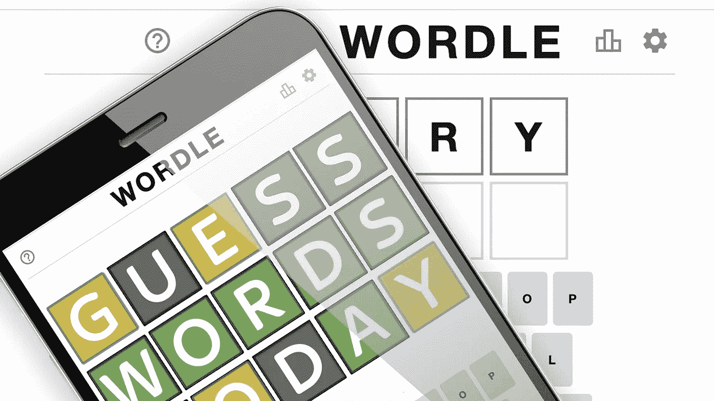
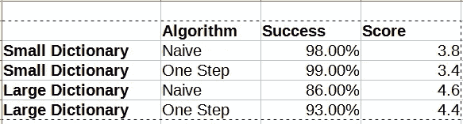

# 打败沃尔多。

> 原文：<https://levelup.gitconnected.com/beat-wordle-ddbe84882f52>

## (有程序但没有统计)



毫无疑问，Wordle 是一种令人上瘾的时尚，网络上充斥着如何玩这个游戏的建议。像许多计算机科学家一样，我的兴趣在于编写程序来击败游戏，而不是自己玩游戏。毫无疑问，有几种这样的解决方案，其中一些使用字母和单词的统计分析。

我的第一次尝试是一个天真的解决方案，只是随机尝试单词，查看分数，然后根据分数过滤掉字典。然后继续从字典中剩余的单词中随机挑选单词。实现这一点的代码非常简单。

计分器将当前猜测的得分计算为一对(字母，值),其中如果字母正确且位于正确的位置，值为 1，如果字母正确但位于错误的位置，值为 0，如果字母不正确，值为-1。

最后，基于计分器的输出过滤字典:

天真的求解者只是查看当前的字典并随机选择一个单词。

请注意，默认的开启器是 SLATE。我在做了一些实验后选择了这个词，如下一节所述。

剩下的工作就是评估这个求解器的性能。为此，我简单地运行了大量的游戏，并跟踪了两个指标:

1.  *成功率*，这是求解者在六步中成功解决游戏的次数比率
2.  游戏的平均时长，我称之为*分数*。

天真的求解者做得很好。它持续产生 98%或更高的成功率，并得到 3.8 左右的分数。

“官方”Wordle 字典是一个非常小的单词列表，准确地说是 2315 个单词，这解释了为什么成功率这么高。我还使用了我在网上找到的另一本字典，它为我提供了一个 15918 个五个字母单词的列表。在更大的字典上评估性能产生了大约 86%的成功率和 4.5 的平均分数，因此我们看到这两个指标都显著恶化。

## 寻找好的开场动作

在前面的例子中，我使用单词“SLATE”作为开场白。起初，我不知道该用哪个词，所以我通过实验找到了这个词。由于现在我有了一个可以体面运行的程序，我用它来评估不同的开局动作。事实上，我将整个词典输入到程序中，并以每个单词为开头进行了 1000 次模拟。为了让它运行得更快一点，我使用了一个线程池来执行实验。

大约 140 个单词的输出列表，所以我只选择了其中的一个。

## 提高性能

从算法的角度来看，随机选择单词并不完全令人满意。看来，如果我们明智地选择用词，我们应该能够做得更好。有几种方法可以将 Wordle 问题转化为优化问题。例如，这个受欢迎的 YouTube 视频讨论了如何使用基于信息论的模型来评估单词。

在我的方法中，我想避免使用统计方法，因为它们对于字典和所使用的语言来说太具体了。我采用了一种更通用的方法，即在下一步中找到最小化字典大小的单词。字典的大小，当然取决于哪个词是秘密，这是未知的。因此，我们能做的最好的事情就是在所有可能的秘密单词选择中最小化字典的平均大小。诚然，这里有一个最小的统计假设，即当前词典中的所有单词都有相同的可能性。

该算法如下进行:

1.  连续选取当前词典中的每个单词作为猜测的候选词
2.  对于每个猜测，依次将当前词典中的每个单词视为秘密
3.  根据秘密和猜测生成分数。
4.  根据分数过滤字典
5.  计算所有可能的秘密的平均大小。这是猜测的**值**

该算法然后选择具有最低值的猜测。该算法的计算量更大，因为对于每个游戏迭代，我们必须进行 n 次评估，其中 n 是当前字典的大小。

它的表现更好吗？

在新算法上运行性能评估测试时，我始终获得了 99%的成功率和接近 3.5 的平均分数——比朴素算法的 3.8 有了显著的提高。

当我们使用更大的字典时，结果会更加明显。在这种情况下，我获得了 4.4 左右的平均分数和 93%的成功率，这是一个显著的进步。



以下是 15，918 个单词的大词典中求解程序未能做出正确猜测的单词:

```
LOVES, ['SLATE', 'RILES', 'LOGES', 'LODES', 'LOSES', 'LOPES']
MALES, ['SLATE', 'LASER', 'HALES', 'WALES', 'GALES', 'VALES']
CAPES, ['SLATE', 'RASEN', 'CAMES', 'CADES', 'CAVES', 'CAFES']
GAMPS, ['SLATE', 'ISBAS', 'KARNS', 'PADUS', 'WASPS', 'VAMPS']
DARED, ['SLATE', 'ADZER', 'PARED', 'CARED', 'EARED', 'HARED']
TOYED, ['SLATE', 'TENOR', 'TOTED', 'TOPED', 'TOWED', 'TOGED']
MOVED, ['SLATE', 'PREDY', 'BEDIN', 'COWED', 'HOMED', 'MOOED']
MARCS, ['SLATE', 'KAPHS', 'DARNS', 'BARMS', 'MARAS', 'MARYS']
SHORE, ['SLATE', 'SPIRE', 'SCORE', 'SWORE', 'SNORE', 'SMORE']
BOXER, ['SLATE', 'JOKER', 'MODER', 'COWER', 'BONER', 'BOYER']
```

## 关于最优性的一点注记

我称之为“OneStepLookahead”解算器，因为它只根据游戏中的下一阶段进行评估。一个完全最优的解算器会着眼于未来的每一步来选择能产生最佳综合得分的单词。这些问题的数学框架是马尔可夫决策过程。由于我不希望指定一个统计模型，我不知道潜在马尔可夫过程的先验转移概率，所以它们必须在行动中被发现。这表明强化学习是获得更好解算器的框架。也许这是未来值得探索的东西。

完整的代码可以在 [GitHub](https://github.com/algorythmist/wordle-solver) 上找到