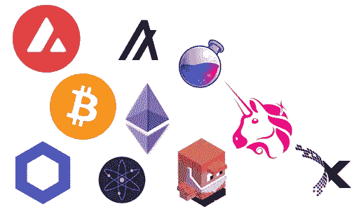

# 击败熊——在秘密空间

> 原文：<https://levelup.gitconnected.com/beating-the-bears-in-crypto-space-8cfe9d2d03f8>

随着时间的推移，我们已经看到了多次经济危机，市场经历了疯狂的波动和大起大落。在每一次危机周期中，许多人得到 [REKT](https://academy.binance.com/en/glossary/rekt) ，许多公司和创业公司被彻底消灭，或者至少再也回不到他们以前的市场估值。

在 crypto 中，市场波动的影响更加不利，因为与传统资产相比，crypto 的市值非常小([至少小 50 倍](https://8marketcap.com/compare/))。因此，与股票、房地产或其他一些传统资产相比，危机期间的波动性更大。毫无疑问，随着时间的推移，我们将看到区块链技术变得更加成熟，其产品越来越多地被采用，密码的市值将上升，波动性将降低。但要达到大规模采用的水平，还需要几年到几十年。在此期间，散户和机构如何才能战胜熊市，在每个周期中生存下来？本文将简要讨论一些能帮助战胜多年熊市并成为长期赢家的关键项目。在文章的最后，我提到了我认为将在下一个周期脱颖而出并能帮助你在市场中生存的十大项目:

**1。**在熊市周期，打折销售将无处不在。在熊市期间，你可以花时间深入学习，而没有大肆宣传和 FOMO ( [害怕错过](https://academy.binance.com/en/glossary/fear-of-missing-out))。利用这段时间尽可能多地了解区块链技术的基础知识。你可以从 academy.binance.com 的币安学院()开始学习区块链的基本原理和不同方面。关于积累，没有必要等待绝对的底部，因为没有人知道底部会在哪里。DCA ( [美元平均成本](https://academy.binance.com/en/glossary/dollar-cost-averaging))是在熊市周期中积累的好方法。这里最关键也是最重要的一点是，预测哪家公司将在熊市中幸存下来，并在市场复苏时抵达新 ATH(达到历史新高)。如果这对你来说太难了，那就坚持使用比特币(BTC)，因为在贝尔斯登，这是更安全的选择。但是，作为投资者，你的目标应该是跑赢比特币或以太坊的表现。因此，用这些来衡量你的投资组合，而不是美元或稳定的硬币。如果你认为你很难找到这样的项目，那么就和 BTC 呆在一起，不要有压力。但要确保你不持有 BTC，而是试图通过使用顶级 Defi ( [分散融资](https://academy.binance.com/en/glossary/defi))协议，如 [TraderJoe](https://traderjoexyz.com/) 、[渗透](https://app.osmosis.zone/)、 [UniSwap](https://uniswap.org/) 等，提供流动性，从而基于你的持有创造被动收入。

**2。**你可能听说过市场中的时间比选择市场时机更重要。不要试图把握市场时机。在这个世界上，没有人能完美地赶上高峰或低谷。最好的方法是以同样的速度学习空间，不管是熊还是牛。这最终会帮助你在不同的情况下积累更多的经验。如果你完全退出市场，希望你能抓住市场的底部，你会错过很多在这个领域取得成功所必须的知识。与社区和开发者保持联系，不断了解该领域的创新。

**3。**不要做杠杆交易或做空或日内交易。那些会让你精疲力尽。在市场低迷时期使用 Defi 协议时，摆脱任何杠杆或债务。这些会让你成为终极 REKT。Defi 和 AMM·德克斯([自动做市商](https://academy.binance.com/en/articles/what-is-an-automated-market-maker-amm))是一个成长空间，有一个超级光明的未来，还有很长的路要走。DEX([分散交易所](https://academy.binance.com/en/articles/what-is-a-decentralized-exchange-dex)即 [TraderJoe](https://traderjoexyz.com/) 、[渗透](https://app.osmosis.zone/)、 [UniSwap](https://uniswap.org/) 等)目前的交易量和流动性不到 CEX(集中交易所即[比特币基地](https://coinbase.com/join/sarker_ee)、[币安](https://accounts.binance.us/en/register?ref=35058615)等)的 10%，未来几天从 CEX 撤出后，交易量将大幅增加。但是当使用 Defi 时，我们很多时候使用杠杆作为借贷协议的借款。

当市场处于上升趋势时，杠杆或借贷方法有效，但在市场下跌时要非常小心。在市场长期低迷期间，努力摆脱所有这些杠杆，让你的资产能够在市场仍然低迷时创造被动收入，而你持有你的资产。最好的办法是选择超级强的项目，并保证其中的 IL ( [非永久性损失](https://academy.binance.com/en/articles/impermanent-loss-explained))较少。在池中建立交易对并提供流动性，这将在你持有资产时创造被动收入。在指数交易中，你的流动性被交易者/ [套利者](https://academy.binance.com/en/glossary/arbitrage)使用，当他们交易时，你根据你在资金池中提供的流动性获得交易费。尝试利用这种 AMM 指数。毫无疑问，你需要做尽职调查，根据你提供流动性的协议的安全性，选择质量最好的 AMM DEX。

**4。**每个周期的大部分项目不会再在 ATH 出现，或者由于缺乏资金或缺乏进一步发展项目所需的新想法或资源，到下一个周期将会停止，创始人/社区离开了项目。此外，由于超积极的创新步伐，我们已经看到新的项目或想法出现，并从现有项目中脱颖而出。因此，当市场显示即将到来的金融危机或更长时间的熊市周期时，确保将投资组合精简为最有机会在市场中生存的项目。最好的方法是关注那些仍然在交付和迭代产品的构建者，他们仍然非常关注社区。查看团队的 Twitter、telegram、discord、Github feed，了解团队如何与社区互动。

**5。**通过学习一些在开发区块链基础设施(如 Rust、Solidity、Java、Haskell 等)中有用的编码，尝试培养一些技能。如果学习编码太难了，那就试着成为你投资的最喜欢的区块链的制作人或者验证者。通过测试他们的产品来知道你的投资是好是坏的最好方法。区块链基础设施的关键产品之一是网络的验证或在简单的构建数据库中生成块。试着学习如何通过成为验证者来为网络做贡献。这将大大有助于提高你对技术的理解，你也会发现你所投资的项目的利弊。在 2018–2020 的上一个熊周期，我是多个区块链的验证者如 [Cardano Stake](https://www.coincashew.com/coins/overview-ada/guide-how-to-build-a-haskell-stakepool-node) pool、 [Wanchain 跨链](https://www.explorewanchain.org/#/storeman/node-setup) Bridge 验证者、 [Algorand 参与节点](https://developer.algorand.org/docs/run-a-node/setup/install/)、用于[雪崩区块链](https://docs.avax.network/nodes/build/run-avalanche-node-manually)的验证者。当我运行所有这些节点时，我已经想出哪一个将是我最终想要移动的区块链生态系统，因为我已经积极地测试了他们的网络分散化设计。猜猜我最后是哪一个？那是雪崩。请随意测试这种方法，以了解您在技术开发和创新方面的投资有多好。

**6。试着从你的传统世界中创造额外的被动收入，这样你就能在整个熊市周期中继续买入。可以是兼职，自由职业或者任何你擅长的事情。例如，在 2018 年至 2020 年的《最后一只熊》中，我开始为一些活动拍摄[照片](https://jonbuet.wixsite.com/jcsarker/p)，比如生日派对、产妇、儿童照片等，以获得一些额外的钱，这样我就可以继续建立我的加密组合。如果你已经有一些资产或业务产生被动收入，那么这对你来说是一个加分项。从那里获得一些被动收入，并不断用你打算发展的项目建立你的投资组合。一致性是这个领域的关键。坚持不懈，不可阻挡！！！！确保在整个熊市周期中尽可能多的买入。如果运用得当，熊市实际上是一份礼物和难得的机会。我们现在知道，当世界以各种形式的资产在区块链上被令牌化时，区块链将会存在，这只是时间问题。所以，接受熊市这个稀有礼物来积累你的财富吧！**

**7。尽可能降低和削减你的所有开支。例如，在 2018 年的最后一只熊中，我停止戒烟以节省一些额外的钱，以便我可以在熊中积累一些好的项目。试着找到一种方法来减少你周围的额外支出，并尽可能多地增加熊市期间积累的现金流。如果你要做很多事情，或者你是一个游览好地方的爱好者，停止过多的旅行。当然，如果你在打败熊后等上 1-2 年，你可以去那些更有趣的地方。**

**8。在熊市期间忽略好项目的市场价格，因为在熊市期间一切看起来都很糟糕，价格不是判断好项目的好指标。做研究，寻找可靠的创新项目，并在这些项目上保持平均成本。停止购买那些没有积极建设和没有满足他们对路线图的承诺的项目。当市场在熊市周期结束时完全投降时，超过 95%的人会死亡。尝试找出哪些项目解决了该领域中真正的挑战性问题，例如 [L1 智能合同](https://www.alchemy.com/overviews/layer-1-blockchain-ecosystems-overview)，它可以在不损害分散性或安全性的情况下实现超快速终结，[跨链桥或互操作性](https://axelar.network/an-introduction-to-the-axelar-network)，[Oracle](https://chain.link/education/blockchain-oracles)，Defi 等。调整你的论文，确保有好的项目，去掉那些你怀疑会存活的项目。**

**9。**观察[美联储](https://www.investing.com/economic-calendar/interest-rate-decision-168)和政府在经济决策上采取的行动，尤其是美国。似乎现在加密和所有其他资产都与美联储的货币政策挂钩，因为世界正在努力控制通货膨胀。如果你看到印钞机响了，这意味着牛市，印钞机响了，那就轮到熊市了。注意联邦政府是如何对抗通货膨胀和控制货币供应的。就随波逐流去判断即将到来的行情吧。

**10。**如果你非常确信市场已经完全投降，或者像 [2020 年 3 月中旬](https://www.forbes.com/sites/cryptoconfidential/2020/03/15/bitcoins-coronavirus-crash-blockchain-in-a-pandemic/?sh=7b761ef42a5b) (Covid 锁定)那样发生了巨大的灾难，我们已经看到加密市场在 24 小时内绝对损失了 50%以上，那就继续用你所有的闲钱出手吧。但你必须确保你当时投资的项目坚如磐石。因为这些投资会让你发财。如果你在有生之年遇到这样的灾难，从你的信用卡或 401K 账户中借一些也没关系。

**在 2018-2020 年的最后一次熊市中幸存下来，根据我过去 5 年在加密领域的经验，以下是我认为将在下一轮中脱颖而出的 10 大项目:**

1.[**Avalanche**](https://www.avax.network/)**(AVAX)**—就一致性、可扩展性和分散性而言，Avalanche 是该领域中最佳的 L1 智能合约。Avalanche 是第一个同时支持亚秒事务终结性并拥有数量不限的块生成验证器的共识。这就像最大程度的去中心化带来的近乎无限的可扩展性。数百万 Dapps 现在可以运行或构建自己定制的区块链，并使用 Avalanche consensus 及其子网技术在亚秒内完成交互。

2. [**比特币**](https://bitcoin.org/en/)**【BTC】**—巨大的储值空间、市场推动者和所有加密技术中被采用最多、流动性最高的资产

3. [**链环**](https://chain.link/) **(链环)** —最好的甲骨文。一个非常重要但在整个加密领域仍被低估的产品。没有 Oracle，任何东西都无法运行，也无法与区块链和传统数据源交互。Chainlink 是整个区块链领域中最好、最受欢迎的 Oracle 产品。

4. [**宇宙**](https://cosmos.network/) **【凌动】** —大 L1 智能合约基础设施。允许在建设主权区块链时进行大规模定制

5. [**以太坊**](https://ethereum.org/en/) **(ETH)** —由于先发制人，大多数开发商采用 L1 智能合约

6.[**Algorand**](https://www.algorand.com/)**(ALGO)**—接近 2-3 秒的超快速终结，并与许多 CBDC(中央银行数字货币)项目合作

7.

8. [**渗透**](https://app.osmosis.zone/) **(OSMO)** —构建于 Cosmos 之上的顶级、前沿 DEX 之一。只有 L1 的 DEX 没有在任何 CEX 上市，但仍然排在流动性最高的前 10 名。

9.[**UNI swap**](https://uniswap.org/)**(UNI)**—由于先动者的原因，空间中使用最多、流动性最高的指标

10.[**Axelar**](https://axelar.network/)**(AXL)**—最好的跨链和互操作协议之一，呈指数级增长。交叉链是连接不同区块链以实现无缝通信的超级关键部分。在撰写本文时，AXL 令牌还没有在任何交易所上市，但这是一个需要关注的项目。

通常，颠覆性技术在熊市-牛市周期的多波中成长，在这些周期中，当其他项目提供更好的解决方案时，许多项目死亡，或者项目由于缺乏资金或执行不当而死亡。因此，在市场低迷时期，选择那些将度过熊市时期的资产，在持有资产的同时设定自己，通过使用适当的智能合约协议，不断产生被动收入。那是杀熊的秘制酱！！！！