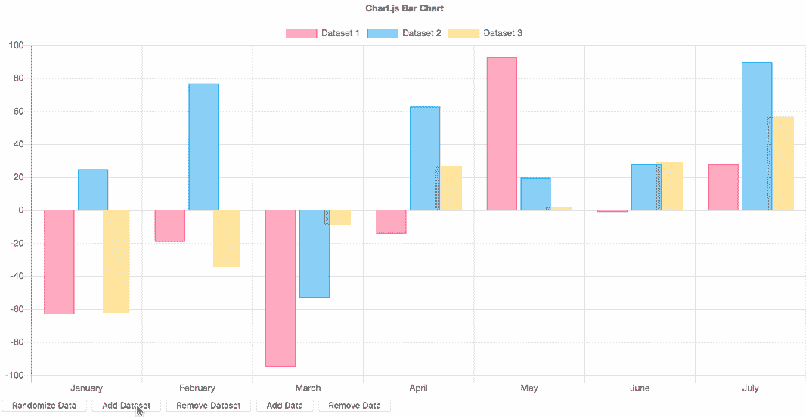
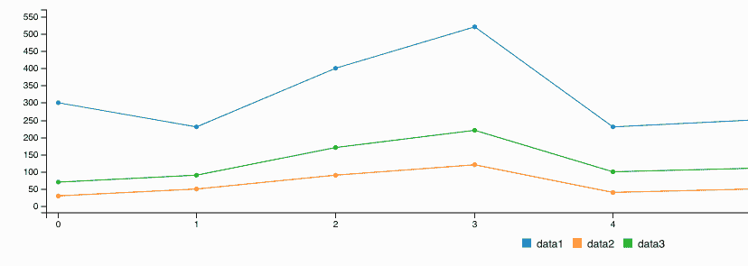
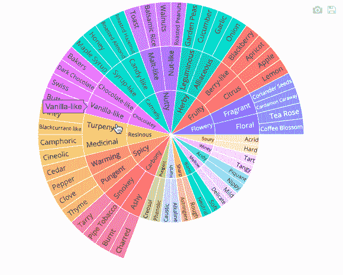
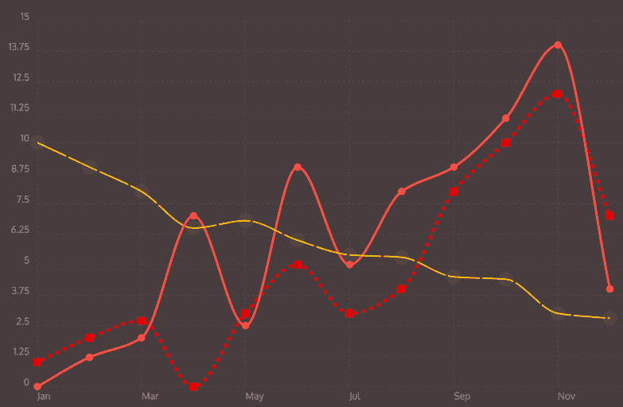

# 漂亮的 JavaScript 数据可视化库

> 原文：<https://levelup.gitconnected.com/beautiful-javascript-data-visualization-libraries-1d3b66d6c318>


马库斯·温克勒在 [Unsplash](https://unsplash.com/s/photos/chart?utm_source=unsplash&utm_medium=referral&utm_content=creditCopyText) 上的照片

如果您正在使用 JavaScript 构建一个 web 应用程序，那么在某些时候您不可避免地需要显示一些数据。最好是以易于理解的方式，这通常意味着生成某种类型的图表或图形。可视化数据是应用程序的一个重要元素，它应该增强应用程序的外观和感觉，而不是用平淡无奇的风格来拖累它。

手动构建图表和图形是耗时的，而且对于今天大量的免费可用库来说，这简直是愚蠢的。但是找到合适的图书馆可能很困难。有这么多的选择，它可以压倒。在特性、元素的外观和感觉以及配置的复杂性之间取得平衡是很棘手的。

我收集了一些优秀的、免费的、易于使用的图表库，它们体现了这些元素的完美平衡，而又不太笨重或复杂。我还将提供一些链接和附加信息，以便将每个库与一些流行的框架一起使用，如 React、Vue 或 Ember。

## [Chart.js](https://www.chartjs.org/)


[https://www.chartjs.org/](https://www.chartjs.org/)

现代、时尚、流行且易于实施。对于任何项目来说，Chart.js 都是一个极好的库，因为它简单而优雅。元素反应灵敏，看起来棒极了。Chart.js 使用 HTML5 元素，这意味着动画和渲染在各种浏览器中都非常流畅和高效。



[https://www . chart js . org/samples/latest/charts/bar/vertical . html](https://www.chartjs.org/samples/latest/charts/bar/vertical.html)

这个库对任何项目都是一个很好的补充，甚至可以显示最复杂的数据集。使用 Chart.js，您可以免费获得许多内置功能和交互性。像启用或禁用不同数据集这样的切换是默认提供的，这使得制作有用的动态视觉效果变得轻而易举。有关设置 Chart.js 的更多详细信息，请查看官方文档。Stanley Ulili 还提供了一个很棒的初学者指南，带你一点一点地完成每个步骤[点击这里](https://www.stanleyulili.com/javascript/beginner-guide-to-chartjs/)。

*Chart.js 插件:*

*   [react-chartjs-2](https://github.com/jerairrest/react-chartjs-2) (React)
*   [vue-chartjs](https://vue-chartjs.org/)
*   ember-cli-chart (Ember)

## [C3.js](https://c3js.org/)


[https://c3js.org/](https://c3js.org/)

C3.js 是使用 D3.js 构建的，D3 . js 是许多数据、其他可视化库甚至一些云笔记本接口如 [Observable](https://observablehq.com) 的底层框架。D3.js 有很多特性，如果你只是想要一些灵活的图形来显示简单的数据，你可能不需要所有的特性。别担心，C3 会保护你的。



[https://c3js.org/](https://c3js.org/)

尽管 C3 元素在视觉上可能不像 Chart.js 或其他库那么光滑，但它们的功能非常强大，并且提供了很大的灵活性。像其他库一样，C3 非常简单易用。实现一个简单的条形图非常容易，下面是他们网站上的一个例子:

```
// adapted from [https://c3js.org/samples/chart_bar.html](https://c3js.org/samples/chart_bar.html)
let chart = c3.generate({
    data: {
        columns: [
            ['data-1', 10, 20, 30, 40, 50, 60],
            ['data-2', 70, 80, 90, 100, 90, 80]
        ],
        type: 'bar'
    },
    bar: {
        width: {
            ratio: 0.75
        }
    }
});
```

查看 C3.js [示例](https://c3js.org/examples.html)以获得更多令人惊叹的可视化数据类型。

*C3.js 插件:*

*   [react-c3js](https://github.com/bcbcarl/react-c3js) (React)
*   [vue-c3](https://github.com/chryb/vue-c3) (Vue)
*   余烬-c3

## [阴谋地](https://plotly.com/javascript/)


[https://plotly.com](https://plotly.com)

Plotly 是一个数据可视化的发电站。在其他库可能缺少某些深奥的可视化类型的地方，Plotly 可能拥有它们。有许多不同的类型可供选择。Plotly JavaScript 图表库也是基于 D3.js 构建的，但是它们也为 [Python](https://plotly.com/python/) 和 [R](https://plotly.com/r/) 语言提供了相同的图表功能。



[https://plotly.com/javascript/sunburst-charts/](https://plotly.com/javascript/sunburst-charts/)

Plotly 不仅有多种图表类型，它还有非常棒的文档。有关于配置每种图表类型的特别详细的指南和用于决定哪种类型适合您的项目的交互式示例。Plotly 令人难以置信的产品的唯一缺点是一些元素的设置非常复杂。根据您选择的图表类型，您可能会看到一条陡峭的配置曲线。

*Plotly 插件:*

*   [React-plottly](https://plotly.com/javascript/react/)(React)(GitHub 可用[此处](https://github.com/plotly/react-plotly.js/))
*   [vue-plotly](https://github.com/David-Desmaisons/vue-plotly) (Vue)
*   余烬-CLI-plottly(余烬)

## [charist . js](https://gionkunz.github.io/chartist-js/)


[https://gionkunz.github.io/chartist-js/](https://gionkunz.github.io/chartist-js/)

图表数据乍一看有些不同。它们没有其他库那样的犀利和死板。图表有一种柔软，平滑的感觉，动画看起来令人难以置信。这是因为 Chartist 使用 SVG 图形和 CSS 动画。如果你以前经历过 CSS 动画的大量应用(例如 animista.net)，并且感觉到风格的平滑和流畅，那么 Chartist 是一个很好的选择。如果您要在已经充满动画的站点中可视化数据，或者如果您的主题遵循相同的基本样式，图表样式会特别有用。

> "只有 10KB (Gzip)，没有依赖性！"



[https://gionkunz.github.io/chartist-js/](https://gionkunz.github.io/chartist-js/)

Chartist 还以其超小的占地面积而自豪。尽管这些令人眼花缭乱的动画看起来成本很高，但查特斯特声称:

> "只有 10KB (Gzip)，没有依赖性！"
> —[charist . js](https://gionkunz.github.io/chartist-js/index.html)

因此，如果您的项目高度受限于大小，或者您不喜欢添加臃肿的库(不管怎样，谁会这样做),那就去看看吧。

*图表插件:*

*   [React-图表制作者](https://github.com/fraserxu/react-chartist) (React)
*   图表绘制者
*   余烬-气候图表专家
*   [更多信息请访问图表网站](https://gionkunz.github.io/chartist-js/index.html)

*感谢您的阅读。我希望您喜欢发现这些数据可视化库的优雅和强大功能。尽管它们中的许多一开始看起来都是类似地实现的，但是在表面之下，每一个都有稍微不同的目标和细微差别，尤其是当涉及到用户界面时。尝试使用这些库中的一个来增强您自己的项目，以获得视觉上更丰富、更吸引人的数据体验。*