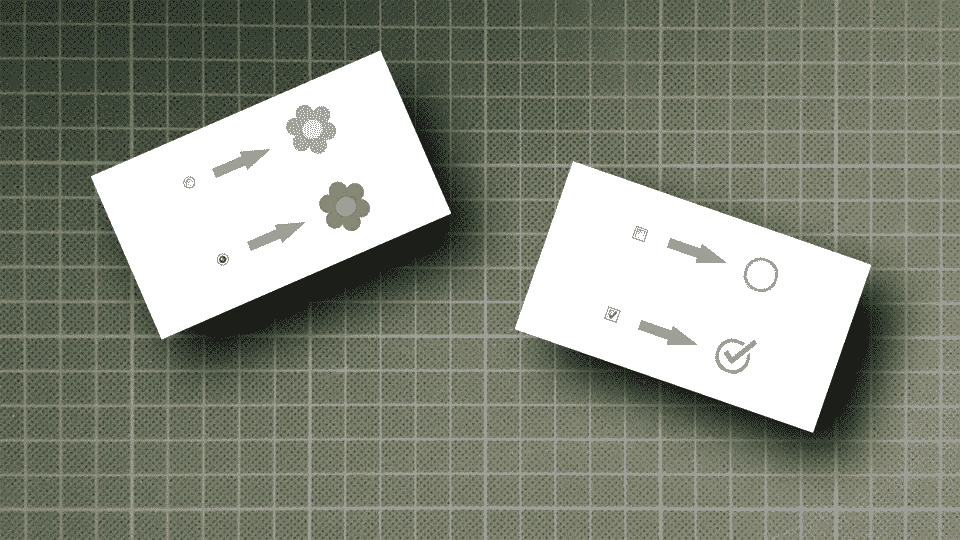

# 只有 CSS 才有漂亮的单选和复选框输入

> 原文：<https://levelup.gitconnected.com/beautiful-radio-and-checkbox-inputs-only-with-css-1359980f94f9>

## 不需要 Javascript 来改变浏览器特定的输入外观



作者提供的图片

你有没有想过有没有一种方法可以改变复选框或单选按钮的外观，而不需要使用 Javascript，只需要使用 CSS 就可以保持标准的浏览器功能？

Web 设计者希望开发人员让这些输入元素看起来像他们在设计工具中设计的那样。但唯一的方法是用 Javascript 伪造浏览器功能。

使用任何 HTML 元素，给它一个未选中的样式和一个选中的样式，用“onclick”事件改变样式，并改变隐藏输入的值。

我对这个解决方案一直不太满意，有一天，我遇到了另一个有这个需求的项目。所以我试着找一个不用 Javascript 的方法。在花了很多时间研究 CSS 和不同的 web 浏览器之后，我发现了一个非常简单的解决方案。

# CSS“外观”有魔力吗

```
input[type="checkbox"],
input[type="radio"] {
  appearance: none;
  -moz-appearance: none;
  -webkit-appearance: none;
}
```

这几行给了我们一个在 Edge、Firefox、Chrome、Safari 和 Opera 中空白的不可见输入元素。现在我们可以做我们想做的:宽度、高度、背景颜色、边框、边框半径、框阴影，也许还有最重要的属性:背景图像！

# 政府检查过了吗？

是的，那也很容易。只需将它添加到您的 CSS 代码中:

```
input[type=radio]:checked {
  properties: you-want;
}
```

对了，还可以用伪类“:hover”。

也许你曾经尝试过在单选或复选框输入中使用“:after”或“:before”，你注意到它在 Firefox 中不起作用。没有火狐默认的外观，它现在正在做！

这里有一个完整的示例代码，你可以复制粘贴，然后玩:

```
input[type=checkbox],
input[type=radio] {
  appearance: none;
  -moz-appearance: none;
  -webkit-appearance: none;
  width: 20px;
  height: 20px;
  background-position: center center;
  background-repeat: no-repeat;
  background-size: contain;
  cursor: pointer;
}input[type=radio] {
  border-radius: 100%;
  background-image: url(bg_radio_off.png);
}input[type=radio]:checked {
  background-image: url(bg_radio_on.png);
}input[type=checkbox] {
  background-image: url(bg_checkbox_off.png);
}input[type=checkbox]:checked {
  background-image: url(bg_checkbox_on.png);
}
```

# Internet Explorer 10、11 在做什么？

它们只呈现宽度和高度属性，其余的都将被忽略，并且使用它们的默认样式。我想我们可以接受。

# 结论

有了这个 CSS，您可以快速摆脱单选和复选框输入的特定于浏览器的样式，不需要 Javascript，但具有完整的浏览器原生功能。

编码快乐！