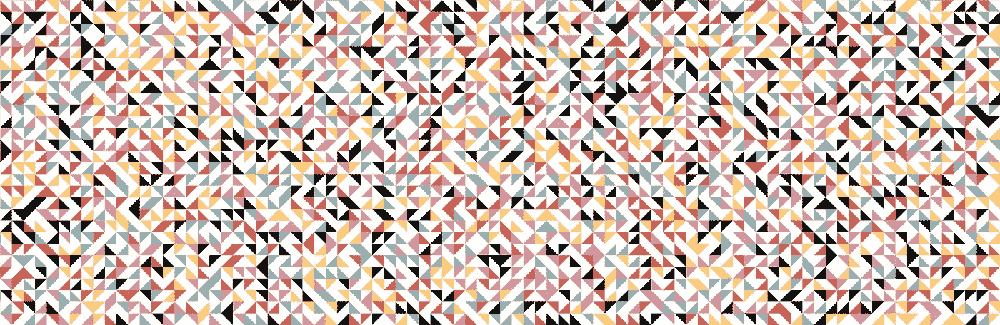
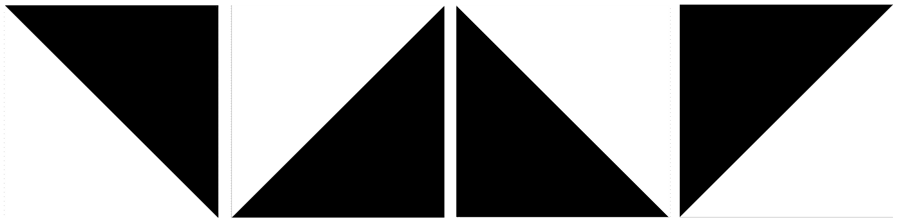
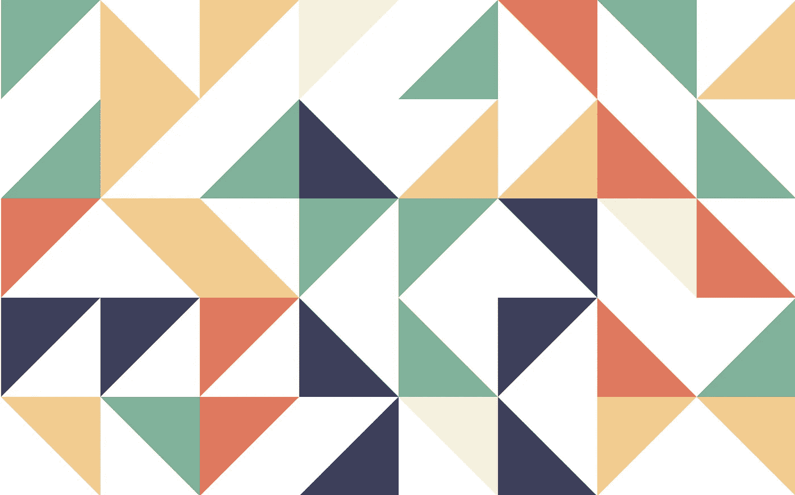
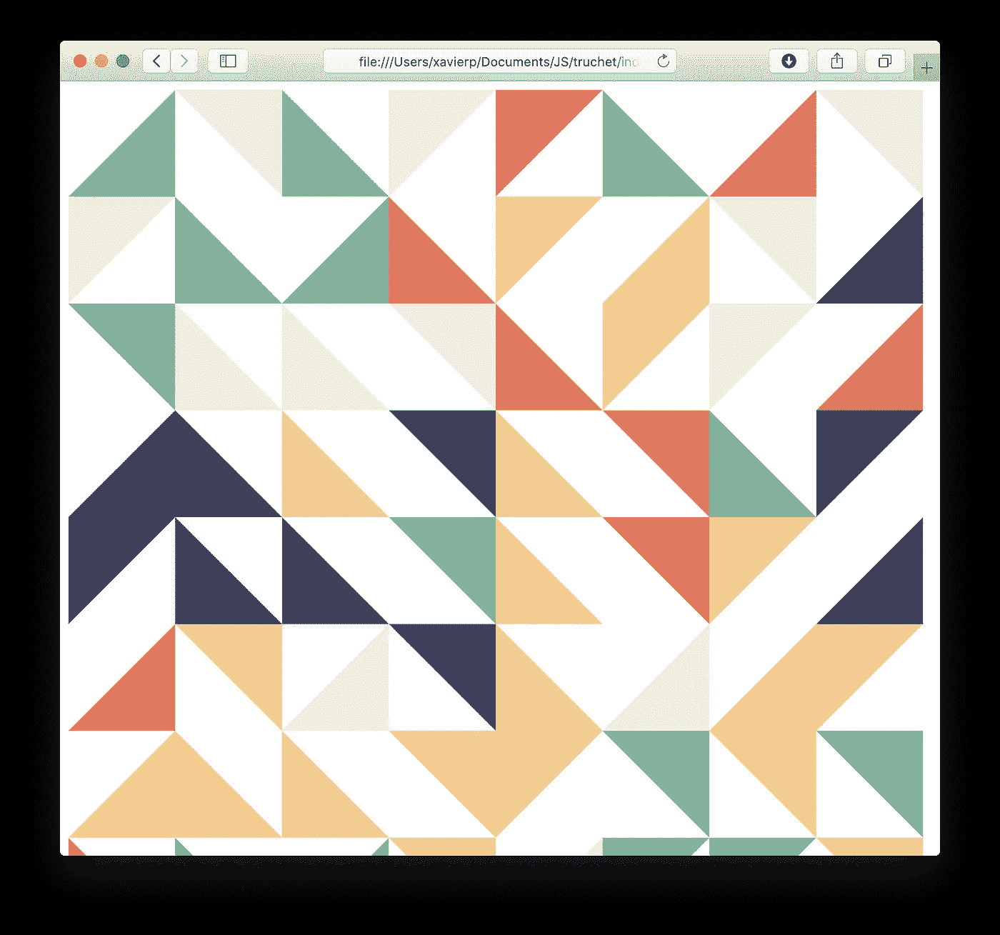

# 使用 JavaScript 和 SVG 为您的装饰需求提供美丽的装饰效果

> 原文：<https://levelup.gitconnected.com/beautiful-truchet-tilings-for-your-decorative-needs-using-javascript-and-svg-6168a60f97f8>

## 辅导的



# 谁被绑架了？

T2:塞巴斯蒂安·特鲁切特(1657-1729)出生于法国里昂，是一位多明尼加人，他因在印刷术、数学和水力学方面的贡献而闻名。


在他的一生中，他监督了大多数法国运河的建设；发明了[排印点](https://en.wikipedia.org/wiki/Point_(typography))；[字体( *Romain du roi* )](https://en.wikipedia.org/wiki/Romain_du_Roi) 后来成为*Times New Roman*；日晷、武器、移植成年树木的引擎；并且——也是这个故事带给我们的——写下了第一份对简单瓷砖(*铺砌*)所有组合的系统研究。

在监督奥尔良运河的工作时，[他写道](http://www.tug.org/TUGboat/Articles/tb20-1/tb62andr.pdf)，

> “[……]我发现了几块瓷砖，打算用来铺在一个小教堂和其他几个公寓的地板上。它们是正方形的，被一条对角线分成两个彩色的部分。为了能够通过这些瓷砖的排列形成令人愉快的设计和图案，我首先研究了这些瓷砖成对连接在一起的方式，总是以棋盘阵列的方式。”

他的发现不久后于 1704 年发表在《皇家科学院回忆录》中，书名为《T21 联合回忆录》(谷歌图书上有售)。

# Truchet Tilings

在一个 Truchet 瓷砖中，只有四个基本的积木:四个正方形被一条对角线分成两个彩色的三角形。



Truchet 镶嵌的四个组成部分。

当这些积木并置在一个表面上时，通常会产生美观的效果，适合展示在例如浴室墙壁或厨房柜台上。事实上，我曾经有几个宜家的抱枕，上面有 Truchet 图案。



## Java Script 语言

我们现在开发非常简单的 JavaScript 代码来生成如此漂亮的镶嵌图。我们从制作文档的框架开始。

```
<html>
<svg id="svg" width="800" height="800"></svg>
<script>let svg = document.getElementById('svg')
let tiles = 16
let w = svg.getBoundingClientRect().width / tiles
let h = svg.getBoundingClientRect().height / tiles
let colors = ['#f4f1de','#e07a5f','#3d405b','#81b29a','#f2cc8f']</script>
</html>
```

到目前为止，我们已经设置了尺寸为`800x800`的`[SVG](https://en.wikipedia.org/wiki/Scalable_Vector_Graphics)`组件，我们将在其上绘制；我们希望每行/每列使用多少瓷砖(参见`16`)及其尺寸(参见`w`和`h`)；和调色板。

接下来，我们将在表面放置随机颜色的随机瓷砖。

```
for (let row = 0; row < tiles; row++){
  for (let col = 0; col < tiles; col++) {
    let x = col * w
    let y = row * h
    let r = rand(4)
    let c = colors[rand(colors.length)]

    switch (r) {
      case 0:
        triangle0(svg, c, x, y, w, h)
        break
      case 1:
        triangle1(svg, c, x, y, w, h)
        break
      case 2:
        triangle2(svg, c, x, y, w, h)
        break
      case 3:
        triangle3(svg, c, x, y, w, h)
        break
    }
  }
}
```

实际上，上面缺少的只是`rand`和每个独立图块的实现(参见`triangle*`)。*我告诉过你事情会很简单*。

`rand`的定义如下，用于产生上界伪随机整数:

```
function rand(m) {
  return Math.floor(Math.random() * Math.floor(m))
}
```

为了实现我们所有的图块(参见`triangle*`)，我们将使用一个更通用的版本`tri`，在 SVG 上绘制一个给定颜色的给定三角形。

```
function tri(svg, c, x1, y1, x2, y2, x3, y3) {
  let p = document.createElementNS("http://www.w3.org/2000/svg", "polygon");
  p.setAttribute("points", `${x1},${y1} ${x2},${y2} ${x3},${y3}`)
  p.setAttribute("style", `fill:${c}`)
  svg.appendChild(p)
}
```

这样，我们所有的图块都可以实现为一行代码，如下所示:

```
function triangle0(svg, c, x, y, w, h) {
  tri(svg, c, x, y, x + w, y, x, y + h)
}function triangle1(svg, c, x, y, w, h) {
  tri(svg, c, x + w, y, x + w, y + h, x, y)
}function triangle2(svg, c, x, y, w, h) {
  tri(svg, c, x + w, y + h, x, y + h, x + w, y)
}function triangle3(svg, c, x, y, w, h) {
  tri(svg, c, x, y + h, x, y, x + w, y + h)
}
```

现在，我们在浏览器中打开 HTML 文件，欣赏我们的工作。每次刷新页面时，都会出现不同的平铺效果。



# 参考

*   雅克·安德烈的[网站](http://jacques-andre.fr)。
*   [完整源代码](https://gist.github.com/xavierpinho/ced97c767ef73b6cbc7cfd077da5ea1f)在此作为 GitHub 要点提供。
*   使用四分之一圆的 Truchet 平铺变体的类似教程。