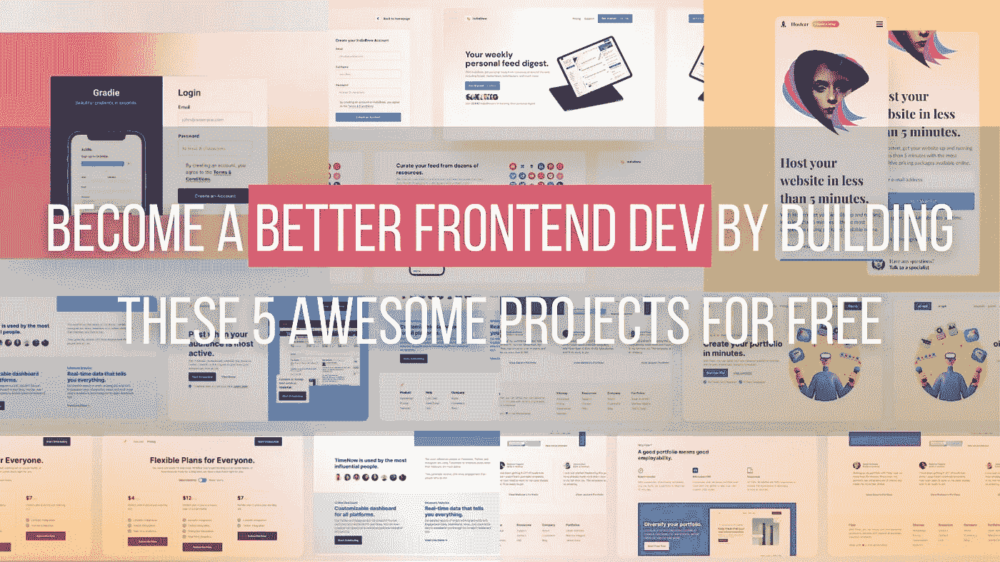
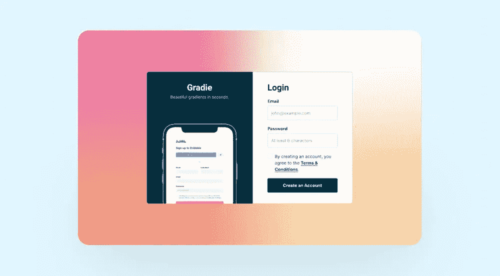
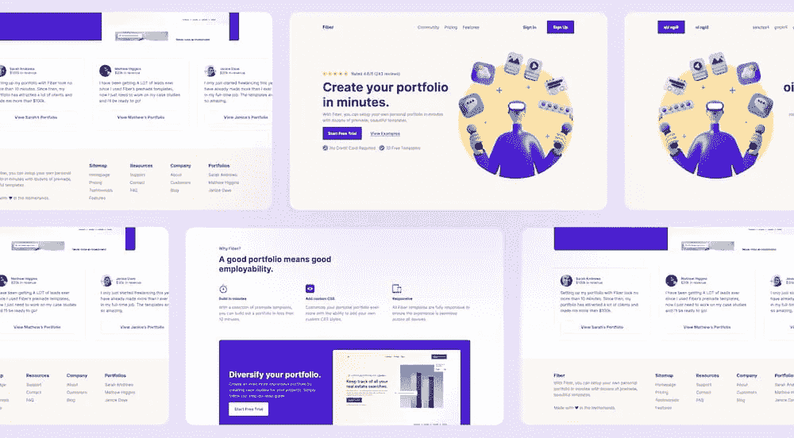
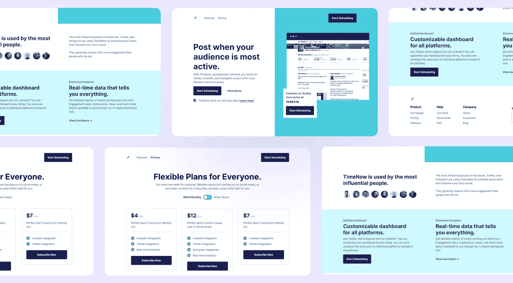
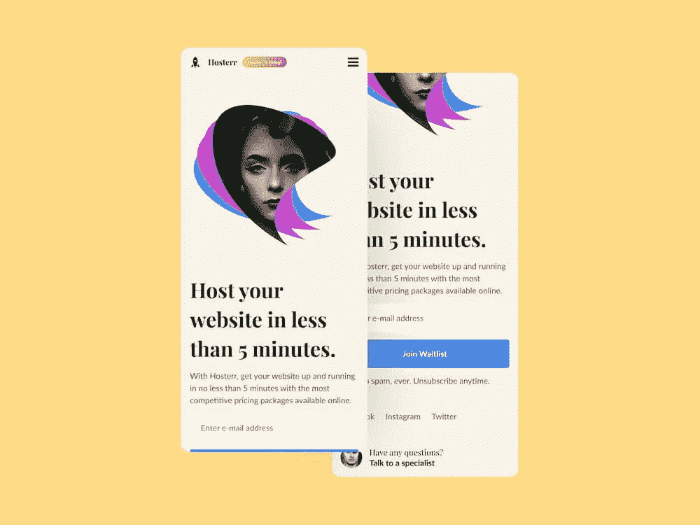
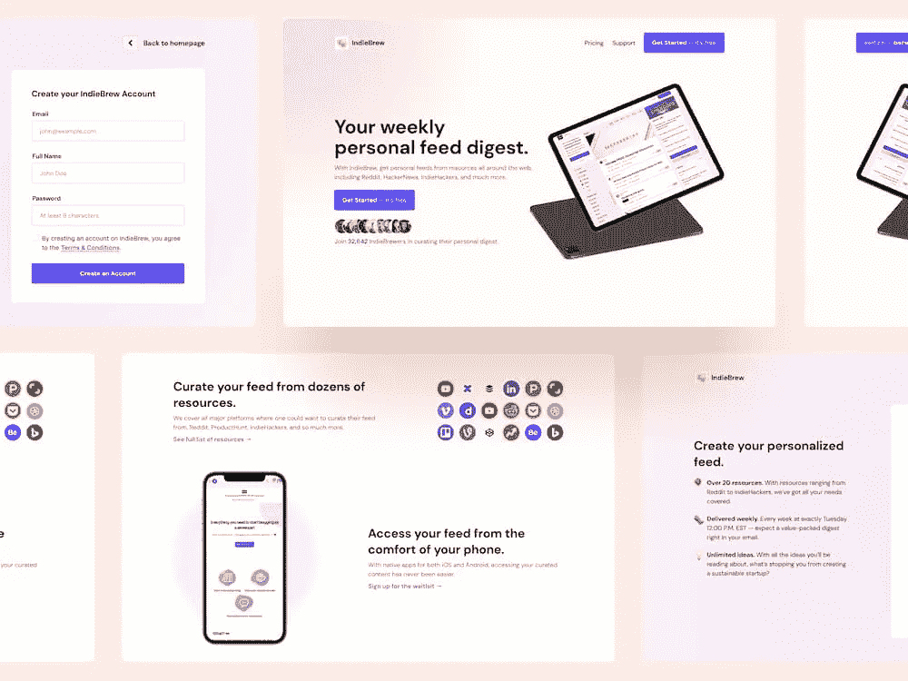

# 成为一个更好的前端开发建设这 5 个可怕的项目免费

> 原文：<https://levelup.gitconnected.com/become-a-better-frontend-dev-by-building-these-5-awesome-projects-for-free-2bd7cc6b5989>

## 学习编码的最好方法是构建真正的项目。

如果你已经是一名开发人员，那么你应该知道教程在解决特定问题时是有趣的，而不是为了培养你的编码技能。如果你是这方面的初学者，这里是我给你的黄金建议:

> 没有什么比构建真实的项目和解决真实世界的问题更能学习和加强你的编码技能了！

这就是为什么我与你分享这篇文章，以帮助你找到正确的地方和方法来建立和加强你作为开发人员的前端技能。

本文涵盖了我测试过的顶级项目列表，通过在真实的设计模板上练习，这些项目对构建你的前端技能很有帮助。这绝对会让你置身于真实的公司项目情境中！因此，没有什么比准备前端开发工作更好的了；)

你还在等什么？我们进攻吧😈

# 一级注册页面

注册页面是你在真实项目中一定会发现的东西。这个项目将帮助您建立下面的页面。这个项目是伟大的实践中心布局和绝对定位。

**你要练习那些要点:**

*   居中 div(在前端世界中必须知道)
*   定位(更准确地说是绝对位置)
*   样式(向页面字段添加 CSS)

**你将有在这个项目中成功的投入:**

*   资产(图标、图像等。)
*   README.md 文件
*   用于桌面、平板和移动设备的 PNG 设计文件。
*   +其他做过这个[挑战](https://www.codewell.cc/challenges/608ac420650dff001599e8ec)的开发者的反馈。

CodeWell 上的注册挑战

你可以在 [Codewell](https://www.codewell.cc/challenges/608ac420650dff001599e8ec) 上找到关于这个挑战的更多细节。

# 双光纤登录页面

你只是开动了你的脑筋。太好了。现在，更进一步。构建登录页面。这个项目是伟大的实践灵活/网格布局，绝对定位，和滑块。

> 响应点击动作按钮而出现的单个[网页](https://en.wikipedia.org/wiki/Web_page)。

**您将练习以下功能:**

*   绝对定位
*   Flex/Grid(对真实项目体验非常重要)
*   创建卡片

**你将在这个项目中获得成功的投入:**

*   资产(图标、图像等。)
*   README.md 文件
*   用于桌面、平板和移动设备的 PNG 设计文件。
*   +做过这个[挑战](https://www.codewell.cc/challenges/608a7e639691700015db16d1)的其他开发者的反馈。

光纤局域网页面挑战由 [CodeWell](https://www.codewell.cc/challenges/608a7e639691700015db16d1)

# [3- TimeNow 登陆和定价页面](https://www.codewell.cc/challenges/608d9a7d747bad001532bd70)

现在，在构建了登录页面之后，这里是一个具有更多功能的高级登录页面。这个项目非常适合练习定制组件和 flex 布局。

**你将练习以下功能:**

*   创建自定义组件，如 toggles(了解基于组件的架构， ***超级重要的*** )
*   创建容器(了解容器中的内容)
*   创建两页网站

**你将在这个项目中获得成功的投入:**

*   资产(图标、图像等。)
*   README.md 文件
*   用于桌面、平板和移动设备的 PNG 设计文件。
*   +做过这个[挑战](https://www.codewell.cc/challenges/608d9a7d747bad001532bd70)的其他开发者的反馈。

[CodeWell](https://www.codewell.cc/challenges/608d9a7d747bad001532bd70) 上的高级登录页面挑战

# 4- **主机等待列表页面**

另一个具有更多功能的登录页面项目。这个项目有一个很好的模板来练习你的 CSS 转换和伸缩技巧。

**你将练习以下功能:**

*   构建和设计表单。
*   构建响应式设计
*   使用变量

**你将有作为这个项目成功的投入:**

*   资产(图标、图像等。)
*   README.md 文件
*   用于桌面、平板和移动设备的 PNG 设计文件。
*   +其他做过这个[挑战](https://www.codewell.cc/challenges/60b3ea4c0cc72310b5a2494d)的开发者的反馈。

[CodeWell](https://www.codewell.cc/challenges/60b3ea4c0cc72310b5a2494d) 上的 Hosterr 登录页面挑战

# 5- **IndieBrew 登陆页面**

IndieBrew 的模板有一个登陆页面和一个注册页面。非常适合全科医生。在第一个项目(注册项目)中，你将需要你的技能。

你将练习以下功能:

*   构建和设计表单。
*   构建响应式设计
*   定位，CSS 容器…

**你将有在这个项目中取得成功的投入:**

*   资产(图标、图像等。)
*   README.md 文件
*   用于桌面、平板和移动设备的 PNG 设计文件。
*   +其他做过这个[挑战](https://www.codewell.cc/challenges/608aca51650dff001599e8f9)的开发者的反馈。

IndieBrew 登录页面挑战[代码井](https://www.codewell.cc/challenges/608aca51650dff001599e8f9)

# 最后的想法…

这些是你可以在 CodeWell 上做的免费挑战。他们一定会加强你的 CSS 和 HTML 技能。

还有更高级的项目，有更复杂的特性来练习您的 JavaScript 技能和其他有趣的技能。不过，这些挑战需要 CodeWell 订阅成为高级会员才能访问它们。

如果你可以订阅，那么这对你学习更多的东西和用更多有趣的项目建立你的投资组合是有好处的。如果你没钱订阅，没关系，你已经学到了很多东西。你可以在 Youtube 频道上继续你的强化技能之旅，那里有其他开发人员构建的项目。

请与我们分享您的经验和反馈，告诉我们您从这些巨大的挑战中学到了什么！

# 感谢您宝贵的时间，希望这对您有用！

亲爱的读者，我希望这是明确和有用的。我希望你和你的家人无论在哪里都平安无事！坚持住。明天会更好！

**让我们在** [**上取得联系**](https://medium.com/@famzil/)**[**Linkedin**](https://www.linkedin.com/in/fatima-amzil-9031ba95/)**[**脸书**](https://www.facebook.com/The-Front-End-World)**[**insta gram**](https://www.instagram.com/the_frontend_world/)**[**Youtube**](https://www.youtube.com/channel/UCaxr-f9r6P1u7Y7SKFHi12g)**或**********

****[www.fam-front.com](http://www.fam-front.com/)****