# 成为 CSS 选择器专业版

> 原文：<https://levelup.gitconnected.com/become-a-css-selectors-pro-ddcead3d8b26>

在这篇文章中，我将介绍使用 CSS 选择器的概述和一些高级方法，这样你就可以成为一名专业人士。


[Pankaj Patel](https://unsplash.com/@pankajpatel?utm_source=medium&utm_medium=referral) 在 [Unsplash](https://unsplash.com?utm_source=medium&utm_medium=referral) 上拍摄的照片

# 概观

CSS 选择器用于定义 CSS 样式，以及不同的样式如何应用于特定的元素、类或嵌套的元素或类。在最基本的情况下，它们可以匹配像`div`或`span`这样的元素类型，如下例所示，为所有`div`元素设置颜色。

```
div {
  color: black;
}
```

# 基本选择器

这些是您的基本构建模块，并且可能是您最熟悉的在 CSS 中选择元素的方式。有四种类型的基本选择器。

**通过元素**

这是你所有的 html 元素，比如`div`、`input`、`span`、`table`等等。

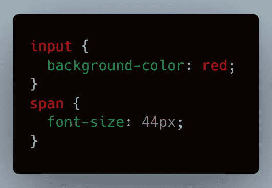

**按类别**

这是基于一个元素或多个元素的 CSS `class`进行选择。注意每个名字前面的`.`。

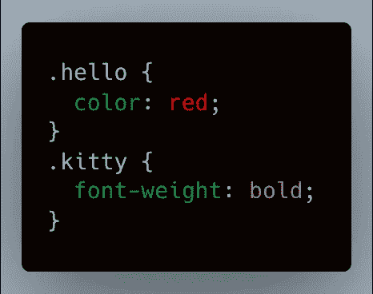

**按 Id**

这将选择赋予元素的任何`id`。通常只选择 1 个元素，因为每个元素都应该有一个惟一的 id。注意名字前面的`#`。

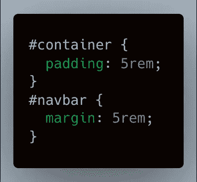

**按属性**

这允许您基于元素的属性进行选择。一个例子是在`form`中的`input`元素上发现的`required`属性。请注意属性名称两边方括号的使用。

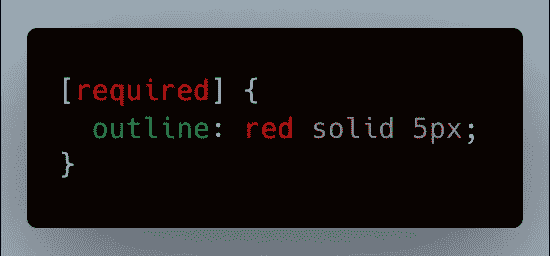

# 分组选择器

这些选择器允许您选择元素组，并且您可以混合和匹配任何基本的选择器。

此示例选择 id 为 name 或`p`元素的所有元素。注意使用逗号来分隔元素。

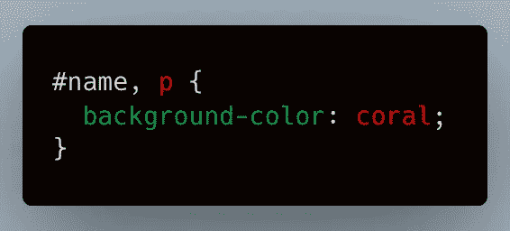

这个例子选择了所有包含 CSS 类`container`和`check`的元素。注意这两个类之间没有空格。

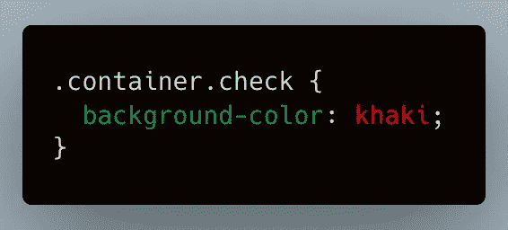

# 组合子

我们可以使用五种不同类型的组合子。这些选项允许您选择嵌套元素或嵌套元素组。

**后裔**

这个选择器在两个选择器之间有一个**空格** **，第二个元素*必须*是第一个元素的后代。**

这个例子选择了两个组，一个是包含类`last_container`的元素中的`p`标签，另一个是包含类`another_container`的元素中的`p`标签。`p`标签只需要是这两个类中任何一个的后代，这样它们就可以嵌套多层并且仍然被选中。

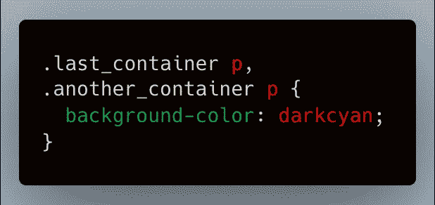

指定该选择器的一种稍微简单的方法是使用`:is`选择器。

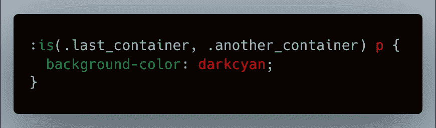

**子**

这个选择器类似于后代选择器，但是嵌套元素*必须是第一个选择器的直接子元素*。

该示例选择所有作为`another_container`的直接子标签的`p`标签。

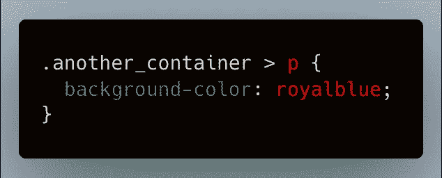

**一般** **兄弟姐妹**

该选择器将选择两个兄弟的第二个元素。注意，这将选择第二个元素，即使在两个兄弟元素之间还有其他元素。

本示例选择另一个`span`标签之后的所有`span`标签。它们*必须*在相同的嵌套层次，它将只选择两个`span`标签中的第二个。

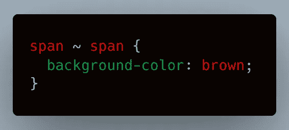

**相邻的** **兄弟姐妹**

该元素将选择两个相邻元素中的第**个元素**。这意味着元素*必须*一个挨着一个，不能被另一个元素分开。

当两个`div`元素作为兄弟元素相邻时，此示例选择第二个`div`。

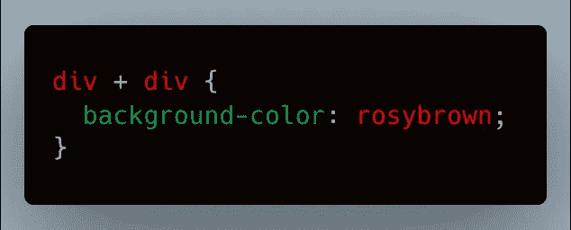

**栏**

浏览器还不支持这个组合器，但是它可以和`table`元素一起使用。

# 伪元素

这些类型的元素通常是 HTML 元素的状态，如`hover`、`focus`等。注意有时有一个单冒号，有时有一个双冒号来指定不同的选择器。在 W3Schools 查看伪元素的完整列表。

本例选择所有`p`标签的第一个字母并设置字体大小。注意双冒号。

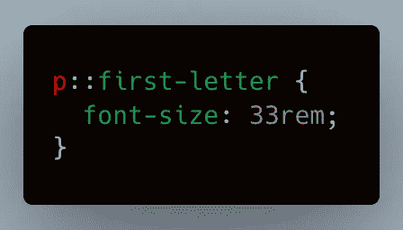

本示例选择最后一个`p`标记并设置背景色。如果我们用 2 而不是 1，那么我们会得到第二个，因为它从底部开始计数。

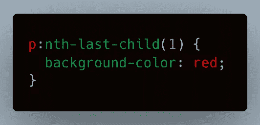

这个例子把一个图像放在所有的`p`标签之后。注意这里的双冒号。如果你想在一个元素前放置一些东西，还有一个`before`选择器。这些被像 [Material UI](https://mui.com/) 这样的 UI 框架用来嵌入或插入额外的元素或样式。

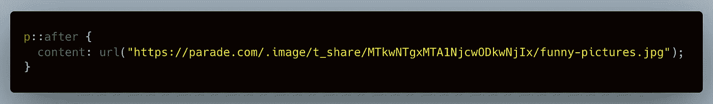

# 结论

现在你已经知道了各种类别和每个类别的一些例子，你可以自己动手，看看你能想出什么样的组合，以及如何在你的应用程序中使用选择器。有关 CSS 选择器的更多信息以及可以使用的伪元素的完整列表，请查看 [W3Schools](https://www.w3schools.com/cssref/css_selectors.asp) 和 [Mozilla](https://developer.mozilla.org/en-US/docs/Web/CSS/CSS_Selectors) 。

如果你喜欢这篇文章，考虑一下[订阅 Medium](https://medium.com/@ascourter/membership) ！

如果你或你的公司有兴趣找人进行技术面试，那么请在 Twitter ( [@Exosyphon](http://twitter.com/Exosyphon) )上给我发 DM，或者访问我的[网站](https://andrewcourter.com/)。如果你喜欢这样的话题，那么你可能也会喜欢我的 Youtube 频道。如果你喜欢 3D 打印的东西，去看看我的 Etsy 商店。祝您愉快！