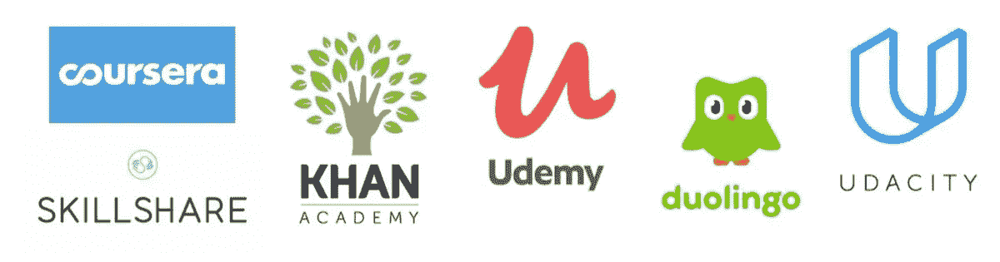
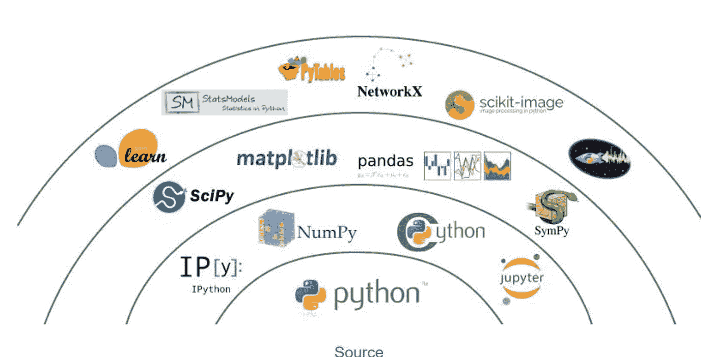
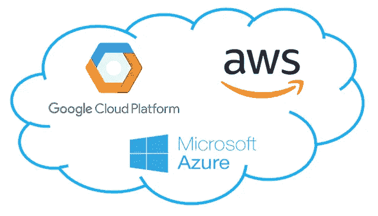

# 破产时成为数据科学巨头

> 原文：<https://levelup.gitconnected.com/become-a-data-science-powerhouse-without-spending-a-fortune-f975ad25adb2>

多梅尼科·洛亚在 [Unsplash](https://unsplash.com?utm_source=medium&utm_medium=referral) 上拍摄的照片

您是否有兴趣成为数据科学专家，但担心高昂的教育和资源成本？不要让金钱阻碍你追求梦想！**不倾家荡产成为数据科学强国是可能的**。在本文中，我们将探索学习数据科学的各种负担得起的选择，包括免费的在线资源、低成本的课程和认证，以及获得实践经验的替代方法。到本文结束时，您将有一个如何在预算内学习数据科学并实现目标的可靠计划。

虽然像 [Dataquest](https://www.dataquest.io/) 、 [DataCamp](https://www.datacamp.com/) 和 [Udacity](https://www.classcentral.com/pricing-charts/udacity-nanodegrees) 这样的网站提供全面的数据科学教育项目，但它们可能很昂贵，并且可能不提供实践经验或允许探索个人兴趣。此外，将在这些项目中学到的概念应用到现实工作环境中可能会很困难。

如果你喜欢视频讲座或传统的课堂环境，edX 和 Coursera 等免费替代工具会提供涵盖数据科学特定主题的单独课程。这些选项可能非常适合那些在这些格式中学习得很好的人。Classcentral 列出了可用的数据科学课程

## Python 编程:

要精通数据科学，必须具备很强的编程技能，尤其是 Python 语言。熟悉 Python 的语法，并学习如何使用各种方法运行程序，如 Jupyter 笔记本、命令行或集成开发环境(IDE)。你可以花一个月的时间复习 Python 文档，Python 的[搭便车指南](https://docs.python-guide.org/intro/learning/)，并完成 [CodeSignal](https://codesignal.com/) 上的编码挑战来提高你的技能。此外，注意程序员使用的常见问题解决技术，也称为算法。

## 统计和线性代数:

这些科目是机器学习和数据分析的必要前提。如果你已经对这些概念有了很好的理解，花一两周的时间温习一下关键思想。特别要关注描述性统计，因为理解和解释数据集的能力是非常有价值的。

*   麻省理工学院开放课程:课程材料，包括课堂讲稿和视频讲座，来自麻省理工学院的本科生和研究生课程。
*   [线性代数及其应用](https://math.mit.edu/~gs/linearalgebra/) : Gilbert Strang 广泛使用的教材。
*   [Open intro 统计教材](https://www.openintro.org/stat/textbook.php):涵盖一系列统计概念的开源教材。

## Numpy、Pandas 和 Matplotlib:

为了有效地加载、操作和可视化数据，学习如何使用这些库是很重要的。虽然没有必要记住每个方法或函数的名称，但是您需要练习使用这些工具来变得熟练。您可以在 [Pandas](http://pandas.pydata.org/pandas-docs/stable/) 文档、 [Numpy](https://docs.scipy.org/doc/numpy/user/index.html) 文档和 [Matplotlib](https://matplotlib.org/tutorials/index.html) 教程中找到学习这些库的有用资源。

## 机器学习:

要在数据科学领域取得成功，理解机器学习算法的理论和应用非常重要。练习将这些概念应用到您感兴趣的真实世界数据中。许多初学者从使用来自 [UCI ML 知识库](https://archive.ics.uci.edu/ml/index.php)的玩具数据集开始，并遵循指导机器学习教程。Scikit-learn 文档还为学习常用算法的应用提供了极好的资源。考虑听一段关于机器学习理论的播客，作为你学习的补充。

## 生产系统:

**要想在数据科学领域出类拔萃，你应该能够获取真实世界的数据，并将其转化为行动**。为此，你需要学习如何使用公司的计算资源来获取、转换和处理数据。熟悉 Amazon Web Services、Google Cloud 和 Microsoft Azure 等工具。培养数据库操作和版本控制的技能也很重要。要学习数据库操作，你可以使用诸如 [ModeAnalytics](https://mode.com/python-tutorial/) 或 [Codecademy](https://www.codecademy.com/) 等资源，甚至在 DigitalOcean 上实现自己的数据库。您可以通过创建一个 GitHub 帐户并使用命令行每天提交代码来获得版本控制的经验。

## **成功的建议:**

1.  **概念会比你学习它们的速度更快:**有许多学习数据科学的在线资源，这很容易让你偏离主题。为了保持专注，要有一个系统来保存有趣的网络资源，并创建一个结构化的学习路径。当你发现新的主题时，你的阅读清单可能会很快增加，但是不要紧张。
2.  **这是一场马拉松，而不是短跑**:自我驱动的教育有时会让人感到力不从心，但一定要记住，学习数据科学是一个终生的过程。不要试图一次学会所有的东西，如果你没有马上理解某些东西，也不要气馁。休息一下，稍后再回到困难的概念。
3.  **练习，练习，练习**:要真正掌握数据科学，你需要练习学以致用。处理个人项目，完成在线挑战和测验，并与他人合作以提高您的技能。
4.  **建立关系网并寻求指导:**与数据科学社区中的其他人联系，无论是通过在线论坛还是面对面的活动。向该领域的导师和专业人士寻求指导，当你需要帮助时，不要害怕寻求帮助

# 构建强大的数据科学产品组合

作为一名数据科学家，你可能会遇到别人对你能力的怀疑。这可能来自潜在的雇主、客户，甚至来自你自己。克服这种怀疑并展示你的技能的最好方法之一是建立一个强大的投资组合。

作品集本质上是你作品的集合，展示你引以为豪的项目，突出你的技能和成就。通过精心制作的投资组合，你可以向他人展示你作为一名数据科学家的能力和自信。

那么，你的投资组合应该包括什么呢？以下是一些想法:

*   你从零开始构建的网络应用
*   您创建的数据库
*   您进行的数据分析，尤其是对真实世界数据的分析
*   任何其他展示你的技能和兴趣的项目

**在整理你的作品集时，一定要注意演示文稿**。文章应该清晰易懂，代码应该有良好的文档记录，投资组合的整体布局和设计应该专业。一份强大的投资组合对找到工作或赢得潜在客户的信任大有帮助。

记住，建立投资组合是一个长期的过程。随着你职业生涯的进展，确保用新的项目和成就不断更新和改进你的投资组合。通过不断增加和改进您的投资组合，您可以展示您作为数据科学家的成长和发展。

由[哈尔·盖特伍德](https://unsplash.com/ja/@halacious?utm_source=medium&utm_medium=referral)在 [Unsplash](https://unsplash.com?utm_source=medium&utm_medium=referral) 上拍摄的照片

最终，**这并不容易**

网上有很多免费的资源，比如 Khan Academy、麻省理工学院的开放式课程和 OpenIntro 统计学教材，可以帮助你学习必要的技能。如果你更喜欢结构化的学习环境或者想要获得认证，参加付费课程或项目也是有帮助的，比如 Coursera 上提供的课程。然而，重要的是要记住，精通数据科学是一个长期的过程，需要实践和坚持。

所以，如果你不能马上理解某些东西，不要气馁，一定要休息一下，调整好自己的节奏。**通过正确的态度和方法，您可以成功掌握数据科学，而不会倾家荡产。**

**现在开始吧，关注我，获取更多精彩文章👍**