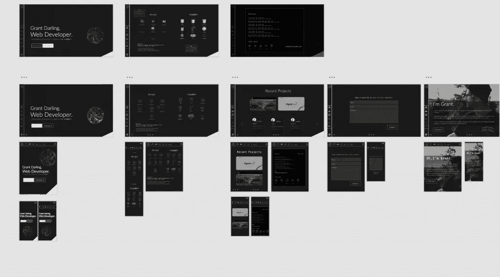

# 在 2020 年成为一名专业的全栈 Web 开发人员——所需的所有技能(包括学习材料)

> 原文：<https://levelup.gitconnected.com/become-a-professional-full-stack-web-developer-in-2020-every-skill-required-with-learning-97b5fe753f46>

所以你想成为一名专业的全栈 web 开发者却不知道从何下手？好了，不要再看了，因为这篇文章将带你了解成为一名专业的 web 开发人员所需要学习的每一项技能！

 [## 编写面试问题

### 一个完整的平台，在这里我会教你找到下一份工作所需的一切，以及…

技术开发](https://skilled.dev) 

我记得当我第一次开始作为自由开发人员的旅程时，我很快就被不同的编程语言、客户端-服务器交互和晦涩的术语所淹没，这使得我的目标似乎完全无法实现。我想确保没有人会像我一样经历漫长的不眠之夜，试图弄清楚这一切。

因此，废话不多说，这里是成为专业全栈 web 开发人员所需的所有技能，以及一些帮助您免费学习的伟大资源！

旁注:为了使这篇文章尽可能简短和有用，我不打算教你学习材料，而是帮助你找到已经存在的最好的材料！

# HTML、CSS 和 Javascript:前端开发的必需品

学习成为全栈 Web 开发人员的第一步是学习开发人员所说的“前端”。在其最基本的形式中，前端由三种语言组成:HTML、CSS 和 Javascript。你可以把前端想象成你在网页上看到的一切，而后端就是它做的一切。想要在页面上显示联系人表单吗？这是前端开发。想从您的联系人表单发送电子邮件吗？那就是后端开发。

一旦你开始编码，这种区别会变得更加明显，但是现在，让我们开始吧！

# 1.超文本标记语言

任何 web 开发人员的第一步都应该是学习 HTML(超文本标记)。那么 HTML 是什么，是用来做什么的呢？嗯，HTML 是一种声明性语言，可以在网页上显示元素。

需要注意的是，HTML 不是编程语言！它没有逻辑成分，正因为如此，它不能被认为是一种你用来“编程”的语言。它是声明性的，意味着它可以“声明”一个元素存在于页面上。一旦你开始使用 HTML 和 Javascript，你会很快发现两者的区别！

兴奋地学习？很好。这里有一些学习 HTML 基础的非常好的资源。他们都会教你你需要知道的东西。

# HTML 资源

# [代码学院:互动](https://www.codecademy.com/learn/learn-html)

Codecademy 是我最喜欢的学习平台之一。它有助于以一种易于理解和互动的方式教你新的语言和概念。这非常适合初学者，也是提高技能的好方法。

[用 Codecademy 学习 HTML】](https://www.codecademy.com/learn/learn-html)

# [自由代码营:互动](https://www.freecodecamp.org/learn)

Freecodecamp 是一个广受尊敬的完全免费的学习编码的方式！用户界面不完全是最好的工作，但它是伟大的内容，会教你一切你需要知道的。您需要登录才能访问 HTML 课程。

[用 Freecodecamp 学习 HTML】](https://www.freecodecamp.org/learn)

# [Udemy:互动](https://www.udemy.com/course/hmtl5-training/)

HTML 课程资源列表的最后一个是 Udemy。Udemy 也是一个非常知名和受人尊敬的学习平台，它可以让你很快从一无所知到经验丰富！如果 Codecademy 和 Freecodecamp 不适合你，请随意查看。

[用 Udemy 学习 HTML】](https://www.udemy.com/course/hmtl5-training/)

# 付费学习:

[全网开发课程(Codecademy)](https://www.codecademy.com/learn/paths/web-development)

我将在这篇博文的每一部分引用这门课程。我个人使用过，这是我能找到的最简单、最有条理的方法。它从假设你没有知识的每一课开始，从头开始教你。

我建议的唯一一件事是，确保你在这个过程中建立真实的项目，这样你就能在学习中加深印象，而不仅仅是表面知识。如果不是这样，学习可能会感到有些被动，你可能不会记住尽可能多的信息！

# 2.半铸钢ˌ钢性铸铁(Cast Semi-Steel)

一旦对 HTML 有了清晰的认识，下一步就是学习 CSS 了。CSS 代表级联样式表，是描述 HTML 元素如何显示的语言。

那么这意味着什么呢？这意味着通过使用 CSS，你将能够设计你的网页！CSS 让我们可以改变文本、图像或链接中过多的设计元素。改变它们在页面上的位置、颜色和比例。我知道这是一个模糊的解释，但我保证我们下面的资源会让一切变得更加清晰。

# CSS 资源

# [代码学院:交互式](https://www.codecademy.com/learn/learn-css)

Codeacademy 也有很棒的免费 CSS 课程来帮助你学习。不幸的是，所有的项目和测验都是付费的学习材料，但是讲座本身应该足以给他们你所需要的信息来很好地理解这门语言。

[用 Codecademy 学习 CSS](https://www.codecademy.com/learn/learn-css)

# [抖音:互动](http://flukeout.github.io/)

Flukeout 有一个类似 Codeacademy 的有趣的交互风格。这是一个免费的学习资源，很好地解释了内容。我觉得在测试的时候有点沮丧。他们的一些例子看起来对一个新的学习者来说可能更令人困惑而不是有帮助。然而，它是免费的，值得一试！

[用 Flukeout 学习 CSS](http://flukeout.github.io/)

# [CSS 指南:书](https://cssguidelin.es/)

这本书更适合中级 CSS 学习者。也就是说，这是一本好书，有助于你学习这门语言。如果你喜欢书本而不是互动游戏来学习，这可能是你的选择。

[用指南学习 CSS](https://cssguidelin.es/)

# 付费学习:

[全网开发课程(Codecademy)](https://www.codecademy.com/learn/paths/web-development)

# 3.java 描述语言

所以我们现在理解 HTML 和 CSS 组成了网页的信息和设计。但是给我们的网站增加交互性怎么样呢？这就是 Javascript 的用武之地。成为专业全栈 Web 开发人员的关键要素！

Javascript 是最常用于前端 web 开发的编程语言(现在后端也是！).Javascript 是一种客户端编程语言，可以在 web 浏览器中编译。它允许我们在我们的元素和无数其他事物中创造交互性。

Javascript 应用的一个常见例子是网页上的滑块，或者双击 Instagram 照片时在照片上显示一个心形图标。

**Javascript 很难学。有些人可能不同意，因为它比其他语言(如 C)容易得多，但我知道我用它经历了一段艰难的时间，你可能也会这样。没关系。诀窍是坚持下去，慢慢地但肯定地，它会变得更容易！只是需要一些练习。**

查看这些伟大的资源，它们在我学习 Javascript 的时候给了我极大的帮助。希望他们也能帮助你。

# Javascript 资源

# [Codecademy&](http://www.codecademy.com/learn/introduction-to-javascript)[Freecodecamp](https://www.freecodecamp.org/learn)

Codecademy 和 Freecodecamp 有很棒的 Javascript 教程，可以让你快速上手。如果这些资源中的任何一个对你的 HTML 或 CSS 有用的话，它也会对你学习 Javascript 有用。

[用 Codecademy 学习 Javascript】](http://www.codecademy.com/learn/introduction-to-javascript)

[用 Freecodecamp 学习 Javascript】](https://www.freecodecamp.org/learn)

# [你不知道 JS: Book](https://github.com/getify/You-Dont-Know-JS)

通过书籍学习 Javascript 帮助我将学习提升到一个新的水平。*你不知道 JS* 是一本在学习 Javascript 时可以随身携带的好书。它带你从最基础的话题到更高级的话题。

[用你不知道的 JS 书学习 Javascript】](https://github.com/getify/You-Dont-Know-JS)

# [雄辩的 Javascript: Book](https://eloquentjavascript.net/)

强烈推荐看这本书！它帮助我将我的知识从更基础的水平提升到中级水平。不要让这个名字欺骗了你，这不是一本给完全初学者看的书。作者并没有试图让你读完这本书，你很可能需要做一些额外的研究来找出本章结尾的问题。

使用一些其他资源，然后到这里来。你不会后悔的！

[用雄辩的 Javascript 书学习 Javascript](https://eloquentjavascript.net/)

# 付费学习:

[全网开发课程(Codecademy)](https://www.codecademy.com/learn/paths/web-development)

# 框架、Sass 和软件设计应用:越来越深入

# 4.结构

作为开发人员，我们花了很多时间编码，说到底时间就是金钱！尤其是当你是自由职业者的时候。因此，我们不能每次想建设新的东西时都要重新发明轮子。

出于这个原因，为了进入一些真正的前端开发工作，我们将希望开始使用前端框架。大多数前端框架都是基于 Javascript 构建的。一些非常受欢迎的选项有 React、AngularJs 和 Vue。

截至 2020 年， [React 是最流行使用的框架](https://dev.to/duomly/the-best-front-end-framework-to-learn-in-2019-dn7)。这意味着这是大多数雇主将建设与。因此，如果你想找一份前端 web 开发人员的工作，React 可能是一个不错的选择！

框架通过抽象的方式建立在它们各自的语言之上。一个简单的方法是，不要写 100 行复杂的代码，你可以把它压缩成 10 行，更容易阅读和理解。

因此，如果您觉得自己对 Javascript 有很好的理解，让我们来学习一下它最流行的框架 React 吧！

# 反应资源

# [代码学院:互动](https://www.codecademy.com/learn/react-101)

这是我个人学习反应的方式。本课程旨在教你 JSX 语言(React 语言)的每个主要概念。它非常深入，如果你没有框架知识，它是一个很好的资源。

[反应历程](https://www.codecademy.com/learn/react-101)

# [React 文档:边学边做](https://reactjs.org/tutorial/tutorial.html)

当然，您可以随时进入 React 文档，通过一个简单的井字游戏向您展示 JSX 语的每个主要组成部分！

[打造一款 React 游戏](https://reactjs.org/tutorial/tutorial.html)

# 付费学习:

[全网开发课程(Codecademy)](https://www.codecademy.com/learn/paths/web-development)

# 5.Sass/scss

关于什么是 Sass 我就不多说了。因为开始建立网站并不是必须的。然而，它确实使建立网站变得更加容易和干净！

Sass 是 CSS 的预处理器。意思是你用 Sass 语言写，它会编译(转换)成普通的 CSS。Sass 是开发人员希望 CSS 成为的一切。它可以像 css 一样编写，但也包括某些方面，以使您的代码更易于阅读、组织和模块化

Sass 和 scss 是编写 css 代码的两种略有不同的方式。Sass 的编写方法比 scss 简单快捷。允许您跳过使用花括号，选择适当的缩进来创建代码。虽然 scss 可以完全像 css 一样编写，但却具有 Sass 的所有优点。

我更喜欢 scss，因为我已经对 css 语言非常熟悉了，而且它还有一些额外的好处，比如允许我将 CSS 库直接导入到我的 style.css 文件中。加载较少样式表的简单方法！

# Sass 资源

# [Sass 设置和基础:视频](https://www.youtube.com/watch?v=Rnxyf6Vyqiw)

这是一个很棒的迷你系列，向您展示了如何在您的计算机上安装 Sass 以及该语言的所有主要组件。这篇文章是为 Sass 语言而写的，而不是 scss，但是它是一个很好的视频，可以帮助你开始学习，并且你可以在以后一直学习 scss 语言。都是一样的设置流程！

[https://www.youtube.com/watch?v=Rnxyf6Vyqiw](https://www.youtube.com/watch?v=Rnxyf6Vyqiw)

# [SCSS 文档](https://sass-lang.com/guide)

一旦在您的计算机上安装了 Sass，您就可以参考文档来复习该语言是如何工作的。当我想做某件事却忘记了语法是如何工作的时候，我会经常回头参考它。

[学习 Sass 文档](https://sass-lang.com/guide)

# 6.软件设计应用

如果你打算成为一名自由职业的网络开发人员(像我一样)，很可能你不仅仅需要成为一名开发人员，你还需要成为一名设计师！每天，我都会使用 Photoshop、illustrator 和 xD 来创建和修改我的网站。下面是对每一个的简短描述和学习资源。

# 软件设计资源

# 用计算机修改（图片或照片）

我主要使用 Photoshop 来优化网页上的图像，并创建实际上并不存在的照片。如果你知道如何正确使用它，Photoshop 可以成为一个非常强大的工具，它可以打开一个你否则永远无法创造的可能性世界。

[学习 Photoshop: 30 天的 Photoshop](https://phlearn.com/tutorial/30-days-photoshop-introduction/)

# 插图画家

我在建网站的时候不会经常用 Illustrator。然而，每当我需要为我的网页制作图标时，我都会使用它(这比你想象的要频繁得多！).例如，[这个页面代表了我用 Illustrator 创建的所有图标。如果你是一位天才艺术家，为你的网站/网络应用程序创作更高级的插图也能让你的作品脱颖而出。](http://grantdarling.com/skills.html)

[学习插画:初学者完全指南](https://www.youtube.com/watch?v=IBouhf4seWQ)

# Adobe xD

我最后的网页设计必备品是 Adobe xD。Adobe xD 允许您在开始构建网站之前，快速轻松地为桌面、平板电脑和移动设备制作网站原型。当与客户就他们想要实现的不同设计元素进行反复沟通时，这可以节省大量时间，而不必事先编写所有代码！

[学习 Adobe xD:文档教程](https://helpx.adobe.com/ca/xd/tutorials.html)

这里是我的 xD 工作区看起来像我的网站[grantdarling.com 的一个例子。](http://grantdarling.com)

# 服务器端语言、SQL 和数据库:后端开发

# 7.后端语言

我发现后端是 Web 开发中更有趣的部分之一。我们开始从事物看起来的样子，转移到事物是如何运作的。有许多后端语言可供选择，如 PHP、Ruby、Java 和 Python。这些语言也有自己的一套框架。例如，Laraval 是最流行的 PHP 语言。

我的意见是你后端语言学 PHP。它是最流行的后端 web 开发语言，被世界上最大的 CMS Wordpress 所使用！这意味着你可以从小企业找到很多需要修改网站的自由职业者。

# PHP 资源

# [代码学院:互动](https://www.codecademy.com/learn/learn-php)

对于一个完全的初学者来说，这是一个非常棒的学习 PHP 的交互方式。如果你是编程新手，我建议你从这里开始。

[用 Codecademy 学 PHP](https://www.codecademy.com/learn/learn-php)

# [自由代码营:视频](https://www.youtube.com/watch?v=OK_JCtrrv-c)

这个视频是一个很好的资源，可以让你在 5 个小时之内学会使用 PHP。我建议跟着视频走，否则你可能记不住你希望的那么多信息。

[用 freecodecamp 学习 PHP](https://www.youtube.com/watch?v=OK_JCtrrv-c)

# 付费学习:

[全网开发课程(Codecademy)](https://www.codecademy.com/learn/paths/web-development)

# 8.SQL 和数据库

学习后端 Web 开发的另一个主要部分是理解如何与数据库交互。在 Web 开发中，最流行的是 SQL 数据库，您可以使用 SQL 语言与它进行交互。

SQL 数据库是一个关系数据库，这意味着数据基本上保存在表、列和行中。如果你在 Microsoft Excel 中做过任何工作，当你学习这种语言时，SQL 在概念上更容易理解。

以下是我学习 SQL 的顶级资源。

# SQL 资源

# [代码学院:交互式](https://www.codecademy.com/learn/learn-sql)

Codecademy 的 SQL 课程非常适合完全初学者。

[用 Codecademy 学习 SQL](https://www.codecademy.com/learn/learn-sql)

# [自学:课程](http://studybyyourself.com/seminar/sql/course/?lang=en)

studybyyourself.com 的这些课程是开始学习 SQL 的一个很好的免费资源。他们有初学者和高级部分，现在就开始你的学习之旅！

[自学 SQL](http://studybyyourself.com/seminar/sql/course/?lang=en)

# 付费学习:

[全网开发课程(Codecademy)](https://www.codecademy.com/learn/paths/web-development)

# 与编程相关的必要工具

# 10.命令行

命令行看起来很可怕，因为一开始，你不知道发生了什么。然而，如果你花一点时间熟悉它，它会变得更加直观和容易理解。

开始使用命令行的最重要的原因是，它将节省您大量的时间，您可以开始利用非常强大的程序，例如在浏览器之外运行 javascript，创建您自己的脚本，并允许您使用 Git & Github(下面将详细介绍)！

我不会过多地谈论命令行，因为有很多内容要介绍，但是这里有一些很好的资源可以介绍。

# 命令行资源

# [代码学院:互动](https://www.codecademy.com/learn/learn-the-command-line)

这是一个很好的学习方法，可以让你很快从初学者变成专业人士！该课程前 7 天免费。我使用过这个资源，可以说在一周内完成是非常容易的。

[用 Codecademy](https://www.codecademy.com/learn/learn-the-command-line) 学习命令行

# [Overthewire:游戏](https://overthewire.org/wargames/bandit/)

如果你想采取一种更实际的方法，你需要谷歌和自己解决问题，这个游戏可能适合你。它带你从 0 级到 34 级。向您传授命令行的基础知识，并逐步学习更高级的主题。

[用 overthewire 学习命令行](https://overthewire.org/wargames/bandit/)

# 付费学习:

[全网开发课程(Codecademy)](https://www.codecademy.com/learn/paths/web-development)

# 11.Git/GitHub

Git 是一个行业标准的版本控制软件，允许您跟踪 web 开发项目的变更。想象 Git 做什么的最简单的方法是想象一个有多个保存文件的旧视频游戏。在任何时间点，你都可以回去检查你的游戏进度，如果出了问题，你就可以回到那里。唯一的区别是多人可以同时玩同一个游戏，Git 使得跟踪谁做了更改变得更加容易，并且他们之间不会发生冲突。

希望这是有意义的，但如果不是，这些学习资源应该会把事情搞清楚！

# Git/Github 资源

# [代码学院:互动](https://www.codecademy.com/learn/learn-git)

另一个 Codecademy 专业课程，但有 7 天的免费试用期。如果你在接下来的 7 天内有时间学习，这是一个很好的资源！

[用 Codecademy 学习 Git/Github](https://www.codecademy.com/learn/learn-git)

# [try.github.io:文档](https://try.github.io/)

帮助您可视化 Git 的优秀文档，提供了一个备忘单，以及如何分支、添加、提交、合并、恢复、精选和重置！

[用 try.github.io 学习 Git/Github](https://try.github.io/)

# 付费学习:

[全网开发课程(Codecademy)](https://www.codecademy.com/learn/paths/web-development)

差不多就是这样！如果你能学会这些核心技能，你几乎可以在网上构建任何你想要的东西！当然，你的学习永远不会真正停止，总会有新的、令人兴奋的东西等待你去探索。然而，这些技能将带你去你需要去的地方，这样你就可以出去找到你的第一份工作或客户！