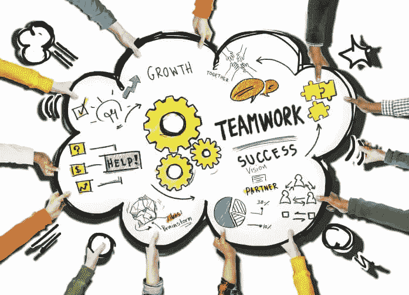
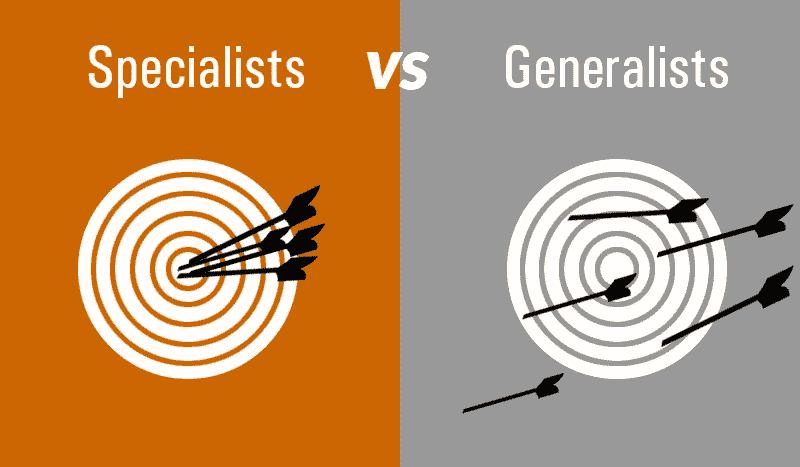
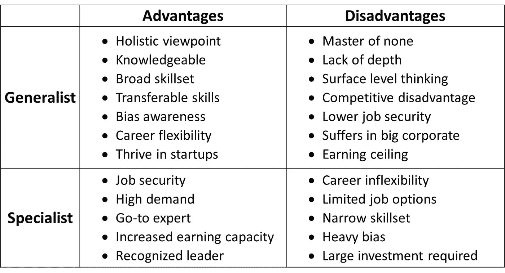
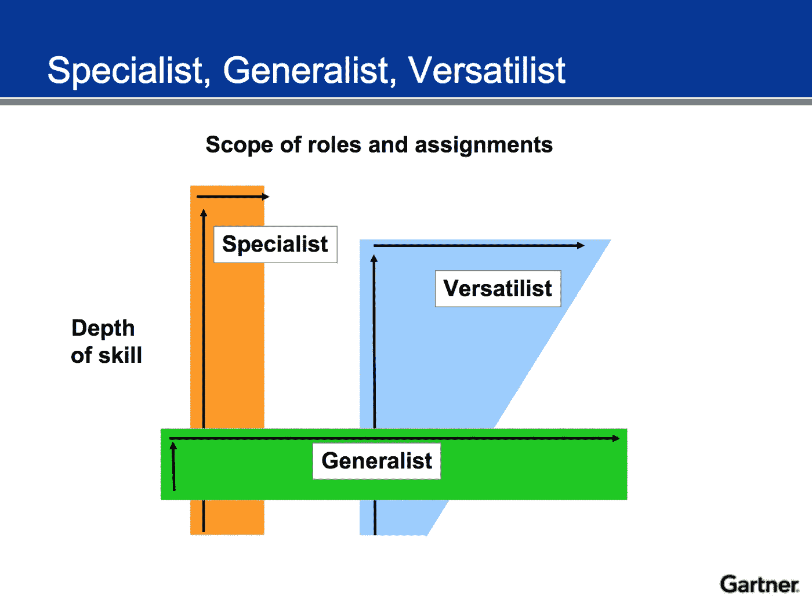

# 如何掌握你的软件工程之旅:10x 工程师

> 原文：<https://levelup.gitconnected.com/becoming-a-10x-engineer-6faabecc49ff>

吸取的教训

## 吸取的主要经验教训

软件工程是当今世界谈论最多和最受欢迎的职业之一。

在我作为软件工程师的旅程中，我与一些优秀的人、最新的技术和伟大的项目一起工作。当我反思我卑微的出身和逐渐成长为现在的工程经理时，我希望我知道当时软件工程工艺的一些关键方面。

以下是一些关键特征(更多将继续添加！).我们将在下面深入探讨每一个特征。

# 铺得太薄

铺得太薄

我把这种特质归因于我们飘忽不定的思想。“这山望着那山高”的观点似乎很适合于此。

*   当我开始做前端 web 开发时，我觉得我也应该学习后端技术(Java for ex。)因为那可能更有价值。
*   接下来，当我开始做更多的全栈开发时，我真的觉得我应该提高我的 DevOps 技能，熟悉 AWS/ Azure/ Google Cloud，部署代码，捆绑代码，包管理等。
*   接下来，当我开始关注这些方面时，我觉得我需要在开源社区中建立自己的存在，即做一些附带项目，为现有项目做贡献，在集会、会议上发言等等。

这个清单似乎永远不会结束，因为我试图从一件事跳到下一件事，以获得更多的技能。这正是我认为导致我在一段短暂的时间内过于分散的原因。

我对各种各样的东西都只是略知皮毛，但对任何东西都不太了解或精通。在我与我当时的经理一对一的会谈中，我们意识到我可能试图同时在太多事情上表现出色。拥有一个以成长为导向的持续学习的心态是很好的，但它必须是有意义的，分阶段进行的，并仔细规划。为了质量发展和技能建设，你必须选择他们的战斗。

我建议你们每个人都思考同样的问题，即列出你们的发展重点领域。如果清单看起来太大，那么你就在 ***中展开太薄的*** 桶中，需要根据你可支配的时间和资源将其缩减到前 1-3 项。如果你拿不出一个具体的清单，那也是一个指标。理想情况下，你需要自己想出一份清单，或者与你的经理/导师合作。

# 仅关注实施

仅关注实施

当我想到*只关注实施时，*我将其归因于目光短浅，即没有看到更大的图景。毫无疑问，软件工程师的最高交付成果是实现给定的特性请求/实现 bug 修复。

然而，作为一名软件工程师，真正的好处或成长取决于对整个 SDLC 框架的某种程度的参与。下面是在实现/编写代码之外参与每个阶段的一些方法，以及随之而来的潜在收益。

1.  **推介/发现阶段**

这里的背景是客户互动。了解你的最终用户对于软件开发有着巨大的价值，这一点我怎么强调都不为过。从了解你在构建什么(用户的目标)，你在为谁(用户)构建，你为什么要构建它(实现将解决的用户痛点)，当你考虑如何构建它(实现本身！).按照这些思路，您作为技术专家从流程的一开始就参与进来，这有助于确定技术可行性，并对承诺的内容和传达给客户的内容进行粗略的时间检查。

**注:*如果你正在做的项目/任务是 B2C 的，比如有成千上万的用户，你还是可以得到上面提到的想要的价值。在这样的场景中，UX 团队和/或产品团队可以阐明实现将面向的目标市场和用户角色。*

2.**技术工作启动阶段/冲刺计划:**

作为一名工程师/ IC，这是你应该寻求清晰并提出任何问题的主要阶段。这可能与*什么、为什么和什么时候*有关，主要是为了手头的任务。

我看到许多团队完全忽略了这个阶段，或者只在技术领导/ EM 和产品人员之间进行。对于可能最终从事代码实现本身工作的工程师来说，在计划的早期尽可能多地接触并意识到这项任务是至关重要的。这将有助于减少过程中的误解和隔阂。

3. **QA +部署阶段**

这些阶段是实施后阶段。

*QA 阶段:*如果你有一个专门的 QA 团队的传统设置，这仍然可以在某些方面使你的敏捷过程瀑布。作为一名软件工程师，你应该能够拥有 [*测试金字塔*](https://martinfowler.com/bliki/TestPyramid.html) 上所有级别的合理能力，以避免任何潜在的筒仓。对可能会破坏您的实施的场景进行批判性思考和尽职调查是一项需要掌握的关键技能。

*部署阶段:*如果您有一个专门的 DevOps 团队负责构建过程和发布，那么您对 e2e 软件交付的了解可能会有差距。至少，您应该知道您的代码实现是如何被捆绑、打包并交付给最终用户的。当性能和束大小是一些感兴趣的关键代码度量时，对这个工作流有基本的理解将帮助您编写更好的软件。

以上 3 个阶段只是一个简短的总结，也是你作为一名软件工程师，除了写代码之外，拓展你的范围和技能发展的一些方法。

# 没有足够的概念证明

不够大

*POC =概念验证*

我可以很容易地说，这是我见过的所有工程师中最容易被**忽视的**特质*，尽管在我看来这是最重要的*。

就我个人而言，当我意识到我在努力工作，但没有以我认为的速度学习/成长时，我才艰难地了解到这一点。当时，我的经理让我意识到了**包装艺术的重要性** — *试验的过程，以一种轻量级的方式实施，并挑选我自己最引以为豪、对我最有意义的最佳解决方案。*

老实说，我花了一些时间才意识到这种方法的好处，而且我经常觉得在我实施的方法中，我受到了挑战，甚至是毫无理由的质疑。一旦我能够清楚地了解一些好处(如下所述)，这就成了我处理大多数中大型或复杂任务的主要方法。

POCing 与单一实施相比的潜在优势:

*   增强了权衡各种方法利弊的能力
*   培养批判性思维，用多种解决方案解决给定的问题
*   由于每个解决方案可能使用不同的方法或语法，因此扩展了编码范围和技术
*   增强了轻松应对未来重构的能力，并从一开始就为规模而构建
*   更加注重选择最佳方法，而不仅仅是提供可行的解决方案

因此，我会**强烈推荐**人们尽快开始这种方法，如果他们还没有这样做，或者如果你正在以某种形式实践它，继续建立它。

# 沟通和协作

沟通和协作

我喜欢下面这句似乎很适合这个关键特质的话。

> 我们中没有一个人像我们所有人一样聪明。—肯·布兰查德

软件工程 ***是一门艺术，绝对需要创造力*** 。很多时候，由于这一领域的工作性质，工程师们倾向于与更具合作精神的人隔绝或被逼入绝境。这可能只是意味着他们有低头的时间，或者真的需要专注于以安静、孤立的方式解决特定的挑战。

虽然上面说的很有道理，我也同意这种方法，但当这成为一种工作方式和思维模式时，问题就显现出来了。当一个人继续成为*的独狼，并通过自己的工作获得权力时，他们会加倍抵制寻求帮助/请求队友为他们解围。当你想展示你作为工程师的顶尖技能时，骄傲很容易成为障碍。*

*除了犹豫是否合作，它还会导致沟通障碍。随着时间的推移，团队在你的工作中的可见度降低，可能会努力与你合作，并在需要帮助时进行干预。*沟通有助于团队建设，说同一种语言，能够以非技术的方式清晰表达任何复杂的技术工作。**

# *精通利基与聪明的多面手*

**

*专家 vs 通才*

*老实说，这是我的软件工程生涯中最具挑战性的话题之一，我相信其他人也是如此。没有正确或错误的方法 ，最终的方向将取决于你的偏好、兴趣和操作风格。*

*我将尝试强调以下每一方面的关键特征。此外，在最后，我想分享一个我个人更喜欢的混合方法，这是一个额外的奖励。*

> **多面手——也被称为“万事通，无所不能的大师”**
> 
> **专家——也被称为“T 型”,即在特定的生态位垂直生长**

**

*多面手与专家的权衡*

*总的来说，**多面手**可以受益于更广阔的视野、更多的技能以及在跳槽时可以轻松转移的技能。另一方面，他们可能会停留在许多技能的表面，但由于缺乏深度而一无所知，反之亦然**专家**。*

*在多面手和专家的辩论中，我想强调的一个领域是*职业发展和成长*。我认为与每个角色相关的一个关键区别是:*

> **通才——他们* **本身没有职业阶梯** *来纵向发展。相反，他们有一个职业攀岩墙，让他们有机会改变路线，根据自己的意愿向上、向下、向左、向右移动，加速成长心态和舒适。**
> 
> *专家——他们大部分都有明确的职业阶梯。这条路可能看起来更窄，有着精确的聚焦和锁定，但总有一个坚实的下一阶段在眼前。*

## *⭐奖金⭐*

*正如我所承诺的，我想分享 Gartner 的一个有趣的花絮。除了成为多面手和专家，还有第三类人能够根据情况进行调整，他们被称为 ***多面手！****

**

*万能主义者的时代*

*如您所见，*versatilits*可以按需扩展和运行。这正是在软件工程领域流行的 ***【戴着许多帽子】*** 观念。*

*无论是在某一天跳到一个产品问题上，第二天与设计团队一起头脑风暴下一个产品开发迭代——程序员与开发人员和软件工程师的真正区别取决于这一核心技能。*

*我个人可以证明，作为一名全能主义者，我对整个 SDLC 和公司使命有着强烈的认同感，增强了我在团队内外的沟通和协作。虽然它非常有价值，但这也有一个潜在的负面影响，即看起来你好像“太分散了”。*

## *感谢阅读！*

## *请随时与我联系: [LinkedIn — Anand Safi](https://www.linkedin.com/in/anandsafi) 。我很想听听你对这个和其他技术话题的想法！*