# 在沙漠中旅行时学习 Javascript EventListener

> 原文：<https://levelup.gitconnected.com/becoming-a-js-eventlistener-master-while-traveling-in-the-dom-desert-e6f93226064e>

> 你上次面试的时候被抓拍和冒泡搞糊涂了吗？发现统治这个世界的规则并掌握它！

JavaScript 是一种通用的语言，可以在广泛的环境和上下文中使用。最常见的环境是浏览器，但它也可以用于服务器、移动设备和许多其他设备。

当您在浏览器中使用 JavaScript 时，您可以访问一组特殊的方法。例如，这些方法提供了操作 DOM 或其事件的方法。

从现在开始，我们将使用人类最强大的力量来建立我们头脑中的理论:抽象。

# 多姆沙漠

想象一片无限的沙漠。这堆令人印象深刻的沙子是大教堂的根源，是万物的容器。

多姆沙漠。

作为一个真正的沙漠，它可以是巨大的，它包含了你的 HTML 页面上的每个孩子。你唯一的限制是你的客户的机器的能力，它必须吸取如此大量的元件。

现在考虑这段 HTML 代码:

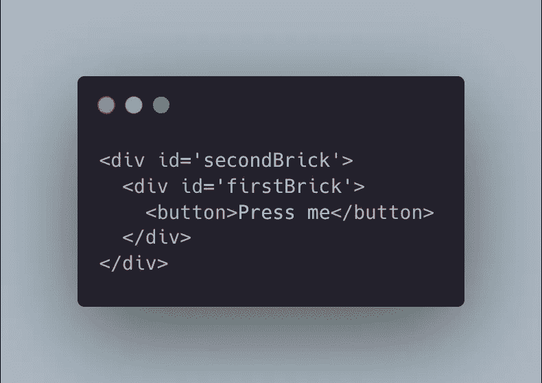

我们的代码代表金字塔。

现在改变你的观点:

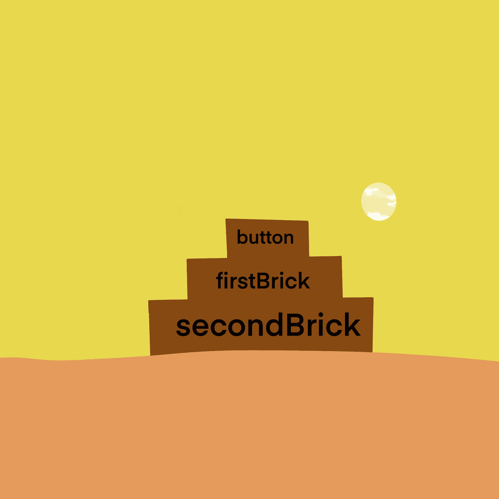

同样的 HTML 在我们的沙漠中是什么样子。

这个金字塔代表了我们的界面，但是我们有一个问题:这些砖块不是交互式的。我们需要将一些事件绑定到块上，我们需要**回调**。

## 什么是回调？

把一个函数想象成一个信封，里面包含执行某件事情的指令。例如，我们有一个函数可以让你得到一只独角兽:

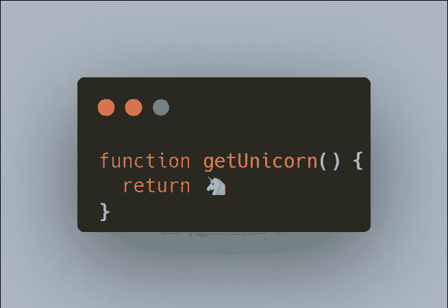

一个很酷的使用独角兽角色的例子。

我注意到许多新开发人员很难区分一个**函数**和它的**执行**之间的区别。当你有疑问时，问问自己:独角兽能呆在信封里吗？

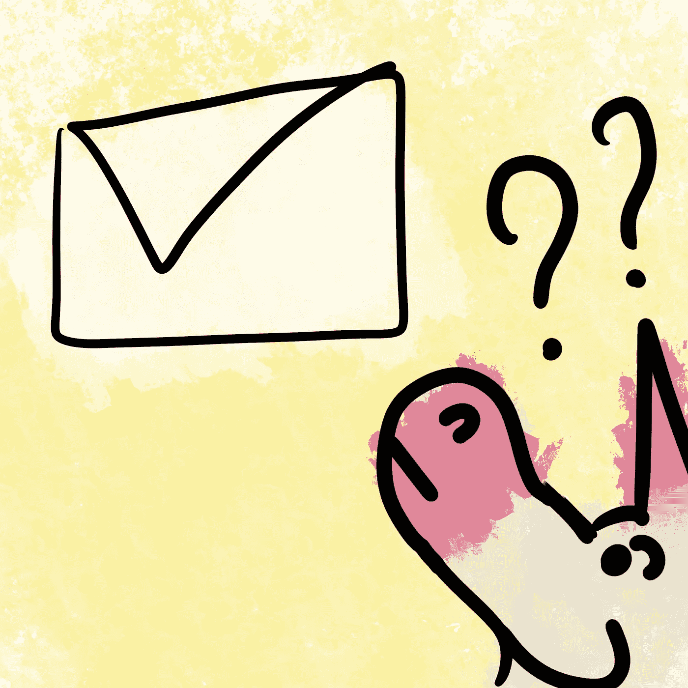

当然不能。

> 一个函数是一个对象，它不能包含真正的 unicorn，而只是构建(或发现，或创建)它的指令。

所以，说到代码:

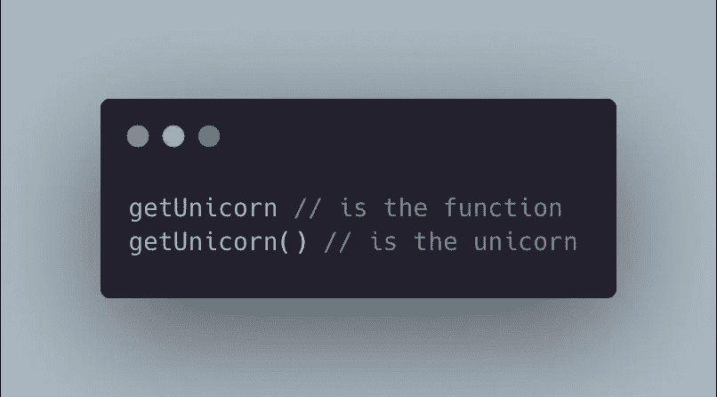

第二行代表**指令的执行**，实际🦄

当你传递信封时(不是🦄)到另一个元素，那么:这个函数被友好地称为**回调**。

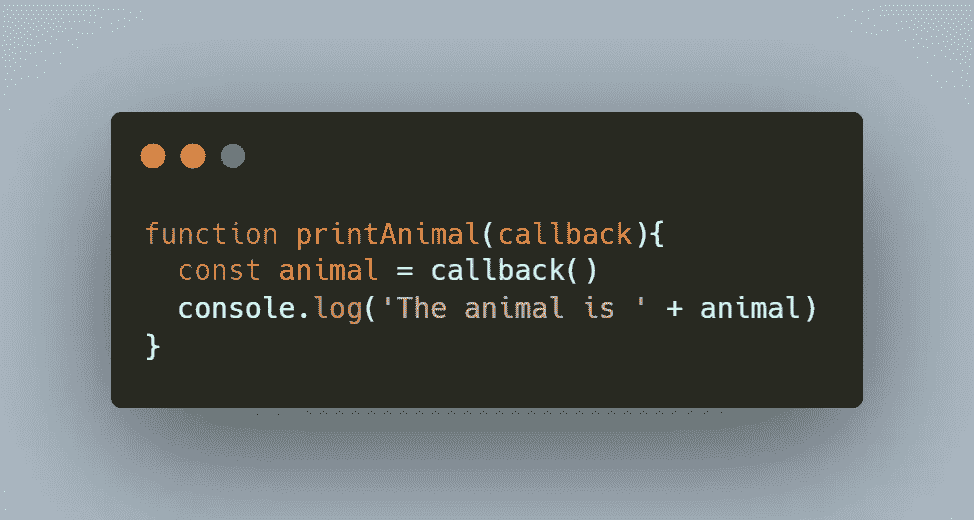

PrintAnimal 获得一个函数并执行它，获得结果并打印出来。

现在我们已经知道什么是回调，我们可以回到我们的事件监听器。如果你想要一篇关于回调的完整文章，请在评论中告诉我。

## 如何在 DOM 元素上注册回调

我们正走近我们的金字塔，我们可以注意到每块砖都有一长排邮箱(出于理智，我只画了其中的三个作为例子)。

每块砖都有一堆邮箱。

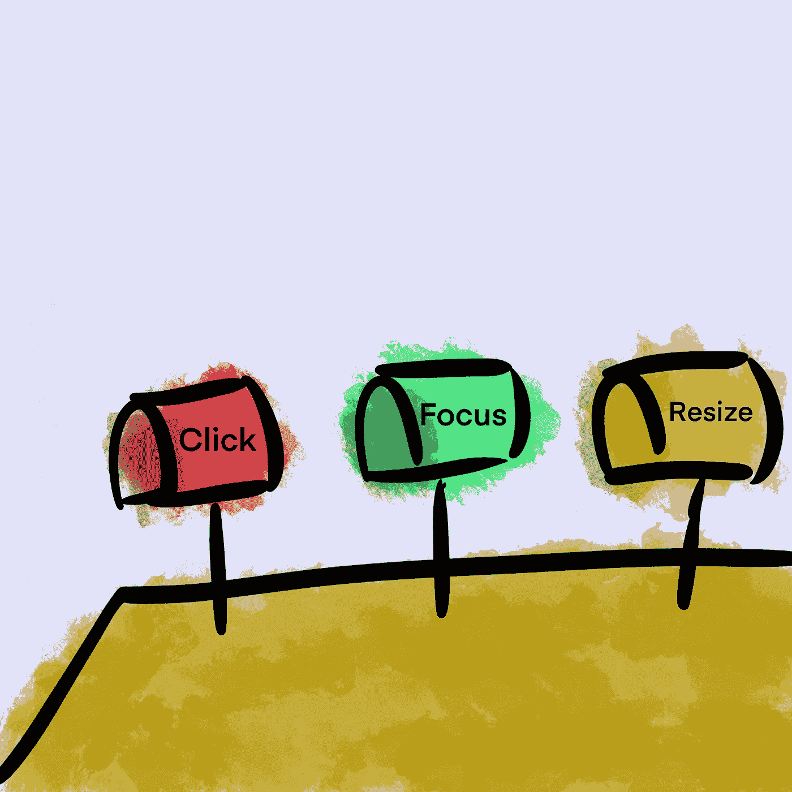

金字塔事件的例子。

每个邮箱都专门接受特定的事件类型。

> 在一个 **HTML 元素**中注册一个**回调**基本上意味着将一个信封放入这个砖块的一个邮箱中。

## 如何注册活动

关于密码，你有很多方法把信封放进这个邮箱。这不是本文的主题，所以我将只提到*推荐的*注册事件监听器的方法:`addEventListener`。

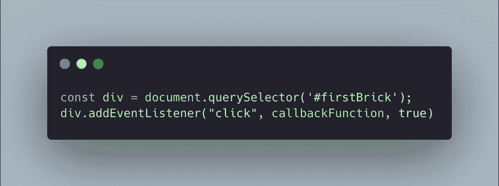

一个 **addEventListener** 的例子。目前为止忽略**真**属性。

这种方法允许您将多个信封放入邮箱。使用其他方法无法做到这一点。如果你想深入了解这个话题，请留下评论。

## **JavaScript (HTML DOM)事件监听器**

在沙漠旁边，有一个办公室:事件监听器。

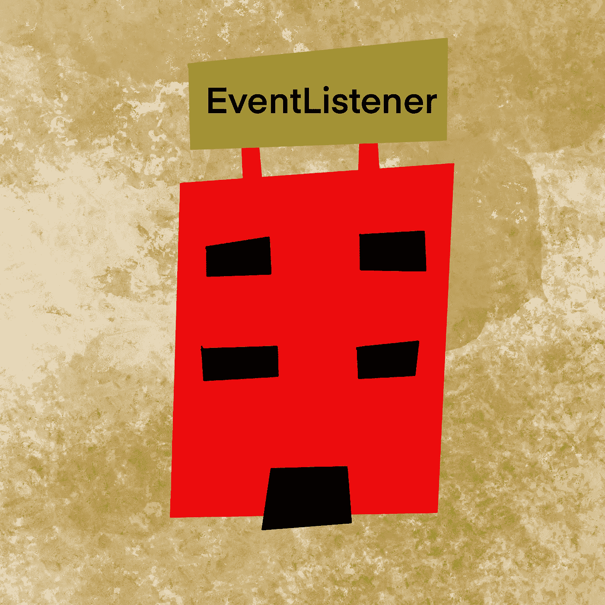

事件监听局。

在它的内部，一群奴才正在工作:事件处理程序。

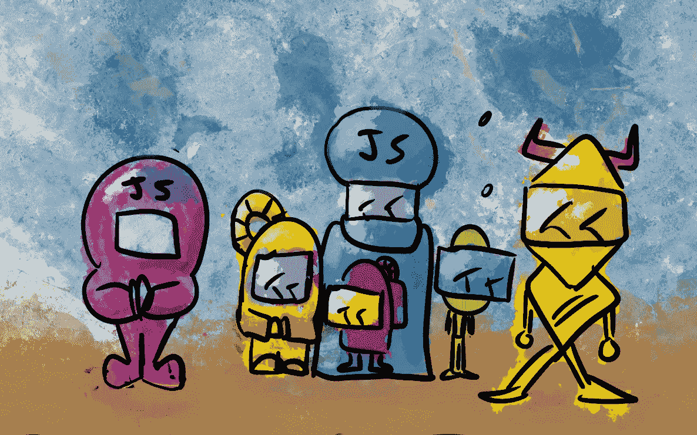

事件侦听器中的事件处理程序。

这个办公室负责接收关于浏览器中触发的任何事件的通知，并通过执行正确的注册回调来委派其最好的仆人攀登金字塔。

**基本场景示例**

假设用户点击金字塔顶部的**按钮**。**事件监听器**从浏览器接收通知。它总是包含两种重要的声音:

1.  **事件类型**(本例中为点击事件)。
2.  **目标元素**(本例中为按钮)。

然后 **EventListener** 挑选 **Click EventListener** 并发送它爬上金字塔，拿到顶端的**按钮**并返回。

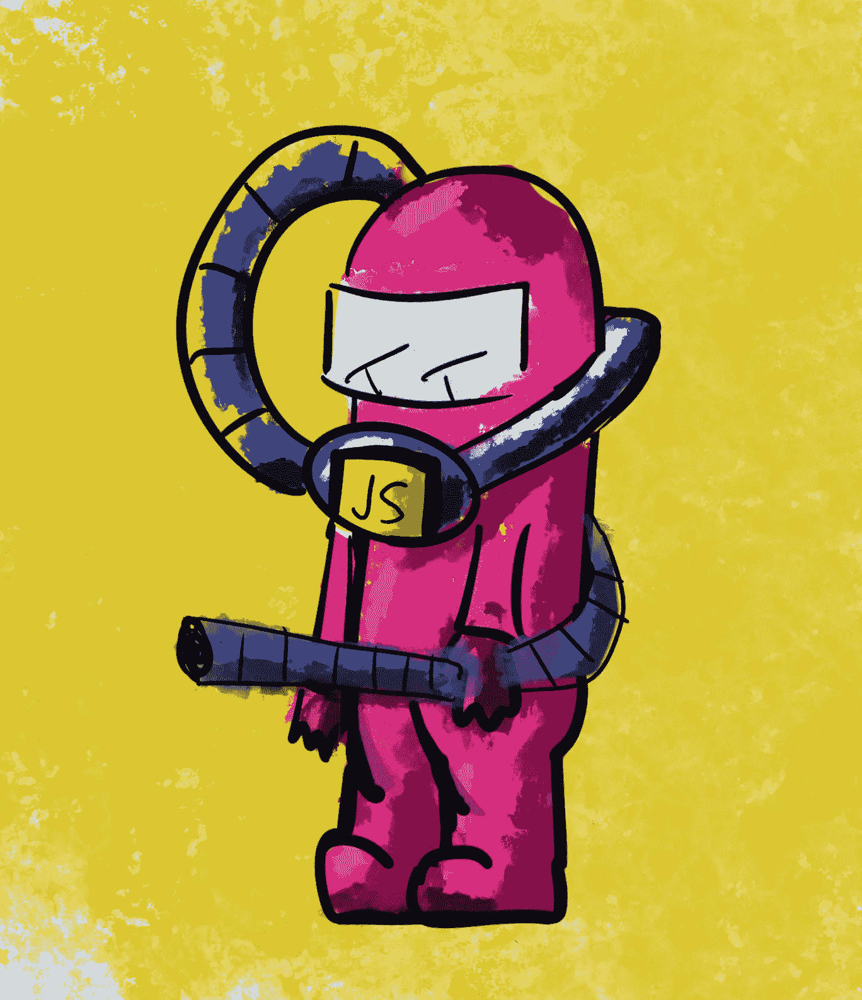

Click 事件处理程序。

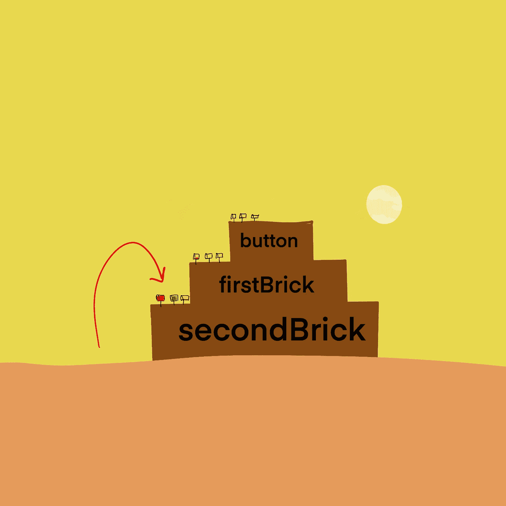

仆人跳过第一块砖。

事件处理程序读取其任务的目标(到达目标元素并返回)，然后跳过第一块砖。在这里，他会找到第二块砖的邮箱，打开“事件点击”邮箱，检查里面是否有回拨。如果有什么要执行的，它就执行它，然后跳过下一块砖。

它对每个砖块都这样做，直到它到达它的目标元素。现在，他检查回调，然后通过金字塔的另一边开始往下跳。

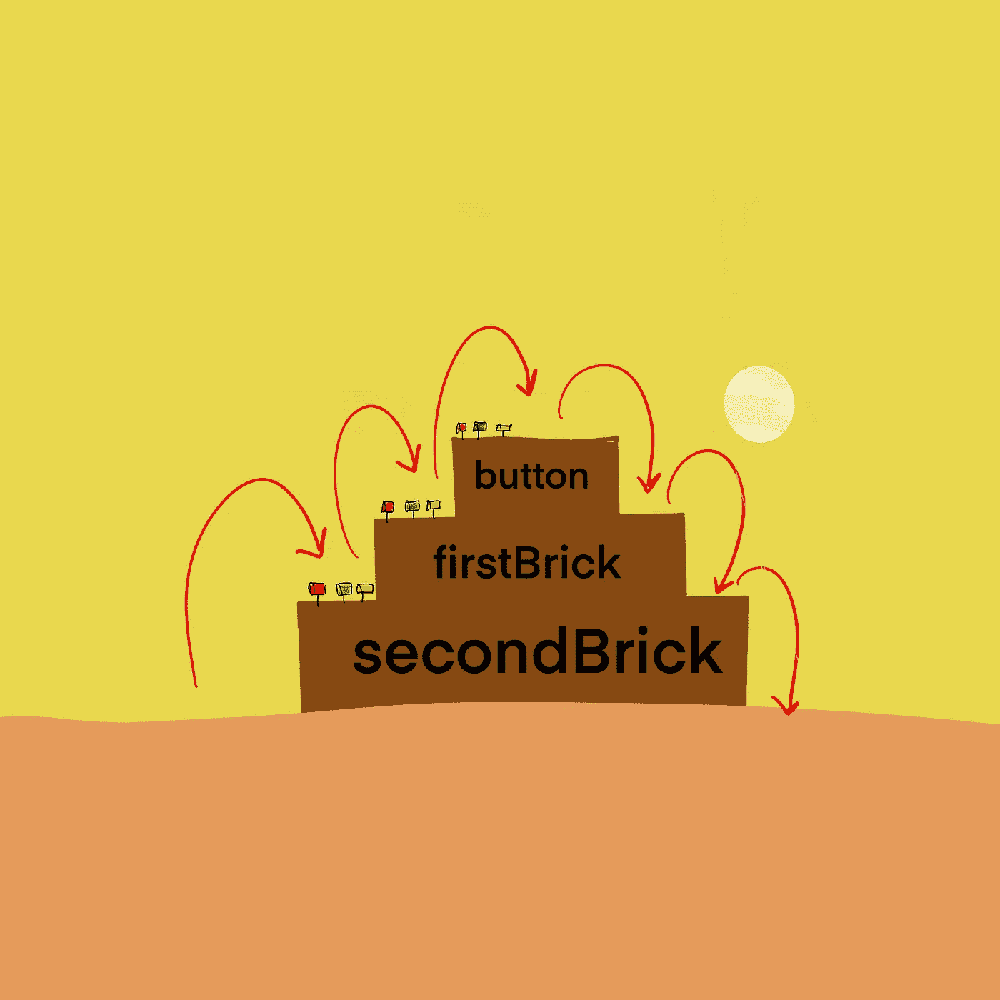

事件处理程序跳转并为每个砖块执行回调，直到它到达目标。

注意:**目标元素**可以是任何元素！例如，如果目标元素是 **secondBrick，**minion**就会这样做:**

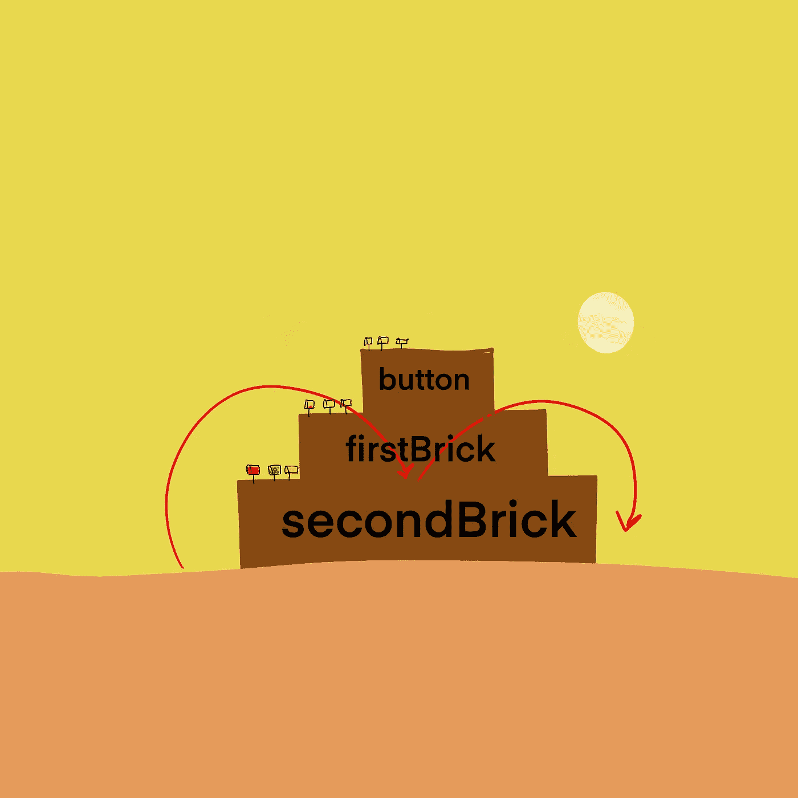

每个元素都可以是目标元素。

现在，如果我们假设我们为每个打印砖块名称的砖块注册了一个回调，我们将得到如下结果:

1.  事件处理器跳过 **secondBrick** ，找到一个回调，并执行它。
2.  事件处理程序跳过**第一块砖**，找到一个回调，并执行它。
3.  事件处理程序跳过**按钮**，找到一个回调，并执行它。
4.  事件处理程序跳过**按钮。**
5.  事件处理程序跳过**第一块砖。**
6.  事件处理程序跳过 **secondBrick。**

打印结果将是:

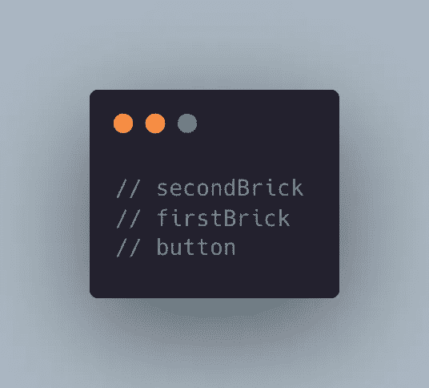

打印输出。

酷，很简单！现在还有最后一件小事:邮箱也可以在金字塔的右边！

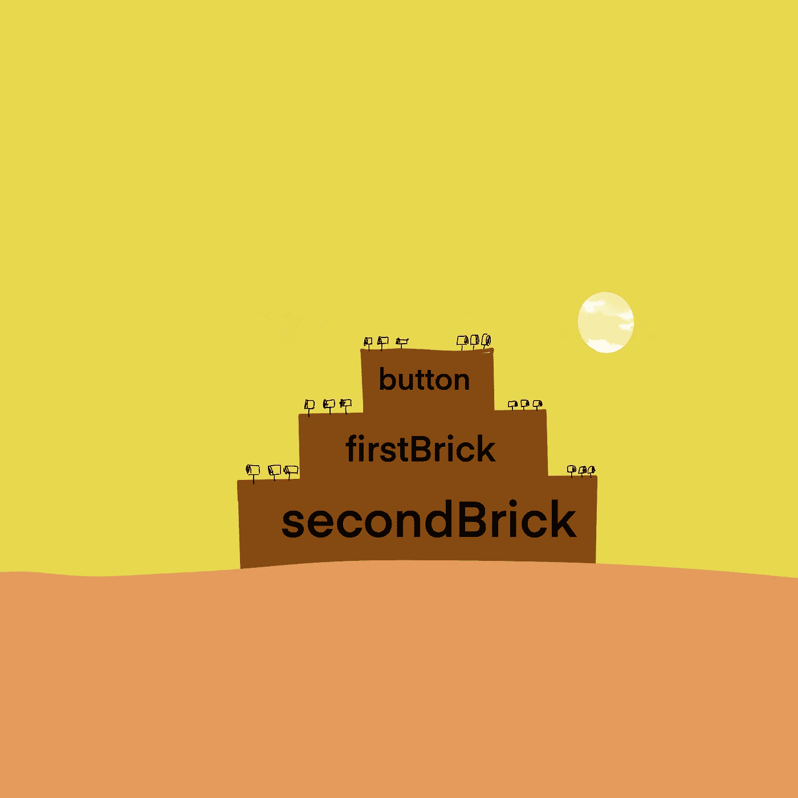

邮箱可以在金字塔的两边。惊喜！

## 冒泡:金字塔下降

我们看到我们的 minion(事件处理程序)正在金字塔的左侧执行回调。

> 在 Javascript 中，攀登被称为**捕获阶段**。

所以，当奴才在右边倒下时

> 这种下降被称为**起泡阶段**。

没什么了，现在只需要把信封放在正确的一边。

您可能还记得，前面我们使用这个函数注册了 **firstBrick 的回调:**

是时候发现 **false** 属性的含义了。

默认情况下，在冒泡阶段注册回调，这是我们的金字塔的右侧。

它的第三个参数是`useCapture`(默认为 false)，如果您想在捕获阶段(金字塔的左侧)注册回调，您需要显式地将其设置为 **true** 。

> 您可以通过将`addEventListener`的第三个参数设置为 true(捕获)或 false(冒泡)来决定您希望在哪一边注册您的回调。

现在你知道了足够多的理论你就不会浪费太多的时间在图纸上了，你只要想想这个金字塔，你在哪个邮箱注册了回调，让 minion 跳转！

你可以在这里找到我的第一篇文章。如果你喜欢这篇文章，我会每周发表一篇文章，敬请关注！